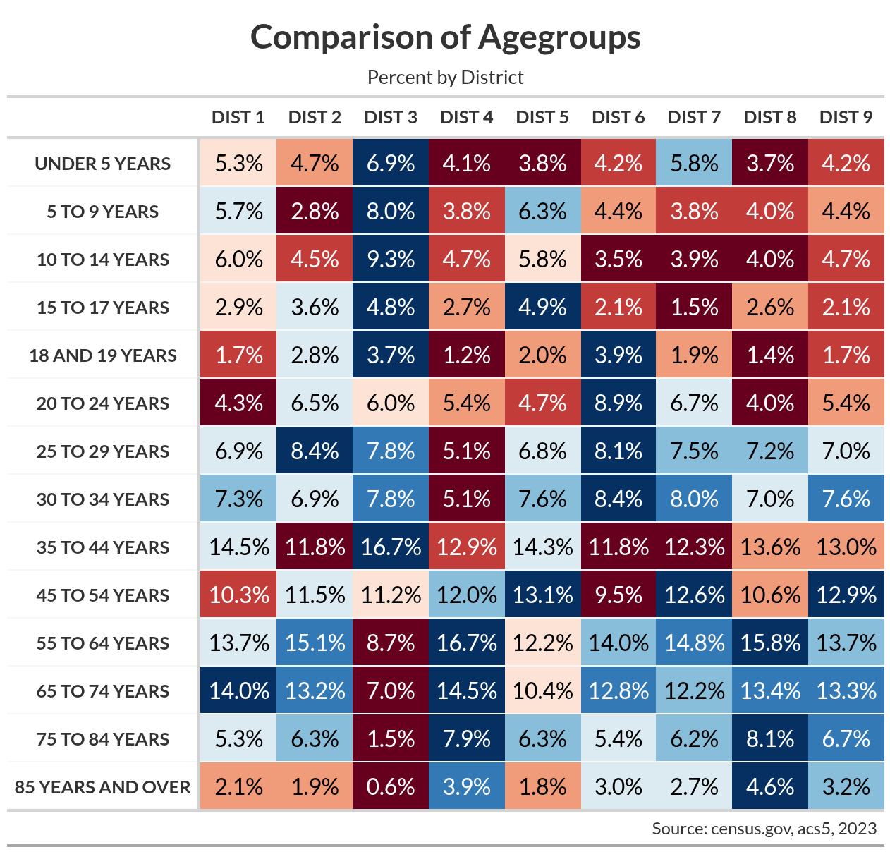
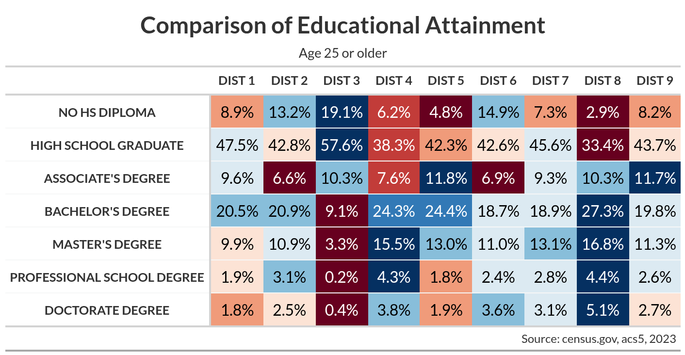

```{r setup, include=FALSE}
knitr::opts_chunk$set(echo = TRUE, paged.print = FALSE)
```

# Introduction

In the [last article](https://biscotty.net/posts/data-science/r-census/abq-demographics) I looked at age, race, and educational attainment in Albuquerque, with a particular focus on differences between council districts. In some cases, the variation was striking. In particular, the third district seemed quite different from the others in a number of ways. Now I would like to apply some statistical testing to see if this impression is valid.

# Setup

I will begin by loading the required libraries, the functions created last time, and some of the datasets from the last session. I'll need to pivot the data so that the variables are columns.

```{r}
#| message: false
library(tidyverse)
library(sf)
library(corrr)
library(car)
library(spdep)
library(zeallot)
library(rstatix)
library(GGally)
library(ggpubr)
library(rcompanion)
library(patchwork)
library(tidycensus)
source("demographic-functions.R")
```

```{r}
#| warning: false
council_dists <- st_read("data/abq_demographics.gpkg", 
                        layer = "council_dists") %>% 
  filter(district != "Los Ranchos")
crs <- 6528
year <- 2023
caption <- str_glue("Source: census.gov, acs5, {year}")
```


```{r}
age_sex_bern <-  st_read("data/abq_demographics.gpkg", 
                        layer = "age_sex_bern")
age_sex_bern_2024 <-  st_read("data/abq_demographics.gpkg", 
                        layer = "age_sex_bern_2024")

process_age <- function(df) {
  df %>%
    group_by(geoid, agegroup) %>%
    summarise(value = sum(value)) %>%
    ungroup() %>%
    mutate(area = st_area(.)) %>%
    split_dists() %>%
    select(-value) %>%
    pivot_wider(names_from = agegroup, values_from = new_value) %>%
    filter(as.numeric(area_pct) > .01) %>%
    select(-c(area, area_split, area_pct)) %>% 
    filter(district != "Los Ranchos")
}

c(abq_age_2023, abq_age_2024) %<-%
  map(list(age_sex_bern, age_sex_bern_2024),
      process_age)
```

# Age Levels

There seemed to be significant variation across council districts, particularly in certain age groups. District 3, in particular, seemed to have many more children and youth, and a lot less older people, who seemed to be more concentrated in District 8. Here are the tables comparing the districts.

{width="600"}

{width="600"}

I will look specifically at people under 20 and over 54, and calculate the percentage of the population in each district which fall into these groups.


```{r}
under_20_cols <- names(abq_age_2023)[c(4:6, 12, 17)]
cols_gt_55 <- names(abq_age_2023)[13:16]
dist_levels <- unique(abq_age_2023$district) %>% 
  sort()

make_age_brackets <- function(df) {
  df %>%
    mutate(
      district = factor(district, levels = dist_levels),
      Total = rowSums(across(where(is.numeric)), na.rm = T),
      Under.20 = rowSums(across(all_of(under_20_cols)), na.rm = T),
      Under.20.pct = Under.20 / Total,
      Over.54 = rowSums(across(all_of(cols_gt_55)), na.rm = T),
      Over.54.pct = Over.54 / Total
    )
}

c(abq_age_2023, abq_age_2024) %<-%
  map(list(abq_age_2023, abq_age_2024),
      make_age_brackets)
```

```{r}
abq_age_2024 %>% 
  st_drop_geometry() %>% 
  as_tibble() %>% 
  filter(Total == 0)
```


## Checking the distributions

A look at the variables show that the distributions in each district doesn't look normal, and varies considerably between districts.

```{r}
age_list_str <- list("Under.20.pct", "Over.54.pct")
```


```{r}
#| warning: false
#| message: false
c(p1, p2) %<-%
  map(
    age_list_str,
    \(x) abq_age_2023 %>%
      ggboxplot("district", x, fill = "district") +
      geom_point(position = position_jitter(width = 0.1)) +
      theme(axis.text.x = element_text(angle = 45, vjust = .5)) +
      guides(fill = "none")
  )
(p1 + p2) + 
  plot_annotation(title = '2023')
```

```{r}
#| warning: false
#| message: false
c(p1, p2) %<-%
  map(
    age_list_str,
    \(x) abq_age_2024 %>%
      ggboxplot("district", x, fill = "district") +
      geom_point(position = position_jitter(width = 0.1)) +
      theme(axis.text.x = element_text(angle = 45, vjust = .5)) +
      guides(fill = "none")
  )
(p1 + p2) + 
  plot_annotation(title = '2024')
```
```{r}
age_list_2023 <- list(abq_age_2023$Under.20.pct, 
                      abq_age_2023$Over.54.pct)
age_list_2024 <- list(abq_age_2024$Under.20.pct, 
                      abq_age_2024$Over.54.pct)
```


```{r}
#| warning: false
#| message: false
plot_hist <- function(df, var) {
  df %>% 
    ggplot(aes(.data[[var]])) +
    geom_histogram(aes(y = after_stat(density)),
    fill = "lightgray", col = "black", bins = 20
  ) +
  geom_line(stat = "density", adjust = 2, color = "blue")
}
```

```{r}
#| warning: false
c(p1, p2) %<-%
  map(
    age_list_str,
    \(x) plot_hist(abq_age_2023, x)
  )
c(p3, p4) %<-%
  map(
    age_list_2023,
    \(x) ggqqplot(x)
  )

(p1 + p3) /
  (p2 + p4) + 
  plot_annotation(title = '2023')
```

```{r}
#| warning: false
c(p1, p2) %<-%
  map(
    age_list_str,
    \(x) plot_hist(abq_age_2024, x)
  )
c(p3, p4) %<-%
  map(
    age_list_2024,
    \(x) ggqqplot(x)
  )

(p1 + p3) /
  (p2 + p4) + 
  plot_annotation(title = '2024')
```


In order to analyze the variance, the data should be normally distributed. Lets see if this is so. The null hypothesis in the Shapiro-Wilk test is that the data is normally distributed.

```{r}
map(age_list_2023,
    \(x) shapiro_test(x))
```

```{r}
map(age_list_2024,
    \(x) shapiro_test(x))
```

The low p-value suggests that the null hypothesis is false, and the data is not normally distributed.

A simple log transformation does not help.

```{r}
map(
  list(abq_age_2023, abq_age_2024),
  \(x) map(
    list(
      log(x$Under.20.pct + 1),
      log(x$Over.54.pct + 1)
    ),
    \(y) shapiro_test(y)
  )
)
```

## Transforming

The Elfving transformation from the `rcompanion` package can transform this into a normal distribution. The Elfving transformation is `qnorm((rank(x) - pi/8)/(N - pi/4 + 1))`, where x is the original data, N is the number of observations, and pi is the constant pi. – Sal Mangiafico

```{r}
#| warning: false
#| message: false

c(abq_age_2023, abq_age_2024) %<-%
  map(
    list(abq_age_2023, abq_age_2024),
    \(x) x %>%
      mutate(
        Under.20.pct.ELF = blom(Under.20.pct),
        Over.54.pct.ELF = blom(Over.54.pct)
      )
  )

age_list_elf_str <- str_replace(age_list_str, "$", ".ELF")

c(age_list_elf_2023, age_list_elf_2024) %<-%
  map(
    list(abq_age_2023, abq_age_2024),
    \(x) list(
      x$Under.20.pct.ELF,
      x$Over.54.pct.ELF
    )
  )
```

```{r}
#| warning: false
c(p1, p2) %<-%
  map(
    age_list_elf_str,
    \(x) plot_hist(abq_age_2023, x)
  )
c(p3, p4) %<-%
  map(
    age_list_elf_2023,
    \(x) ggqqplot(x)
  )

(p1 + p3) /
  (p2 + p4) + 
  plot_annotation(title = '2023')
```

```{r}
#| warning: false
c(p1, p2, p3) %<-%
  map(
    append(age_list_elf_str, age_list_str[2], after = 1),
    \(x) plot_hist(abq_age_2024, x)
  )
c(p4, p5, p6) %<-%
  map(
    append(age_list_elf_2024, age_list_2024[2], after = 1),
    \(x) ggqqplot(x)
  )

(p1 + p4) /
  (p2 + p5) /
  (p3 + p6) + 
  plot_annotation(title = '2024')
```


```{r}
map(age_list_2023,
    \(x) shapiro_test(x))
```

```{r}
map(append(age_list_elf_2024, age_list_2024[2], after = 1),
    \(x) shapiro_test(x))
```


This looks good. I should also check for equality of variance.

```{r}
map(append(age_list_2023, age_list_elf_2023),
    \(x) bartlett.test(x, abq_age_2023$district))
```

The untransformed data did not show homogeneity of variance, but the transformed data does. Now I'll to the analysis of variance.

```{r}
map(append(age_list_2024, age_list_elf_2024),
    \(x) bartlett.test(x, abq_age_2024$district))
```


## AOV

```{r}
c(aov_under_20_pct_ELF_2023, aov_over_54_pct_ELF_2023) %<-%
  map(
    age_list_elf_str,
    \(x) aov(as.formula(glue("{x} ~ district")),
      data = abq_age_2023
    )
  )
map(list(aov_under_20_pct_ELF_2023, aov_over_54_pct_ELF_2023),
    \(x) summary(x))
```

```{r}
c(aov_under_20_pct_ELF_2024, aov_over_54_pct_ELF_2024) %<-%
  map(
    age_list_elf_str,
    \(x) aov(as.formula(glue("{x} ~ district")),
      data = abq_age_2024
    )
  )
map(list(aov_under_20_pct_ELF_2024, aov_over_54_pct_ELF_2024),
    \(x) summary(x))
```

```{r}
welchs_aov_over_54_pct <- oneway.test(
  Over.54.pct ~ district,
  data = abq_age_2024,
  var.equal = F
)
welchs_aov_over_54_pct
```


The results do show a statistical difference between the districts. Tukey's HSD can show us where.

```{r}
map(
  list(aov_under_20_pct_ELF_2023, aov_over_54_pct_ELF_2023),
  \(x) TukeyHSD(x)[[1]] %>%
    as.data.frame() %>%
    filter(`p adj` <= .05)
)
```

```{r}
map(
  list(aov_under_20_pct_ELF_2024, aov_over_54_pct_ELF_2024),
  \(x) TukeyHSD(x)[[1]] %>%
    as.data.frame() %>%
    filter(`p adj` <= .05)
)
```


```{r}
abq_age_2024 %>%
  st_drop_geometry() %>%
  games_howell_test(Over.54.pct ~ district) %>%
  filter(p.adj <= .05)
```


Indeed, there is a statistically significant different between District 3 and most of the others. Out of curiosity, I will perform the test on the untransformed data.


```{r}
#| message: false
#| warning: false
library(ggridges)
plot_dist_ridge <- function(df, var) {
  ggplot(df, aes(
    x = .data[[var]], y = district,
    fill = factor(stat(quantile))
  )) +
    stat_density_ridges(
      geom = "density_ridges_gradient", calc_ecdf = TRUE,
      quantiles = 4, quantile_lines = TRUE, alpha = 0.7,
      jittered_points = TRUE, position = "points_sina"
    ) +
    scale_fill_viridis_d(name = "Quartiles") +
    theme(axis.title.x = element_blank())
}
```

```{r}
#| warning: false
pmap(
  list(
    list(abq_age_2023, abq_age_2023, abq_age_2024, abq_age_2024),
    as.list(rep(c("Under.20.pct", "Over.54.pct"), 2)),
    as.list(rep(c(
      "Population Percent under 20 years old",
      "Population Percent over 54 years old"
    ), 2)),
    as.list(rep(c("2023", "2024"), each = 2))
  ),
  \(df, x, y, z) df %>%
    plot_dist_ridge(x) +
    labs(title = y, subtitle = z)
)
```

```{r}
#| warning: false
map(
  list(abq_age_2023$Under.20.pct, abq_age_2023$Over.54.pct),
  \(x) pairwise.wilcox.test(
    x, abq_age_2023$district,
    p.adjust.method = "holm"
  ) %>%
    tidy() %>%
    filter(p.value <= .05)
)
map(
  list(abq_age_2024$Under.20.pct, abq_age_2024$Over.54.pct),
  \(x) pairwise.wilcox.test(
    x, abq_age_2024$district,
    p.adjust.method = "holm"
  ) %>%
    tidy() %>%
    filter(p.value <= .05)
)
```


This reveals almost the same results. 


Bartlett's test fails to reject the null hypothesis that all variances are equal. I'll create a linear model to get a sense of the explanatory power of this variable.

```{r}
map(list(abq_age_2023, abq_age_2024),
    \(x) map(c("Under.20.pct.ELF", "Over.54.pct.ELF"),
    \(y) lm(as.formula(glue("{y} ~ district")),
      data = x
    ) %>% summary())
  )
```


# Education

## Prep

```{r}
abq_edu <- st_read("data/abq_demographics.gpkg",
                   layer = "edu_dist_sf")

edu_bern <- st_read("data/abq_demographics.gpkg",
                    layer = "edu_bern_sf")

edu_levels <- unique(abq_edu$education)
abq_edu <- abq_edu %>% 
#  mutate(area = st_area(.)) %>% 
  group_by(geoid, district, education) %>% 
  summarise(value = sum(value)) %>% 
  ungroup() %>% 
  filter(district != "Los Ranchos") %>% 
  pivot_wider(names_from = education, values_from = value) %>% 
  filter(if_any(where(is.numeric), ~ . > 0))
```

```{r}
adv_degree <- names(abq_edu)[c(6, 8, 10)]
col_degree <- c(names(abq_edu)[5], adv_degree)
no_degree <- names(abq_edu)[c(7, 9)]
abq_edu <- abq_edu %>% 
  mutate(district = factor(district, levels = dist_levels),
         Total = rowSums(across(where(is.numeric))),
         College.Degree = rowSums(across(all_of(col_degree)), na.rm = T),
         College.Degree.pct = College.Degree / Total,
         Advanced.Degree = rowSums(across(all_of(adv_degree)), na.rm = T),
         Advanced.Degree.pct = Advanced.Degree / Total,
         No.Degree = rowSums(across(all_of(no_degree)), na.rm = T),
         No.Degree.pct = No.Degree / Total)
abq_edu
```
## Checking the distributions

A look at the variables show that the distributions in each district doesn't look normal, and varies considerably between districts.

```{r}
names(abq_edu)
cols_str <- names(abq_edu)[c(17, 13, 15)]
cols_list <- list(
  abq_edu$No.Degree.pct, abq_edu$College.Degree.pct,
  abq_edu$Advanced.Degree.pct
)
```


```{r}
#| warning: false
#| message: false
c(p1, p2, p3) %<-%
  map(
    cols_str,
    \(x) abq_edu %>%
      ggboxplot("district", x, fill = "district") +
      geom_point(position = position_jitter(width = 0.1)) +
      theme(axis.text.x = element_text(angle = 45, vjust = .5)) +
      guides(fill = "none")
  )
p1; p2; p3
```

```{r}
#| warning: false
#| message: false
c(p1, p2, p3) %<-%
  map(
    cols_str,
    \(x) plot_hist(abq_edu, x)
  )
c(p4, p5, p6) %<-%
  map(
    cols_list,
    \(x) ggqqplot(x)
  )

(p1 + p4) /
  (p2 + p5) /
  (p3 + p6)
```

In order to analyze the variance, the data should be normally distributed. Lets see if this is so. The null hypothesis in the Shapiro-Wilk test is that the data is normally distributed.

```{r}
map(cols_list,
    \(x) shapiro_test(x))
```

The low p-value suggests that the percentage of people with no high school diploma is normally distributed, while the others are not.

## Transforming

The Elfving transformation from the `rcompanion` package can transform this into a normal distribution. The Elfving transformation is `qnorm((rank(x) - pi/8)/(N - pi/4 + 1))`, where x is the original data, N is the number of observations, and pi is the constant pi. – Sal Mangiafico

```{r}
#| warning: false
#| message: false
abq_edu <- abq_edu %>% 
  mutate(
    College.Degree.pct.ELF = blom(College.Degree.pct),
    Advanced.Degree.pct.ELF = blom(Advanced.Degree.pct)
  )

cols_str <- names(abq_edu)[17:19]
cols_list <- list(
  abq_edu$No.Degree.pct, abq_edu$College.Degree.pct.ELF,
  abq_edu$Advanced.Degree.pct.ELF
)

c(p1, p2, p3) %<-%
  map(
    cols_str,
    \(x) plot_hist(abq_edu, x)
  )
c(p4, p5, p6) %<-%
  map(
    cols_list,
    \(x) ggqqplot(x)
  )

(p1 + p4) /
  (p2 + p5) /
  (p3 + p6)
```

```{r}
map(cols_list,
    \(x) shapiro_test(x))
```

```{r}
abq_edu <- abq_edu %>% 
  mutate(
    College.Degree.pct.log = log(College.Degree.pct + 1),
    Advanced.Degree.pct.log = log(Advanced.Degree.pct + 1)
  )
names(abq_edu)
cols_str <- names(abq_edu)[c(17, 20, 21)]
cols_list <- list(
  abq_edu$No.Degree.pct, abq_edu$College.Degree.pct.log,
  abq_edu$Advanced.Degree.pct.log
)

c(p1, p2, p3) %<-%
  map(
    cols_str,
    \(x) plot_hist(abq_edu, x)
  )
c(p4, p5, p6) %<-%
  map(
    cols_list,
    \(x) ggqqplot(x)
  )

(p1 + p4) /
  (p2 + p5) /
  (p3 + p6)
```

```{r}
map(
  cols_list,
  \(x) shapiro_test(x)
)
```


This looks good. I should also check for equality of variance.

```{r}
cols_str <- names(abq_edu)[17:18]
cols_list <- list(
  abq_edu$No.Degree.pct, 
  abq_edu$College.Degree.pct.ELF
)
map(cols_list,
    \(x) bartlett.test(x, abq_edu$district))
```

The untransformed data did not show homogeneity of variance, but the transformed data does. Now I'll to the analysis of variance.

## AOV

```{r}
c(aov_No.Degree_pct, aov_College.Degree.pct.ELF) %<-%
  map(
    cols_str,
    \(x) aov(as.formula(glue("{x} ~ district")),
      data = abq_edu
    )
  )
map(list(aov_No.Degree_pct, aov_College.Degree.pct.ELF),
    \(x) summary(x))
```

The results do show a statistical difference between the districts. Tukey's HSD can show us where.

```{r}
map(
  list(aov_No.Degree_pct, aov_College.Degree.pct.ELF),
  \(x) TukeyHSD(x)[[1]] %>%
    as.data.frame() %>%
    filter(`p adj` <= .05)
)
```

Indeed, there is a statistically significant different between District 3 and most of the others. Out of curiosity, I will perform the test on the untransformed data.

The Kruskal-Wallis Test uses the following null and alternative hypotheses:

The null hypothesis (H0): The median is equal across all groups.

The alternative hypothesis: (HA): The median is not equal across all groups

```{r}
map(
    cols_str,
    \(x) kruskal.test(as.formula(glue("{x} ~ district")),
      data = abq_edu
    ))
```

```{r}
#| message: false
#| warning: false
c(p1, p2) %<-%
map2(cols_str[1:2],
     list("Population Percent No Degree",
          "Population Percent College Degree"),
     \(x, y) abq_edu %>% 
       plot_dist_ridge(x) +
       labs(title = y))
p1; p2
```


```{r}
#| warning: false
map(cols_list,
    \(x) pairwise.wilcox.test(
  x, abq_edu$district,
  p.adjust.method = "holm"
) %>% 
  tidy() %>% 
  filter(p.value <= .05))
```


This reveals almost the same results. 


Bartlett's test fails to reject the null hypothesis that all variances are equal. I'll create a linear model to get a sense of the explanatory power of this variable.

```{r}
map(
    cols_str,
    \(x) lm(as.formula(glue("{x} ~ district")),
      data = abq_edu
    ) %>% summary()
  )
```

