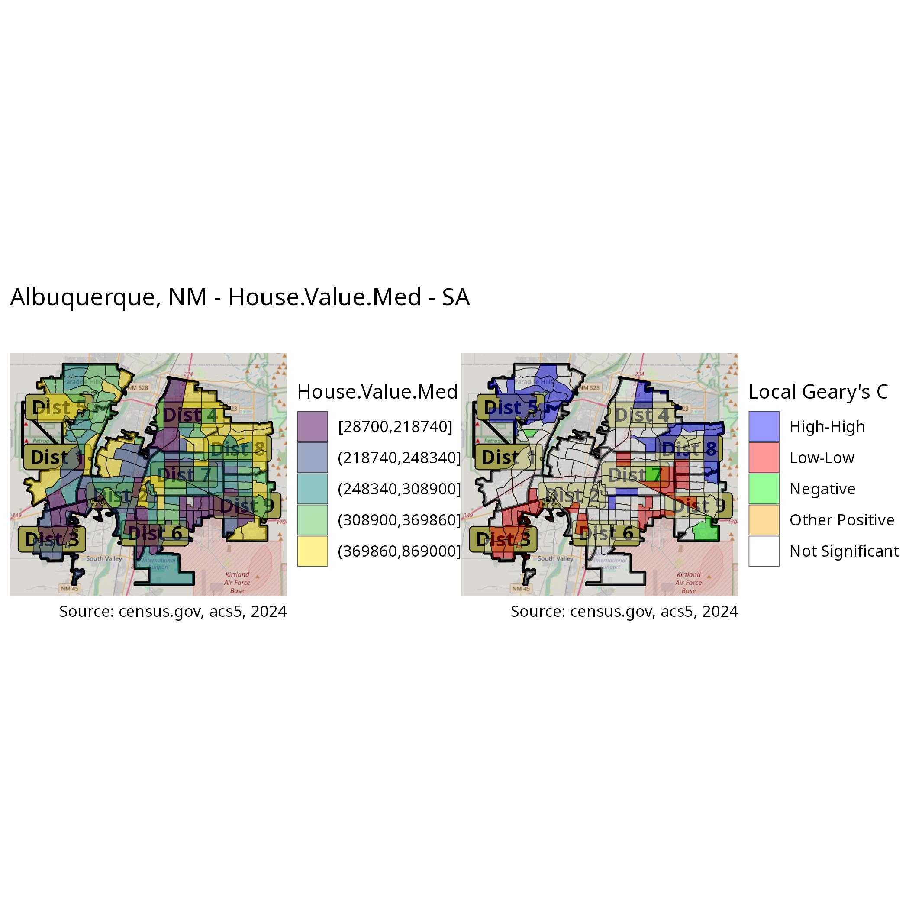
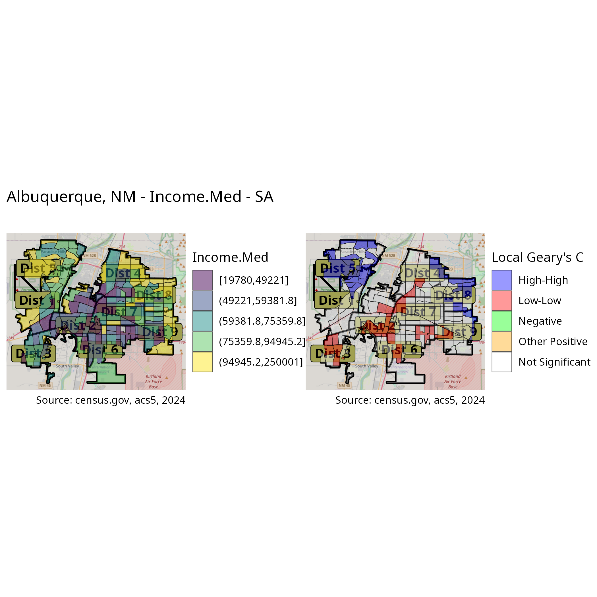
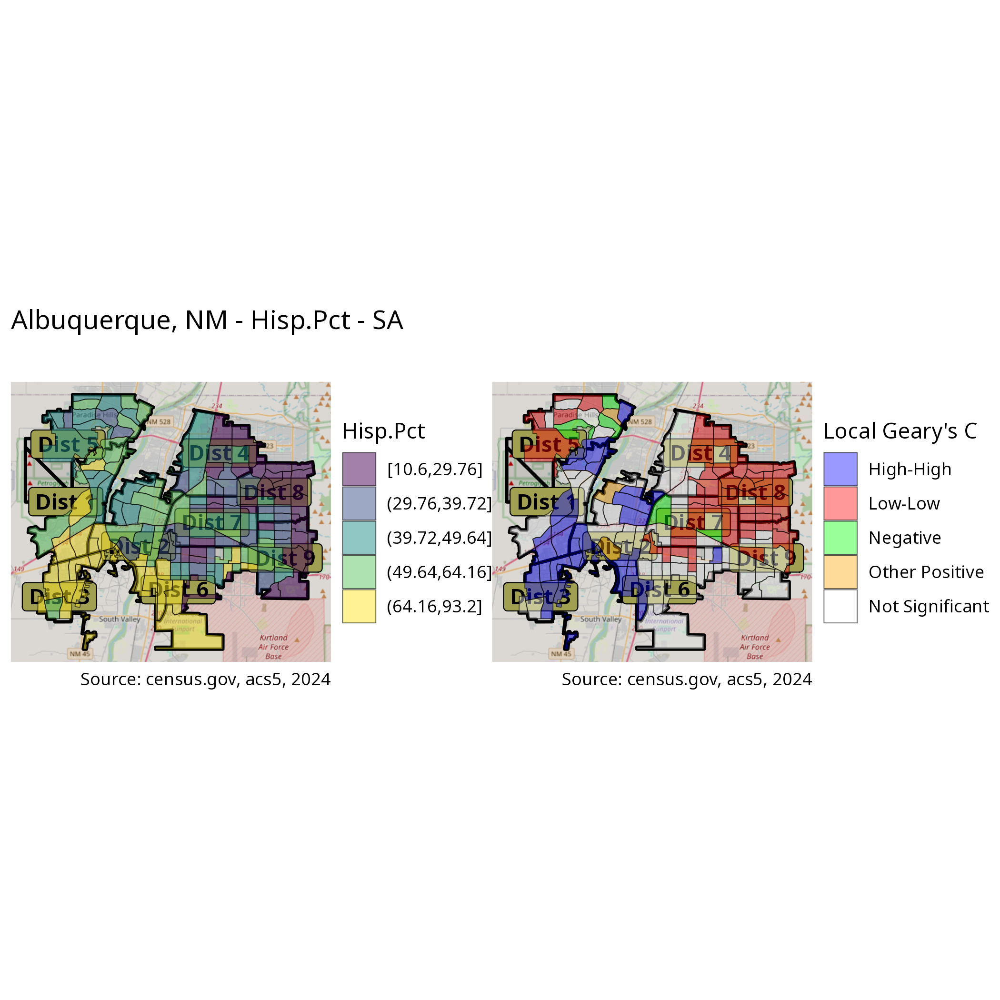
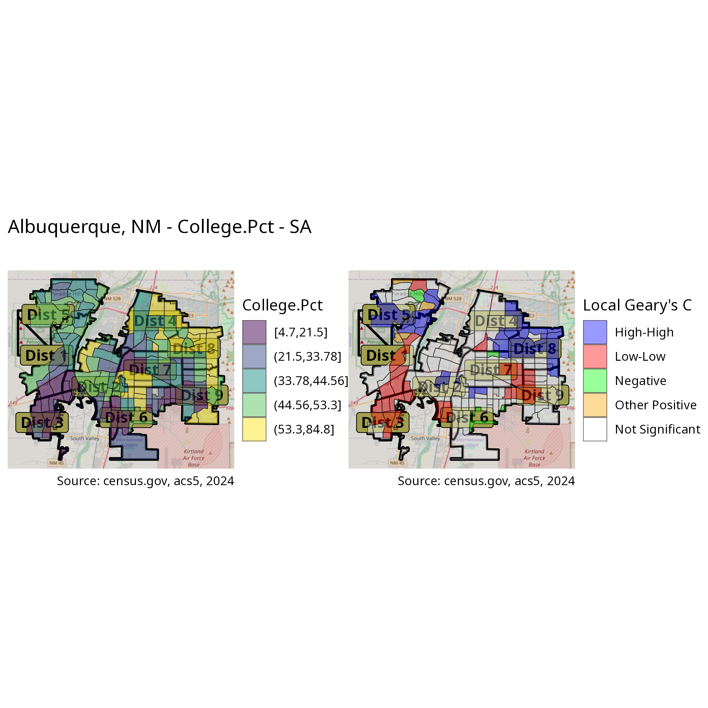

# Introduction

This is the third part of a short series of articles in which I am looking at demographics and economic indicators among the population of Albuquerque, New Mexico. More specifically, I'm considering how they vary among city council districts, the extent to which any variation is not merely random, and what potential explanations there are for the variances.

In the last article, simply mapping the variables and overlaying the council districts seemed to show strong differences between a number of them.  _Spatial autocorrelation_, and the identification of hot and cold spots for many variables, allowed us again to identify apparently significant differences, sometimes extreme, between certain districts.

The current article will be concerned with statistical testing of these apparent variances. A number of hurdles exist before tests can be run, however. ANOVA testing expects variables to be normally distributed. As we saw, few of the variables actually are. They will therefore require an appropriate transformation prior to running the tests. Additionally, as we shall see, many variables will exhibit unequal variance, violating an assumption of the traditional [ANOVA](https://en.wikipedia.org/wiki/Analysis_of_variance) test. For these variables, we will use [Welch's t-test](https://en.wikipedia.org/wiki/Welch's_t-test).

As before, this article has a secondary purpose, encouraging efficient programming. I will continue to demonstrate how the `collapse` package can significantly improve the speed of data processing and transformation. I will make use of matrices rather than data frames where possible, only using the latter where necessary. I will also show how `purrr`'s `partial` function can be used to write simpler and clearer code.

As usual, I will begin by loading the libraries, and the data from last time.

```{r}
#| code-fold: true
#| code-summary: "Show the code"
#| message: false
options(paged.print = FALSE,
        tigris_use_cache = TRUE)
libraries <- list(
  "sf", "collapse", "ggplot2", "magrittr",
  "zeallot", "purrr", "patchwork", "rstatix"
)
invisible(lapply(libraries, library, character.only = TRUE))

microbenchmark <- microbenchmark::microbenchmark
glue <- glue::glue
ggboxplot <- ggpubr::ggboxplot
ggqqplot <- ggpubr::ggqqplot
blom <- rcompanion::blom
tidy <- broom::tidy
stat_density_ridges <- ggridges::stat_density_ridges
iif <- kit::iif
rownames_to_column <- tibble::rownames_to_column
separate <- tidyr::separate
slice_max <- dplyr::slice_max

year <- 2024
crs <- 6528
caption <- glue("Source: census.gov, acs5, {year}")
options(digits = 4)
```

```{r}
#| output: false
abq_data <- 
  st_read("data/district_variance.gpkg", layer = "abq_data") %>% 
  ftransform(Population.Density = NULL, GEOID = NULL, 
             Population = NULL, area_pct = NULL)
abq_data_geom <- st_geometry(abq_data)
abq_data %<>% st_drop_geometry %>% qDF
abq_data_m <- abq_data %>% gv(-1) %>% qM
districts <- abq_data %>% gv(1)
var_names <- abq_data %>% num_vars(return = "names")
```

# Preparing the variables

## Visualization

I will begin by recalling a few of the distribution plots constructed last time.

```{r}
#| code-fold: true
#| code-summary: "Show the code"
plot_hist <- function(df, var) {
  df %>%
    ggplot(aes(.data[[var]])) +
    geom_histogram(aes(y = after_stat(density)),
      fill = "lightgray", col = "black", bins = 20
    ) +
    geom_line(stat = "density", adjust = 2, color = "blue") +
    labs(caption = caption)
}
```

```{r}
#| fig-height: 3
hists <- map(var_names, \(x) num_vars(abq_data) %>% plot_hist(x))
qqs <- map(num_vars(abq_data), ggqqplot)
c(
  pHouse.Value.Med, pGini, pRent.Med, pAge.Med, pIncome.Med, 
  pForeign.Born.Pct, pHisp.Pct, pCollege.Pct, pIn.Poverty.Pct,
  pVacant.Pct, pRenter.Occupied.Pct, pHousing.Density
) %<-% map(seq_len(length(hists)), 
           \(x) hists[[x]] + qqs[[x]])
```

```{r}
pHouse.Value.Med; pIncome.Med; pGini
```

The first two are clearly not normal, which is the situation for most of the variables. On the other hand, there is at least one which appears normal.

Now, let's look at the variation of variables across districts. For that, I will construct a series of boxplots and ridge plots.

```{r}
#| code-fold: true
#| code-summary: "Show the code"
plot_dist_box <- function(df, var) {
  df %>%
    ggboxplot("district", var, fill = "district") +
    geom_point(position = position_jitter(width = 0.1)) +
    scale_fill_viridis_d() +
    theme(axis.text.x = element_text(angle = 45, vjust = .5, hjust = .5)) +
    guides(fill = "none") + labs(caption = caption)}

plot_dist_ridge <- function(df, var) {
  ggplot(df, aes(x = .data[[var]], y = district, 
                 fill = factor(after_stat(quantile)))) +
  stat_density_ridges(
    geom = "density_ridges_gradient", calc_ecdf = TRUE,
    quantiles = 4, quantile_lines = TRUE, alpha = 0.7,
    jittered_points = TRUE, position = "points_sina") +
  scale_fill_viridis_d(name = "Quartiles") +
  theme(axis.title.x = element_blank())}

c(
  bpHouse.Value.Med, bpGini, bpRent.Med, bpAge.Med, bpIncome.Med, 
  bpForeign.Born.Pct, bpHisp.Pct, bpCollege.Pct, bpIn.Poverty.Pct,
  bpVacant.Pct, bpRenter.Occupied.Pct, bpHousing.Density
) %<-%
  map(var_names, \(x) abq_data %>% plot_dist_box(x))

c(
  rpHouse.Value.Med, rpGini, rpRent.Med, rpAge.Med, rpIncome.Med, 
  rpForeign.Born.Pct, rpHisp.Pct, rpCollege.Pct, rpIn.Poverty.Pct,
  rpVacant.Pct, rpRenter.Occupied.Pct, rpHousing.Density
) %<-%
  map(
    var_names,
    \(x) abq_data %>%
      plot_dist_ridge(x) +
      labs(title = x)
  )
```

```{r}
#| message: false
#| warning: false
bpHouse.Value.Med + rpHouse.Value.Med
```

The shape of the distributions in each district are wildly different. The means do not seem to vary as much, with notable exceptions.

```{r}
#| message: false
#| warning: false
bpHisp.Pct + rpHisp.Pct
```

In this case, the third district sticks out as the proverbial sore thumb in the ridge plot. Here, also, the means seem all over the board. Based on the prior explorations, a similar feature should be evident in the percentage of college graduates.

```{r}
#| message: false
#| warning: false
bpCollege.Pct + rpCollege.Pct
```

Indeed it is, though perhaps not so extreme. With regard to the inequality measurement, we saw last time that it showed little correlation to race, age, or education, nor did it show the degree of spatial autocorrelation seen in the other variables. I am, therefore, expecting to see quite a bit less variance between districts here.

```{r}
#| message: false
#| warning: false
bpGini + rpGini
```


These plots confirm some of the observations made based on the maps and SA statistics. They also reveal how different the distributions are shaped. In most variables, district 3 has a rather compact distribution, which is closer to normal than any other district. On the other hand, the distributions of the fourth district are generally very wide and not at all normal. The sixth and eighth district show the same tendancy for some of the variables.

Both the lack of normal distribution and the apparent non-homogeneity of variance across the districts will be issues to address when performing the analysis of variance. As the above plots show, only a couple of the variables appear to be normally distributed, and there is little equality of variance.

## Normalization

With a couple of exceptions, visualization showed that none of these variables appear to be normally distributed. Formally, we can use the [Shapiro-Wilk](https://en.wikipedia.org/wiki/Shapiro%E2%80%93Wilk_test)[^1] test for normal distribution to confirm statistically.

[^1]: The statistic is defined as $W = \frac{\left(\sum_{i=1}^n a_ix_{(i)}\right)^2}{\sum_{i=1}^n \left(x_i-\hat{x}\right)^2}$

The null hypothesis in this test is that the data _is_ normally distributed. $p$-values less than 0.05 indicate that the null hypothesis should be rejected, implying that the data are not normally distributed. I'll start by running a `shapiro_test` on all of the variables, filtering for $p$-values greater than 0.05, which are the normally distributed variables.

I'll also demonstrate a handy use of `purrr`'s `partial` function. The `unlist2d` function, which I use frequently, by default adds a `.id` column to the results, something I never want. I will use the `partial` function here to override the default for all future invocations.


```{r}
unlist2d <- partial(unlist2d, idcols = F)
```

```{r}
map(asplit(abq_data_m, 2), shapiro_test) %>% 
  unlist2d %>% 
  fmutate(variable = var_names,
          sig = iif(p.value <= .05, "Yes", "No")) %>%
  fsubset(sig == "No")
```

As expected, only two of the variables are normally distributed.

## Transformations

I will test some different transformations to see if I can coerce the data to normalcy. I will create a function to do so and filter the data as above. Happily, in R, functions are first-class data types, allowing functions to be passed as arguments to functions. In fact, this custom function highlights the richness of R's functional programming capabilities, using the built-in `mapply()` and `purrr`'s `map()`. I will write a generic function, and partially apply the first two arguments with `partial` to create a new function specific to my data. I will also be using the matrix version of the data set for faster processing. 


```{r}
run_shapiro <- function(mat, names, f) {
  data <- mapply(f, asplit(mat, 2)) %>% asplit(2)
  map(data, shapiro_test) %>%
    unlist2d %>%
    fmutate(
      variable = names,
      sig = iif(p.value <= .05, "Yes", "No")
    ) %>%
    fsubset(sig == "No")
}

run_shapiro_abq <- partial(run_shapiro, abq_data_m, var_names)
```


I'll try a few common transformations such as square root, cube root, and log transformations. I'll use a modified log transformation, since there are many 0 values. Each function gets passed as an argument to `run_shapiro_abq`.

```{r}
cube_root <- function(x) {
  sign(x) * abs(x)^(1/3)
}
ihs_transform <- function(x) {
  log(x + (x^2 + 1)^0.5)
}

map(list(sqrt, cube_root, ihs_transform), run_shapiro_abq)
```

Only a few variables can be normalized with these techniques. Now I'll try an inverse normal transformation. This transformation is based on ranking, and is able to normalize highly skewed distributions. The downside of this transformation is that the "distance" between each observation is lost, obscuring information about the variability within the variable. The `blom()` function which performs the transformation defaults to a "general" method, so again, I will use `partial`.

```{r}
xf_blom <- partial(blom, method = "blom")
run_shapiro_abq(xf_blom)
```

All of the variables are normalizable with this transformation, with the exception of vacancy percentage, so I'll remove it, and create a frame with the transformed data.

```{r}
abq_data_m %<>% fsubset(, -Vacant.Pct)
var_names <- colnames(abq_data_m)
abq_data_blom_m <- dapply(abq_data_m, xf_blom)
```

Again, this is many times faster than with `dplyr`.

```{r}
dmutate <- dplyr::mutate
dacross <- dplyr::across
dall_of <- dplyr::all_of
microbenchmark(
  collapse = dapply(abq_data_m, xf_blom),
  dyplr = abq_data %>%
    dmutate(dacross(dall_of(var_names), ~ xf_blom(.x)))
)
```

# Analysis of Variance

## Equality of variance (Bartlett's test)

Now that I have normally distributed variables, I need to address the second assumption of ANOVA tests, which is equality of variance among the districts. [Bartlett's test](https://en.wikipedia.org/wiki/Bartlett's_test) can be used for that purpose.

The null hypothesis in Bartlett's test is that all population variances are equal among the districts, while the alternative hypothesis is that at least two are different. These tests require data frames, so I will need to convert the matrices and add back the district column.

```{r}
abq_data_blom <- qDF(abq_data_blom_m) %>% 
  add_vars(districts, pos = "front")
vars_list <- gv(abq_data_blom, var_names) %>% as.list

btests <- map2(
  var_names,
  vars_list,
  \(x, y) list(x, bartlett.test(y ~ district, abq_data_blom))
)

data.frame(
  variable = unlist(map(
    seq_len(length(btests)),
    \(x) btests[[x]][[1]])),
  statistic = unlist(map(
    seq_len(length(btests)),
    \(x) btests[[x]][[2]]$statistic)),
  p_value = unlist(map(
    seq_len(length(btests)),
    \(x) btests[[x]][[2]]$p.value %>% round(., 3)))) %>% 
  fsubset(p_value > .05)
```

As expected, only some of the variables show homogeneity of variance, and only one is of special interest.

## ANOVA

Median house value, median income, percent foreign born, Hispanic, and college graduate variables do not show homogeneity of variance, and so I will remove them for purposes of the classic ANOVA test.

```{r}
var_names_aov <- var_names[c(2:4, 9:11)]
```

```{r}
aov_tests <- map(
  var_names_aov,
  \(x) list(x, aov(as.formula(glue("{x} ~ district")),
    data = abq_data_blom)
  )
)

map2(
  seq_len(length(aov_tests)), var_names_aov,
  \(x, y) data.frame(
    variable = y,
    statistic = tidy(aov_tests[[x]][[2]])$statistic[1],
    p.value = tidy(aov_tests[[x]][[2]])$p.value[1]
  )) %>% unlist2d
```

All of the variables tested have a low p-value, showing the existence of variance across districts in all variables. Based on what we know this is hardly surprising.

## Welch's test

Since Gini is the only variable on this list which we had been focused on before, I will also run Welch's test, which does not expect homogeneity of variance.

```{r}
map(
  var_names,
  \(x) welch_anova_test(as.formula(glue("{x} ~ district")), 
                        data = abq_data_blom) %>% 
    fselect(variable = .y., statistic, p.value = p)
  ) %>% unlist2d %>% roworder(-statistic)
```

All of the variables show statistically significant variance among at least some districts. As expected, the demographic variables we were considering are high on the list, with Hispanic percentage topping the list by a wide margin. The economic variables we considered also show a relatively high statistic/low p-value. Based the analyses we did last time, none of this is surprising.

# Post-hoc tests

## Tukey's HSD

Of course, things get more interesting when we look at the _post hoc_ tests. The amusingly named Tukey's Honestly Significant Difference Test, or [Tukey's range test](https://en.wikipedia.org/wiki/Tukey's_range_test), allows us to find out where the significant differences are for the ANOVA tests.

```{r}
TukeyHSD(aov_tests[[1]][[2]])$district %>% head(3)
```
The output of a single `TukeyHSD` is fine, but running the test for multiple variables and simplifying the output for easy manipulation requires some work, such as splitting the single district variable into two. I also want to filter out insignificant results.

```{r}
results_tky <- map(
  aov_tests,
  \(x) TukeyHSD(x[[2]])$district %>%
    as.data.frame %>%
    fsubset(`p adj` <= .05) %>%
    fmutate(variable = x[[1]]) %>%
    rownames_to_column("districts")
) %>%
  unlist2d %>%
  separate(districts, c("District.1", "District.2"), sep = "-")
```

I need to clean up the data a bit in order to ensure, for example, that duplicates get eliminated. Note the use of `kit`'s fast `iif` function.

```{r}
dist_names <- funique(districts$district)

tk_compare <- map(
  dist_names,
  \(x) results_tky %>%
    fsubset(District.1 == x | District.2 == x) %>%
    fmutate(
      district = x,
      compare = iif(District.1 == x, District.2, District.1)
    ) %>% 
    fselect(variable, district, compare, diff, `p adj`)
) %>% unlist2d %>% roworder(variable)
```

Only one of the variables in which we have been interested was a candidate for ANOVA. I'll display that here.

```{r}
aov_gini <- fsubset(tk_compare, variable == "Gini") %>% 
  funique(cols = 4)
aov_gini
```

::: {.callout-note collapse="true"}

The above code assumes that no two pairs will have the exact statistical value, which would be highly unlikely. A more accurate way of weeding out unordered pairs is a little more complicated, and probably unnecessary.

```{r}
aov_gini_2 <- fsubset(tk_compare, variable == "Gini") %>%
  fmutate(
    dist = pmin(district, compare),
    comp = pmax(district, compare)
  )
funique(aov_gini_2, cols = c("dist", "comp")) %>% 
  gv(-c(6, 7))
```

:::

One way to think about this is to simply count the number of districts for which each given district varies statistically.

```{r}
rowbind(fcount(aov_gini$district), fcount(aov_gini$compare)) %>% 
  collap(by = ~ x, FUN = fsum) %>% frename(x = "district",
                                           N = "count")
```

Four districts show no variance at all, while those that do only show variance with only two or three other districts. As we saw in the last article, inequality is more randomly distributed geographically than any of the other variables of interest.

## Games-Howell

Although we can't use Tukey's HSD for the rest of the variables, I can use the Games-Howell test, which does not require homogeneity of variance. First, I'll execute the test for each variable, capturing the information I want, and processing these results in a similar manner as before.

```{r}
results_gh <- map(
  var_names,
  \(x) games_howell_test(
    abq_data_blom, as.formula(glue("{x} ~ district"))
    ) %>%
    fsubset(p.adj.signif %!=% "ns") %>%
    fselect(variable = .y., district = group1, compare = group2, 
            estimate, p.adj, p.adj.signif)) %>% unlist2d

gh_compare <- map(
  dist_names,
  \(x) results_gh %>%
    fsubset(district == x | compare == x) %>%
    fmutate(district = x,
            compare = iif(district == x, compare, district))) %>% 
  unlist2d
```

Now I can create the output I want.

```{r}
var_names_gh <- c("House.Value.Med", "Income.Med",
                  "Hisp.Pct", "College.Pct")
gh_comp <- map(var_names_gh,
    \(x) gh_compare %>% fsubset(variable %==% x) %>% 
        funique(cols = 4))

gh_cnt <- map2(var_names_gh, gh_comp,
    \(x, y) {
      cnt <- rowbind(fcount(y$district), fcount(y$compare)) %>%
        collap(by = ~ x, FUN = fsum) %>% 
        frename(x = "district", N = "count")
      cnt %>% 
        add_vars(variable = rep(x, nrow(cnt)), pos = "front")
      }) %>% unlist2d
```

Starting with median house value, let's recall the maps showing the geographic distribution of median housing values, as well as the hot and cold spots identified by spatial autocorrelation.

{.lightbox}

Now let's see which district(s) are variant with the most other districts. In other words, which is "most different".

```{r}
fsubset(gh_cnt, variable %==% "House.Value.Med")
```

District 3 shows the most number of variances by far. Let's drill down on the third district.

```{r}
#| code-fold: true
#| code-summary: "Show the code"
gh_dist_comp <- function(var, dist, comp = gh_comp) {
  fsubset(unlist2d(comp), variable %==% var) %>%
  fsubset(district == dist | compare == dist)
}
```

```{r}
gh_dist_comp("House.Value.Med", "Dist 3")
```

With the exception of Districts six and nine, housing values are lower in district three by a statistically significant margin. It is worth noting that Districts three, six and nine are the southernmost districts.

```{r}
gh_dist_comp("House.Value.Med", "Dist 8")
```

District 8 shows significantly higher house prices than half of the other districts, three of which are in the south of the city. The prices are not significantly different from the northern and northwestern districts.

Next, I will consider median income.

{.lightbox}

```{r}
fsubset(gh_cnt, variable %==% "Income.Med")
```

Although the overall geographical distribution of income and housing values seemed generally similar, the variances are quite different. The third district, an overwhelming stand-out in housing values, is unremarkable in terms of income. Now, it is the fifth, sixth, and eighth which stand out. I'll first look at the sixth district. 

```{r}
gh_dist_comp("Income.Med", "Dist 6")
```

The sixth district appears to have significantly lower median incomes than most of the other districts, with the exception of the bordering second and seventh, and the southwestern third.  Now, I will consider the eighth district, the one with the highest housing values.

```{r}
gh_dist_comp("Income.Med", "Dist 8")
```

District 8, on the other hand shows consistently higher income levels than at least four others, predictably those in the southwest and the more centrally located seventh district. Income levels which aren't statistically different from the eighth district are found in those districts which which wrap around the northwestern, northern and northeastern edges of the city. Finally, consider the fifth district. This is in the far northwest, and is growing quickly both residentially and commercially.

```{r}
gh_dist_comp("Income.Med", "Dist 5")
```

This district shows variances with the same four districts identified above. This is interesting because the fifth district was not at all unusual in terms of house prices.

Now I will turn to the demographic variables.

{.lightbox}

```{r}
fsubset(gh_cnt, variable %==% "Hisp.Pct")
```

It should come as no surprise at this point that the percentage of Hispanics in each district vary widely, considering the mapping and correlation analyses we have already seen. The Hispanic population varies widely across Albuquerque in ways that are not random. District three is again the standout, being statistically different from every other district. More interesting might be to look at the sixth district, the most average, if you will.

```{r}
gh_dist_comp("Hisp.Pct", "Dist 6")
```

District six sits in the middle of the two extremes, between the third with by far the most Hispanics, and the eighth with by far the least. This can be contrasted with the median income analysis above, in which the sixth district showed lower income than five of the eight others. It did not show significant income variance with District three, however.

The anticipation of variance of college educated people, based on what we have seen so far, is that it will be somewhat the mirror image of the Hispanic variable. We'll see if this is true.


{.lightbox}

```{r}
fsubset(gh_cnt, variable %==% "College.Pct")
```

Educational levels seem to be much more evenly distributed throughout the city, but the third and eighth districts stand out yet again. We can anticipate the results of those specific comparisons.

```{r}
gh_dist_comp("College.Pct", "Dist 3")
gh_dist_comp("College.Pct", "Dist 8")
```

College educated people seem to be concentrated in the northeast and east. A couple of points to note. The ninth district, while being similar to the eighth here and in terms of income levels, never-the-less showed significantly lower house prices. On the other hand, the first district, which shows a significantly lower value from the eighth, was shown to be statistically similar in terms of income and housing prices.

# Conclusion

The analyses in this article confirm statistically many of the impressions gained in the prior article, namely that there is significant demographic and economic differences between many districts. The general trend seems to be for economic indicators to be higher in the outer districts to the north, northeast and eastern districts, while they are lower in the southern and southwestern districts. The eighth, in the far northeast, and the third, in the far southwest, show significant, often extreme, ends of the spectrum for many of the variables. Interestingly, the third district, which stands out for most variables, turns out not to be so different from the others, with a couple of exceptions, in terms of income. Finally, inequality, as measured by the Gini index, seems to be pretty equally distributed among the districts, with only a handful of statistically significant variances discovered.

My intention is to proceed to logistic regression modeling, which will be a little tricky as, with nine districts to consider, I will need to use multinomial logistic regression for some of the models. However, before doing so, I would like to do some analysis of the road network in Albuquerque, considering access to, density of, and distance from, certain types of facilities such as government offices, hospitals and financial institutions.


