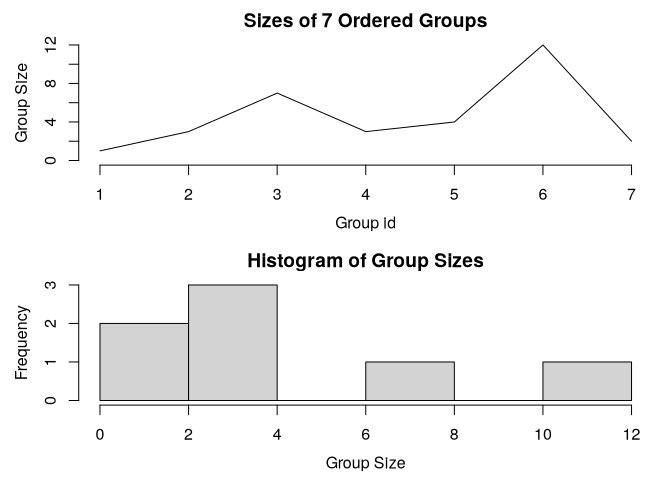

# Collapse Advanced Statistical Programming


[Source](https://fastverse.org/collapse/articles/collapse_intro.html)

``` r
library(collapse)
```

    collapse 2.1.6, see ?`collapse-package` or ?`collapse-documentation`


    Attaching package: 'collapse'

    The following object is masked from 'package:stats':

        D

``` r
library(magrittr)
library(microbenchmark)
```

# Fast statistical functions

`fsum`, `fprod`, `fmean`, `fmedian`, `fmode`, `fvar`, `fsd`, `fmin`,
`fmax`, `fnth`, `ffirst`, `flast`, `fnobs`, `fndistinct`

For column-wise means

``` r
fmean(mtcars$mpg)
```

    [1] 20.09063

``` r
(f1 <- fmean(mtcars))
```

           mpg        cyl       disp         hp       drat         wt       qsec 
     20.090625   6.187500 230.721875 146.687500   3.596563   3.217250  17.848750 
            vs         am       gear       carb 
      0.437500   0.406250   3.687500   2.812500 

``` r
(f2 <- fmean(mtcars, drop = F))
```

           mpg    cyl     disp       hp     drat      wt     qsec     vs      am
    1 20.09063 6.1875 230.7219 146.6875 3.596563 3.21725 17.84875 0.4375 0.40625
        gear   carb
    1 3.6875 2.8125

``` r
class(f1); class(f2)
```

    [1] "numeric"

    [1] "data.frame"

``` r
m <- qM(mtcars)
fmean(m)
```

           mpg        cyl       disp         hp       drat         wt       qsec 
     20.090625   6.187500 230.721875 146.687500   3.596563   3.217250  17.848750 
            vs         am       gear       carb 
      0.437500   0.406250   3.687500   2.812500 

``` r
fmean(m, drop = F)
```

              mpg    cyl     disp       hp     drat      wt     qsec     vs      am
    [1,] 20.09063 6.1875 230.7219 146.6875 3.596563 3.21725 17.84875 0.4375 0.40625
           gear   carb
    [1,] 3.6875 2.8125

Weighted statistics

``` r
weights <- abs(rnorm(fnrow(mtcars)))
fmean(mtcars)
```

           mpg        cyl       disp         hp       drat         wt       qsec 
     20.090625   6.187500 230.721875 146.687500   3.596563   3.217250  17.848750 
            vs         am       gear       carb 
      0.437500   0.406250   3.687500   2.812500 

``` r
fmean(mtcars, w = weights)
```

            mpg         cyl        disp          hp        drat          wt 
     21.0554880   5.9279131 208.0033716 135.9898104   3.6608623   3.1182164 
           qsec          vs          am        gear        carb 
     17.7725350   0.4167433   0.5139494   3.8131410   2.8177936 

Frequency-weighted standard deviation

``` r
fsd(mtcars, w = weights)
```

            mpg         cyl        disp          hp        drat          wt 
      6.1623043   1.8109169 119.4881811  64.9565679   0.5708346   0.9799209 
           qsec          vs          am        gear        carb 
      1.4670562   0.5029331   0.5098553   0.7452826   1.6787345 

Grouped statistics

``` r
fmean(mtcars, mtcars$cyl)
```

           mpg cyl     disp        hp     drat       wt     qsec        vs
    4 26.66364   4 105.1364  82.63636 4.070909 2.285727 19.13727 0.9090909
    6 19.74286   6 183.3143 122.28571 3.585714 3.117143 17.97714 0.5714286
    8 15.10000   8 353.1000 209.21429 3.229286 3.999214 16.77214 0.0000000
             am     gear     carb
    4 0.7272727 4.090909 1.545455
    6 0.4285714 3.857143 3.428571
    8 0.1428571 3.285714 3.500000

``` r
fmean(mtcars, fselect(mtcars, cyl, vs, am))
```

               mpg cyl     disp        hp     drat       wt     qsec vs am     gear
    4.0.1 26.00000   4 120.3000  91.00000 4.430000 2.140000 16.70000  0  1 5.000000
    4.1.0 22.90000   4 135.8667  84.66667 3.770000 2.935000 20.97000  1  0 3.666667
    4.1.1 28.37143   4  89.8000  80.57143 4.148571 2.028286 18.70000  1  1 4.142857
    6.0.1 20.56667   6 155.0000 131.66667 3.806667 2.755000 16.32667  0  1 4.333333
    6.1.0 19.12500   6 204.5500 115.25000 3.420000 3.388750 19.21500  1  0 3.500000
    8.0.0 15.05000   8 357.6167 194.16667 3.120833 4.104083 17.14250  0  0 3.000000
    8.0.1 15.40000   8 326.0000 299.50000 3.880000 3.370000 14.55000  0  1 5.000000
              carb
    4.0.1 2.000000
    4.1.0 1.666667
    4.1.1 1.428571
    6.0.1 4.666667
    6.1.0 2.500000
    8.0.0 3.083333
    8.0.1 6.000000

Getting column indices

``` r
(ind <- fselect(mtcars, cyl, vs, am, return = "indices"))
```

    [1] 2 8 9

``` r
fmean(get_vars(mtcars, -ind), get_vars(mtcars, ind))
```

               mpg     disp        hp     drat       wt     qsec     gear     carb
    4.0.1 26.00000 120.3000  91.00000 4.430000 2.140000 16.70000 5.000000 2.000000
    4.1.0 22.90000 135.8667  84.66667 3.770000 2.935000 20.97000 3.666667 1.666667
    4.1.1 28.37143  89.8000  80.57143 4.148571 2.028286 18.70000 4.142857 1.428571
    6.0.1 20.56667 155.0000 131.66667 3.806667 2.755000 16.32667 4.333333 4.666667
    6.1.0 19.12500 204.5500 115.25000 3.420000 3.388750 19.21500 3.500000 2.500000
    8.0.0 15.05000 357.6167 194.16667 3.120833 4.104083 17.14250 3.000000 3.083333
    8.0.1 15.40000 326.0000 299.50000 3.880000 3.370000 14.55000 5.000000 6.000000

# Factors, Grouping Objects and Grouped Data Frames

Passing factors or grouping objects to the `g` argument is faster than
passing vectors. `na.exclude = FALSE` attaches a class `na.included`

Create a factor.

``` r
f <- qF(mtcars$cyl, na.exclude = F)
attributes(f)
```

    $levels
    [1] "4" "6" "8"

    $class
    [1] "factor"      "na.included"

Grouped standard deviation

``` r
dat <- get_vars(mtcars, -ind)
fsd(dat, f)
```

           mpg     disp       hp      drat        wt     qsec      gear     carb
    4 4.509828 26.87159 20.93453 0.3654711 0.5695637 1.682445 0.5393599 0.522233
    6 1.453567 41.56246 24.26049 0.4760552 0.3563455 1.706866 0.6900656 1.812654
    8 2.560048 67.77132 50.97689 0.3723618 0.7594047 1.196014 0.7262730 1.556624

Without option na.exclude = FALSE, anyNA needs to be called on the
factor (noticeable on larger data).

``` r
f2 <- qF(mtcars$cyl)
microbenchmark(fsd(dat, f), fsd(dat, f2))
```

    Unit: microseconds
             expr   min     lq     mean median     uq    max neval cld
      fsd(dat, f) 8.577 8.8770 10.28444  9.909 10.103 41.582   100   a
     fsd(dat, f2) 8.693 8.9695  9.96502 10.082 10.274 24.096   100   a

Group (GRP) objects are prefereable over factors.

Create a `GRP` object

``` r
(g <- GRP(mtcars, ~ cyl + vs + am))
```

    collapse grouping object of length 32 with 7 ordered groups

    Call: GRP.default(X = mtcars, by = ~cyl + vs + am), X is unsorted

    Distribution of group sizes: 
       Min. 1st Qu.  Median    Mean 3rd Qu.    Max. 
      1.000   2.500   3.000   4.571   5.500  12.000 

    Groups with sizes: 
    4.0.1 4.1.0 4.1.1 6.0.1 6.1.0 8.0.0 8.0.1 
        1     3     7     3     4    12     2 

``` r
str(g)
```

    Class 'GRP'  hidden list of 9
     $ N.groups    : int 7
     $ group.id    : int [1:32] 4 4 3 5 6 5 6 2 2 5 ...
     $ group.sizes : int [1:7] 1 3 7 3 4 12 2
     $ groups      :'data.frame':   7 obs. of  3 variables:
      ..$ cyl: num [1:7] 4 4 4 6 6 8 8
      ..$ vs : num [1:7] 0 1 1 0 1 0 0
      ..$ am : num [1:7] 1 0 1 1 0 0 1
     $ group.vars  : chr [1:3] "cyl" "vs" "am"
     $ ordered     : Named logi [1:2] TRUE FALSE
      ..- attr(*, "names")= chr [1:2] "ordered" "sorted"
     $ order       : int [1:32] 27 8 9 21 3 18 19 20 26 28 ...
      ..- attr(*, "starts")= int [1:7] 1 2 5 12 15 19 31
      ..- attr(*, "maxgrpn")= int 12
      ..- attr(*, "sorted")= logi FALSE
     $ group.starts: int [1:7] 27 8 3 1 4 5 29
     $ call        : language GRP.default(X = mtcars, by = ~cyl + vs + am)

``` r
plot(g)
```



``` r
microbenchmark(fsd(dat, g), 
               fsd(dat, get_vars(mtcars, ind)))
```

    Unit: microseconds
                                expr    min     lq     mean  median     uq     max
                         fsd(dat, g) 25.332 26.163 28.18785 26.8885 29.176  45.825
     fsd(dat, get_vars(mtcars, ind)) 39.310 40.571 45.70378 41.2830 46.063 225.031
     neval cld
       100  a 
       100   b

Or, create grouped data frame.

``` r
gmtcars <- fgroup_by(mtcars, cyl, vs, am)
fmedian(gmtcars)
```

      cyl vs am   mpg  disp    hp  drat    wt  qsec gear carb
    1   4  0  1 26.00 120.3  91.0 4.430 2.140 16.70  5.0  2.0
    2   4  1  0 22.80 140.8  95.0 3.700 3.150 20.01  4.0  2.0
    3   4  1  1 30.40  79.0  66.0 4.080 1.935 18.61  4.0  1.0
    4   6  0  1 21.00 160.0 110.0 3.900 2.770 16.46  4.0  4.0
    5   6  1  0 18.65 196.3 116.5 3.500 3.440 19.17  3.5  2.5
    6   8  0  0 15.20 355.0 180.0 3.075 3.810 17.35  3.0  3.0
    7   8  0  1 15.40 326.0 299.5 3.880 3.370 14.55  5.0  6.0

``` r
head(fgroup_vars(gmtcars))
```

                      cyl vs am
    Mazda RX4           6  0  1
    Mazda RX4 Wag       6  0  1
    Datsun 710          4  1  1
    Hornet 4 Drive      6  1  0
    Hornet Sportabout   8  0  0
    Valiant             6  1  0

``` r
fmedian(gmtcars, keep.group_vars = FALSE)
```

        mpg  disp    hp  drat    wt  qsec gear carb
    1 26.00 120.3  91.0 4.430 2.140 16.70  5.0  2.0
    2 22.80 140.8  95.0 3.700 3.150 20.01  4.0  2.0
    3 30.40  79.0  66.0 4.080 1.935 18.61  4.0  1.0
    4 21.00 160.0 110.0 3.900 2.770 16.46  4.0  4.0
    5 18.65 196.3 116.5 3.500 3.440 19.17  3.5  2.5
    6 15.20 355.0 180.0 3.075 3.810 17.35  3.0  3.0
    7 15.40 326.0 299.5 3.880 3.370 14.55  5.0  6.0

Now suppose we wanted to create a new dataset which contains the mean,
sd, min and max of the variables mpg and disp grouped by cyl, vs and am:

Standard evaluation

``` r
dat <- get_vars(mtcars, c("mpg", "disp"))
add_vars(g[["groups"]],
         add_stub(fmean(dat, g, use.g.names = F), "mean_"),
         add_stub(fsd(dat, g, use.g.names = F), "sd_"),
         add_stub(fmin(dat, g, use.g.names = F), "min_"),
         add_stub(fmax(dat, g, use.g.names = F), "max_"))
```

      cyl vs am mean_mpg mean_disp    sd_mpg   sd_disp min_mpg min_disp max_mpg
    1   4  0  1 26.00000  120.3000        NA        NA    26.0    120.3    26.0
    2   4  1  0 22.90000  135.8667 1.4525839 13.969371    21.5    120.1    24.4
    3   4  1  1 28.37143   89.8000 4.7577005 18.802128    21.4     71.1    33.9
    4   6  0  1 20.56667  155.0000 0.7505553  8.660254    19.7    145.0    21.0
    5   6  1  0 19.12500  204.5500 1.6317169 44.742634    17.8    167.6    21.4
    6   8  0  0 15.05000  357.6167 2.7743959 71.823494    10.4    275.8    19.2
    7   8  0  1 15.40000  326.0000 0.5656854 35.355339    15.0    301.0    15.8
      max_disp
    1    120.3
    2    146.7
    3    121.0
    4    160.0
    5    258.0
    6    472.0
    7    351.0

Non-standard evaluation

``` r
fgroup_by(mtcars, cyl, vs, am) %>% 
  fselect(mpg, disp) %>% {
    add_vars(fgroup_vars(., "unique"),
             fmean(., keep.group_vars = F) %>% add_stub("mean_"),
             fsd(., keep.group_vars = F) %>% add_stub("sd_"),
             fmin(., keep.group_vars = F) %>% add_stub("min_"),
             fmax(., keep.group_vars = F) %>% add_stub("max_"))
  }
```

      cyl vs am mean_mpg mean_disp    sd_mpg   sd_disp min_mpg min_disp max_mpg
    1   4  0  1 26.00000  120.3000        NA        NA    26.0    120.3    26.0
    2   4  1  0 22.90000  135.8667 1.4525839 13.969371    21.5    120.1    24.4
    3   4  1  1 28.37143   89.8000 4.7577005 18.802128    21.4     71.1    33.9
    4   6  0  1 20.56667  155.0000 0.7505553  8.660254    19.7    145.0    21.0
    5   6  1  0 19.12500  204.5500 1.6317169 44.742634    17.8    167.6    21.4
    6   8  0  0 15.05000  357.6167 2.7743959 71.823494    10.4    275.8    19.2
    7   8  0  1 15.40000  326.0000 0.5656854 35.355339    15.0    301.0    15.8
      max_disp
    1    120.3
    2    146.7
    3    121.0
    4    160.0
    5    258.0
    6    472.0
    7    351.0

# Grouped and Weighted Computations

Using a weight vector

``` r
add_vars(g[["groups"]],
         add_stub(fmean(dat, g, weights, use.g.names = F), "w_mean_"),
         add_stub(fsd(dat, g, weights, use.g.names = F), "w_sd_"),
         add_stub(fmin(dat, g, use.g.names = F), "min_"),
         add_stub(fmax(dat, g, use.g.names = F), "max_"))
```

      cyl vs am w_mean_mpg w_mean_disp  w_sd_mpg w_sd_disp min_mpg min_disp max_mpg
    1   4  0  1   26.00000   120.30000 0.0000000  0.000000    26.0    120.3    26.0
    2   4  1  0   24.07174   144.64357 1.2702891  9.854252    21.5    120.1    24.4
    3   4  1  1   27.77086    92.51302 5.2107908 20.561638    21.4     71.1    33.9
    4   6  0  1   20.36828   152.71089 0.7776348  8.972710    19.7    145.0    21.0
    5   6  1  0   19.08653   195.09666 1.4195874 47.935372    17.8    167.6    21.4
    6   8  0  0   15.37648   345.81635 2.9312287 77.617230    10.4    275.8    19.2
    7   8  0  1   15.04211   303.63189        NA        NA    15.0    301.0    15.8
      max_disp
    1    120.3
    2    146.7
    3    121.0
    4    160.0
    5    258.0
    6    472.0
    7    351.0

With reordering

``` r
add_vars(g[["groups"]],
         add_stub(fmean(dat, g, weights, use.g.names = F), "w_mean_"),
         add_stub(fsd(dat, g, weights, use.g.names = F), "w_sd_"),
         add_stub(fmin(dat, g, use.g.names = F), "min_"),
         add_stub(fmax(dat, g, use.g.names = F), "max_"),
         pos = c(4,8,5,9,6,10,7,11))
```

      cyl vs am w_mean_mpg  w_sd_mpg min_mpg max_mpg w_mean_disp w_sd_disp min_disp
    1   4  0  1   26.00000 0.0000000    26.0    26.0   120.30000  0.000000    120.3
    2   4  1  0   24.07174 1.2702891    21.5    24.4   144.64357  9.854252    120.1
    3   4  1  1   27.77086 5.2107908    21.4    33.9    92.51302 20.561638     71.1
    4   6  0  1   20.36828 0.7776348    19.7    21.0   152.71089  8.972710    145.0
    5   6  1  0   19.08653 1.4195874    17.8    21.4   195.09666 47.935372    167.6
    6   8  0  0   15.37648 2.9312287    10.4    19.2   345.81635 77.617230    275.8
    7   8  0  1   15.04211        NA    15.0    15.8   303.63189        NA    301.0
      max_disp
    1    120.3
    2    146.7
    3    121.0
    4    160.0
    5    258.0
    6    472.0
    7    351.0

``` r
microbenchmark(call = add_vars(g[["groups"]],
         add_stub(fmean(dat, g, weights, use.g.names = FALSE), "w_mean_"),
         add_stub(fsd(dat, g, weights, use.g.names = FALSE), "w_sd_"),
         add_stub(fmin(dat, g, use.g.names = FALSE), "min_"),
         add_stub(fmax(dat, g, use.g.names = FALSE), "max_")))
```

    Unit: microseconds
     expr    min     lq     mean  median      uq     max neval
     call 45.103 45.837 49.55153 46.2395 47.1525 196.592   100

# Transformations with `TRA`

- calculate weighted group means and use them to demean the data
- calculate weighted group sd’s and use them to scale the data
- replace all observations by their group-minimum
- replace all observations by their group-maximum

``` r
add_vars(get_vars(mtcars, ind),
         add_stub(fmean(dat, g, weights, "-"), "w_demean_"),
         add_stub(fsd(dat, g, weights, "/"), "w_scalse_"),
         add_stub(fmin(dat, g, "replace"), "min_"),
         add_stub(fmax(dat, g, "replace"), "max_")) %>% 
  head()
```

                      cyl vs am w_demean_mpg w_demean_disp w_scalse_mpg
    Mazda RX4           6  0  1    0.6317226      7.289107    27.004963
    Mazda RX4 Wag       6  0  1    0.6317226      7.289107    27.004963
    Datsun 710          4  1  1   -4.9708581     15.486982     4.375535
    Hornet 4 Drive      6  1  0    2.3134683     62.903343    15.074803
    Hornet Sportabout   8  0  0    3.3235185     14.183651     6.379577
    Valiant             6  1  0   -0.9865317     29.903343    12.750184
                      w_scalse_disp min_mpg min_disp max_mpg max_disp
    Mazda RX4             17.831849    19.7    145.0    21.0      160
    Mazda RX4 Wag         17.831849    19.7    145.0    21.0      160
    Datsun 710             5.252500    21.4     71.1    33.9      121
    Hornet 4 Drive         5.382247    17.8    167.6    21.4      258
    Hornet Sportabout      4.638145    10.4    275.8    19.2      472
    Valiant                4.693820    17.8    167.6    21.4      258

Modify `mtcars`

``` r
pos <- as.integer(c(2,8,3,9,4,10,5,11))

add_vars(mtcars, pos) <- c(
  add_stub(fmean(dat, g, weights, "-"), "w_demean_"),
  add_stub(fsd(dat, g, weights, "/"), "w_scale_"),
  add_stub(fmin(dat, g, "replace"), "min_"),
  add_stub(fmax(dat, g, "replace"), "max_")
)
head(mtcars)
```

                       mpg w_demean_mpg w_scale_mpg min_mpg max_mpg cyl disp
    Mazda RX4         21.0    0.6317226   27.004963    19.7    21.0   6  160
    Mazda RX4 Wag     21.0    0.6317226   27.004963    19.7    21.0   6  160
    Datsun 710        22.8   -4.9708581    4.375535    21.4    33.9   4  108
    Hornet 4 Drive    21.4    2.3134683   15.074803    17.8    21.4   6  258
    Hornet Sportabout 18.7    3.3235185    6.379577    10.4    19.2   8  360
    Valiant           18.1   -0.9865317   12.750184    17.8    21.4   6  225
                      w_demean_disp w_scale_disp min_disp max_disp  hp drat    wt
    Mazda RX4              7.289107    17.831849    145.0      160 110 3.90 2.620
    Mazda RX4 Wag          7.289107    17.831849    145.0      160 110 3.90 2.875
    Datsun 710            15.486982     5.252500     71.1      121  93 3.85 2.320
    Hornet 4 Drive        62.903343     5.382247    167.6      258 110 3.08 3.215
    Hornet Sportabout     14.183651     4.638145    275.8      472 175 3.15 3.440
    Valiant               29.903343     4.693820    167.6      258 105 2.76 3.460
                       qsec vs am gear carb
    Mazda RX4         16.46  0  1    4    4
    Mazda RX4 Wag     17.02  0  1    4    4
    Datsun 710        18.61  1  1    4    1
    Hornet 4 Drive    19.44  1  0    3    1
    Hornet Sportabout 17.02  0  0    3    2
    Valiant           20.22  1  0    3    1

``` r
rm(mtcars)
```

Using `ftransform`

``` r
settransform(mtcars,
             carb_dwmed_cyl = fmedian(carb, cyl, weights, "-"),
             carb_wsd_vs_am = fsd(carb, list(vs, am), weights, "replace"))


rm(mtcars)
```

Multivariate

``` r
settransform(mtcars, c(
  fmedian(list(carb_dwmed_cyl = carb, mpg_dwmed_cyl = mpg), 
          cyl, weights, "-"),
  fsd(list(carb_wsd_vs_am = carb, mpg_wsd_vs_am = mpg), 
      list(vs, am), weights, "replace")
))
```

Nested (Computing the weighted 3rd quartile of mpg, grouped by cyl and
carb being greater than it’s weighted median, grouped by vs)

``` r
settransform(mtcars,
  mpg_gwQ3_cyl = fnth(
    mpg, 0.75,
    list(cyl, carb > fmedian(carb, vs, weights, 1L)),
    weights, 1L
  )
)

head(mtcars)
```

                       mpg cyl disp  hp drat    wt  qsec vs am gear carb
    Mazda RX4         21.0   6  160 110 3.90 2.620 16.46  0  1    4    4
    Mazda RX4 Wag     21.0   6  160 110 3.90 2.875 17.02  0  1    4    4
    Datsun 710        22.8   4  108  93 3.85 2.320 18.61  1  1    4    1
    Hornet 4 Drive    21.4   6  258 110 3.08 3.215 19.44  1  0    3    1
    Hornet Sportabout 18.7   8  360 175 3.15 3.440 17.02  0  0    3    2
    Valiant           18.1   6  225 105 2.76 3.460 20.22  1  0    3    1
                      carb_dwmed_cyl mpg_dwmed_cyl carb_wsd_vs_am mpg_wsd_vs_am
    Mazda RX4                      0           1.3      2.2753463      4.006585
    Mazda RX4 Wag                  0           1.3      2.2753463      4.006585
    Datsun 710                    -1          -3.2      0.5361809      5.210791
    Hornet 4 Drive                -3           1.7      1.3921653      3.090295
    Hornet Sportabout             -1           3.5      0.8303578      2.931229
    Valiant                       -3          -1.6      1.3921653      3.090295
                      mpg_gwQ3_cyl
    Mazda RX4             20.97676
    Mazda RX4 Wag         20.97676
    Datsun 710            30.40000
    Hornet 4 Drive        19.56054
    Hornet Sportabout     17.47843
    Valiant               19.56054

``` r
rm(mtcars)
```
