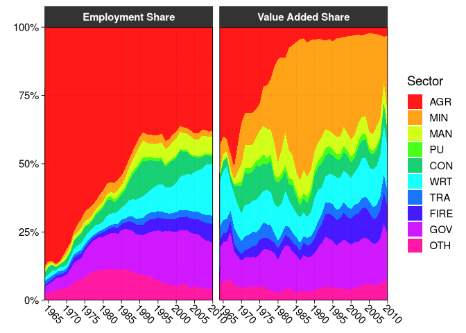

# Collapse Data and summary tools


[Source](https://fastverse.org/collapse/articles/collapse_intro.html)

# World Bank Development Data

``` r
library(collapse)
```

    collapse 2.1.6, see ?`collapse-package` or ?`collapse-documentation`


    Attaching package: 'collapse'

    The following object is masked from 'package:stats':

        D

``` r
library(magrittr)
head(wlddev)
```

          country iso3c       date year decade     region     income  OECD PCGDP
    1 Afghanistan   AFG 1961-01-01 1960   1960 South Asia Low income FALSE    NA
    2 Afghanistan   AFG 1962-01-01 1961   1960 South Asia Low income FALSE    NA
    3 Afghanistan   AFG 1963-01-01 1962   1960 South Asia Low income FALSE    NA
    4 Afghanistan   AFG 1964-01-01 1963   1960 South Asia Low income FALSE    NA
    5 Afghanistan   AFG 1965-01-01 1964   1960 South Asia Low income FALSE    NA
    6 Afghanistan   AFG 1966-01-01 1965   1960 South Asia Low income FALSE    NA
      LIFEEX GINI       ODA     POP
    1 32.446   NA 116769997 8996973
    2 32.962   NA 232080002 9169410
    3 33.471   NA 112839996 9351441
    4 33.971   NA 237720001 9543205
    5 34.463   NA 295920013 9744781
    6 34.948   NA 341839996 9956320

Name attributes, set with `vlabels()`.

``` r
namlab(wlddev, class = TRUE)
```

       Variable     Class
    1   country character
    2     iso3c    factor
    3      date      Date
    4      year   integer
    5    decade   integer
    6    region    factor
    7    income    factor
    8      OECD   logical
    9     PCGDP   numeric
    10   LIFEEX   numeric
    11     GINI   numeric
    12      ODA   numeric
    13      POP   numeric
                                                                                   Label
    1                                                                       Country Name
    2                                                                       Country Code
    3                                                         Date Recorded (Fictitious)
    4                                                                               Year
    5                                                                             Decade
    6                                                                             Region
    7                                                                       Income Level
    8                                                            Is OECD Member Country?
    9                                                 GDP per capita (constant 2010 US$)
    10                                           Life expectancy at birth, total (years)
    11                                                  Gini index (World Bank estimate)
    12 Net official development assistance and official aid received (constant 2018 US$)
    13                                                                 Population, total

``` r
descr(wlddev)
```

    Dataset: wlddev, 13 Variables, N = 13176
    --------------------------------------------------------------------------------
    country (character): Country Name
    Statistics
          N  Ndist
      13176    216
    Table
                          Freq   Perc
    Afghanistan             61   0.46
    Albania                 61   0.46
    Algeria                 61   0.46
    American Samoa          61   0.46
    Andorra                 61   0.46
    Angola                  61   0.46
    Antigua and Barbuda     61   0.46
    Argentina               61   0.46
    Armenia                 61   0.46
    Aruba                   61   0.46
    Australia               61   0.46
    Austria                 61   0.46
    Azerbaijan              61   0.46
    Bahamas, The            61   0.46
    ... 202 Others       12322  93.52

    Summary of Table Frequencies
       Min. 1st Qu.  Median    Mean 3rd Qu.    Max. 
         61      61      61      61      61      61 
    --------------------------------------------------------------------------------
    iso3c (factor): Country Code
    Statistics
          N  Ndist
      13176    216
    Table
                     Freq   Perc
    ABW                61   0.46
    AFG                61   0.46
    AGO                61   0.46
    ALB                61   0.46
    AND                61   0.46
    ARE                61   0.46
    ARG                61   0.46
    ARM                61   0.46
    ASM                61   0.46
    ATG                61   0.46
    AUS                61   0.46
    AUT                61   0.46
    AZE                61   0.46
    BDI                61   0.46
    ... 202 Others  12322  93.52

    Summary of Table Frequencies
       Min. 1st Qu.  Median    Mean 3rd Qu.    Max. 
         61      61      61      61      61      61 
    --------------------------------------------------------------------------------
    date (Date): Date Recorded (Fictitious)
    Statistics
             N       Ndist         Min         Max  
         13176          61  1961-01-01  2021-01-01  
    --------------------------------------------------------------------------------
    year (integer): Year
    Statistics
          N  Ndist  Mean     SD   Min   Max  Skew  Kurt
      13176     61  1990  17.61  1960  2020    -0   1.8
    Quantiles
        1%    5%   10%   25%   50%   75%   90%   95%   99%
      1960  1963  1966  1975  1990  2005  2014  2017  2020
    --------------------------------------------------------------------------------
    decade (integer): Decade
    Statistics
          N  Ndist     Mean     SD   Min   Max  Skew  Kurt
      13176      7  1985.57  17.51  1960  2020  0.03  1.79
    Quantiles
        1%    5%   10%   25%   50%   75%   90%   95%   99%
      1960  1960  1960  1970  1990  2000  2010  2010  2020
    --------------------------------------------------------------------------------
    region (factor): Region
    Statistics
          N  Ndist
      13176      7
    Table
                                Freq   Perc
    Europe & Central Asia       3538  26.85
    Sub-Saharan Africa          2928  22.22
    Latin America & Caribbean   2562  19.44
    East Asia & Pacific         2196  16.67
    Middle East & North Africa  1281   9.72
    South Asia                   488   3.70
    North America                183   1.39
    --------------------------------------------------------------------------------
    income (factor): Income Level
    Statistics
          N  Ndist
      13176      4
    Table
                         Freq   Perc
    High income          4819  36.57
    Upper middle income  3660  27.78
    Lower middle income  2867  21.76
    Low income           1830  13.89
    --------------------------------------------------------------------------------
    OECD (logical): Is OECD Member Country?
    Statistics
          N  Ndist
      13176      2
    Table
            Freq   Perc
    FALSE  10980  83.33
    TRUE    2196  16.67
    --------------------------------------------------------------------------------
    PCGDP (numeric): GDP per capita (constant 2010 US$)
    Statistics (28.13% NAs)
         N  Ndist      Mean        SD     Min        Max  Skew   Kurt
      9470   9470  12048.78  19077.64  132.08  196061.42  3.13  17.12
    Quantiles
          1%      5%     10%      25%      50%       75%       90%       95%
      227.71  399.62  555.55  1303.19  3767.16  14787.03  35646.02  48507.84
           99%
      92340.28
    --------------------------------------------------------------------------------
    LIFEEX (numeric): Life expectancy at birth, total (years)
    Statistics (11.43% NAs)
          N  Ndist  Mean     SD    Min    Max   Skew  Kurt
      11670  10548  64.3  11.48  18.91  85.42  -0.67  2.67
    Quantiles
         1%     5%    10%    25%    50%    75%    90%    95%    99%
      35.83  42.77  46.83  56.36  67.44  72.95  77.08  79.34  82.36
    --------------------------------------------------------------------------------
    GINI (numeric): Gini index (World Bank estimate)
    Statistics (86.76% NAs)
         N  Ndist   Mean   SD   Min   Max  Skew  Kurt
      1744    368  38.53  9.2  20.7  65.8   0.6  2.53
    Quantiles
        1%    5%   10%   25%   50%  75%   90%    95%   99%
      24.6  26.3  27.6  31.5  36.4   45  52.6  55.98  60.5
    --------------------------------------------------------------------------------
    ODA (numeric): Net official development assistance and official aid received (constant 2018 US$)
    Statistics (34.67% NAs)
         N  Ndist        Mean          SD          Min             Max  Skew
      8608   7832  454'720131  868'712654  -997'679993  2.56715605e+10  6.98
        Kurt
      114.89
    Quantiles
                1%           5%          10%          25%         50%         75%
      -12'593999.7  1'363500.01  8'347000.31  44'887499.8  165'970001  495'042503
                 90%             95%             99%
      1.18400697e+09  1.93281696e+09  3.73380782e+09
    --------------------------------------------------------------------------------
    POP (numeric): Population, total
    Statistics (1.95% NAs)
          N  Ndist         Mean          SD   Min             Max  Skew    Kurt
      12919  12877  24'245971.6  102'120674  2833  1.39771500e+09  9.75  108.91
    Quantiles
           1%       5%      10%     25%       50%        75%          90%
      8698.84  31083.3  62268.4  443791  4'072517  12'816178  46'637331.4
              95%         99%
      81'177252.5  308'862641
    --------------------------------------------------------------------------------

Convert output to data frame

``` r
descr(wlddev) %>% 
  as.data.frame() %>% 
  head()
```

      Variable     Class                      Label     N Ndist   Min   Max
    1  country character               Country Name 13176   216    NA    NA
    2    iso3c    factor               Country Code 13176   216    NA    NA
    3     date      Date Date Recorded (Fictitious) 13176    61 -3287 18628
    4     year   integer                       Year 13176    61  1960  2020
    5   decade   integer                     Decade 13176     7  1960  2020
    6   region    factor                     Region 13176     7    NA    NA
          Mean       SD          Skew     Kurt   1%   5%  10%  25%  50%  75%  90%
    1       NA       NA            NA       NA   NA   NA   NA   NA   NA   NA   NA
    2       NA       NA            NA       NA   NA   NA   NA   NA   NA   NA   NA
    3       NA       NA            NA       NA   NA   NA   NA   NA   NA   NA   NA
    4 1990.000 17.60749 -5.770900e-16 1.799355 1960 1963 1966 1975 1990 2005 2014
    5 1985.574 17.51175  3.256512e-02 1.791726 1960 1960 1960 1970 1990 2000 2010
    6       NA       NA            NA       NA   NA   NA   NA   NA   NA   NA   NA
       95%  99%
    1   NA   NA
    2   NA   NA
    3   NA   NA
    4 2017 2020
    5 2010 2020
    6   NA   NA

Check which variables are time-varying.

``` r
varying(wlddev, wlddev$iso3c)
```

    country   iso3c    date    year  decade  region  income    OECD   PCGDP  LIFEEX 
      FALSE   FALSE    TRUE    TRUE    TRUE   FALSE   FALSE   FALSE    TRUE    TRUE 
       GINI     ODA     POP 
       TRUE    TRUE    TRUE 

Check variation within each country

``` r
varying(wlddev, wlddev$iso3c, any_group = F) %>% 
  head()
```

        country iso3c date year decade region income  OECD PCGDP LIFEEX GINI  ODA
    ABW   FALSE FALSE TRUE TRUE   TRUE  FALSE  FALSE FALSE  TRUE   TRUE   NA TRUE
    AFG   FALSE FALSE TRUE TRUE   TRUE  FALSE  FALSE FALSE  TRUE   TRUE   NA TRUE
    AGO   FALSE FALSE TRUE TRUE   TRUE  FALSE  FALSE FALSE  TRUE   TRUE TRUE TRUE
    ALB   FALSE FALSE TRUE TRUE   TRUE  FALSE  FALSE FALSE  TRUE   TRUE TRUE TRUE
    AND   FALSE FALSE TRUE TRUE   TRUE  FALSE  FALSE FALSE  TRUE     NA   NA   NA
    ARE   FALSE FALSE TRUE TRUE   TRUE  FALSE  FALSE FALSE  TRUE   TRUE TRUE TRUE
         POP
    ABW TRUE
    AFG TRUE
    AGO TRUE
    ALB TRUE
    AND TRUE
    ARE TRUE

In general data is varying if it has two or more distinct non-missing
values. We could also take a closer look at observation counts and
distinct values using:

``` r
fnobs(wlddev, wlddev$iso3c) %>% head()
```

        country iso3c date year decade region income OECD PCGDP LIFEEX GINI ODA POP
    ABW      61    61   61   61     61     61     61   61    32     60    0  20  60
    AFG      61    61   61   61     61     61     61   61    18     60    0  60  60
    AGO      61    61   61   61     61     61     61   61    40     60    3  58  60
    ALB      61    61   61   61     61     61     61   61    40     60    9  32  60
    AND      61    61   61   61     61     61     61   61    50      0    0   0  60
    ARE      61    61   61   61     61     61     61   61    45     60    2  45  60

``` r
fndistinct(wlddev, wlddev$iso3c) %>% head()
```

        country iso3c date year decade region income OECD PCGDP LIFEEX GINI ODA POP
    ABW       1     1   61   61      7      1      1    1    32     60    0  20  60
    AFG       1     1   61   61      7      1      1    1    18     60    0  60  60
    AGO       1     1   61   61      7      1      1    1    40     59    3  58  60
    ALB       1     1   61   61      7      1      1    1    40     59    9  32  60
    AND       1     1   61   61      7      1      1    1    50      0    0   0  60
    ARE       1     1   61   61      7      1      1    1    45     60    2  45  60

Summarize. `higher = TRUE` provides skewness.

``` r
qsu(wlddev, cols = 9:12, higher = TRUE)
```

                N        Mean          SD          Min             Max     Skew
    PCGDP    9470   12048.778  19077.6416     132.0776      196061.417   3.1276
    LIFEEX  11670     64.2963     11.4764       18.907         85.4171  -0.6748
    GINI     1744     38.5341      9.2006         20.7            65.8    0.596
    ODA      8608  454'720131  868'712654  -997'679993  2.56715605e+10   6.9832
               Kurt
    PCGDP   17.1154
    LIFEEX   2.6718
    GINI     2.5329
    ODA     114.889

Same by region

``` r
qsu(wlddev, by = ~region, cols = 9:12, vlabels = TRUE, higher = TRUE)
```

    , , PCGDP: GDP per capita (constant 2010 US$)

                                   N        Mean          SD         Min
    East Asia & Pacific         1467  10513.2441  14383.5507    132.0776
    Europe & Central Asia       2243  25992.9618  26435.1316    366.9354
    Latin America & Caribbean   1976   7628.4477   8818.5055   1005.4085
    Middle East & North Africa   842  13878.4213  18419.7912    578.5996
    North America                180    48699.76  24196.2855  16405.9053
    South Asia                   382   1235.9256   1611.2232    265.9625
    Sub-Saharan Africa          2380   1840.0259   2596.0104    164.3366
                                       Max    Skew     Kurt
    East Asia & Pacific         71992.1517  1.6392   4.7419
    Europe & Central Asia       196061.417  2.2022  10.1977
    Latin America & Caribbean   88391.3331  4.1702  29.3739
    Middle East & North Africa  116232.753  2.4178   9.7669
    North America               113236.091   0.938   2.9688
    South Asia                    8476.564  2.7874  10.3402
    Sub-Saharan Africa          20532.9523  3.1161  14.4175

    , , LIFEEX: Life expectancy at birth, total (years)

                                   N     Mean       SD      Min      Max     Skew
    East Asia & Pacific         1807  65.9445  10.1633   18.907   85.078   -0.856
    Europe & Central Asia       3046  72.1625   5.7602   45.369  85.4171  -0.5594
    Latin America & Caribbean   2107  68.3486   7.3768   41.762  82.1902  -1.0357
    Middle East & North Africa  1226  66.2508   9.8306   29.919  82.8049  -0.8782
    North America                144  76.2867   3.5734  68.8978  82.0488  -0.1963
    South Asia                   480  57.5585  11.3004   32.446   78.921  -0.2623
    Sub-Saharan Africa          2860   51.581   8.6876   26.172  74.5146   0.1452
                                  Kurt
    East Asia & Pacific         4.3125
    Europe & Central Asia       4.0434
    Latin America & Caribbean   3.9379
    Middle East & North Africa  3.3054
    North America                1.976
    South Asia                  2.1147
    Sub-Saharan Africa          2.7245

    , , GINI: Gini index (World Bank estimate)

                                  N     Mean      SD   Min   Max     Skew    Kurt
    East Asia & Pacific         154  37.7571  5.0318  27.8  49.1   0.3631  2.3047
    Europe & Central Asia       798  31.9114  4.5809  20.7  48.4   0.2989  2.5254
    Latin America & Caribbean   413  49.9557  5.4821  34.4  63.3  -0.0386  2.3631
    Middle East & North Africa   91  36.0143  5.2073    26  47.4   0.0241  1.9209
    North America                49  37.4816  3.6972    31  41.5  -0.4282  1.4577
    South Asia                   46  33.8804  3.9898  25.9  43.8   0.4205  2.7748
    Sub-Saharan Africa          193  44.6606  8.2003  29.8  65.8   0.6598  2.8451

    , , ODA: Net official development assistance and official aid received (constant 2018 US$)

                                   N            Mean              SD           Min
    East Asia & Pacific         1537      352'017964      622'847624   -997'679993
    Europe & Central Asia        787      402'455286      568'237036   -322'070007
    Latin America & Caribbean   1972      172'880081      260'781049   -444'040009
    Middle East & North Africa  1105      732'380009  1.52108993e+09   -141'789993
    North America                 39      468717.916     10'653560.8  -15'869999.9
    South Asia                   466  1.27049955e+09  1.61492889e+09   -247'369995
    Sub-Saharan Africa          2702      486'371750      656'336230  -18'409999.8
                                           Max    Skew     Kurt
    East Asia & Pacific         4.04487988e+09   2.722  11.5221
    Europe & Central Asia       4.34612988e+09  3.1305  15.2525
    Latin America & Caribbean   2.99568994e+09  3.3259  22.4569
    Middle East & North Africa  2.56715605e+10  6.6304  79.2238
    North America                  61'509998.3  4.8602  29.3092
    South Asia                  8.75425977e+09  1.7923    6.501
    Sub-Saharan Africa          1.18790801e+10  4.5456  48.8447

``` r
qsu(wlddev, pid = ~ iso3c, cols = c(1,4,9:12), vlabels = TRUE, higher = TRUE)
```

    , , country: Country Name

               N/T  Mean  SD  Min  Max  Skew  Kurt
    Overall  13176     -   -    -    -     -     -
    Between    216     -   -    -    -     -     -
    Within      61     -   -    -    -     -     -

    , , year: Year

               N/T  Mean       SD   Min   Max  Skew    Kurt
    Overall  13176  1990  17.6075  1960  2020    -0  1.7994
    Between    216  1990        0  1990  1990     -       -
    Within      61  1990  17.6075  1960  2020    -0  1.7994

    , , PCGDP: GDP per capita (constant 2010 US$)

                 N/T        Mean          SD          Min         Max    Skew
    Overall     9470   12048.778  19077.6416     132.0776  196061.417  3.1276
    Between      206  12962.6054  20189.9007     253.1886   141200.38  3.1263
    Within   45.9709   12048.778   6723.6808  -33504.8721  76767.5254  0.6576
                Kurt
    Overall  17.1154
    Between  16.2299
    Within   17.2003

    , , LIFEEX: Life expectancy at birth, total (years)

                 N/T     Mean       SD      Min      Max     Skew    Kurt
    Overall    11670  64.2963  11.4764   18.907  85.4171  -0.6748  2.6718
    Between      207  64.9537   9.8936  40.9663  85.4171  -0.5012  2.1693
    Within   56.3768  64.2963   6.0842  32.9068  84.4198  -0.2643  3.7027

    , , GINI: Gini index (World Bank estimate)

                 N/T     Mean      SD      Min      Max    Skew    Kurt
    Overall     1744  38.5341  9.2006     20.7     65.8   0.596  2.5329
    Between      167  39.4233  8.1356  24.8667  61.7143  0.5832  2.8256
    Within   10.4431  38.5341  2.9277  25.3917  55.3591  0.3263  5.3389

    , , ODA: Net official development assistance and official aid received (constant 2018 US$)

                 N/T        Mean          SD              Min             Max
    Overall     8608  454'720131  868'712654      -997'679993  2.56715605e+10
    Between      178  439'168412  569'049959       468717.916  3.62337432e+09
    Within   48.3596  454'720131  650'709624  -2.44379420e+09  2.45610972e+10
               Skew      Kurt
    Overall  6.9832   114.889
    Between   2.355    9.9487
    Within   9.6047  263.3716

The above output reports 3 sets of summary statistics for each variable:
Statistics computed on the Overall (raw) data, and on the
Between-country (i.e. country averaged) and Within-country
(i.e. country-demeaned) data1. This is a powerful way to summarize panel
data because aggregating the data by country gives us a cross-section of
countries with no variation over time, whereas subtracting country
specific means from the data eliminates all cross-sectional variation.

The N/T columns shows that for `PCGDP` we have 9470 total observations,
that we observe GDP data for 206 countries and that we have on average
45.97 observations (time-periods) per country. In contrast the GINI
Index is only available for 167 countries with 10.4 observations on
average. The Overall and Within mean of the data are identical by
definition, and the Between mean would also be the same in a balanced
panel with no missing observations. In practice we have unequal amounts
of observations for different countries, thus countries have different
weights in the Overall mean and the difference between *Overall* and
*Between*-country mean reflects this discrepancy. The most interesting
statistic in this summary arguably is the standard deviation, and in
particular the comparison of the *Between*-SD reflecting the variation
between countries and the *Within*-SD reflecting average variation over
time. This comparison shows that `PCGDP`, `LIFEEX` and `GINI` vary more
between countries, but ODA received varies more within countries over
time. The 0 *Between*-SD for the year variable and the fact that the
*Overall* and *Within*-SD are equal shows that year is individual
invariant. Thus `qsu` also provides the same information as `varying`,
but with additional details on the relative magnitudes of
cross-sectional and time series variation. It is also a common pattern
that the *kurtosis* increases in within-transformed data, while the
*skewness* decreases in most cases.

Perform the same across regions

``` r
(m <- qsu(wlddev, by = ~ region, pid = ~ iso3c, cols = 9:12, 
    vlabels = TRUE, higher = TRUE))
```

    , , Overall, PCGDP: GDP per capita (constant 2010 US$)

                                 N/T        Mean          SD         Min
    East Asia & Pacific         1467  10513.2441  14383.5507    132.0776
    Europe & Central Asia       2243  25992.9618  26435.1316    366.9354
    Latin America & Caribbean   1976   7628.4477   8818.5055   1005.4085
    Middle East & North Africa   842  13878.4213  18419.7912    578.5996
    North America                180    48699.76  24196.2855  16405.9053
    South Asia                   382   1235.9256   1611.2232    265.9625
    Sub-Saharan Africa          2380   1840.0259   2596.0104    164.3366
                                       Max    Skew     Kurt
    East Asia & Pacific         71992.1517  1.6392   4.7419
    Europe & Central Asia       196061.417  2.2022  10.1977
    Latin America & Caribbean   88391.3331  4.1702  29.3739
    Middle East & North Africa  116232.753  2.4178   9.7669
    North America               113236.091   0.938   2.9688
    South Asia                    8476.564  2.7874  10.3402
    Sub-Saharan Africa          20532.9523  3.1161  14.4175

    , , Between, PCGDP: GDP per capita (constant 2010 US$)

                                N/T        Mean          SD         Min         Max
    East Asia & Pacific          34  10513.2441   12771.742    444.2899  39722.0077
    Europe & Central Asia        56  25992.9618   24051.035    809.4753   141200.38
    Latin America & Caribbean    38   7628.4477   8470.9708   1357.3326  77403.7443
    Middle East & North Africa   20  13878.4213  17251.6962   1069.6596  64878.4021
    North America                 3    48699.76  18604.4369  35260.4708  74934.5874
    South Asia                    8   1235.9256   1488.3669      413.68   6621.5002
    Sub-Saharan Africa           47   1840.0259   2234.3254    253.1886   9922.0052
                                  Skew     Kurt
    East Asia & Pacific         1.1488   2.7089
    Europe & Central Asia       2.0026   9.0733
    Latin America & Caribbean   4.4548  32.4956
    Middle East & North Africa  1.9508   6.0796
    North America               0.7065      1.5
    South Asia                  3.0546  11.3083
    Sub-Saharan Africa          2.1442   6.8259

    , , Within, PCGDP: GDP per capita (constant 2010 US$)

                                    N/T       Mean          SD          Min
    East Asia & Pacific         43.1471  12048.778   6615.8248  -11964.6472
    Europe & Central Asia       40.0536  12048.778  10971.0483  -33504.8721
    Latin America & Caribbean        52  12048.778   2451.2636    -354.1639
    Middle East & North Africa     42.1  12048.778   6455.0512  -18674.4049
    North America                    60  12048.778  15470.4609  -29523.1017
    South Asia                    47.75  12048.778    617.0934   10026.9155
    Sub-Saharan Africa          50.6383  12048.778    1321.764    4846.3834
                                       Max     Skew     Kurt
    East Asia & Pacific          49541.463    0.824   8.9418
    Europe & Central Asia       76767.5254   0.4307   7.4139
    Latin America & Caribbean   23036.3668   0.1259   7.1939
    Middle East & North Africa  63665.0446   1.8525  23.0457
    North America               50350.2816  -0.2451   3.2075
    South Asia                   14455.865   0.9846   5.6366
    Sub-Saharan Africa          24883.1246   1.3879  28.0186

    , , Overall, LIFEEX: Life expectancy at birth, total (years)

                                 N/T     Mean       SD      Min      Max     Skew
    East Asia & Pacific         1807  65.9445  10.1633   18.907   85.078   -0.856
    Europe & Central Asia       3046  72.1625   5.7602   45.369  85.4171  -0.5594
    Latin America & Caribbean   2107  68.3486   7.3768   41.762  82.1902  -1.0357
    Middle East & North Africa  1226  66.2508   9.8306   29.919  82.8049  -0.8782
    North America                144  76.2867   3.5734  68.8978  82.0488  -0.1963
    South Asia                   480  57.5585  11.3004   32.446   78.921  -0.2623
    Sub-Saharan Africa          2860   51.581   8.6876   26.172  74.5146   0.1452
                                  Kurt
    East Asia & Pacific         4.3125
    Europe & Central Asia       4.0434
    Latin America & Caribbean   3.9379
    Middle East & North Africa  3.3054
    North America                1.976
    South Asia                  2.1147
    Sub-Saharan Africa          2.7245

    , , Between, LIFEEX: Life expectancy at birth, total (years)

                                N/T     Mean      SD      Min      Max     Skew
    East Asia & Pacific          32  65.9445  7.6833  49.7995  77.9008  -0.3832
    Europe & Central Asia        55  72.1625  4.4378  60.1129  85.4171  -0.6584
    Latin America & Caribbean    40  68.3486  4.9199  53.4918  82.1902  -0.9947
    Middle East & North Africa   21  66.2508   5.922  52.5371  76.7395  -0.3181
    North America                 3  76.2867  1.3589  74.8065  78.4175   0.1467
    South Asia                    8  57.5585  5.6158  49.1972  69.3429   0.6643
    Sub-Saharan Africa           48   51.581   5.657  40.9663  71.5749   1.1333
                                  Kurt
    East Asia & Pacific         2.4322
    Europe & Central Asia       2.8874
    Latin America & Caribbean   4.1617
    Middle East & North Africa  3.0331
    North America               1.6356
    South Asia                  3.1288
    Sub-Saharan Africa           4.974

    , , Within, LIFEEX: Life expectancy at birth, total (years)

                                    N/T     Mean      SD      Min      Max     Skew
    East Asia & Pacific         56.4688  64.2963  6.6528  32.9068  83.9918  -0.3949
    Europe & Central Asia       55.3818  64.2963  3.6723  46.3045  78.6265  -0.0307
    Latin America & Caribbean    52.675  64.2963  5.4965  46.7831  79.5026  -0.3827
    Middle East & North Africa   58.381  64.2963  7.8467  41.6187  78.8872  -0.6216
    North America                    48  64.2963  3.3049  54.7766  69.4306  -0.4327
    South Asia                       60  64.2963  9.8062  41.4342  83.0122  -0.0946
    Sub-Saharan Africa          59.5833  64.2963  6.5933  41.5678  84.4198   0.0811
                                  Kurt
    East Asia & Pacific         3.9528
    Europe & Central Asia       3.7576
    Latin America & Caribbean   2.9936
    Middle East & North Africa   2.808
    North America               2.3027
    South Asia                  2.1035
    Sub-Saharan Africa          2.7821

    , , Overall, GINI: Gini index (World Bank estimate)

                                N/T     Mean      SD   Min   Max     Skew    Kurt
    East Asia & Pacific         154  37.7571  5.0318  27.8  49.1   0.3631  2.3047
    Europe & Central Asia       798  31.9114  4.5809  20.7  48.4   0.2989  2.5254
    Latin America & Caribbean   413  49.9557  5.4821  34.4  63.3  -0.0386  2.3631
    Middle East & North Africa   91  36.0143  5.2073    26  47.4   0.0241  1.9209
    North America                49  37.4816  3.6972    31  41.5  -0.4282  1.4577
    South Asia                   46  33.8804  3.9898  25.9  43.8   0.4205  2.7748
    Sub-Saharan Africa          193  44.6606  8.2003  29.8  65.8   0.6598  2.8451

    , , Between, GINI: Gini index (World Bank estimate)

                                N/T     Mean      SD      Min      Max     Skew
    East Asia & Pacific          23  37.7571  4.3005     30.8  45.8857   0.4912
    Europe & Central Asia        49  31.9114  4.0611  24.8667   40.935   0.3323
    Latin America & Caribbean    25  49.9557  4.0492     41.1     57.9     0.03
    Middle East & North Africa   15  36.0143  4.7002    29.05     42.7  -0.2035
    North America                 2  37.4816  3.3563  33.1222  40.0129  -0.5503
    South Asia                    7  33.8804  3.0052  30.3556     38.8   0.2786
    Sub-Saharan Africa           46  44.6606  6.8844    34.52  61.7143   0.9464
                                  Kurt
    East Asia & Pacific          2.213
    Europe & Central Asia        2.291
    Latin America & Caribbean   2.2573
    Middle East & North Africa  1.6815
    North America               1.3029
    South Asia                  1.4817
    Sub-Saharan Africa          3.2302

    , , Within, GINI: Gini index (World Bank estimate)

                                    N/T     Mean      SD      Min      Max     Skew
    East Asia & Pacific          6.6957  38.5341  2.6125  31.0187  45.8901  -0.0585
    Europe & Central Asia       16.2857  38.5341  2.1195  31.2841  50.1387   0.6622
    Latin America & Caribbean     16.52  38.5341  3.6955  25.3917  48.8341  -0.0506
    Middle East & North Africa   6.0667  38.5341  2.2415  31.7675   45.777   0.0408
    North America                  24.5  38.5341  1.5507  33.0212  42.7119  -1.3213
    South Asia                   6.5714  38.5341  2.6244  32.8341  45.0675  -0.1055
    Sub-Saharan Africa           4.1957  38.5341  4.4553  27.9452  55.3591   0.6338
                                  Kurt
    East Asia & Pacific         3.0933
    Europe & Central Asia       6.1763
    Latin America & Caribbean   2.7603
    Middle East & North Africa  4.7415
    North America               6.8321
    South Asia                  2.6885
    Sub-Saharan Africa          4.4174

    , , Overall, ODA: Net official development assistance and official aid received (constant 2018 US$)

                                 N/T            Mean              SD           Min
    East Asia & Pacific         1537      352'017964      622'847624   -997'679993
    Europe & Central Asia        787      402'455286      568'237036   -322'070007
    Latin America & Caribbean   1972      172'880081      260'781049   -444'040009
    Middle East & North Africa  1105      732'380009  1.52108993e+09   -141'789993
    North America                 39      468717.916     10'653560.8  -15'869999.9
    South Asia                   466  1.27049955e+09  1.61492889e+09   -247'369995
    Sub-Saharan Africa          2702      486'371750      656'336230  -18'409999.8
                                           Max    Skew     Kurt
    East Asia & Pacific         4.04487988e+09   2.722  11.5221
    Europe & Central Asia       4.34612988e+09  3.1305  15.2525
    Latin America & Caribbean   2.99568994e+09  3.3259  22.4569
    Middle East & North Africa  2.56715605e+10  6.6304  79.2238
    North America                  61'509998.3  4.8602  29.3092
    South Asia                  8.75425977e+09  1.7923    6.501
    Sub-Saharan Africa          1.18790801e+10  4.5456  48.8447

    , , Between, ODA: Net official development assistance and official aid received (constant 2018 US$)

                                N/T            Mean              SD          Min
    East Asia & Pacific          31      352'017964      457'183279  1'654615.38
    Europe & Central Asia        32      402'455286      438'074771  12'516000.1
    Latin America & Caribbean    37      172'880081      167'160838  2'225483.88
    Middle East & North Africa   21      732'380009      775'418887   3'112820.5
    North America                 1      468717.916               0   468717.916
    South Asia                    8  1.27049955e+09  1.18347893e+09  27'152499.9
    Sub-Saharan Africa           48      486'371750      397'995105  28'801206.9
                                           Max    Skew    Kurt
    East Asia & Pacific         1.63585532e+09  1.7771  5.1361
    Europe & Central Asia       2.05456932e+09  2.0449  7.2489
    Latin America & Caribbean       538'386665  0.8981  2.4954
    Middle East & North Africa  2.86174883e+09  1.1363  3.6377
    North America                   468717.916       -       -
    South Asia                  3.62337432e+09  0.7229  2.4072
    Sub-Saharan Africa          1.55049113e+09  0.9871  3.1513

    , , Within, ODA: Net official development assistance and official aid received (constant 2018 US$)

                                    N/T        Mean              SD
    East Asia & Pacific         49.5806  454'720131      422'992450
    Europe & Central Asia       24.5938  454'720131      361'916875
    Latin America & Caribbean   53.2973  454'720131      200'159960
    Middle East & North Africa   52.619  454'720131  1.30860235e+09
    North America                    39  454'720131     10'653560.8
    South Asia                    58.25  454'720131  1.09880524e+09
    Sub-Saharan Africa          56.2917  454'720131      521'897637
                                            Min             Max    Skew     Kurt
    East Asia & Pacific         -2.04042108e+09  3.59673152e+09  0.2908  14.4428
    Europe & Central Asia       -1.08796786e+09  3.30549004e+09  2.3283  18.6937
    Latin America & Caribbean       -527'706542  3.28976141e+09  3.7015  41.7506
    Middle East & North Africa  -2.34610870e+09  2.45610972e+10  7.8663  117.987
    North America                    438'381413      515'761411  4.8602  29.3092
    South Asia                  -2.44379420e+09  5.58560558e+09  1.8418   9.4588
    Sub-Saharan Africa              -952'168698  1.12814455e+10  5.2349  86.1042

``` r
class(m); str(m)
```

    [1] "qsu"   "array" "table"

     'qsu' num [1:7, 1:7, 1:3, 1:4] 1467 2243 1976 842 180 ...
     - attr(*, "dimnames")=List of 4
      ..$ : chr [1:7] "East Asia & Pacific" "Europe & Central Asia" "Latin America & Caribbean" "Middle East & North Africa" ...
      ..$ : chr [1:7] "N/T" "Mean" "SD" "Min" ...
      ..$ : chr [1:3] "Overall" "Between" "Within"
      ..$ : chr [1:4] "PCGDP: GDP per capita (constant 2010 US$)" "LIFEEX: Life expectancy at birth, total (years)" "GINI: Gini index (World Bank estimate)" "ODA: Net official development assistance and official aid received (constant 2018 US$)"

Notice that the output here is a 4D array of summary statistics, which
we could also subset (\[) or permute (aperm) to view these statistics in
any convenient way.

Output as nested list.

``` r
l <- qsu(wlddev, by = ~ region, pid = ~ iso3c, cols = 9:12,
          vlabels = T, higher = T, array = F)
str(l, give.attr = F)
```

    List of 4
     $ PCGDP: GDP per capita (constant 2010 US$)                                             :List of 3
      ..$ Overall: 'qsu' num [1:7, 1:7] 1467 2243 1976 842 180 ...
      ..$ Between: 'qsu' num [1:7, 1:7] 34 56 38 20 3 ...
      ..$ Within : 'qsu' num [1:7, 1:7] 43.1 40.1 52 42.1 60 ...
     $ LIFEEX: Life expectancy at birth, total (years)                                       :List of 3
      ..$ Overall: 'qsu' num [1:7, 1:7] 1807 3046 2107 1226 144 ...
      ..$ Between: 'qsu' num [1:7, 1:7] 32 55 40 21 3 ...
      ..$ Within : 'qsu' num [1:7, 1:7] 56.5 55.4 52.7 58.4 48 ...
     $ GINI: Gini index (World Bank estimate)                                                :List of 3
      ..$ Overall: 'qsu' num [1:7, 1:7] 154 798 413 91 49 ...
      ..$ Between: 'qsu' num [1:7, 1:7] 23 49 25 15 2 ...
      ..$ Within : 'qsu' num [1:7, 1:7] 6.7 16.29 16.52 6.07 24.5 ...
     $ ODA: Net official development assistance and official aid received (constant 2018 US$):List of 3
      ..$ Overall: 'qsu' num [1:7, 1:7] 1537 787 1972 1105 39 ...
      ..$ Between: 'qsu' num [1:7, 1:7] 31 32 37 21 1 ...
      ..$ Within : 'qsu' num [1:7, 1:7] 49.6 24.6 53.3 52.6 39 ...

Convert to data frame

``` r
unlist2d(l, idcols = c("Variable", "Trans"), row.names = "Region") %>% 
  head()
```

                                       Variable   Trans                     Region
    1 PCGDP: GDP per capita (constant 2010 US$) Overall        East Asia & Pacific
    2 PCGDP: GDP per capita (constant 2010 US$) Overall      Europe & Central Asia
    3 PCGDP: GDP per capita (constant 2010 US$) Overall  Latin America & Caribbean
    4 PCGDP: GDP per capita (constant 2010 US$) Overall Middle East & North Africa
    5 PCGDP: GDP per capita (constant 2010 US$) Overall              North America
    6 PCGDP: GDP per capita (constant 2010 US$) Overall                 South Asia
         N      Mean        SD        Min        Max      Skew      Kurt
    1 1467 10513.244 14383.551   132.0776  71992.152 1.6392248  4.741856
    2 2243 25992.962 26435.132   366.9354 196061.417 2.2022472 10.197685
    3 1976  7628.448  8818.505  1005.4085  88391.333 4.1701769 29.373869
    4  842 13878.421 18419.791   578.5996 116232.753 2.4177586  9.766883
    5  180 48699.760 24196.285 16405.9053 113236.091 0.9380056  2.968769
    6  382  1235.926  1611.223   265.9625   8476.564 2.7873830 10.340176

Weighted pairwise correlations

``` r
pwcor(wlddev[9:12], N = TRUE, P = TRUE)
```

                  PCGDP        LIFEEX         GINI          ODA
    PCGDP    1   (9470)   .57* (9022) -.44* (1735) -.16* (7128)
    LIFEEX  .57* (9022)   1   (11670) -.35* (1742) -.02  (8142)
    GINI   -.44* (1735)  -.35* (1742)   1   (1744) -.20* (1109)
    ODA    -.16* (7128)  -.02  (8142) -.20* (1109)   1   (8608)

Pairwise correlations computed on averaged and within-transformed data.

``` r
pwcor(fmean(wlddev[9:12], wlddev$iso3c), N = TRUE, P = TRUE) %>% 
  print(show = "lower.tri")
```

                 PCGDP      LIFEEX        GINI         ODA
    PCGDP    1   (206)                                    
    LIFEEX  .60* (199)   1   (207)                        
    GINI   -.42* (165) -.40* (165)   1   (167)            
    ODA    -.25* (172) -.21* (172) -.19* (145)   1   (178)

``` r
pwcor(fwithin(wlddev[9:12], wlddev$iso3c), P = TRUE) %>% 
  print(show = "lower.tri")
```

            PCGDP LIFEEX   GINI    ODA
    PCGDP     1                       
    LIFEEX   .31*    1                
    GINI    -.01   -.16*    1         
    ODA     -.01    .17*  -.08*    1  

``` r
pwnobs(wlddev)
```

            country iso3c  date  year decade region income  OECD PCGDP LIFEEX GINI
    country   13176 13176 13176 13176  13176  13176  13176 13176  9470  11670 1744
    iso3c     13176 13176 13176 13176  13176  13176  13176 13176  9470  11670 1744
    date      13176 13176 13176 13176  13176  13176  13176 13176  9470  11670 1744
    year      13176 13176 13176 13176  13176  13176  13176 13176  9470  11670 1744
    decade    13176 13176 13176 13176  13176  13176  13176 13176  9470  11670 1744
    region    13176 13176 13176 13176  13176  13176  13176 13176  9470  11670 1744
    income    13176 13176 13176 13176  13176  13176  13176 13176  9470  11670 1744
    OECD      13176 13176 13176 13176  13176  13176  13176 13176  9470  11670 1744
    PCGDP      9470  9470  9470  9470   9470   9470   9470  9470  9470   9022 1735
    LIFEEX    11670 11670 11670 11670  11670  11670  11670 11670  9022  11670 1742
    GINI       1744  1744  1744  1744   1744   1744   1744  1744  1735   1742 1744
    ODA        8608  8608  8608  8608   8608   8608   8608  8608  7128   8142 1109
    POP       12919 12919 12919 12919  12919  12919  12919 12919  9470  11659 1744
             ODA   POP
    country 8608 12919
    iso3c   8608 12919
    date    8608 12919
    year    8608 12919
    decade  8608 12919
    region  8608 12919
    income  8608 12919
    OECD    8608 12919
    PCGDP   7128  9470
    LIFEEX  8142 11659
    GINI    1109  1744
    ODA     8608  8597
    POP     8597 12919

Note that both pwcor/pwcov and pwnobs are faster on matrices.

# GGDC 10-sector database

The Groningen Growth and Development Centre 10-Sector Database provides
long-run data on sectoral productivity performance in Africa, Asia, and
Latin America. Variables covered in the data set are annual series of
value added (VA, in local currency), and persons employed (EMP) for 10
broad sectors.

``` r
head(GGDC10S); class(GGDC10S); namlab(GGDC10S, class = T)
```

      Country Regioncode             Region Variable Year      AGR      MIN
    1     BWA        SSA Sub-saharan Africa       VA 1960       NA       NA
    2     BWA        SSA Sub-saharan Africa       VA 1961       NA       NA
    3     BWA        SSA Sub-saharan Africa       VA 1962       NA       NA
    4     BWA        SSA Sub-saharan Africa       VA 1963       NA       NA
    5     BWA        SSA Sub-saharan Africa       VA 1964 16.30154 3.494075
    6     BWA        SSA Sub-saharan Africa       VA 1965 15.72700 2.495768
            MAN        PU       CON      WRT      TRA     FIRE      GOV      OTH
    1        NA        NA        NA       NA       NA       NA       NA       NA
    2        NA        NA        NA       NA       NA       NA       NA       NA
    3        NA        NA        NA       NA       NA       NA       NA       NA
    4        NA        NA        NA       NA       NA       NA       NA       NA
    5 0.7365696 0.1043936 0.6600454 6.243732 1.658928 1.119194 4.822485 2.341328
    6 1.0181992 0.1350976 1.3462312 7.064825 1.939007 1.246789 5.695848 2.678338
           SUM
    1       NA
    2       NA
    3       NA
    4       NA
    5 37.48229
    6 39.34710

    [1] "data.frame"

         Variable     Class                                                 Label
    1     Country character                                               Country
    2  Regioncode character                                           Region code
    3      Region character                                                Region
    4    Variable character                                              Variable
    5        Year   numeric                                                  Year
    6         AGR   numeric                                          Agriculture 
    7         MIN   numeric                                                Mining
    8         MAN   numeric                                         Manufacturing
    9          PU   numeric                                             Utilities
    10        CON   numeric                                          Construction
    11        WRT   numeric                         Trade, restaurants and hotels
    12        TRA   numeric                  Transport, storage and communication
    13       FIRE   numeric Finance, insurance, real estate and business services
    14        GOV   numeric                                   Government services
    15        OTH   numeric               Community, social and personal services
    16        SUM   numeric                               Summation of sector GDP

``` r
unique(GGDC10S$Variable)
```

    [1] "VA"  "EMP"

Problems: `VA` is in local currency, and `VA` and `EMP` share the same
column. To address the first problem, convert to percentages based on
the sector sum in column 16. The second problem is solved using group
statistics.

``` r
pGGDC10S <- ftransformv(GGDC10S, 6:15, `*`, 100 / SUM)
su <- qsu(pGGDC10S, by = ~ Variable, pid = ~ Variable + Country,
          cols = 6:16, higher = T)
str(su)
```

     'qsu' num [1:2, 1:7, 1:3, 1:11] 2225 2139 35.1 17.3 26.7 ...
     - attr(*, "dimnames")=List of 4
      ..$ : chr [1:2] "EMP" "VA"
      ..$ : chr [1:7] "N/T" "Mean" "SD" "Min" ...
      ..$ : chr [1:3] "Overall" "Between" "Within"
      ..$ : chr [1:11] "AGR" "MIN" "MAN" "PU" ...

Permute the array to a more readable format

``` r
aperm(su, c(4L, 2L, 3L, 1L))
```

    , , Overall, EMP

           N/T        Mean          SD       Min      Max     Skew     Kurt
    AGR   2225     35.0949     26.7235     0.156      100   0.4856   2.0951
    MIN   2216      1.0349      1.4247    0.0043   9.4097   3.1281  15.0429
    MAN   2216     14.9768      8.0392    0.5822  45.2974   0.4272   2.8455
    PU    2215      0.5782      0.3601    0.0154   2.4786   1.2588   5.5822
    CON   2216      5.6583      2.9252    0.1417  15.9887  -0.0631   2.2725
    WRT   2216     14.9155      6.5573     0.809  32.8046  -0.1814   2.3226
    TRA   2216      4.8193       2.652    0.1506  15.0454   0.9477   4.4695
    FIRE  2216      4.6501      4.3518    0.0799  21.7717   1.2345   4.0831
    GOV   1780     13.1263      8.0844         0  34.8897   0.6301   2.5338
    OTH   2109      8.3977      6.6409     0.421  34.8942   1.4028   4.3191
    SUM   2225  36846.8741  96318.6544  173.8829   764200   5.0229  30.9814

    , , Between, EMP

          N/T        Mean         SD       Min         Max     Skew     Kurt
    AGR    42     35.0949    24.1204    0.9997     88.3263   0.5202   2.2437
    MIN    42      1.0349     1.2304    0.0296      6.8532   2.7313   12.331
    MAN    42     14.9768     7.0375     1.718     32.3439  -0.0164   2.4321
    PU     42      0.5782     0.3041    0.0671      1.3226   0.5459   2.6905
    CON    42      5.6583     2.4748    0.5037     10.3691  -0.4442   2.3251
    WRT    42     14.9155      5.264    4.0003     26.7699  -0.5478   2.7294
    TRA    42      4.8193     2.4712     0.374     12.3887   0.9782   4.7857
    FIRE   42      4.6501     3.4468    0.1505     12.4402   0.6052   2.5883
    GOV    34     13.1263     7.2832    2.0086     29.1577   0.3858   2.1068
    OTH    40      8.3977      6.266    1.3508     26.4036   1.4349   4.3185
    SUM    42  36846.8741  89205.503  369.2353  485820.474   4.0761  19.3159

    , , Within, EMP

              N/T         Mean          SD          Min          Max     Skew
    AGR   52.9762      26.3768     11.5044      -5.3234     107.4891   1.6002
    MIN   52.7619       3.4006      0.7182      -1.4068        7.509  -0.1988
    MAN   52.7619       17.476      3.8861      -1.1061      40.3964   -0.082
    PU    52.7381       1.3896      0.1929       0.6346       2.5461   0.5731
    CON   52.7619       5.7633      1.5596       0.8964      12.9663   0.3077
    WRT   52.7619      15.7581        3.91       3.7356      29.7615   0.3339
    TRA   52.7619       6.3486      0.9623       2.3501      11.1064   0.2671
    FIRE  52.7619       5.8228      2.6567      -2.9836      15.9974   0.5486
    GOV   52.3529       13.263      3.5088      -2.1983       23.611  -0.5647
    OTH    52.725       7.3941      2.1999      -2.3286      17.4413   0.2929
    SUM   52.9762  21'566436.8  36327.1443  21'287906.3  21'844816.3   0.6649
             Kurt
    AGR   11.9683
    MIN   15.0343
    MAN    7.3994
    PU     7.8523
    CON    4.1248
    WRT    3.3386
    TRA    5.7162
    FIRE   4.0288
    GOV    4.7286
    OTH    6.4631
    SUM   34.2495

    , , Overall, VA

           N/T         Mean          SD       Min             Max     Skew
    AGR   2139      17.3082     15.5066    0.0318          95.222   1.3274
    MIN   2139       5.8514      9.0975         0         59.0602   2.7193
    MAN   2139      20.0651      8.0033     0.979         41.6281  -0.0348
    PU    2139       2.2298      1.1088         0          9.1888   0.8899
    CON   2139       5.8721      2.5113    0.5951         25.8575   1.5002
    WRT   2139       16.631      5.1374    4.5187         39.7594   0.3455
    TRA   2139       7.9329      3.1057    0.7957         25.9625   1.0122
    FIRE  2139       7.0377     12.7077  -151.065         39.1705  -6.2254
    GOV   1702       13.406      6.3521    0.7607         32.5107   0.4888
    OTH   2139       6.4046      5.8416    0.2327         31.4474   1.4978
    SUM   2139  43'961639.1  358'350627         0  8.06794210e+09  15.7682
              Kurt
    AGR     4.8827
    MIN    10.9184
    MAN     2.6831
    PU      6.2385
    CON     8.9578
    WRT     3.2655
    TRA     5.7137
    FIRE   59.8739
    GOV     2.9043
    OTH     4.2051
    SUM   289.4632

    , , Between, VA

          N/T         Mean          SD        Min             Max     Skew     Kurt
    AGR    43      17.3082     13.1901     0.6058         63.8364   1.1328   4.7111
    MIN    43       5.8514      7.5705     0.0475         27.9214   1.7113    4.807
    MAN    43      20.0651      6.6423     4.1869         32.1138  -0.3591    2.619
    PU     43       2.2298      0.7457     0.4462           4.307   0.6196   3.8724
    CON    43       5.8721      1.8455     2.9405         12.9279   1.3285    6.505
    WRT    43       16.631      4.3779     8.4188         26.3876    0.292   2.4553
    TRA    43       7.9329      2.7222      2.037         14.8892   0.6362   3.6686
    FIRE   43       7.0377      9.0284   -35.6144         23.8658   -2.674  15.0975
    GOV    35       13.406       5.875     1.9757         27.7714   0.5198   3.0416
    OTH    43       6.4046      5.6137     1.1184         19.5299   1.3274   3.2043
    SUM    43  43'961639.1  185'785836  5077.7231  1.23317892e+09   5.8098  36.9778

    , , Within, VA

              N/T         Mean          SD              Min             Max
    AGR   49.7442      26.3768      8.1532            5.245         94.3499
    MIN   49.7442       3.4006      5.0451          -20.051         35.7053
    MAN   49.7442       17.476      4.4647           1.1188         36.3501
    PU    49.7442       1.3896      0.8206          -1.0904          6.2714
    CON   49.7442       5.7633      1.7031          -0.3464         18.6929
    WRT   49.7442      15.7581      2.6884           4.6513         32.6691
    TRA   49.7442       6.3486      1.4951           0.9187         18.5977
    FIRE  49.7442       5.8228      8.9428        -109.6278         54.1241
    GOV   48.6286       13.263      2.4153           5.1249         22.8497
    OTH   49.7442       7.3941      1.6159          -0.9151         19.3116
    SUM   49.7442  21'566436.8  306'429102  -1.21124805e+09  6.85632962e+09
             Skew      Kurt
    AGR     1.234    9.5269
    MIN     0.341    13.102
    MAN   -0.1928    3.9339
    PU     0.5258    5.3462
    CON    0.7493    6.3751
    WRT    0.2338    4.4953
    TRA    0.6995   10.1129
    FIRE  -2.7728   54.5971
    GOV    0.1663    3.3083
    OTH    0.7301    9.6613
    SUM   12.6639  253.1145

The statistics show that the dataset is very consistent: Employment data
cover 42 countries and 53 time-periods in almost all sectors.
Agriculture is the largest sector in terms of employment, amounting to a
35% share of employment across countries and time, with a standard
deviation (SD) of around 27%. The between-country SD in agricultural
employment share is 24% and the within SD is 12%, indicating that
processes of structural change are very gradual and most of the
variation in structure is between countries. The next largest sectors
after agriculture are manufacturing, wholesale and retail trade and
government, each claiming an approx. 15% share of the economy. In these
sectors the between-country SD is also about twice as large as the
within-country SD.

In terms of value added, the data covers 43 countries in 50
time-periods. Agriculture, manufacturing, wholesale and retail trade and
government are also the largest sectors in terms of VA, but with a
diminished agricultural share (around 17%) and a greater share for
manufacturing (around 20%). The variation between countries is again
greater than the variation within countries, but it seems that at least
in terms of agricultural VA share there is also a considerable
within-country SD of 8%. This is also true for the finance and real
estate sector with a within SD of 9%, suggesting (using a bit of common
sense) that a diminishing VA share in agriculture and increased VA share
in finance and real estate was a pattern characterizing most of the
countries in this sample.

# Plot

``` r
library(ggplot2)
plotGGDC <- function(ctry) {
  fsubset(GGDC10S, Country == ctry, Variable, Year, AGR:SUM) %>% 
    ftransform(fselect(., AGR:OTH) %>% 
                 lapply(`*`, 1 / SUM) %>% 
                 replace_outliers(0, NA, "min")) %>% 
    ftransform(Variable = recode_char(Variable,
                                      VA = "Value Added Share",
                                      EMP = "Employment Share"),
               SUM = NULL) %>% 
    qDT() %>% 
    data.table::melt(1:2, variable.name = "Sector", na.rm = T) %>% 
    ggplot(aes(x = Year, y = value, fill = Sector)) +
    geom_area(position = "fill", alpha = 0.9) +
    labs(x = NULL, y = NULL) +
    theme_linedraw(base_size = 14L) +
    facet_wrap(~ Variable) +
    scale_fill_manual(values = sub("#00FF66", "#00CC66", rainbow(10L))) +
    scale_x_continuous(breaks = scales::pretty_breaks(n = 7L), expand = c(0, 0)) +
    scale_y_continuous(scales::pretty_breaks(n = 10L), expand = c(0,0),
                       labels = scales::percent) +
    theme(axis.text.x = element_text(angle = 315, hjust = 0, margin = ggplot2::margin(t = 0)),
          strip.background = element_rect(colour = "grey20", fill = "grey20"),
          strip.text = element_text(face = "bold"))    
}

plotGGDC("BWA")
```


