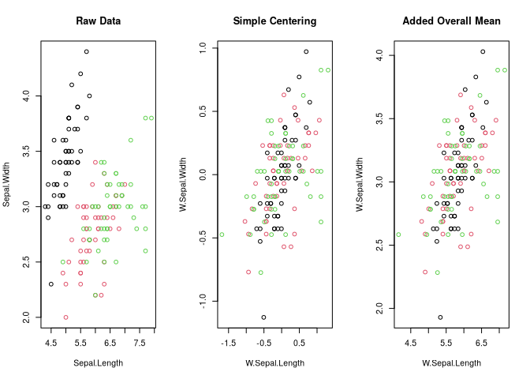

# Collapse Data Transformations


[Source](https://fastverse.org/collapse/articles/collapse_intro.html)

``` r
library(collapse)
library(magrittr)
library(microbenchmark)
options(paged.print = FALSE)
```

# Row and Column Arithmetic

`collapse` introduces a set of efficient row- and column-wise arithmetic
operators for matrix-like objects:

- `%rr%`, `%r+%`, `%r-%`, `%r*%`, `%r/%`
- `%cr%`, `%c+%`, `%c-%`, `%c*%`, `%c/%`.

``` r
X <- qM(fselect(GGDC10S, AGR:SUM))
(v <- fsum(X))
```

            AGR         MIN         MAN          PU         CON         WRT 
    11026503529  8134743462 24120129864  1461548426  7845957666 14776120961 
            TRA        FIRE         GOV         OTH         SUM 
     6416089614  7216735147  5962229565  7155872037 94115930269 

Divide the rows of X by v

``` r
microbenchmark(t(t(X) / v),
              X / outer(rep(1, nrow(X)), v), 
              X %r/% v)
```

    Unit: microseconds
                            expr     min       lq      mean   median       uq
                       t(t(X)/v) 156.494 165.2340 268.00137 179.9465 328.8225
     X/outer(rep(1, nrow(X)), v)  80.774  86.0175 148.42042  96.5255 198.8165
                        X %r/% v  31.741  36.8410  71.49925  41.1770 110.6585
          max neval cld
     2000.199   100 a  
     1761.226   100  b 
      244.184   100   c

Data frame row operations

``` r
dat <- fselect(GGDC10S, AGR:SUM)
microbenchmark(dat %r/% v,
               copyAttrib(mapply(`/`, dat, v, SIMPLIFY = FALSE), dat))
```

    Unit: microseconds
                                                       expr    min      lq     mean
                                                 dat %r/% v 31.850 34.7605  77.7505
     copyAttrib(mapply(`/`, dat, v, SIMPLIFY = FALSE), dat) 88.172 93.6750 142.3552
      median      uq      max neval cld
      38.395 106.420 1603.775   100  a 
     105.307 168.812 1819.141   100   b

Data frame column arithmetic is slow

``` r
microbenchmark(dat / dat$SUM,
               dat / 5,
               dat / dat,
               dat %c/% dat$SUM,
               dat %c/% 5,
               dat %c/% dat)
```

    Unit: microseconds
                 expr      min        lq       mean    median        uq      max
          dat/dat$SUM 1380.247 1495.9880 1872.10940 1587.0465 1841.4655 6979.111
                dat/5  413.015  439.9340  527.23172  478.9285  524.2120 2950.920
              dat/dat  443.939  477.4905  617.55789  528.1165  586.7920 3130.425
     dat %c/% dat$SUM   57.234   62.3030  104.68163   66.8475   76.9945 2424.406
           dat %c/% 5   55.459   60.2275   94.81271   65.2040   72.5095 2113.776
         dat %c/% dat   60.583   64.2065  101.96067   68.2955   83.4025 2165.083
     neval cld
       100 a  
       100  b 
       100  b 
       100   c
       100   c
       100   c

# Row and Column Data Apply

``` r
dapply(mtcars, median)
```

        mpg     cyl    disp      hp    drat      wt    qsec      vs      am    gear 
     19.200   6.000 196.300 123.000   3.695   3.325  17.710   0.000   0.000   4.000 
       carb 
      2.000 

``` r
dapply(mtcars, median, MARGIN = 1)
```

              Mazda RX4       Mazda RX4 Wag          Datsun 710      Hornet 4 Drive 
                  4.000               4.000               4.000               3.215 
      Hornet Sportabout             Valiant          Duster 360           Merc 240D 
                  3.440               3.460               4.000               4.000 
               Merc 230            Merc 280           Merc 280C          Merc 450SE 
                  4.000               4.000               4.000               4.070 
             Merc 450SL         Merc 450SLC  Cadillac Fleetwood Lincoln Continental 
                  3.730               3.780               5.250               5.424 
      Chrysler Imperial            Fiat 128         Honda Civic      Toyota Corolla 
                  5.345               4.000               4.000               4.000 
          Toyota Corona    Dodge Challenger         AMC Javelin          Camaro Z28 
                  3.700               3.520               3.435               4.000 
       Pontiac Firebird           Fiat X1-9       Porsche 914-2        Lotus Europa 
                  3.845               4.000               4.430               4.000 
         Ford Pantera L        Ferrari Dino       Maserati Bora          Volvo 142E 
                  5.000               6.000               8.000               4.000 

``` r
dapply(mtcars, quantile)
```

            mpg cyl    disp    hp  drat      wt    qsec vs am gear carb
    0%   10.400   4  71.100  52.0 2.760 1.51300 14.5000  0  0    3    1
    25%  15.425   4 120.825  96.5 3.080 2.58125 16.8925  0  0    3    2
    50%  19.200   6 196.300 123.0 3.695 3.32500 17.7100  0  0    4    2
    75%  22.800   8 326.000 180.0 3.920 3.61000 18.9000  1  1    4    4
    100% 33.900   8 472.000 335.0 4.930 5.42400 22.9000  1  1    5    8

`dapply` preserves data structure

``` r
m <- qM(mtcars)
is.data.frame(dapply(mtcars, log))
```

    [1] TRUE

``` r
is.matrix(dapply(m, log))
```

    [1] TRUE

Can also perform conversion

``` r
identical(log(m), dapply(mtcars, log, return = "matrix"))
```

    [1] TRUE

``` r
identical(dapply(mtcars, log), dapply(m, log, return = "data.frame"))
```

    [1] TRUE

# Split-Apply-Combine Computing

`BY` is a generalization of dapply for grouped computations using
functions that are not part of the Fast Statistical Functions introduced
above. It is however not faster than dplyr or data.table for larger
grouped computations on data frames requiring split-apply-combine
computing.

``` r
v <- iris$Sepal.Length
f <- iris$Species
```

Sum by species, about 2x faster than tapply(v, f, sum)

``` r
BY(v, f, sum)
```

        setosa versicolor  virginica 
         250.3      296.8      329.4 

Species quantiles: by default stacked

``` r
BY(v, f, quantile)
```

          setosa.0%      setosa.25%      setosa.50%      setosa.75%     setosa.100% 
              4.300           4.800           5.000           5.200           5.800 
      versicolor.0%  versicolor.25%  versicolor.50%  versicolor.75% versicolor.100% 
              4.900           5.600           5.900           6.300           7.000 
       virginica.0%   virginica.25%   virginica.50%   virginica.75%  virginica.100% 
              4.900           6.225           6.500           6.900           7.900 

``` r
BY(v, f, quantile, expand.wide = T)
```

                0%   25% 50% 75% 100%
    setosa     4.3 4.800 5.0 5.2  5.8
    versicolor 4.9 5.600 5.9 6.3  7.0
    virginica  4.9 6.225 6.5 6.9  7.9

Matrix method

``` r
miris <- qM(num_vars(iris))
BY(miris, f, sum)
```

               Sepal.Length Sepal.Width Petal.Length Petal.Width
    setosa            250.3       171.4         73.1        12.3
    versicolor        296.8       138.5        213.0        66.3
    virginica         329.4       148.7        277.6       101.3

``` r
BY(miris, f, quantile) %>% head()
```

                  Sepal.Length Sepal.Width Petal.Length Petal.Width
    setosa.0%              4.3       2.300        1.000         0.1
    setosa.25%             4.8       3.200        1.400         0.2
    setosa.50%             5.0       3.400        1.500         0.2
    setosa.75%             5.2       3.675        1.575         0.3
    setosa.100%            5.8       4.400        1.900         0.6
    versicolor.0%          4.9       2.000        3.000         1.0

``` r
BY(miris, f, quantile, expand.wide = T)[, 1:5]
```

               Sepal.Length.0% Sepal.Length.25% Sepal.Length.50% Sepal.Length.75%
    setosa                 4.3            4.800              5.0              5.2
    versicolor             4.9            5.600              5.9              6.3
    virginica              4.9            6.225              6.5              6.9
               Sepal.Length.100%
    setosa                   5.8
    versicolor               7.0
    virginica                7.9

# Fast (Grouped) Replacing and Sweeping-out Statistics

The 10 operations supported by `TRA` are:

- 1 - “replace_fill” : replace and overwrite missing values (same as
  dplyr::mutate)
- 2 - “replace” : replace but preserve missing values
- 3 - “-” : subtract (center)
- 4 - “-+” : subtract group-statistics but add average of group
  statistics
- 5 - “/” : divide (scale)
- 6 - “%” : compute percentages (divide and multiply by 100)
- 7 - “+” : add
- 8 - “\*” : multiply
- 9 - “%%” : modulus
- 10 - “-%%” : subtract modulus

The code below computes the column means of the iris-matrix obtained
above, and uses them to demean that matrix. `fwithin` is generally
fastest.

``` r
stats <- fmean(miris)
microbenchmark(sweep(miris, 2, stats, "-"),
               miris - outer(rep(1, nrow(iris)), stats),
               TRA(miris, fmean(miris), "-"),
               miris %r-% fmean(miris), # a wrapper for TRA
               fmean(miris, TRA = "-"), # better for any operation if the stats are not needed
               fwithin(miris))
```

    Unit: microseconds
                                         expr    min      lq     mean  median
                  sweep(miris, 2, stats, "-") 20.080 21.2150 23.89573 22.3315
     miris - outer(rep(1, nrow(iris)), stats)  6.779  7.5790  8.52404  7.9845
                TRA(miris, fmean(miris), "-")  4.424  4.8455  5.55617  5.2025
                      miris %r-% fmean(miris)  4.936  5.3675  6.13767  5.6755
                      fmean(miris, TRA = "-")  3.698  4.1645  4.85127  4.4595
                               fwithin(miris)  3.671  4.2030  5.44950  4.4630
          uq     max neval cld
     24.5910  78.789   100 a  
      8.5350  27.888   100  b 
      5.5950  19.256   100   c
      6.0710  41.708   100   c
      4.8015  31.891   100   c
      4.8125 100.079   100   c

Simple replacing. Same as `fmean(miris, TRA = "replace")` or
\``fbetween(miris)`

``` r
TRA(miris, fmean(miris), "replace") %>% head(3)
```

         Sepal.Length Sepal.Width Petal.Length Petal.Width
    [1,]     5.843333    3.057333        3.758    1.199333
    [2,]     5.843333    3.057333        3.758    1.199333
    [3,]     5.843333    3.057333        3.758    1.199333

Simple scaling

``` r
TRA(miris, fsd(miris), "/") %>% head()
```

         Sepal.Length Sepal.Width Petal.Length Petal.Width
    [1,]     6.158928    8.029986    0.7930671   0.2623854
    [2,]     5.917402    6.882845    0.7930671   0.2623854
    [3,]     5.675875    7.341701    0.7364195   0.2623854
    [4,]     5.555112    7.112273    0.8497148   0.2623854
    [5,]     6.038165    8.259414    0.7930671   0.2623854
    [6,]     6.521218    8.947698    0.9630101   0.5247707

Grouped operations

## Grouped centering

same as `fmean(miris, f, TRA = "-")` or `fwithin(m, f)`

``` r
microbenchmark(
  TRA(miris, fmean(miris, f), "-", f) %>% head(),
  fwithin(miris, f))
```

    Unit: microseconds
                                               expr    min      lq     mean  median
     TRA(miris, fmean(miris, f), "-", f) %>% head() 21.732 22.3485 24.21912 22.8135
                                  fwithin(miris, f) 11.488 11.9580 13.98561 12.2610
          uq     max neval cld
     23.4060 108.611   100  a 
     12.7355 140.141   100   b

``` r
fwithin(miris, f) %>% head()
```

         Sepal.Length Sepal.Width Petal.Length Petal.Width
    [1,]        0.094       0.072       -0.062      -0.046
    [2,]       -0.106      -0.428       -0.062      -0.046
    [3,]       -0.306      -0.228       -0.162      -0.046
    [4,]       -0.406      -0.328        0.038      -0.046
    [5,]       -0.006       0.172       -0.062      -0.046
    [6,]        0.394       0.472        0.238       0.154

## Grouped replacing

``` r
TRA(miris, fmean(miris, f), "replace", f) %>% head(3)
```

         Sepal.Length Sepal.Width Petal.Length Petal.Width
    [1,]        5.006       3.428        1.462       0.246
    [2,]        5.006       3.428        1.462       0.246
    [3,]        5.006       3.428        1.462       0.246

``` r
microbenchmark(
  TRA(miris, fmean(miris, f), "replace", f),
  fbetween(miris, f)
)
```

    Unit: microseconds
                                          expr    min      lq     mean  median
     TRA(miris, fmean(miris, f), "replace", f)  9.479 10.5245 14.20965 11.2455
                            fbetween(miris, f) 11.646 13.0960 17.66688 13.7625
         uq     max neval cld
     14.416 135.837   100   a
     16.273 252.995   100   a

## Groupwise percentages

``` r
TRA(miris, fsum(miris, f), "%", f) %>% head(3)
```

         Sepal.Length Sepal.Width Petal.Length Petal.Width
    [1,]     2.037555    2.042007     1.915185    1.626016
    [2,]     1.957651    1.750292     1.915185    1.626016
    [3,]     1.877747    1.866978     1.778386    1.626016

# Fast Standardizing

The function `fscale` can be used to efficiently standardize (i.e. scale
and center) data using a numerically stable online algorithm. The
standardization-operator `STD` also exists as a wrapper around `fscale`.
By default `STD` adds a prefix to standardized variables and also
provides an enhanced method for data frames.

``` r
fscale(mtcars) %>% head(2)
```

                        mpg        cyl       disp         hp      drat         wt
    Mazda RX4     0.1508848 -0.1049878 -0.5706198 -0.5350928 0.5675137 -0.6103996
    Mazda RX4 Wag 0.1508848 -0.1049878 -0.5706198 -0.5350928 0.5675137 -0.3497853
                        qsec         vs       am      gear      carb
    Mazda RX4     -0.7771651 -0.8680278 1.189901 0.4235542 0.7352031
    Mazda RX4 Wag -0.4637808 -0.8680278 1.189901 0.4235542 0.7352031

``` r
STD(mtcars) %>% head(2)
```

                    STD.mpg    STD.cyl   STD.disp     STD.hp  STD.drat     STD.wt
    Mazda RX4     0.1508848 -0.1049878 -0.5706198 -0.5350928 0.5675137 -0.6103996
    Mazda RX4 Wag 0.1508848 -0.1049878 -0.5706198 -0.5350928 0.5675137 -0.3497853
                    STD.qsec     STD.vs   STD.am  STD.gear  STD.carb
    Mazda RX4     -0.7771651 -0.8680278 1.189901 0.4235542 0.7352031
    Mazda RX4 Wag -0.4637808 -0.8680278 1.189901 0.4235542 0.7352031

``` r
STD(mtcars) %>% qsu()
```

               N  Mean  SD      Min     Max
    STD.mpg   32    -0   1  -1.6079  2.2913
    STD.cyl   32     0   1  -1.2249  1.0149
    STD.disp  32    -0   1  -1.2879  1.9468
    STD.hp    32     0   1   -1.381  2.7466
    STD.drat  32    -0   1  -1.5646  2.4939
    STD.wt    32    -0   1  -1.7418  2.2553
    STD.qsec  32     0   1   -1.874  2.8268
    STD.vs    32     0   1   -0.868   1.116
    STD.am    32    -0   1  -0.8141  1.1899
    STD.gear  32     0   1  -0.9318  1.7789
    STD.carb  32    -0   1  -1.1222  3.2117

Groupwise and weighted scaling. Standardize across countries and
sectors:

``` r
STD_GGDC10S <- STD(GGDC10S,
                   ~ Variable + Country,
                   cols = 6:16)
head(STD_GGDC10S)
```

      Variable Country    STD.AGR    STD.MIN    STD.MAN     STD.PU    STD.CON
    1       VA     BWA         NA         NA         NA         NA         NA
    2       VA     BWA         NA         NA         NA         NA         NA
    3       VA     BWA         NA         NA         NA         NA         NA
    4       VA     BWA         NA         NA         NA         NA         NA
    5       VA     BWA -0.7382911 -0.7165772 -0.6682536 -0.8051315 -0.6922839
    6       VA     BWA -0.7392424 -0.7167359 -0.6680535 -0.8050172 -0.6917529
         STD.WRT    STD.TRA   STD.FIRE    STD.GOV    STD.OTH    STD.SUM
    1         NA         NA         NA         NA         NA         NA
    2         NA         NA         NA         NA         NA         NA
    3         NA         NA         NA         NA         NA         NA
    4         NA         NA         NA         NA         NA         NA
    5 -0.6032762 -0.5889923 -0.6349956 -0.6561054 -0.5959744 -0.6758663
    6 -0.6030211 -0.5887320 -0.6349359 -0.6558634 -0.5957137 -0.6757768

Correlated Standardized Value-Added across countries

``` r
fsubset(STD_GGDC10S, Variable == "VA", STD.AGR:STD.SUM) %>% 
  pwcor()
```

             STD.AGR STD.MIN STD.MAN STD.PU STD.CON STD.WRT STD.TRA STD.FIRE
    STD.AGR       1      .88     .93    .88     .89     .90     .90      .86
    STD.MIN      .88      1      .86    .84     .85     .85     .84      .83
    STD.MAN      .93     .86      1     .95     .96     .97     .98      .95
    STD.PU       .88     .84     .95     1      .95     .96     .96      .95
    STD.CON      .89     .85     .96    .95      1      .98     .98      .97
    STD.WRT      .90     .85     .97    .96     .98      1      .99      .98
    STD.TRA      .90     .84     .98    .96     .98     .99      1       .98
    STD.FIRE     .86     .83     .95    .95     .97     .98     .98       1 
    STD.GOV      .93     .88     .98    .96     .98     .99     .99      .98
    STD.OTH      .88     .84     .97    .96     .97     .99     .99      .98
    STD.SUM      .90     .86     .98    .97     .98    1.00     .99      .98
             STD.GOV STD.OTH STD.SUM
    STD.AGR      .93     .88     .90
    STD.MIN      .88     .84     .86
    STD.MAN      .98     .97     .98
    STD.PU       .96     .96     .97
    STD.CON      .98     .97     .98
    STD.WRT      .99     .99    1.00
    STD.TRA      .99     .99     .99
    STD.FIRE     .98     .98     .98
    STD.GOV       1      .99    1.00
    STD.OTH      .99      1      .99
    STD.SUM     1.00     .99      1 

# Fast Centering and Averaging

`fbetween` for centering, `fwithin` for averaging.

``` r
fbetween(mtcars$mpg) %>% head
```

    [1] 20.09062 20.09062 20.09062 20.09062 20.09062 20.09062

``` r
fwithin(mtcars$mpg) %>% head
```

    [1]  0.909375  0.909375  2.709375  1.309375 -1.390625 -1.990625

``` r
all.equal(fbetween(mtcars) + fwithin(mtcars), mtcars)
```

    [1] TRUE

Groupwise centering and averaging

``` r
fbetween(mtcars$mpg, mtcars$cyl) %>% head()
```

    [1] 19.74286 19.74286 26.66364 19.74286 15.10000 19.74286

``` r
fwithin(mtcars$mpg, mtcars$cyl) %>% head()
```

    [1]  1.257143  1.257143 -3.863636  1.657143  3.600000 -1.642857

The code below implements the task of demeaning 4 series by country and
saving the country-id using the within-operator `W` as opposed to
`fwithin` which requires all input to be passed externally like the Fast
Statistical Functions.

``` r
W(wlddev, ~ iso3c, cols = 9:12) %>% head
```

      iso3c W.PCGDP  W.LIFEEX W.GINI       W.ODA
    1   AFG      NA -16.75117     NA -1370778502
    2   AFG      NA -16.23517     NA -1255468497
    3   AFG      NA -15.72617     NA -1374708502
    4   AFG      NA -15.22617     NA -1249828497
    5   AFG      NA -14.73417     NA -1191628485
    6   AFG      NA -14.24917     NA -1145708502

Manually with `fbetween`

``` r
add_vars(
  get_vars(wlddev, "iso3c"),
  get_vars(wlddev, 9:12) %>%
    fwithin(wlddev$iso3c) %>%
    add_stub("W.")
) %>% head()
```

      iso3c W.PCGDP  W.LIFEEX W.GINI       W.ODA
    1   AFG      NA -16.75117     NA -1370778502
    2   AFG      NA -16.23517     NA -1255468497
    3   AFG      NA -15.72617     NA -1374708502
    4   AFG      NA -15.22617     NA -1249828497
    5   AFG      NA -14.73417     NA -1191628485
    6   AFG      NA -14.24917     NA -1145708502

``` r
microbenchmark(
  W(wlddev, ~iso3c, cols = 9:12),
  add_vars(
    get_vars(wlddev, "iso3c"),
    get_vars(wlddev, 9:12) %>%
      fwithin(wlddev$iso3c) %>%
      add_stub("W.")
  )
)
```

    Unit: microseconds
                                                                                                              expr
                                                                                    W(wlddev, ~iso3c, cols = 9:12)
     add_vars(get_vars(wlddev, "iso3c"), get_vars(wlddev, 9:12) %>%      fwithin(wlddev$iso3c) %>% add_stub("W."))
         min      lq      mean   median       uq      max neval cld
     810.699 894.373  992.9572 958.8725 1009.240 1992.010   100   a
     816.129 911.971 1069.4980 975.7195 1015.907 6173.091   100   a

Drop the id’s (by)

``` r
W(wlddev, ~ iso3c, cols = 9:12, keep.by = F) %>% head
```

      W.PCGDP  W.LIFEEX W.GINI       W.ODA
    1      NA -16.75117     NA -1370778502
    2      NA -16.23517     NA -1255468497
    3      NA -15.72617     NA -1374708502
    4      NA -15.22617     NA -1249828497
    5      NA -14.73417     NA -1191628485
    6      NA -14.24917     NA -1145708502

This replaces missing values with the group-mean: Same as
`fmean(x, g, TRA = "replace_fill")`

``` r
B(wlddev, ~ iso3c, cols = 9:12, fill = TRUE) %>% head()
```

      iso3c  B.PCGDP B.LIFEEX B.GINI      B.ODA
    1   AFG 483.8351 49.19717     NA 1487548499
    2   AFG 483.8351 49.19717     NA 1487548499
    3   AFG 483.8351 49.19717     NA 1487548499
    4   AFG 483.8351 49.19717     NA 1487548499
    5   AFG 483.8351 49.19717     NA 1487548499
    6   AFG 483.8351 49.19717     NA 1487548499

This adds back the overall mean after subtracting out group means: Same
as `fmean(x, g, TRA = "-+")`

``` r
W(wlddev, ~ iso3c, cols = 9:12, mean = "overall.mean") %>% head()
```

      iso3c W.PCGDP W.LIFEEX W.GINI      W.ODA
    1   AFG      NA 47.54514     NA -916058371
    2   AFG      NA 48.06114     NA -800748366
    3   AFG      NA 48.57014     NA -919988371
    4   AFG      NA 49.07014     NA -795108366
    5   AFG      NA 49.56214     NA -736908354
    6   AFG      NA 50.04714     NA -690988371

``` r
oldpar <- par(mfrow = c(1, 3))
plot(iris[1:2], col = iris$Species, 
     main = "Raw Data")
plot(W(iris, ~ Species)[2:3], col = iris$Species, 
     main = "Simple Centering")
plot(W(iris, ~ Species, mean = "overall.mean")[2:3], col = iris$Species,
     main = "Added Overall Mean")
```



``` r
par(oldpar)
```

Using operators in regression. When using operators in formulas, we need
to remove missing values beforehand to obtain the same results as a
Fixed-Effects package

## Linear regression with `W` and `B`

``` r
data <- wlddev %>% fselect(iso3c, year, PCGDP, LIFEEX) %>% 
  na_omit()
```

classical lm() -\> iso3c is a factor, creates a matrix of 200+ country
dummies.

``` r
coef(lm(PCGDP ~ LIFEEX + iso3c, data))[1:2]
```

    (Intercept)      LIFEEX 
      -2837.039     380.448 

Centering each variable individually

``` r
coef(lm(W(PCGDP, iso3c) ~ W(LIFEEX, iso3c), data))
```

         (Intercept) W(LIFEEX, iso3c) 
         6.19273e-13      3.80448e+02 

Centering the data

``` r
coef(lm(
  W.PCGDP ~ W.LIFEEX, W(data, PCGDP + LIFEEX ~ iso3c)
))
```

    (Intercept)    W.LIFEEX 
    6.19273e-13 3.80448e+02 

Adding the overall mean back to the data only changes the intercept

``` r
coef(lm(
  W.PCGDP ~ W.LIFEEX, 
  W(data, PCGDP + LIFEEX  ~ iso3c, 
    mean = "overall.mean")))
```

    (Intercept)    W.LIFEEX 
     -14020.142     380.448 

Procedure suggested by Mundlak (1978) - controlling for group averages
instead of demeaning

``` r
coef(lm(PCGDP ~ LIFEEX + B(LIFEEX, iso3c), data))
```

         (Intercept)           LIFEEX B(LIFEEX, iso3c) 
         -52254.7421         380.4480         585.8386 

# HD Centering and Linear Prediction

When simple centering is not enough, eg if a linear model with multiple
levels of fixed-effects needs to be estimated, potentially with
interactions between continuous covariates. `fhdwithin` / `HDW` and
`fhdbetween` / `HDB` are used, which splits the regression into a factor
portion which uses `fixest::demean` and the portion with continous
variables which uses `chol` or `qr`.

An example of using `HDW` to manually solve a regression problem with
country and time fixed effects.

``` r
data$year <- qF(data$year, na.exclude = FALSE)
class(data$iso3c)
```

    [1] "factor"

Classical `lm()` creates a matrix of 196 country dummies and 56 year
dummies

``` r
coef(lm(PCGDP ~ LIFEEX + iso3c + year, data))[1:2]
```

    (Intercept)      LIFEEX 
     37388.0493   -333.0115 

Centering each variable individually

``` r
coef(lm(HDW(PCGDP, list(iso3c, year)) ~
          HDW(LIFEEX, list(iso3c, year)),
        data))
```

                       (Intercept) HDW(LIFEEX, list(iso3c, year)) 
                     -2.263411e-13                  -3.330115e+02 

Centering the entire data

``` r
coef(lm(HDW.PCGDP ~ HDW.LIFEEX, HDW(data, PCGDP + LIFEEX ~ iso3c + year)))
```

      (Intercept)    HDW.LIFEEX 
    -2.263411e-13 -3.330115e+02 

Procedure suggested by Mundlak (1978) - controlling for averages instead
of demeaning

``` r
coef(lm(PCGDP ~ LIFEEX + HDB(LIFEEX, list(iso3c, year)), data))
```

                       (Intercept)                         LIFEEX 
                       -48141.1094                      -333.0115 
    HDB(LIFEEX, list(iso3c, year)) 
                         1236.2681 

We may wish to test whether including time fixed-effects in the above
regression actually impacts the fit.

``` r
data %$% fFtest(PCGDP, year, list(LIFEEX, iso3c))
```

                        R-Sq.  DF1  DF2  F-Stat.  P-Value
    Full Model          0.894  258 8763  286.130    0.000
    Restricted Model    0.873  199 8822  304.661    0.000
    Exclusion Rest.     0.021   59 8763   29.280    0.000

The test shows that the time fixed-effects (accounted for like year
dummies) are jointly significant.

One can also use `fhdbetween` / `HDB` and `fhdwithin` / `HDW` to project
out interactions and continuous covariates.

``` r
wlddev$year <- as.numeric(wlddev$year)
```

classical lm() -\> full country-year interaction, -\> 200+ country
dummies, 200+ trends, year and ODA

``` r
coef(lm(PCGDP ~ LIFEEX + iso3c * year + ODA, wlddev))[1:2]
```

      (Intercept)        LIFEEX 
    -7.257955e+05  8.938626e+00 

Same with `HDW`

``` r
coef(lm(HDW.PCGDP ~ HDW.LIFEEX, 
        HDW(wlddev, PCGDP + LIFEEX ~ iso3c * year + ODA)))
```

      (Intercept)    HDW.LIFEEX 
    -4.089985e-12  8.938626e+00 

example of a simple continuous problem

``` r
HDW(iris[1:2], iris[3:4]) %>% head
```

      HDW.Sepal.Length HDW.Sepal.Width
    1       0.21483967       0.2001352
    2       0.01483967      -0.2998648
    3      -0.13098262      -0.1255786
    4      -0.33933805      -0.1741510
    5       0.11483967       0.3001352
    6       0.41621663       0.6044681
