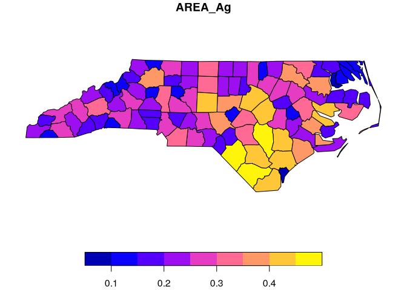

# Collapse and sf


[Source](https://fastverse.org/collapse/articles/collapse_intro.html)

``` r
library(collapse)
library(magrittr)
library(sf)
library(microbenchmark)
library(dplyr)
options(paged.print = FALSE)
```

``` r
(nc <- st_read(system.file("shape/nc.shp", package = "sf"), quiet = T))
```

    Simple feature collection with 100 features and 14 fields
    Geometry type: MULTIPOLYGON
    Dimension:     XY
    Bounding box:  xmin: -84.32385 ymin: 33.88199 xmax: -75.45698 ymax: 36.58965
    Geodetic CRS:  NAD27
    First 10 features:
        AREA PERIMETER CNTY_ CNTY_ID        NAME  FIPS FIPSNO CRESS_ID BIR74 SID74
    1  0.114     1.442  1825    1825        Ashe 37009  37009        5  1091     1
    2  0.061     1.231  1827    1827   Alleghany 37005  37005        3   487     0
    3  0.143     1.630  1828    1828       Surry 37171  37171       86  3188     5
    4  0.070     2.968  1831    1831   Currituck 37053  37053       27   508     1
    5  0.153     2.206  1832    1832 Northampton 37131  37131       66  1421     9
    6  0.097     1.670  1833    1833    Hertford 37091  37091       46  1452     7
    7  0.062     1.547  1834    1834      Camden 37029  37029       15   286     0
    8  0.091     1.284  1835    1835       Gates 37073  37073       37   420     0
    9  0.118     1.421  1836    1836      Warren 37185  37185       93   968     4
    10 0.124     1.428  1837    1837      Stokes 37169  37169       85  1612     1
       NWBIR74 BIR79 SID79 NWBIR79                       geometry
    1       10  1364     0      19 MULTIPOLYGON (((-81.47276 3...
    2       10   542     3      12 MULTIPOLYGON (((-81.23989 3...
    3      208  3616     6     260 MULTIPOLYGON (((-80.45634 3...
    4      123   830     2     145 MULTIPOLYGON (((-76.00897 3...
    5     1066  1606     3    1197 MULTIPOLYGON (((-77.21767 3...
    6      954  1838     5    1237 MULTIPOLYGON (((-76.74506 3...
    7      115   350     2     139 MULTIPOLYGON (((-76.00897 3...
    8      254   594     2     371 MULTIPOLYGON (((-76.56251 3...
    9      748  1190     2     844 MULTIPOLYGON (((-78.30876 3...
    10     160  2038     5     176 MULTIPOLYGON (((-80.02567 3...

# Summarising Data Frames

Which columns have at least 2 non-missing distinct values

``` r
varying(nc)
```

         AREA PERIMETER     CNTY_   CNTY_ID      NAME      FIPS    FIPSNO  CRESS_ID 
         TRUE      TRUE      TRUE      TRUE      TRUE      TRUE      TRUE      TRUE 
        BIR74     SID74   NWBIR74     BIR79     SID79   NWBIR79 
         TRUE      TRUE      TRUE      TRUE      TRUE      TRUE 

``` r
qsu(nc)
```

                 N     Mean         SD    Min    Max
    AREA       100   0.1263     0.0492  0.042  0.241
    PERIMETER  100    1.673     0.4823  0.999   3.64
    CNTY_      100  1985.96   106.5166   1825   2241
    CNTY_ID    100  1985.96   106.5166   1825   2241
    NAME       100        -          -      -      -
    FIPS       100        -          -      -      -
    FIPSNO     100    37100     58.023  37001  37199
    CRESS_ID   100     50.5    29.0115      1    100
    BIR74      100  3299.62  3848.1651    248  21588
    SID74      100     6.67     7.7812      0     44
    NWBIR74    100  1050.81  1432.9117      1   8027
    BIR79      100  4223.92  5179.4582    319  30757
    SID79      100     8.36     9.4319      0     57
    NWBIR79    100  1352.81  1975.9988      3  11631

``` r
descr(nc)
```

    Dataset: nc, 14 Variables, N = 100
    --------------------------------------------------------------------------------
    AREA (numeric): 
    Statistics
        N  Ndist  Mean    SD   Min   Max  Skew  Kurt
      100     77  0.13  0.05  0.04  0.24  0.48   2.5
    Quantiles
        1%    5%   10%   25%   50%   75%  90%   95%   99%
      0.04  0.06  0.06  0.09  0.12  0.15  0.2  0.21  0.24
    --------------------------------------------------------------------------------
    PERIMETER (numeric): 
    Statistics
        N  Ndist  Mean    SD  Min   Max  Skew  Kurt
      100     96  1.67  0.48    1  3.64  1.48  5.95
    Quantiles
      1%    5%   10%   25%   50%   75%  90%   95%  99%
       1  1.09  1.19  1.32  1.61  1.86  2.2  2.72  3.2
    --------------------------------------------------------------------------------
    CNTY_ (numeric): 
    Statistics
        N  Ndist     Mean      SD   Min   Max  Skew  Kurt
      100    100  1985.96  106.52  1825  2241  0.26  2.32
    Quantiles
           1%       5%     10%      25%   50%      75%   90%     95%      99%
      1826.98  1832.95  1837.9  1902.25  1982  2067.25  2110  2156.3  2238.03
    --------------------------------------------------------------------------------
    CNTY_ID (numeric): 
    Statistics
        N  Ndist     Mean      SD   Min   Max  Skew  Kurt
      100    100  1985.96  106.52  1825  2241  0.26  2.32
    Quantiles
           1%       5%     10%      25%   50%      75%   90%     95%      99%
      1826.98  1832.95  1837.9  1902.25  1982  2067.25  2110  2156.3  2238.03
    --------------------------------------------------------------------------------
    NAME (character): 
    Statistics
        N  Ndist
      100    100
    Table
                   Freq  Perc
    Ashe              1     1
    Alleghany         1     1
    Surry             1     1
    Currituck         1     1
    Northampton       1     1
    Hertford          1     1
    Camden            1     1
    Gates             1     1
    Warren            1     1
    Stokes            1     1
    Caswell           1     1
    Rockingham        1     1
    Granville         1     1
    Person            1     1
    ... 86 Others    86    86

    Summary of Table Frequencies
       Min. 1st Qu.  Median    Mean 3rd Qu.    Max. 
          1       1       1       1       1       1 
    --------------------------------------------------------------------------------
    FIPS (character): 
    Statistics
        N  Ndist
      100    100
    Table
                   Freq  Perc
    37009             1     1
    37005             1     1
    37171             1     1
    37053             1     1
    37131             1     1
    37091             1     1
    37029             1     1
    37073             1     1
    37185             1     1
    37169             1     1
    37033             1     1
    37157             1     1
    37077             1     1
    37145             1     1
    ... 86 Others    86    86

    Summary of Table Frequencies
       Min. 1st Qu.  Median    Mean 3rd Qu.    Max. 
          1       1       1       1       1       1 
    --------------------------------------------------------------------------------
    FIPSNO (numeric): 
    Statistics
        N  Ndist   Mean     SD    Min    Max  Skew  Kurt
      100    100  37100  58.02  37001  37199    -0   1.8
    Quantiles
            1%       5%      10%      25%    50%      75%      90%      95%
      37002.98  37010.9  37020.8  37050.5  37100  37149.5  37179.2  37189.1
           99%
      37197.02
    --------------------------------------------------------------------------------
    CRESS_ID (integer): 
    Statistics
        N  Ndist  Mean     SD  Min  Max  Skew  Kurt
      100    100  50.5  29.01    1  100     0   1.8
    Quantiles
        1%    5%   10%    25%   50%    75%   90%    95%    99%
      1.99  5.95  10.9  25.75  50.5  75.25  90.1  95.05  99.01
    --------------------------------------------------------------------------------
    BIR74 (numeric): 
    Statistics
        N  Ndist     Mean       SD  Min    Max  Skew   Kurt
      100    100  3299.62  3848.17  248  21588  2.79  11.79
    Quantiles
          1%      5%    10%   25%     50%   75%     90%    95%       99%
      283.64  419.75  531.8  1077  2180.5  3936  6725.7  11193  20378.22
    --------------------------------------------------------------------------------
    SID74 (numeric): 
    Statistics
        N  Ndist  Mean    SD  Min  Max  Skew   Kurt
      100     23  6.67  7.78    0   44  2.44  10.28
    Quantiles
      1%  5%  10%  25%  50%   75%   90%    95%    99%
       0   0    0    2    4  8.25  15.1  18.25  38.06
    --------------------------------------------------------------------------------
    NWBIR74 (numeric): 
    Statistics
        N  Ndist     Mean       SD  Min   Max  Skew   Kurt
      100     93  1050.81  1432.91    1  8027  2.83  11.84
    Quantiles
      1%    5%   10%  25%    50%     75%     90%     95%      99%
       1  9.95  39.2  190  697.5  1168.5  2231.8  3942.9  7052.84
    --------------------------------------------------------------------------------
    BIR79 (numeric): 
    Statistics
        N  Ndist     Mean       SD  Min    Max  Skew  Kurt
      100    100  4223.92  5179.46  319  30757  2.99  13.1
    Quantiles
          1%     5%    10%      25%   50%   75%   90%       95%       99%
      349.69  539.3  675.7  1336.25  2636  4889  8313  14707.45  26413.87
    --------------------------------------------------------------------------------
    SID79 (numeric): 
    Statistics
        N  Ndist  Mean    SD  Min  Max  Skew  Kurt
      100     28  8.36  9.43    0   57  2.28  9.88
    Quantiles
      1%  5%  10%  25%  50%    75%  90%  95%    99%
       0   0    1    2    5  10.25   21   26  38.19
    --------------------------------------------------------------------------------
    NWBIR79 (numeric): 
    Statistics
        N  Ndist     Mean    SD  Min    Max  Skew   Kurt
      100     98  1352.81  1976    3  11631  3.18  14.45
    Quantiles
        1%    5%   10%    25%    50%      75%     90%     95%       99%
      3.99  11.9  44.7  250.5  874.5  1406.75  2987.9  5090.5  10624.17
    --------------------------------------------------------------------------------

# Selecting Columns and Subsetting

``` r
nc %>% fselect(AREA, NAME:FIPSNO)
```

    Simple feature collection with 100 features and 4 fields
    Geometry type: MULTIPOLYGON
    Dimension:     XY
    Bounding box:  xmin: -84.32385 ymin: 33.88199 xmax: -75.45698 ymax: 36.58965
    Geodetic CRS:  NAD27
    First 10 features:
        AREA        NAME  FIPS FIPSNO                       geometry
    1  0.114        Ashe 37009  37009 MULTIPOLYGON (((-81.47276 3...
    2  0.061   Alleghany 37005  37005 MULTIPOLYGON (((-81.23989 3...
    3  0.143       Surry 37171  37171 MULTIPOLYGON (((-80.45634 3...
    4  0.070   Currituck 37053  37053 MULTIPOLYGON (((-76.00897 3...
    5  0.153 Northampton 37131  37131 MULTIPOLYGON (((-77.21767 3...
    6  0.097    Hertford 37091  37091 MULTIPOLYGON (((-76.74506 3...
    7  0.062      Camden 37029  37029 MULTIPOLYGON (((-76.00897 3...
    8  0.091       Gates 37073  37073 MULTIPOLYGON (((-76.56251 3...
    9  0.118      Warren 37185  37185 MULTIPOLYGON (((-78.30876 3...
    10 0.124      Stokes 37169  37169 MULTIPOLYGON (((-80.02567 3...

Same using standard evaluation (`gv` is a shorthand for `get_vars()`)

``` r
get_vars(nc, c("AREA", "NAME", "FIPS", "FIPSNO"))
```

    Simple feature collection with 100 features and 4 fields
    Geometry type: MULTIPOLYGON
    Dimension:     XY
    Bounding box:  xmin: -84.32385 ymin: 33.88199 xmax: -75.45698 ymax: 36.58965
    Geodetic CRS:  NAD27
    First 10 features:
        AREA        NAME  FIPS FIPSNO                       geometry
    1  0.114        Ashe 37009  37009 MULTIPOLYGON (((-81.47276 3...
    2  0.061   Alleghany 37005  37005 MULTIPOLYGON (((-81.23989 3...
    3  0.143       Surry 37171  37171 MULTIPOLYGON (((-80.45634 3...
    4  0.070   Currituck 37053  37053 MULTIPOLYGON (((-76.00897 3...
    5  0.153 Northampton 37131  37131 MULTIPOLYGON (((-77.21767 3...
    6  0.097    Hertford 37091  37091 MULTIPOLYGON (((-76.74506 3...
    7  0.062      Camden 37029  37029 MULTIPOLYGON (((-76.00897 3...
    8  0.091       Gates 37073  37073 MULTIPOLYGON (((-76.56251 3...
    9  0.118      Warren 37185  37185 MULTIPOLYGON (((-78.30876 3...
    10 0.124      Stokes 37169  37169 MULTIPOLYGON (((-80.02567 3...

Subsetting rows and columns

``` r
fsubset(nc, AREA > fmean(AREA), AREA, NAME:FIPSNO)
```

    Simple feature collection with 44 features and 4 fields
    Geometry type: MULTIPOLYGON
    Dimension:     XY
    Bounding box:  xmin: -84.32385 ymin: 33.88199 xmax: -75.45698 ymax: 36.58965
    Geodetic CRS:  NAD27
    First 10 features:
        AREA        NAME  FIPS FIPSNO                       geometry
    1  0.143       Surry 37171  37171 MULTIPOLYGON (((-80.45634 3...
    2  0.153 Northampton 37131  37131 MULTIPOLYGON (((-77.21767 3...
    3  0.153  Rockingham 37157  37157 MULTIPOLYGON (((-79.53051 3...
    4  0.143   Granville 37077  37077 MULTIPOLYGON (((-78.74912 3...
    5  0.190     Halifax 37083  37083 MULTIPOLYGON (((-77.33221 3...
    6  0.199      Wilkes 37193  37193 MULTIPOLYGON (((-81.02057 3...
    7  0.128    Franklin 37069  37069 MULTIPOLYGON (((-78.25455 3...
    8  0.170    Guilford 37081  37081 MULTIPOLYGON (((-79.53782 3...
    9  0.180      Bertie 37015  37015 MULTIPOLYGON (((-76.78307 3...
    10 0.142        Nash 37127  37127 MULTIPOLYGON (((-78.18693 3...

A fast version of `[` (where i is used and optionally j)

``` r
nc %>% 
  ss(1:10, c("AREA", "NAME", "FIPS", "FIPSNO"))
```

    Simple feature collection with 10 features and 4 fields
    Geometry type: MULTIPOLYGON
    Dimension:     XY
    Bounding box:  xmin: -84.32385 ymin: 33.88199 xmax: -75.45698 ymax: 36.58965
    Geodetic CRS:  NAD27
        AREA        NAME  FIPS FIPSNO                       geometry
    1  0.114        Ashe 37009  37009 MULTIPOLYGON (((-81.47276 3...
    2  0.061   Alleghany 37005  37005 MULTIPOLYGON (((-81.23989 3...
    3  0.143       Surry 37171  37171 MULTIPOLYGON (((-80.45634 3...
    4  0.070   Currituck 37053  37053 MULTIPOLYGON (((-76.00897 3...
    5  0.153 Northampton 37131  37131 MULTIPOLYGON (((-77.21767 3...
    6  0.097    Hertford 37091  37091 MULTIPOLYGON (((-76.74506 3...
    7  0.062      Camden 37029  37029 MULTIPOLYGON (((-76.00897 3...
    8  0.091       Gates 37073  37073 MULTIPOLYGON (((-76.56251 3...
    9  0.118      Warren 37185  37185 MULTIPOLYGON (((-78.30876 3...
    10 0.124      Stokes 37169  37169 MULTIPOLYGON (((-80.02567 3...

## Benchmarks

Selection

``` r
microbenchmark(
  collapse = fselect(nc, AREA, NAME:FIPSNO),
  dplyr = select(nc, AREA, NAME:FIPSNO),
  collapse2 = gv(nc, c("AREA", "NAME", "FIPS", "FIPSNO")),
  sf = nc[c("AREA", "NAME", "FIPS", "FIPSNO")]
)
```

    Unit: microseconds
          expr     min       lq       mean   median       uq      max neval cld
      collapse   4.361   8.3450   10.86593  10.9485  12.7225   29.415   100 a  
         dplyr 752.859 818.6185 1001.90279 880.1000 994.5640 6502.937   100  b 
     collapse2   3.791   4.6640    9.26020   9.5565  11.6610   49.977   100 a  
            sf 213.945 250.6200  284.91677 281.9590 314.1425  484.799   100   c

Subsetting

``` r
microbenchmark(
  collapse = fsubset(nc, AREA > fmean(AREA), AREA, NAME:FIPSNO),
  dplyr = select(nc, AREA, NAME:FIPSNO) |> filter(AREA > fmean(AREA)),
  collapse2 = ss(nc, 1:10, c("AREA", "NAME", "FIPS", "FIPSNO")),
  sf = nc[1:10, c("AREA", "NAME", "FIPS", "FIPSNO")]
)
```

    Unit: microseconds
          expr      min        lq       mean    median       uq      max neval cld
      collapse   13.513   18.1960   26.33492   27.6325   31.503   67.645   100 a  
         dplyr 1510.773 1607.9345 1720.54985 1674.8715 1730.135 5721.176   100  b 
     collapse2    4.213    5.9500   10.29426   10.9240   12.311   24.586   100 a  
            sf  324.724  380.0125  429.49760  398.3675  420.180 3307.669   100   c

``` r
attr(nc, "agr")
```

         AREA PERIMETER     CNTY_   CNTY_ID      NAME      FIPS    FIPSNO  CRESS_ID 
         <NA>      <NA>      <NA>      <NA>      <NA>      <NA>      <NA>      <NA> 
        BIR74     SID74   NWBIR74     BIR79     SID79   NWBIR79 
         <NA>      <NA>      <NA>      <NA>      <NA>      <NA> 
    Levels: constant aggregate identity

However, collapse functions don’t subset the ‘agr’ attribute on
selecting columns, which (if specified) relates columns (attributes) to
the geometry, and also don’t modify the ‘bbox’ attribute giving the
overall boundaries of a set of geometries when subsetting the sf data
frame. Not changing ‘bbox’ upon subsetting may lead to too large margins
when plotting the geometries of a subset sf data frame.

One way to to change this is calling `st_make_valid()` on the subset
frame; but it is very expensive, thus unless the subset frame is very
small, it is better to use `[`, `base::subset()` or `dplyr::filter()` in
cases where the bounding box size matters.

# Aggregation and Grouping

Aggregating by variable SID74 using the median for numeric and the mode
for categorical columns

``` r
nc %>% collap(
  ~ SID74,
  custom = list(
    fmedian = is.numeric,
    fmode = is.character,
    st_union = "geometry"
  )
)
```

    Simple feature collection with 23 features and 15 fields
    Geometry type: MULTIPOLYGON
    Dimension:     XY
    Bounding box:  xmin: -84.32385 ymin: 33.88199 xmax: -75.45698 ymax: 36.58965
    Geodetic CRS:  NAD27
    First 10 features:
         AREA PERIMETER  CNTY_ CNTY_ID        NAME  FIPS FIPSNO CRESS_ID  BIR74
    1  0.0780    1.3070 1950.0  1950.0   Alleghany 37005  37073     37.0  487.0
    2  0.0810    1.2880 1887.0  1887.0        Ashe 37009  37137     69.0  751.0
    3  0.1225    1.6435 1959.5  1959.5     Caswell 37033  37078     39.5 1271.0
    4  0.1140    1.4895 2027.5  2027.5  Pasquotank 37139  37149     75.0 1448.0
    5  0.1430    1.7160 1947.0  1947.0      Warren 37185  37145     73.0 2483.0
    6  0.1160    1.6300 2026.0  2026.0       Surry 37171  37105     53.0 2414.0
    7  0.1670    1.7655 1960.5  1960.5      Bertie 37015  37056     28.5 3692.5
    8  0.1495    1.7375 1986.0  1986.0    Hertford 37091  37092     46.5 2093.0
    9  0.1420    1.6400 2034.0  2034.0        Nash 37127  37109     55.0 2255.0
    10 0.1605    2.1005 1910.0  1910.0 Northampton 37131  37076     38.5 4468.0
       SID74 SID74 NWBIR74  BIR79 SID79 NWBIR79                       geometry
    1      0     0    40.0  594.0   1.0    45.0 MULTIPOLYGON (((-83.69563 3...
    2      1     1   148.0  899.0   1.0   176.0 MULTIPOLYGON (((-80.02406 3...
    3      2     2   382.5 1676.5   2.0   452.0 MULTIPOLYGON (((-77.16129 3...
    4      3     3   547.0 1936.5   6.0   760.5 MULTIPOLYGON (((-80.06518 3...
    5      4     4   930.0 2777.0   5.0  1086.0 MULTIPOLYGON (((-78.25681 3...
    6      5     5   370.0 3339.0   6.0   528.0 MULTIPOLYGON (((-76.4087 35...
    7      6     6   986.0 4514.5   9.5  1255.0 MULTIPOLYGON (((-78.58041 3...
    8      7     7   970.5 2373.5   5.5  1167.5 MULTIPOLYGON (((-76.70538 3...
    9      8     8   818.0 2817.0   7.0  1023.0 MULTIPOLYGON (((-78.16968 3...
    10     9     9   998.0 5781.0  10.5  1201.5 MULTIPOLYGON (((-77.14196 3...

Grouping and aggregating with `fsummarise`

``` r
nc %>% 
  fgroup_by(SID74) %>% 
  fsummarise(AREA_Ag = fsum(AREA),
             Perimeter_Ag = fmedian(PERIMETER),
             geometry = st_union(geometry))
```

    Simple feature collection with 23 features and 3 fields
    Geometry type: MULTIPOLYGON
    Dimension:     XY
    Bounding box:  xmin: -84.32385 ymin: 33.88199 xmax: -75.45698 ymax: 36.58965
    Geodetic CRS:  NAD27
    First 10 features:
       SID74 AREA_Ag Perimeter_Ag                       geometry
    1      0   1.103       1.3070 MULTIPOLYGON (((-83.69563 3...
    2      1   0.914       1.2880 MULTIPOLYGON (((-80.02406 3...
    3      2   1.047       1.6435 MULTIPOLYGON (((-77.16129 3...
    4      3   0.647       1.4895 MULTIPOLYGON (((-80.06518 3...
    5      4   1.913       1.7160 MULTIPOLYGON (((-78.25681 3...
    6      5   1.380       1.6300 MULTIPOLYGON (((-76.4087 35...
    7      6   0.663       1.7655 MULTIPOLYGON (((-78.58041 3...
    8      7   0.599       1.7375 MULTIPOLYGON (((-76.70538 3...
    9      8   0.670       1.6400 MULTIPOLYGON (((-78.16968 3...
    10     9   0.321       2.1005 MULTIPOLYGON (((-77.14196 3...

`st_union` is slow. For a faster alternative, use `geos` for planar and
`s2` for spherical geometries.

``` r
nc %>% 
  fmutate(geometry = s2::as_s2_geography(geometry)) %>% 
  fgroup_by(SID74) %>% 
  fsummarise(AREA_Ag = fsum(AREA),
             Perimeter_Ag = fmedian(PERIMETER),
             geometry = s2::s2_union_agg(geometry)) %>% 
  fmutate(geometry = st_as_sfc(geometry))
```

    Simple feature collection with 23 features and 3 fields
    Geometry type: MULTIPOLYGON
    Dimension:     XY
    Bounding box:  xmin: -84.32385 ymin: 33.88199 xmax: -75.45698 ymax: 36.58965
    Geodetic CRS:  WGS 84
    First 10 features:
       SID74 AREA_Ag Perimeter_Ag                       geometry
    1      0   1.103       1.3070 MULTIPOLYGON (((-83.69563 3...
    2      1   0.914       1.2880 MULTIPOLYGON (((-80.02406 3...
    3      2   1.047       1.6435 MULTIPOLYGON (((-77.16129 3...
    4      3   0.647       1.4895 MULTIPOLYGON (((-80.06518 3...
    5      4   1.913       1.7160 MULTIPOLYGON (((-78.25681 3...
    6      5   1.380       1.6300 MULTIPOLYGON (((-76.4087 35...
    7      6   0.663       1.7655 MULTIPOLYGON (((-78.58041 3...
    8      7   0.599       1.7375 MULTIPOLYGON (((-76.70538 3...
    9      8   0.670       1.6400 MULTIPOLYGON (((-78.16968 3...
    10     9   0.321       2.1005 MULTIPOLYGON (((-77.14196 3...

``` r
st_crs(nc)
```

    Coordinate Reference System:
      User input: NAD27 
      wkt:
    GEOGCRS["NAD27",
        DATUM["North American Datum 1927",
            ELLIPSOID["Clarke 1866",6378206.4,294.978698213898,
                LENGTHUNIT["metre",1]]],
        PRIMEM["Greenwich",0,
            ANGLEUNIT["degree",0.0174532925199433]],
        CS[ellipsoidal,2],
            AXIS["latitude",north,
                ORDER[1],
                ANGLEUNIT["degree",0.0174532925199433]],
            AXIS["longitude",east,
                ORDER[2],
                ANGLEUNIT["degree",0.0174532925199433]],
        ID["EPSG",4267]]

In general, also upon aggregation with collapse, functions
`st_as_sfc()`, `st_as_sf()`, or, in the worst case, `st_make_valid()`,
may need to be invoked to ensure valid sf object output.

One exception that both avoids the high cost of spatial functions in
aggregation and any need for ex-post conversion/validation is
aggregating spatial panel data over the time-dimension. Such panels can
quickly be aggregated using `ffirst()` or `flast()` to aggregate the
geometry:

Creating a panel-dataset by simply duplicating nc for 2 different years

``` r
(pnc <- rowbind(`2000` = nc, `2001` = nc, idcol = "Year") %>% 
   as_integer_factor())
```

    Simple feature collection with 200 features and 15 fields
    Geometry type: MULTIPOLYGON
    Dimension:     XY
    Bounding box:  xmin: -84.32385 ymin: 33.88199 xmax: -75.45698 ymax: 36.58965
    Geodetic CRS:  NAD27
    First 10 features:
       Year  AREA PERIMETER CNTY_ CNTY_ID        NAME  FIPS FIPSNO CRESS_ID BIR74
    1  2000 0.114     1.442  1825    1825        Ashe 37009  37009        5  1091
    2  2000 0.061     1.231  1827    1827   Alleghany 37005  37005        3   487
    3  2000 0.143     1.630  1828    1828       Surry 37171  37171       86  3188
    4  2000 0.070     2.968  1831    1831   Currituck 37053  37053       27   508
    5  2000 0.153     2.206  1832    1832 Northampton 37131  37131       66  1421
    6  2000 0.097     1.670  1833    1833    Hertford 37091  37091       46  1452
    7  2000 0.062     1.547  1834    1834      Camden 37029  37029       15   286
    8  2000 0.091     1.284  1835    1835       Gates 37073  37073       37   420
    9  2000 0.118     1.421  1836    1836      Warren 37185  37185       93   968
    10 2000 0.124     1.428  1837    1837      Stokes 37169  37169       85  1612
       SID74 NWBIR74 BIR79 SID79 NWBIR79                       geometry
    1      1      10  1364     0      19 MULTIPOLYGON (((-81.47276 3...
    2      0      10   542     3      12 MULTIPOLYGON (((-81.23989 3...
    3      5     208  3616     6     260 MULTIPOLYGON (((-80.45634 3...
    4      1     123   830     2     145 MULTIPOLYGON (((-76.00897 3...
    5      9    1066  1606     3    1197 MULTIPOLYGON (((-77.21767 3...
    6      7     954  1838     5    1237 MULTIPOLYGON (((-76.74506 3...
    7      0     115   350     2     139 MULTIPOLYGON (((-76.00897 3...
    8      0     254   594     2     371 MULTIPOLYGON (((-76.56251 3...
    9      4     748  1190     2     844 MULTIPOLYGON (((-78.30876 3...
    10     1     160  2038     5     176 MULTIPOLYGON (((-80.02567 3...

Aggregating by `NAME`, using the last value for all categorical data

``` r
pnc %>% collap(
  ~ NAME, fmedian, catFUN = flast, cols = -1L
)
```

    Simple feature collection with 100 features and 15 fields
    Geometry type: MULTIPOLYGON
    Dimension:     XY
    Bounding box:  xmin: -84.32385 ymin: 33.88199 xmax: -75.45698 ymax: 36.58965
    Geodetic CRS:  NAD27
    First 10 features:
        AREA PERIMETER CNTY_ CNTY_ID      NAME      NAME  FIPS FIPSNO CRESS_ID
    1  0.111     1.392  1904    1904  Alamance  Alamance 37001  37001        1
    2  0.066     1.070  1950    1950 Alexander Alexander 37003  37003        2
    3  0.061     1.231  1827    1827 Alleghany Alleghany 37005  37005        3
    4  0.138     1.621  2096    2096     Anson     Anson 37007  37007        4
    5  0.114     1.442  1825    1825      Ashe      Ashe 37009  37009        5
    6  0.064     1.213  1892    1892     Avery     Avery 37011  37011        6
    7  0.203     3.197  2004    2004  Beaufort  Beaufort 37013  37013        7
    8  0.180     2.151  1905    1905    Bertie    Bertie 37015  37015        8
    9  0.225     2.107  2162    2162    Bladen    Bladen 37017  37017        9
    10 0.212     2.024  2241    2241 Brunswick Brunswick 37019  37019       10
       BIR74 SID74 NWBIR74 BIR79 SID79 NWBIR79                       geometry
    1   4672    13    1243  5767    11    1397 MULTIPOLYGON (((-79.24619 3...
    2   1333     0     128  1683     2     150 MULTIPOLYGON (((-81.10889 3...
    3    487     0      10   542     3      12 MULTIPOLYGON (((-81.23989 3...
    4   1570    15     952  1875     4    1161 MULTIPOLYGON (((-79.91995 3...
    5   1091     1      10  1364     0      19 MULTIPOLYGON (((-81.47276 3...
    6    781     0       4   977     0       5 MULTIPOLYGON (((-81.94135 3...
    7   2692     7    1131  2909     4    1163 MULTIPOLYGON (((-77.10377 3...
    8   1324     6     921  1616     5    1161 MULTIPOLYGON (((-76.78307 3...
    9   1782     8     818  2052     5    1023 MULTIPOLYGON (((-78.2615 34...
    10  2181     5     659  2655     6     841 MULTIPOLYGON (((-78.65572 3...

Using `fsummarise` to aggregate just two variables and the geometry

``` r
(pnc_ag <- pnc %>% 
   fgroup_by(NAME) %>% 
   fsummarise(AREA_Ag = fsum(AREA),
              Perimeter_Ag = fmedian(PERIMETER),
              geometry = flast(geometry)))
```

    Simple feature collection with 100 features and 3 fields
    Geometry type: MULTIPOLYGON
    Dimension:     XY
    Bounding box:  xmin: -84.32385 ymin: 33.88199 xmax: -75.45698 ymax: 36.58965
    Geodetic CRS:  NAD27
    First 10 features:
            NAME AREA_Ag Perimeter_Ag                       geometry
    1   Alamance   0.222        1.392 MULTIPOLYGON (((-79.24619 3...
    2  Alexander   0.132        1.070 MULTIPOLYGON (((-81.10889 3...
    3  Alleghany   0.122        1.231 MULTIPOLYGON (((-81.23989 3...
    4      Anson   0.276        1.621 MULTIPOLYGON (((-79.91995 3...
    5       Ashe   0.228        1.442 MULTIPOLYGON (((-81.47276 3...
    6      Avery   0.128        1.213 MULTIPOLYGON (((-81.94135 3...
    7   Beaufort   0.406        3.197 MULTIPOLYGON (((-77.10377 3...
    8     Bertie   0.360        2.151 MULTIPOLYGON (((-76.78307 3...
    9     Bladen   0.450        2.107 MULTIPOLYGON (((-78.2615 34...
    10 Brunswick   0.424        2.024 MULTIPOLYGON (((-78.65572 3...

``` r
plot(pnc_ag["AREA_Ag"])
```



# Indexing

``` r
(pnc <- pnc %>% findex_by(CNTY_ID, Year))
```

    Simple feature collection with 200 features and 15 fields
    Geometry type: MULTIPOLYGON
    Dimension:     XY
    Bounding box:  xmin: -84.32385 ymin: 33.88199 xmax: -75.45698 ymax: 36.58965
    Geodetic CRS:  NAD27
    First 10 features:
       Year  AREA PERIMETER CNTY_ CNTY_ID        NAME  FIPS FIPSNO CRESS_ID BIR74
    1  2000 0.114     1.442  1825    1825        Ashe 37009  37009        5  1091
    2  2000 0.061     1.231  1827    1827   Alleghany 37005  37005        3   487
    3  2000 0.143     1.630  1828    1828       Surry 37171  37171       86  3188
    4  2000 0.070     2.968  1831    1831   Currituck 37053  37053       27   508
    5  2000 0.153     2.206  1832    1832 Northampton 37131  37131       66  1421
    6  2000 0.097     1.670  1833    1833    Hertford 37091  37091       46  1452
    7  2000 0.062     1.547  1834    1834      Camden 37029  37029       15   286
    8  2000 0.091     1.284  1835    1835       Gates 37073  37073       37   420
    9  2000 0.118     1.421  1836    1836      Warren 37185  37185       93   968
    10 2000 0.124     1.428  1837    1837      Stokes 37169  37169       85  1612
       SID74 NWBIR74 BIR79 SID79 NWBIR79                       geometry
    1      1      10  1364     0      19 MULTIPOLYGON (((-81.47276 3...
    2      0      10   542     3      12 MULTIPOLYGON (((-81.23989 3...
    3      5     208  3616     6     260 MULTIPOLYGON (((-80.45634 3...
    4      1     123   830     2     145 MULTIPOLYGON (((-76.00897 3...
    5      9    1066  1606     3    1197 MULTIPOLYGON (((-77.21767 3...
    6      7     954  1838     5    1237 MULTIPOLYGON (((-76.74506 3...
    7      0     115   350     2     139 MULTIPOLYGON (((-76.00897 3...
    8      0     254   594     2     371 MULTIPOLYGON (((-76.56251 3...
    9      4     748  1190     2     844 MULTIPOLYGON (((-78.30876 3...
    10     1     160  2038     5     176 MULTIPOLYGON (((-80.02567 3...

    Indexed by:  CNTY_ID [100] | Year [2] 

``` r
qsu(pnc$AREA)
```

             N/T    Mean      SD     Min     Max
    Overall  200  0.1263  0.0491   0.042   0.241
    Between  100  0.1263  0.0492   0.042   0.241
    Within     2  0.1263       0  0.1263  0.1263

``` r
settransform(pnc, AREA_diff = fdiff(AREA))
psmat(pnc$AREA_diff) %>% head()
```

         2000 2001
    1825   NA    0
    1827   NA    0
    1828   NA    0
    1831   NA    0
    1832   NA    0
    1833   NA    0

``` r
pnc <- unindex(pnc)
```

# Unique Values, Ordering, Splitting, Binding

`funique()` and `roworder[v]()` ignore the geometry column. `rsplit()`
can recursively split an `sf` frame into multiple chunks.

Split by `SID74`

``` r
funique(nc$SID74)
```

     [1]  1  0  5  9  7  4  2 16 18  3 10 23 13  6  8 11 14 12 44 38 15 29 31

``` r
rsplit(nc, ~ SID74) %>% 
  head(2)
```

    $`0`
    Simple feature collection with 13 features and 13 fields
    Geometry type: MULTIPOLYGON
    Dimension:     XY
    Bounding box:  xmin: -84.32385 ymin: 33.88199 xmax: -75.45698 ymax: 36.58965
    Geodetic CRS:  NAD27
    First 10 features:
        AREA PERIMETER CNTY_ CNTY_ID      NAME  FIPS FIPSNO CRESS_ID BIR74 NWBIR74
    1  0.061     1.231  1827    1827 Alleghany 37005  37005        3   487      10
    2  0.062     1.547  1834    1834    Camden 37029  37029       15   286     115
    3  0.091     1.284  1835    1835     Gates 37073  37073       37   420     254
    4  0.064     1.213  1892    1892     Avery 37011  37011        6   781       4
    5  0.059     1.319  1927    1927  Mitchell 37121  37121       61   671       1
    6  0.080     1.307  1936    1936    Yancey 37199  37199      100   770      12
    7  0.066     1.070  1950    1950 Alexander 37003  37003        2  1333     128
    8  0.099     1.411  1963    1963   Tyrrell 37177  37177       89   248     116
    9  0.094     3.640  2000    2000      Dare 37055  37055       28   521      43
    10 0.078     1.202  2056    2056    Graham 37075  37075       38   415      40
       BIR79 SID79 NWBIR79                       geometry
    1    542     3      12 MULTIPOLYGON (((-81.23989 3...
    2    350     2     139 MULTIPOLYGON (((-76.00897 3...
    3    594     2     371 MULTIPOLYGON (((-76.56251 3...
    4    977     0       5 MULTIPOLYGON (((-81.94135 3...
    5    919     2       4 MULTIPOLYGON (((-82.11885 3...
    6    869     1      10 MULTIPOLYGON (((-82.27921 3...
    7   1683     2     150 MULTIPOLYGON (((-81.10889 3...
    8    319     0     141 MULTIPOLYGON (((-76.1673 35...
    9   1059     1      73 MULTIPOLYGON (((-75.78317 3...
    10   488     1      45 MULTIPOLYGON (((-83.69563 3...

    $`1`
    Simple feature collection with 11 features and 13 fields
    Geometry type: MULTIPOLYGON
    Dimension:     XY
    Bounding box:  xmin: -84.32385 ymin: 33.88199 xmax: -75.45698 ymax: 36.58965
    Geodetic CRS:  NAD27
    First 10 features:
        AREA PERIMETER CNTY_ CNTY_ID       NAME  FIPS FIPSNO CRESS_ID BIR74 NWBIR74
    1  0.114     1.442  1825    1825       Ashe 37009  37009        5  1091      10
    2  0.070     2.968  1831    1831  Currituck 37053  37053       27   508     123
    3  0.124     1.428  1837    1837     Stokes 37169  37169       85  1612     160
    4  0.081     1.288  1880    1880    Watauga 37189  37189       95  1323      17
    5  0.063     1.000  1881    1881 Perquimans 37143  37143       72   484     230
    6  0.044     1.158  1887    1887     Chowan 37041  37041       21   751     368
    7  0.086     1.267  1893    1893     Yadkin 37197  37197       99  1269      65
    8  0.069     1.201  1948    1948      Davie 37059  37059       30  1207     148
    9  0.060     1.036  2071    2071       Polk 37149  37149       75   533      95
    10 0.082     1.388  2085    2085    Pamlico 37137  37137       69   542     222
       BIR79 SID79 NWBIR79                       geometry
    1   1364     0      19 MULTIPOLYGON (((-81.47276 3...
    2    830     2     145 MULTIPOLYGON (((-76.00897 3...
    3   2038     5     176 MULTIPOLYGON (((-80.02567 3...
    4   1775     1      33 MULTIPOLYGON (((-81.80622 3...
    5    676     0     310 MULTIPOLYGON (((-76.48053 3...
    6    899     1     491 MULTIPOLYGON (((-76.68874 3...
    7   1568     1      76 MULTIPOLYGON (((-80.49554 3...
    8   1438     3     177 MULTIPOLYGON (((-80.45677 3...
    9    673     0      79 MULTIPOLYGON (((-82.21017 3...
    10   631     1     277 MULTIPOLYGON (((-76.94324 3...

Only splitting Area

``` r
rsplit(nc, AREA ~ SID74) %>% 
  head(1)
```

    $`0`
    Simple feature collection with 13 features and 1 field
    Geometry type: MULTIPOLYGON
    Dimension:     XY
    Bounding box:  xmin: -84.32385 ymin: 33.88199 xmax: -75.45698 ymax: 36.58965
    Geodetic CRS:  NAD27
    First 10 features:
        AREA                       geometry
    1  0.061 MULTIPOLYGON (((-81.23989 3...
    2  0.062 MULTIPOLYGON (((-76.00897 3...
    3  0.091 MULTIPOLYGON (((-76.56251 3...
    4  0.064 MULTIPOLYGON (((-81.94135 3...
    5  0.059 MULTIPOLYGON (((-82.11885 3...
    6  0.080 MULTIPOLYGON (((-82.27921 3...
    7  0.066 MULTIPOLYGON (((-81.10889 3...
    8  0.099 MULTIPOLYGON (((-76.1673 35...
    9  0.094 MULTIPOLYGON (((-75.78317 3...
    10 0.078 MULTIPOLYGON (((-83.69563 3...

Combine with `rowbind()`, which preserves the attributes of the first
object by default.

``` r
nc_combined <- nc %>% 
  rsplit(seq_row(.)) %>% 
  rowbind()
identical(nc_combined, nc)
```

    [1] TRUE

# Transformations

``` r
nc %>% 
  fmutate(gsum_AREA = fsum(AREA, SID74, TRA = "fill")) %>% 
  head
```

    Simple feature collection with 6 features and 15 fields
    Geometry type: MULTIPOLYGON
    Dimension:     XY
    Bounding box:  xmin: -81.74107 ymin: 36.07282 xmax: -75.77316 ymax: 36.58965
    Geodetic CRS:  NAD27
       AREA PERIMETER CNTY_ CNTY_ID        NAME  FIPS FIPSNO CRESS_ID BIR74 SID74
    1 0.114     1.442  1825    1825        Ashe 37009  37009        5  1091     1
    2 0.061     1.231  1827    1827   Alleghany 37005  37005        3   487     0
    3 0.143     1.630  1828    1828       Surry 37171  37171       86  3188     5
    4 0.070     2.968  1831    1831   Currituck 37053  37053       27   508     1
    5 0.153     2.206  1832    1832 Northampton 37131  37131       66  1421     9
    6 0.097     1.670  1833    1833    Hertford 37091  37091       46  1452     7
      NWBIR74 BIR79 SID79 NWBIR79                       geometry gsum_AREA
    1      10  1364     0      19 MULTIPOLYGON (((-81.47276 3...     0.914
    2      10   542     3      12 MULTIPOLYGON (((-81.23989 3...     1.103
    3     208  3616     6     260 MULTIPOLYGON (((-80.45634 3...     1.380
    4     123   830     2     145 MULTIPOLYGON (((-76.00897 3...     0.914
    5    1066  1606     3    1197 MULTIPOLYGON (((-77.21767 3...     0.321
    6     954  1838     5    1237 MULTIPOLYGON (((-76.74506 3...     0.599

Can also do this, but more expensive:

``` r
nc %>% 
  fgroup_by(SID74) %>% 
  fmutate(gsum_AREA = fsum(AREA)) %>% 
  head
```

    Simple feature collection with 6 features and 15 fields
    Geometry type: MULTIPOLYGON
    Dimension:     XY
    Bounding box:  xmin: -81.74107 ymin: 36.07282 xmax: -75.77316 ymax: 36.58965
    Geodetic CRS:  NAD27
       AREA PERIMETER CNTY_ CNTY_ID        NAME  FIPS FIPSNO CRESS_ID BIR74 SID74
    1 0.114     1.442  1825    1825        Ashe 37009  37009        5  1091     1
    2 0.061     1.231  1827    1827   Alleghany 37005  37005        3   487     0
    3 0.143     1.630  1828    1828       Surry 37171  37171       86  3188     5
    4 0.070     2.968  1831    1831   Currituck 37053  37053       27   508     1
    5 0.153     2.206  1832    1832 Northampton 37131  37131       66  1421     9
    6 0.097     1.670  1833    1833    Hertford 37091  37091       46  1452     7
      NWBIR74 BIR79 SID79 NWBIR79                       geometry gsum_AREA
    1      10  1364     0      19 MULTIPOLYGON (((-81.47276 3...     0.914
    2      10   542     3      12 MULTIPOLYGON (((-81.23989 3...     1.103
    3     208  3616     6     260 MULTIPOLYGON (((-80.45634 3...     1.380
    4     123   830     2     145 MULTIPOLYGON (((-76.00897 3...     0.914
    5    1066  1606     3    1197 MULTIPOLYGON (((-77.21767 3...     0.321
    6     954  1838     5    1237 MULTIPOLYGON (((-76.74506 3...     0.599

`fcompute()` only keeps new columns, but also `geometry`. Additional
columns can be retained with `keep`.

``` r
nc %>% 
  fcompute(scaled_AREA = fscale(AREA),
           gsum_AREA = fsum(AREA, SID74, TRA = "fill"),
           keep = .c(AREA, SID74))
```

    Simple feature collection with 100 features and 4 fields
    Geometry type: MULTIPOLYGON
    Dimension:     XY
    Bounding box:  xmin: -84.32385 ymin: 33.88199 xmax: -75.45698 ymax: 36.58965
    Geodetic CRS:  NAD27
    First 10 features:
        AREA SID74 scaled_AREA gsum_AREA                       geometry
    1  0.114     1 -0.24918601     0.914 MULTIPOLYGON (((-81.47276 3...
    2  0.061     0 -1.32641756     1.103 MULTIPOLYGON (((-81.23989 3...
    3  0.143     5  0.34024257     1.380 MULTIPOLYGON (((-80.45634 3...
    4  0.070     1 -1.14349145     0.914 MULTIPOLYGON (((-76.00897 3...
    5  0.153     9  0.54349380     0.321 MULTIPOLYGON (((-77.21767 3...
    6  0.097     7 -0.59471311     0.599 MULTIPOLYGON (((-76.74506 3...
    7  0.062     0 -1.30609244     1.103 MULTIPOLYGON (((-76.00897 3...
    8  0.091     0 -0.71666386     1.103 MULTIPOLYGON (((-76.56251 3...
    9  0.118     4 -0.16788552     1.913 MULTIPOLYGON (((-78.30876 3...
    10 0.124     1 -0.04593478     0.914 MULTIPOLYGON (((-80.02567 3...

# Conversion to and from `sf`

The quick converters can be used on `sf` objects. To convert back, use
`setAttrib()`, `copyAttrib()` or `copyMostAttrib()`.

``` r
library(data.table)
qDT(nc)[, list(roll_AREA = frollmean(AREA, 2), geometry),
  by = SID74
] %>%
  copyMostAttrib(nc)
```

    Simple feature collection with 100 features and 2 fields
    Geometry type: MULTIPOLYGON
    Dimension:     XY
    Bounding box:  xmin: -84.32385 ymin: 33.88199 xmax: -75.45698 ymax: 36.58965
    Geodetic CRS:  NAD27
    First 10 features:
       SID74 roll_AREA                       geometry
    1      1        NA MULTIPOLYGON (((-81.47276 3...
    2      1    0.0920 MULTIPOLYGON (((-76.00897 3...
    3      1    0.0970 MULTIPOLYGON (((-80.02567 3...
    4      1    0.1025 MULTIPOLYGON (((-81.80622 3...
    5      1    0.0720 MULTIPOLYGON (((-76.48053 3...
    6      1    0.0535 MULTIPOLYGON (((-76.68874 3...
    7      1    0.0650 MULTIPOLYGON (((-80.49554 3...
    8      1    0.0775 MULTIPOLYGON (((-80.45677 3...
    9      1    0.0645 MULTIPOLYGON (((-82.21017 3...
    10     1    0.0710 MULTIPOLYGON (((-76.94324 3...

The fastest way to remove the geometry column is `atomic_elem()`

``` r
qDT(atomic_elem(nc)) %>% head
```

        AREA PERIMETER CNTY_ CNTY_ID        NAME   FIPS FIPSNO CRESS_ID BIR74 SID74
       <num>     <num> <num>   <num>      <char> <char>  <num>    <int> <num> <num>
    1: 0.114     1.442  1825    1825        Ashe  37009  37009        5  1091     1
    2: 0.061     1.231  1827    1827   Alleghany  37005  37005        3   487     0
    3: 0.143     1.630  1828    1828       Surry  37171  37171       86  3188     5
    4: 0.070     2.968  1831    1831   Currituck  37053  37053       27   508     1
    5: 0.153     2.206  1832    1832 Northampton  37131  37131       66  1421     9
    6: 0.097     1.670  1833    1833    Hertford  37091  37091       46  1452     7
       NWBIR74 BIR79 SID79 NWBIR79
         <num> <num> <num>   <num>
    1:      10  1364     0      19
    2:      10   542     3      12
    3:     208  3616     6     260
    4:     123   830     2     145
    5:    1066  1606     3    1197
    6:     954  1838     5    1237

This can be used in `join()` and `pivot()` to remove geometries.

Use atomic_elem() to strip geometry off y in left join

``` r
identical(nc, join(nc, atomic_elem(nc), overid = 2))
```

    left join: nc[AREA, PERIMETER, CNTY_, CNTY_ID, NAME, FIPS, FIPSNO, CRESS_ID, BIR74, SID74, NWBIR74, BIR79, SID79, NWBIR79] 100/100 (100%) <1:1st> y[AREA, PERIMETER, CNTY_, CNTY_ID, NAME, FIPS, FIPSNO, CRESS_ID, BIR74, SID74, NWBIR74, BIR79, SID79, NWBIR79] 100/100 (100%)

    [1] TRUE

In pivot: presently need to specify what to do with geometry column

``` r
pivot(nc, c("CNTY_ID", "geometry")) %>% head
```

    Simple feature collection with 6 features and 3 fields
    Geometry type: MULTIPOLYGON
    Dimension:     XY
    Bounding box:  xmin: -81.74107 ymin: 36.07282 xmax: -75.77316 ymax: 36.58965
    Geodetic CRS:  NAD27
      CNTY_ID                       geometry variable value
    1    1825 MULTIPOLYGON (((-81.47276 3...     AREA 0.114
    2    1827 MULTIPOLYGON (((-81.23989 3...     AREA 0.061
    3    1828 MULTIPOLYGON (((-80.45634 3...     AREA 0.143
    4    1831 MULTIPOLYGON (((-76.00897 3...     AREA  0.07
    5    1832 MULTIPOLYGON (((-77.21767 3...     AREA 0.153
    6    1833 MULTIPOLYGON (((-76.74506 3...     AREA 0.097

``` r
qDT(atomic_elem(nc)) %>% 
  pivot("CNTY_ID") %>% head
```

       CNTY_ID variable  value
         <num>   <fctr> <char>
    1:    1825     AREA  0.114
    2:    1827     AREA  0.061
    3:    1828     AREA  0.143
    4:    1831     AREA   0.07
    5:    1832     AREA  0.153
    6:    1833     AREA  0.097

# `units` Support

``` r
nc_dist <- st_centroid(nc) %>% st_distance()
```

    Warning: st_centroid assumes attributes are constant over geometries

``` r
fmean(nc_dist) %>% head
```

    Units: [m]
    [1] 250543.9 237040.0 217941.5 337016.5 250380.2 269604.6

``` r
fndistinct(nc_dist) %>% head
```

    [1] 100 100 100 100 100 100
