# District Variance


# Introduction

In the [last
article](https://biscotty.net/posts/data-science/r-census/abq-demographics)
I compared age, race, and educational attainment between council
districts in Albuquerque. In some cases, the variation was striking. In
particular, the third district seemed quite different from the others in
a number of ways. Now I would like to apply some statistical testing to
see if this impression is backed up statistically.

To make the comparison, I will use some economic and demographic
information obtained from `census.gov` using the `tidycensus` package.
This will include information such as income, housing and rent costs,
race and education. The first part of the article will cover data
preparation, which involves cleaning the raw census data and splitting
the census tracts between the various districts.

Once prepared, most of the data will prove not to be normally
distributed, something which is normally necessary for analysis of
variance tests. This section is concerned with finding a way to
transform the data to allow for the variance testing.

Finally, I will perform a number of variance tests, and will be able to
learn blah blah

# Data Preparation

I will begin by loading the required libraries and setting some
constants.

``` r
options(paged.print = FALSE,
        tigris_use_cache = TRUE)
libraries <- list(
  "corrr", "ggspatial", "ggtext", "patchwork", "sf",
  "spatialreg", "spdep", "tidycensus", "tidyverse", 
  "zeallot", "DescTools", "GWmodel", "scales", "glue",
  "ggpubr", "units", "rstatix", "rcompanion", "collapse",
  "classInt", "nngeo"
)
invisible(lapply(libraries, library, character.only = TRUE))
```

``` r
year <- 2024
crs <- 6528
caption <- str_glue("Source: census.gov, acs5, {year}")
```

## Council Districts

I’ll begin by preparing the council district spatial dataset. Obtaining
these programmatically is frankly hit-and-miss, so it’s best to download
them directly from the county and city websites. A peculiarity of
Albuquerque is the fact that there are some “islands” of unincorporated
territory entirely surrounded by a council district. I will use the
`st_remove_holes()` function from the `nngeo` package, and treat these
islands as part of the respective district.

One of the peculiarities of Albuquerque is the fact that there are
numerous areas in the geographic area of Albuquerque which are not
incorporated into the city. This includes “islands” in the middle of
districts, as well as areas on the fringe of the city limits. In order
to capture this data, I will create an “Unincorporated” district, and
choose a geographic extent for the study area. In order to specify the
“Unincororated” area, I will take the *difference* between the full
county and the areas attributed to one of the districts or Los Ranchos.
After giving this data their label, I bind the identified region back to
the `council_dists` data frame.

``` r
council_dists <-
  st_read("data/BC_CityCouncil/ABQ_CityCouncils.shp") %>%
  select(district = DISTRICTNU) %>%
  arrange(district) %>% 
  mutate(district = paste("District", district)) %>% 
  st_remove_holes()
```

    Reading layer `ABQ_CityCouncils' from data source 
      `/home/biscotty/Projects/ABQ/data/BC_CityCouncil/ABQ_CityCouncils.shp' 
      using driver `ESRI Shapefile'
    Simple feature collection with 9 features and 11 fields
    Geometry type: POLYGON
    Dimension:     XY
    Bounding box:  xmin: 1454193 ymin: 1436226 xmax: 1574255 ymax: 1534960
    Projected CRS: NAD83(HARN) / New Mexico Central (ftUS)

``` r
los_ranchos <-
  st_read("data/LosRanchos/LosRanchos.shp") %>%
  select(district = Name)
```

    Reading layer `LosRanchos' from data source 
      `/home/biscotty/Projects/ABQ/data/LosRanchos/LosRanchos.shp' 
      using driver `ESRI Shapefile'
    Simple feature collection with 1 feature and 8 fields
    Geometry type: MULTIPOLYGON
    Dimension:     XY
    Bounding box:  xmin: 1512612 ymin: 1505061 xmax: 1529234 ymax: 1524577
    Projected CRS: NAD83(HARN) / New Mexico Central (ftUS)

``` r
council_dists <-
  rbind(council_dists, los_ranchos) %>%
  st_transform(crs)
```

I would like to define a study area that is a bit smaller than the
actual city limits, which will cut out some geographically outlying
census tracts. I will also create geometries for the unincoporated area
by taking the `st_difference` of the rectangular bounding box of the
`council_dists` and the existing district geometries.

``` r
difference <- 
   st_difference(
  st_as_sfc(st_bbox(council_dists)),
  st_union(council_dists$geometry)
) %>% 
  st_as_sf() %>%
  rename(geometry = x) %>% 
  mutate(district = "Unincorporated")

council_dists <- bind_rows(difference, council_dists)
```

``` r
dist_box = c(xmin = 452000, xmax = 479833, 
             ymin = 443500, ymax = 467858)
council_dists <- council_dists %>% 
  st_crop(dist_box)
```

``` r
ggplot(council_dists, aes(color = district)) +
  geom_sf() +
  theme_void()
```

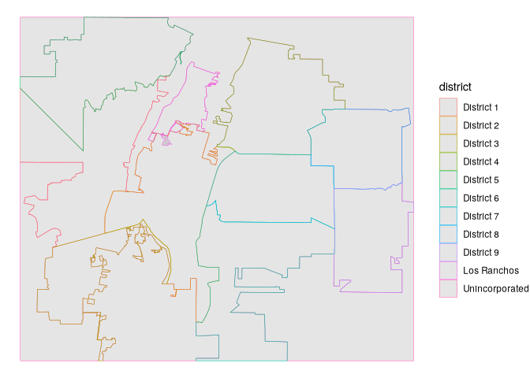

## Census Data

### Fetching

The `get_acs()` function obtains information from the American Community
Survey tables. By supplying a named vector, the columns of the returned
data table will be automatically renamed. Setting `geometry = TRUE`
returns an `sf` object, and `output = "wide"` gives a column for each
variable. After obtaining the data, I will remove the margin of error
columns, remove the trailing “E” from the remaining column names, and
transform the geometry to an appropriate coordinate reference system.

``` r
vars_census <- c(
  House.Value.Med = "B25077_001",
  Renter.Occupied = "B25003_003",
  Vacant = "B25002_003",
  Income.Med = "DP03_0062",
  Gini = "B19083_001",
  Rent.Med = "B25031_001",
  Foreign.Born.Pct = "DP02_0094P",
  Hisp.Pct = "DP05_0090P",
  In.Poverty = "B17001A_002",
  Age.Med = "B01002_001",
  College.Pct = "DP02_0068P",
  Population.Total = "B01003_001"
)

bern_data <- get_acs(
  geography = "tract",
  state = "NM",
  county = "Bernalillo",
  variables = vars_census,
  output = "wide",
  year = year,
  geometry = TRUE,
  cache_table = TRUE
) %>%
  select(-2 & !ends_with("M")) %>%
  rename_with(~ sub("E$", "", .)) %>% 
  st_transform(crs)
```

    Getting data from the 2020-2024 5-year ACS

    Fetching data by table type ("B/C", "S", "DP") and combining the result.

### Cleaning

Let’s take a look at the data before splitting it between districts.

``` r
summary(bern_data)
```

           GEOID     House.Value.Med  Renter.Occupied      Vacant      
     Length   :176   Min.   : 28700   Min.   :   0.0   Min.   :  0.00  
     N.unique :176   1st Qu.:220825   1st Qu.: 212.2   1st Qu.: 31.75  
     N.blank  :  0   Median :291750   Median : 433.5   Median : 73.50  
     Min.nchar: 11   Mean   :303776   Mean   : 575.2   Mean   : 98.02  
     Max.nchar: 11   3rd Qu.:360525   3rd Qu.: 794.8   3rd Qu.:142.50  
                     Max.   :869000   Max.   :2423.0   Max.   :403.00  
                     NAs    :10                                        
          Gini           Rent.Med      In.Poverty         Age.Med     
     Min.   :0.0680   Min.   : 425   Min.   :   0.00   Min.   :19.80  
     1st Qu.:0.3708   1st Qu.: 989   1st Qu.:  89.75   1st Qu.:35.52  
     Median :0.4125   Median :1195   Median : 180.00   Median :40.60  
     Mean   :0.4183   Mean   :1307   Mean   : 235.89   Mean   :40.96  
     3rd Qu.:0.4624   3rd Qu.:1519   3rd Qu.: 324.25   3rd Qu.:46.30  
     Max.   :0.5929   Max.   :3501   Max.   :1161.00   Max.   :66.30  
     NAs    :3        NAs    :9                        NAs    :2      
     Population.Total   Income.Med     Foreign.Born.Pct    Hisp.Pct    
     Min.   :    0    Min.   : 19780   Min.   : 0.00    Min.   : 0.00  
     1st Qu.: 2746    1st Qu.: 51945   1st Qu.: 4.30    1st Qu.:30.95  
     Median : 3708    Median : 66940   Median : 8.65    Median :44.05  
     Mean   : 3829    Mean   : 75169   Mean   :10.14    Mean   :47.42  
     3rd Qu.: 4802    3rd Qu.: 92870   3rd Qu.:12.47    3rd Qu.:61.12  
     Max.   :11669    Max.   :250001   Max.   :39.20    Max.   :93.20  
                      NAs    :4        NAs    :2        NAs    :2      
      College.Pct             geometry  
     Min.   : 0.00   MULTIPOLYGON :176  
     1st Qu.:22.15   epsg:6528    :  0  
     Median :37.45   +proj=tmer...:  0  
     Mean   :37.68                      
     3rd Qu.:49.88                      
     Max.   :84.80                      
     NAs    :2                          

There is some clean-up to do. There are some `na`s to explore, and
oddities like areas where the population total is 0. I’ll with the
zero-population areas.

``` r
bern_data %>% 
  filter(Population.Total == 0)
```

    Simple feature collection with 2 features and 13 fields
    Geometry type: MULTIPOLYGON
    Dimension:     XY
    Bounding box:  xmin: 430659.3 ymin: 443790.6 xmax: 470946.2 ymax: 453313.6
    Projected CRS: NAD83(2011) / New Mexico Central
    # A tibble: 2 × 14
      GEOID House.Value.Med Renter.Occupied Vacant  Gini Rent.Med In.Poverty Age.Med
    * <chr>           <dbl>           <dbl>  <dbl> <dbl>    <dbl>      <dbl>   <dbl>
    1 3500…              NA               0      0    NA       NA          0      NA
    2 3500…              NA               0      0    NA       NA          0      NA
    # ℹ 6 more variables: Population.Total <dbl>, Income.Med <dbl>,
    #   Foreign.Born.Pct <dbl>, Hisp.Pct <dbl>, College.Pct <dbl>,
    #   geometry <MULTIPOLYGON [m]>

``` r
ggplot(bern_data) +
  geom_sf(color = "red") +
  geom_sf(data = bern_data %>% filter(Population.Total == 0), fill = "navy") +
  annotation_map_tile(
    type = "osm", alpha = 0.7,
    zoomin = -1, cachedir = "~/.cache/maps/"
  ) +
  theme_void() +
  lims(
    x = dist_box[1:2],
    y = dist_box[3:4]
  )
```

    Loading required namespace: raster

    Zoom: 11


This tract is the state fairgrounds. The other is outside the study
area. I’ll remove them.

``` r
bern_data <- bern_data %>% 
  filter(Population.Total > 0)
summary(bern_data)
```

           GEOID     House.Value.Med  Renter.Occupied      Vacant      
     Length   :174   Min.   : 28700   Min.   :   0.0   Min.   :  0.00  
     N.unique :174   1st Qu.:220825   1st Qu.: 219.8   1st Qu.: 33.50  
     N.blank  :  0   Median :291750   Median : 436.0   Median : 74.00  
     Min.nchar: 11   Mean   :303776   Mean   : 581.8   Mean   : 99.14  
     Max.nchar: 11   3rd Qu.:360525   3rd Qu.: 798.2   3rd Qu.:143.50  
                     Max.   :869000   Max.   :2423.0   Max.   :403.00  
                     NAs    :8                                         
          Gini           Rent.Med      In.Poverty        Age.Med     
     Min.   :0.0680   Min.   : 425   Min.   :   0.0   Min.   :19.80  
     1st Qu.:0.3708   1st Qu.: 989   1st Qu.:  91.5   1st Qu.:35.52  
     Median :0.4125   Median :1195   Median : 183.5   Median :40.60  
     Mean   :0.4183   Mean   :1307   Mean   : 238.6   Mean   :40.96  
     3rd Qu.:0.4624   3rd Qu.:1519   3rd Qu.: 324.8   3rd Qu.:46.30  
     Max.   :0.5929   Max.   :3501   Max.   :1161.0   Max.   :66.30  
     NAs    :1        NAs    :7                                      
     Population.Total   Income.Med     Foreign.Born.Pct    Hisp.Pct    
     Min.   :   16    Min.   : 19780   Min.   : 0.00    Min.   : 0.00  
     1st Qu.: 2768    1st Qu.: 51945   1st Qu.: 4.30    1st Qu.:30.95  
     Median : 3721    Median : 66940   Median : 8.65    Median :44.05  
     Mean   : 3873    Mean   : 75169   Mean   :10.14    Mean   :47.42  
     3rd Qu.: 4811    3rd Qu.: 92870   3rd Qu.:12.47    3rd Qu.:61.12  
     Max.   :11669    Max.   :250001   Max.   :39.20    Max.   :93.20  
                      NAs    :2                                        
      College.Pct             geometry  
     Min.   : 0.00   MULTIPOLYGON :174  
     1st Qu.:22.15   epsg:6528    :  0  
     Median :37.45   +proj=tmer...:  0  
     Mean   :37.68                      
     3rd Qu.:49.88                      
     Max.   :84.80                      
                                        

The population of 16 is suspicious.

``` r
bern_data %>% 
  filter(Population.Total < 20)
```

    Simple feature collection with 1 feature and 13 fields
    Geometry type: MULTIPOLYGON
    Dimension:     XY
    Bounding box:  xmin: 450601.6 ymin: 454903.5 xmax: 460264.7 ymax: 464835.2
    Projected CRS: NAD83(2011) / New Mexico Central
    # A tibble: 1 × 14
      GEOID House.Value.Med Renter.Occupied Vacant  Gini Rent.Med In.Poverty Age.Med
    * <chr>           <dbl>           <dbl>  <dbl> <dbl>    <dbl>      <dbl>   <dbl>
    1 3500…              NA               4      0 0.068       NA          4      65
    # ℹ 6 more variables: Population.Total <dbl>, Income.Med <dbl>,
    #   Foreign.Born.Pct <dbl>, Hisp.Pct <dbl>, College.Pct <dbl>,
    #   geometry <MULTIPOLYGON [m]>

``` r
ggplot(bern_data) +
  geom_sf(color = "red") +
  geom_sf(data = bern_data %>% filter(Population.Total < 20), fill = "navy") +
  annotation_map_tile(
    type = "osm", alpha = 0.7,
    zoomin = -1, cachedir = "~/.cache/maps/"
  ) +
  theme_void() +
  lims(
    x = dist_box[1:2],
    y = dist_box[3:4]
  )
```

    Zoom: 11


This tract contains federal land, and no useful data. I’ll remove this
as well.

``` r
bern_data <- bern_data %>% 
  filter(Population.Total > 20)
```

This only leaves `na`s in two variables. Let’s take a closer look.

``` r
bern_data %>% 
  filter(if_any(everything(), is.na))
```

    Simple feature collection with 12 features and 13 fields
    Geometry type: MULTIPOLYGON
    Dimension:     XY
    Bounding box:  xmin: 413766.6 ymin: 429420.9 xmax: 480613.7 ymax: 468330.2
    Projected CRS: NAD83(2011) / New Mexico Central
    # A tibble: 12 × 14
       GEOID       House.Value.Med Renter.Occupied Vacant   Gini Rent.Med In.Poverty
     * <chr>                 <dbl>           <dbl>  <dbl>  <dbl>    <dbl>      <dbl>
     1 35001000718          206500             428    105  0.592       NA        170
     2 35001000906              NA            2063    379  0.4        867        468
     3 35001001800              NA             422     73  0.476      861         80
     4 35001002100              NA            1128    125  0.419      956        167
     5 35001003400              NA            1642    176  0.453      942        430
     6 35001003744          869000              13      0  0.357       NA          0
     7 35001004603          225100             163     66  0.403       NA         99
     8 35001004736              NA             270      0  0.373     1095        126
     9 35001004754          271500             175     61  0.394       NA        317
    10 35001940602           98900               0     74  0.306       NA        216
    11 35001980000              NA            1416    101  0.333     1766        166
    12 35001980500              NA               0      0 NA           NA          0
    # ℹ 7 more variables: Age.Med <dbl>, Population.Total <dbl>, Income.Med <dbl>,
    #   Foreign.Born.Pct <dbl>, Hisp.Pct <dbl>, College.Pct <dbl>,
    #   geometry <MULTIPOLYGON [m]>

This data seems worth preserving. I will fill in these values based on
the median values for each variable, but I would like these values to be
based on the median for the specific district, rather than an overall
median. I will need to split the districts at this point in order to
calculate the values.

## Create District Dataset

Splitting the data involves intersecting the county data with the
districts. Since some of the variables are extensive, representing
counts, these values will need to be apportioned based on the percentage
area represented by each subsection. I’ll calculate the initial area of
each tract, then the areas of each newly-created sub-section, allowing
me to divide each tract’s data by the percentage area lying in the new
tracts.

``` r
dist_data <- bern_data %>% 
  mutate(area = st_area(.)) %>% 
  st_intersection(council_dists) %>% 
  mutate(
    area_split = st_area(.),
    area_pct = as.numeric(area_split / area),
    Population = round(Population.Total * area_pct, 0),
    Population.Density = Population / area_split,
    Renter.Occupied = round(Renter.Occupied * area_pct, 0),
    Vacant = round(Vacant * area_pct, 0),
    In.Poverty = round(In.Poverty * area_pct, 0)
    )
```

Now I can calculate the per-district averages for the two variables.

``` r
vars_na <- c("House.Value.Med", "Rent.Med")

var_avgs <- dist_data %>%
  st_drop_geometry() %>%
  group_by(district) %>%
  summarise(across(
    all_of(vars_na),
    list(dist = \(x) median(x, na.rm = T))
  ))

#%>%
#  ungroup()

fill_avgs <- function(var, replace) {
  if_else(is.na(var), replace, var)
}

dist_data <- dist_data %>%
  left_join(var_avgs) %>% 
  mutate(
    House.Value.Med = fill_avgs(House.Value.Med, House.Value.Med_dist),
    Rent.Med = fill_avgs(Rent.Med, Rent.Med_dist),
  ) %>% 
  select(-c(Population.Total, area, area_split, ends_with("dist")))
```

    Joining with `by = join_by(district)`

``` r
summary(dist_data)
```

           GEOID     House.Value.Med  Renter.Occupied      Vacant      
     Length   :324   Min.   : 28700   Min.   :   0.0   Min.   :  0.00  
     N.unique :166   1st Qu.:220875   1st Qu.:   1.0   1st Qu.:  0.00  
     N.blank  :  0   Median :272950   Median :  90.0   Median : 14.00  
     Min.nchar: 11   Mean   :305239   Mean   : 304.8   Mean   : 48.32  
     Max.nchar: 11   3rd Qu.:360800   3rd Qu.: 461.0   3rd Qu.: 66.00  
                     Max.   :869000   Max.   :2419.0   Max.   :403.00  
          Gini           Rent.Med      In.Poverty        Age.Med     
     Min.   :0.2313   Min.   : 632   Min.   :   0.0   Min.   :19.80  
     1st Qu.:0.3729   1st Qu.: 995   1st Qu.:   0.0   1st Qu.:35.40  
     Median :0.4177   Median :1190   Median :  39.5   Median :40.35  
     Mean   :0.4238   Mean   :1308   Mean   : 120.3   Mean   :40.80  
     3rd Qu.:0.4695   3rd Qu.:1506   3rd Qu.: 174.5   3rd Qu.:45.60  
     Max.   :0.5929   Max.   :3501   Max.   :1161.0   Max.   :66.30  
       Income.Med     Foreign.Born.Pct    Hisp.Pct      College.Pct   
     Min.   : 19780   Min.   : 0.00    Min.   :10.60   Min.   : 2.80  
     1st Qu.: 50694   1st Qu.: 4.60    1st Qu.:33.42   1st Qu.:22.75  
     Median : 64375   Median : 8.80    Median :45.05   Median :37.15  
     Mean   : 75211   Mean   :10.77    Mean   :49.05   Mean   :38.05  
     3rd Qu.: 92870   3rd Qu.:14.80    3rd Qu.:62.40   3rd Qu.:50.38  
     Max.   :250001   Max.   :39.20    Max.   :93.20   Max.   :84.80  
          district            geometry      area_pct           Population      
     Length   :324   MULTIPOLYGON : 93   Min.   :4.000e-08   Min.   :    0.00  
     N.unique : 11   POLYGON      :231   1st Qu.:2.266e-03   1st Qu.:   11.25  
     N.blank  :  0   epsg:6528    :  0   Median :4.212e-01   Median : 1426.50  
     Min.nchar: 10   +proj=tmer...:  0   Mean   :4.903e-01   Mean   : 1916.11  
     Max.nchar: 14                       3rd Qu.:9.993e-01   3rd Qu.: 3383.25  
                                         Max.   :1.000e+00   Max.   :11152.00  
     Population.Density 
     Min.   :0.0000000  
     1st Qu.:0.0006142  
     Median :0.0013268  
     Mean   :0.0014029  
     3rd Qu.:0.0020175  
     Max.   :0.0059555  

The split data now contains more areas with a population is 0. As a
result of the splitting, there are numerous small fragments containing
little information. To address this, I will remove all of the new rows
which represent less than 1% of the original area.

``` r
dist_data <- dist_data %>% 
  filter(area_pct > .01)
summary(dist_data)
```

           GEOID     House.Value.Med  Renter.Occupied      Vacant      
     Length   :228   Min.   : 28700   Min.   :   1.0   Min.   :  0.00  
     N.unique :165   1st Qu.:226900   1st Qu.:  77.5   1st Qu.:  8.00  
     N.blank  :  0   Median :298650   Median : 298.5   Median : 42.00  
     Min.nchar: 11   Mean   :312189   Mean   : 432.8   Mean   : 68.64  
     Max.nchar: 11   3rd Qu.:362375   3rd Qu.: 622.2   3rd Qu.:102.50  
                     Max.   :869000   Max.   :2419.0   Max.   :403.00  
          Gini           Rent.Med      In.Poverty        Age.Med     
     Min.   :0.2313   Min.   : 632   Min.   :   0.0   Min.   :19.80  
     1st Qu.:0.3718   1st Qu.:1018   1st Qu.:  32.0   1st Qu.:35.40  
     Median :0.4136   Median :1233   Median :  97.0   Median :40.00  
     Mean   :0.4198   Mean   :1340   Mean   : 170.8   Mean   :40.63  
     3rd Qu.:0.4693   3rd Qu.:1517   3rd Qu.: 252.2   3rd Qu.:45.77  
     Max.   :0.5929   Max.   :3501   Max.   :1161.0   Max.   :66.30  
       Income.Med     Foreign.Born.Pct    Hisp.Pct      College.Pct   
     Min.   : 19780   Min.   : 0.000   Min.   :10.60   Min.   : 2.80  
     1st Qu.: 53445   1st Qu.: 4.675   1st Qu.:33.70   1st Qu.:22.75  
     Median : 68970   Median : 8.800   Median :45.20   Median :38.15  
     Mean   : 77815   Mean   :10.721   Mean   :49.46   Mean   :38.61  
     3rd Qu.: 94526   3rd Qu.:13.475   3rd Qu.:63.08   3rd Qu.:50.80  
     Max.   :250001   Max.   :39.200   Max.   :93.20   Max.   :84.80  
          district            geometry      area_pct         Population   
     Length   :228   MULTIPOLYGON : 42   Min.   :0.01254   Min.   :   38  
     N.unique : 11   POLYGON      :186   1st Qu.:0.32908   1st Qu.: 1152  
     N.blank  :  0   epsg:6528    :  0   Median :0.95721   Median : 2752  
     Min.nchar: 10   +proj=tmer...:  0   Mean   :0.69613   Mean   : 2721  
     Max.nchar: 14                       3rd Qu.:0.99997   3rd Qu.: 3886  
                                         Max.   :1.00000   Max.   :11152  
     Population.Density 
     Min.   :2.456e-05  
     1st Qu.:8.362e-04  
     Median :1.422e-03  
     Mean   :1.519e-03  
     3rd Qu.:2.026e-03  
     Max.   :5.955e-03  

That looks good. I’ll remove unnecessary columns and limit the
exploration to the augmented Albuquerque districts, and can proceed with
exploring the data distributions.

``` r
abq_data <- dist_data  %>% 
  select(-c(area_pct, Population, Population.Density)) %>% 
  filter(!district %in% c("Los Ranchos", "Unincorporated"))
```

# Data Normalization

To perform the standard analysis of variance, data is expected to be
normally distributed. Further, there should be equality of variance
across districts.

## Visualize

I’ll start by plotting the raw data.

``` r
var_names <- names(abq_data)[-c(1, 13:14)]

plot_dist <- function(df, var) {
  df %>%
    ggboxplot("district", var, fill = "district") +
    geom_point(position = position_jitter(width = 0.1)) +
    theme(axis.text.x = element_text(angle = 45, vjust = .5)) +
    guides(fill = "none") +
    labs(caption = caption)
}

c(p1, p2, p3, p4, p5, p6, p7, p8, p9) %<-%
  map(var_names, \(x) abq_data %>% plot_dist(x))
```

``` r
(p1 + p2)
```

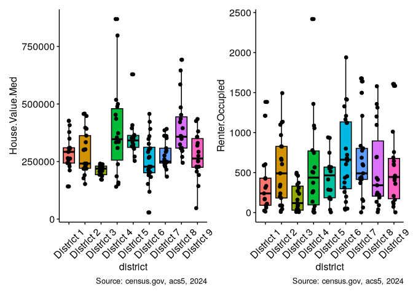

``` r
(p3 + p4)
```

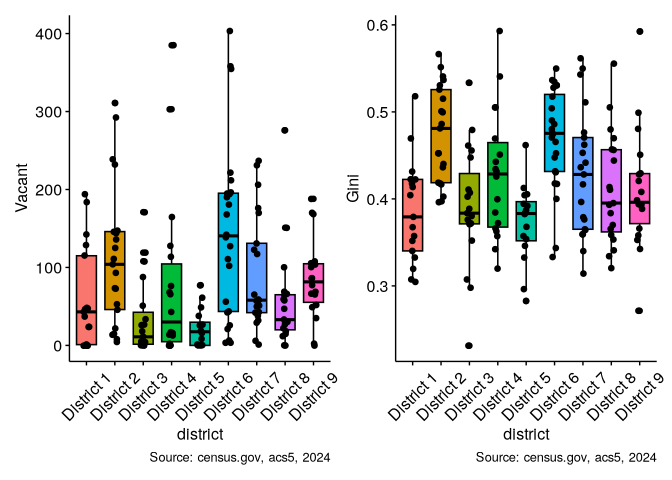

``` r
(p5 + p6)
```

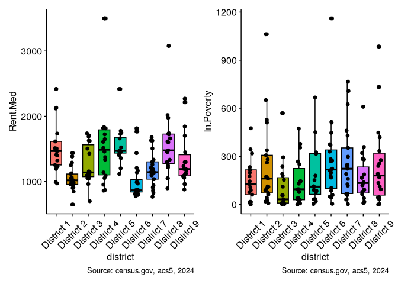

``` r
(p7 + p8)
```

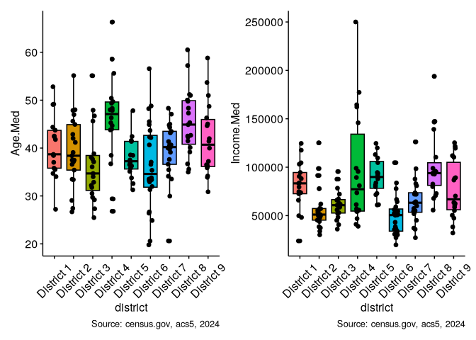

``` r
p9
```

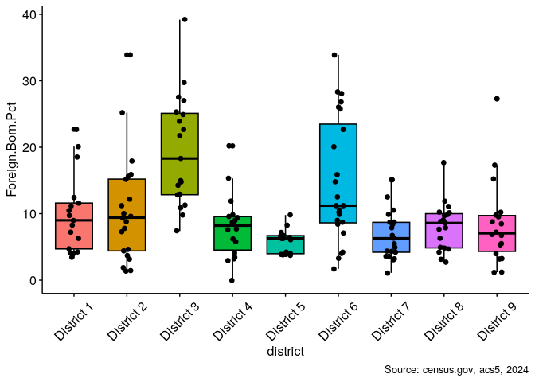

I want to construct nine histograms and nine qqplots, and display them
side-by-side with `patchwork`. This is where I really appreciate the
functional programming aspects of **R**. To do this, I’ll first create a
histogram function. Note the `.data[[var]]` syntax. It is necessary to
pass variables to `aes()` when using the `aes()` function within a
function. Then I will use `map()` four times to produce the plots.

``` r
plot_hist <- function(df, var) {
  df %>%
    ggplot(aes(.data[[var]])) +
    geom_histogram(aes(y = after_stat(density)),
      fill = "lightgray", col = "black", bins = 20
    ) +
    geom_line(stat = "density", adjust = 2, color = "blue") +
    labs(caption = caption)
}

hists <- map(var_names, \(x) abq_data %>% plot_hist(x))
vars_list <- map(var_names, \(x) pull(abq_data, x))
qqs <- map(vars_list, ggqqplot)
map(1:length(hists),
     \(x) hists[[x]] + qqs[[x]])
```

    [[1]]

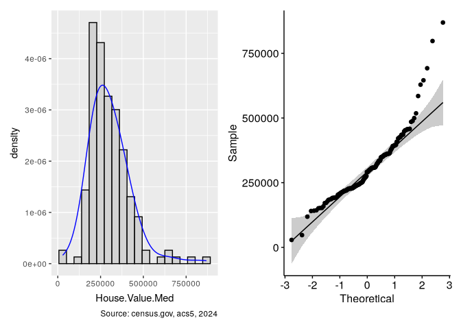


    [[2]]

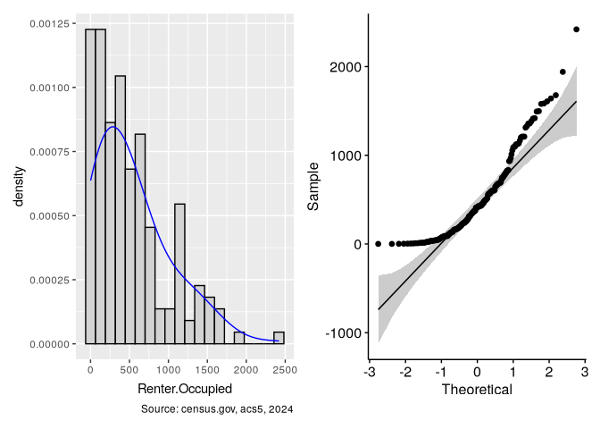


    [[3]]

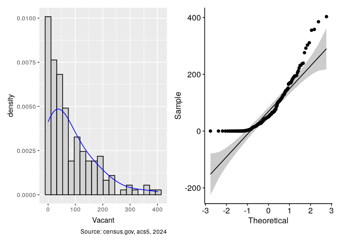


    [[4]]

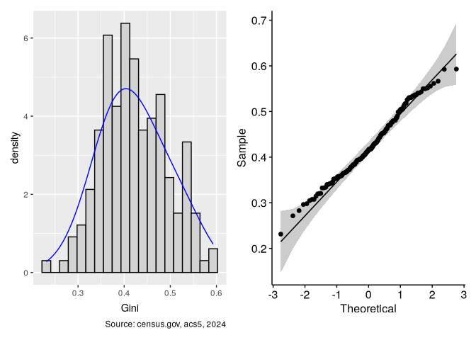


    [[5]]

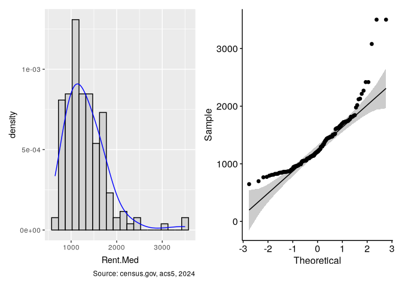


    [[6]]

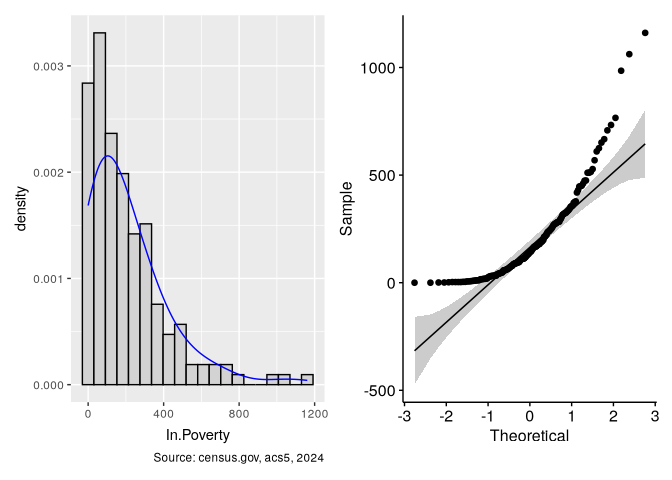


    [[7]]

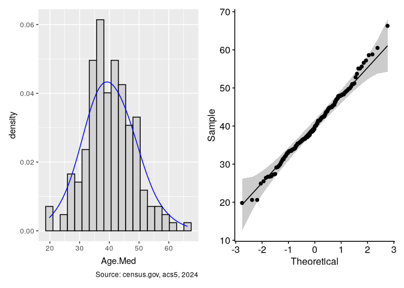


    [[8]]

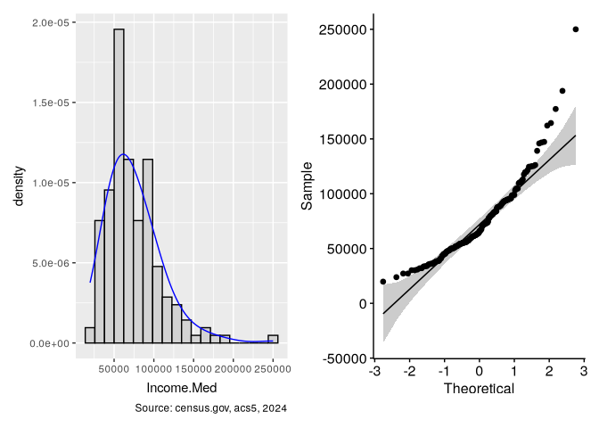


    [[9]]

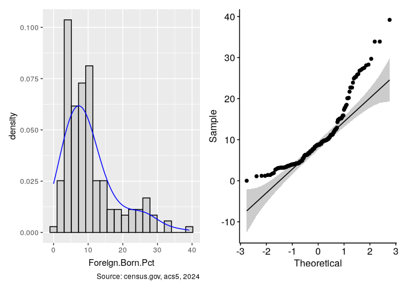


    [[10]]

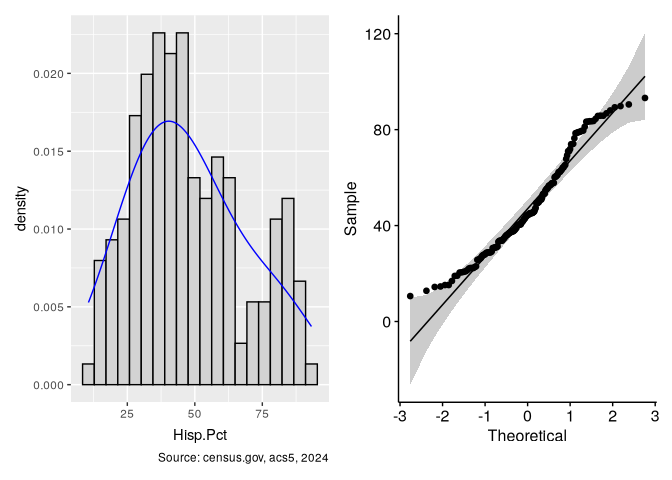


    [[11]]

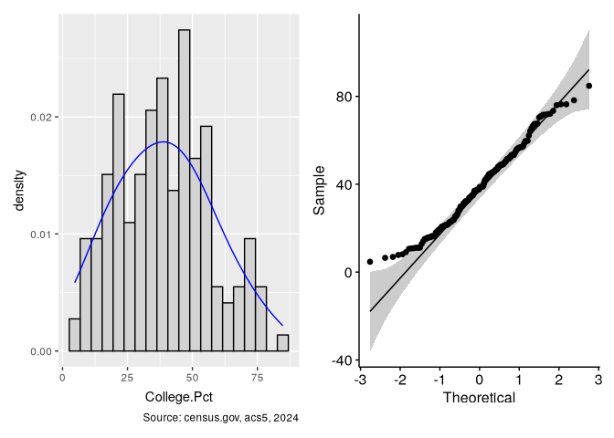

With a couple of exceptions, these variables do not appear to be
normally distributed.

## Shapiro tests

The Shapiro-Wilk test can be used to evaluate statistically whether a
variable is normally distributed. The null hypothesis in this test is
that the data is normally distributed. $p$-values less than 0.05
indicate that the null hypothesis should be rejected, implying that the
data are not normally distributed. I’ll start by running a
`shapiro_test` on all of the variables, filtering for $p$-values greater
than 0.05. These variables are normally distributed.

``` r
map(
  map(
    var_names,
    \(x) pull(abq_data, x)
  ),
  shapiro_test
) %>%
  collapse::unlist2d() %>%
  mutate(
    variable = var_names,
    sig = if_else(p.value <= .05, "Yes", "No")
  ) %>%
  select(-1) %>%
  filter(sig == "No")
```

      variable statistic   p.value sig
    1     Gini 0.9875397 0.1295101  No
    2  Age.Med 0.9924356 0.5044565  No

## Transformations

I’d like to test a number of different transformations, so I will create
a function to do so and filter the data as above. Happily, in R,
functions are first-class data types, allowing functions to be passed as
arguments to functions. In fact, this custom function highlights the
richness of R’s functional programming capabilities, using the built-in
`lapply()` and `purrr`’s `map()`. The pipe itself is akin to functional
composition.

``` r
run_shapiro <- function(df, vars, f) {
  data <- map(
    vars,
    \(x) pull(df, x)
  ) %>%
    lapply(f)
  map(data, shapiro_test) %>%
    collapse::unlist2d() %>%
    mutate(
      variable = vars,
      sig = if_else(p.value < .05, "Yes", "No")
    ) %>%
    select(-1) %>%
    filter(sig == "No")
}
```

I’ll start with a simple square-root transformation.

``` r
run_shapiro(abq_data, var_names, sqrt)
```

      variable statistic   p.value sig
    1     Gini 0.9911581 0.3649678  No
    2  Age.Med 0.9929594 0.5694869  No

That doesn’t help. How about a cube root?

``` r
cube_root <- function(x) {
  sign(x) * abs(x)^(1/3)
}

run_shapiro(abq_data, var_names, cube_root)
```

        variable statistic    p.value sig
    1       Gini 0.9910811 0.35754303  No
    2 In.Poverty 0.9945265 0.77339992  No
    3    Age.Med 0.9903006 0.28889027  No
    4 Income.Med 0.9847190 0.05538311  No

That helps a little, but not much. I can’t use a straight-forward log
transformation due to the many 0 values, so I will use a modified log
transformation.

``` r
ihs_transform <- function(x) {
  log(x + (x^2 + 1)^0.5)
}

run_shapiro(abq_data, var_names, ihs_transform)
```

        variable statistic   p.value sig
    1       Gini 0.9890016 0.1994232  No
    2 Income.Med 0.9962839 0.9489259  No

That’s even worse. I’ll try an inverse normal transformation. This
transformation is based on ranking, and is able to normalize highly
skewed distributions. The downside of this transformation is that the
“distance” between each observation is lost, obscuring information about
the variability within the variable. The `blom()` function which
performs the transformation defaults to a “general” method.

``` r
xf_blom <- partial(blom, method = "blom")
run_shapiro(abq_data, var_names, xf_blom)
```

               variable statistic   p.value sig
    1   House.Value.Med 0.9994448 1.0000000  No
    2   Renter.Occupied 0.9986406 0.9999578  No
    3              Gini 0.9994133 1.0000000  No
    4          Rent.Med 0.9986041 0.9999457  No
    5        In.Poverty 0.9984672 0.9998724  No
    6           Age.Med 0.9992511 0.9999999  No
    7        Income.Med 0.9993959 1.0000000  No
    8  Foreign.Born.Pct 0.9990495 0.9999990  No
    9          Hisp.Pct 0.9993834 1.0000000  No
    10      College.Pct 0.9993546 1.0000000  No

``` r
run_shapiro(abq_data, var_names, blom)
```

               variable statistic   p.value sig
    1   House.Value.Med 0.9994830 1.0000000  No
    2   Renter.Occupied 0.9986733 0.9999665  No
    3              Gini 0.9994515 1.0000000  No
    4          Rent.Med 0.9986368 0.9999566  No
    5        In.Poverty 0.9985000 0.9998949  No
    6           Age.Med 0.9992894 1.0000000  No
    7        Income.Med 0.9994342 1.0000000  No
    8  Foreign.Born.Pct 0.9990878 0.9999994  No
    9          Hisp.Pct 0.9994216 1.0000000  No
    10      College.Pct 0.9993929 1.0000000  No

``` r
log_blom <- compose(xf_blom, ihs_transform)
run_shapiro(abq_data, var_names, log_blom)
```

               variable statistic   p.value sig
    1   House.Value.Med 0.9994448 1.0000000  No
    2   Renter.Occupied 0.9986406 0.9999578  No
    3              Gini 0.9994133 1.0000000  No
    4          Rent.Med 0.9986041 0.9999457  No
    5        In.Poverty 0.9984672 0.9998724  No
    6           Age.Med 0.9992511 0.9999999  No
    7        Income.Med 0.9993959 1.0000000  No
    8  Foreign.Born.Pct 0.9990495 0.9999990  No
    9          Hisp.Pct 0.9993834 1.0000000  No
    10      College.Pct 0.9993546 1.0000000  No

Remove non-standard variables.

``` r
abq_data <- abq_data %>% 
  select(-c("GEOID", "Vacant"))
var_names <- var_names[-3]
```

``` r
abq_data_elf <- abq_data %>% 
  mutate(across(all_of(var_names), ~ blom(.x)))
abq_data_elf_2 <- abq_data %>% 
  mutate(across(all_of(var_names), ~ log_blom(.x)))
```

## Distribution Plots

``` r
map(var_names, \(x) abq_data_elf %>% plot_dist(x))
```

    [[1]]

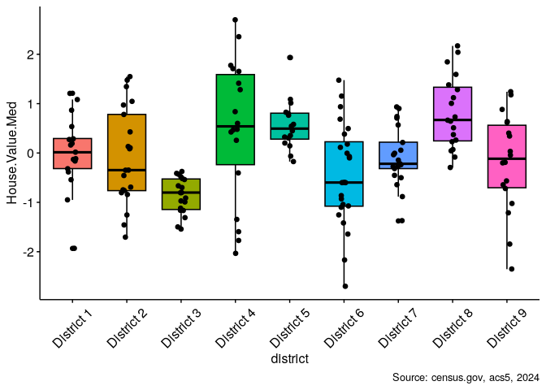


    [[2]]

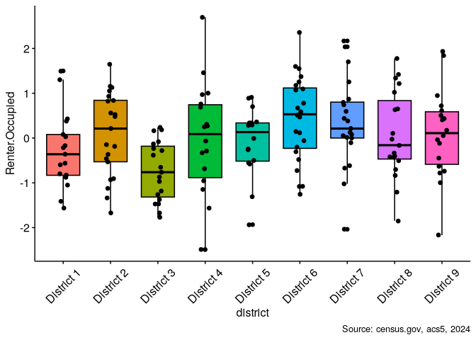


    [[3]]

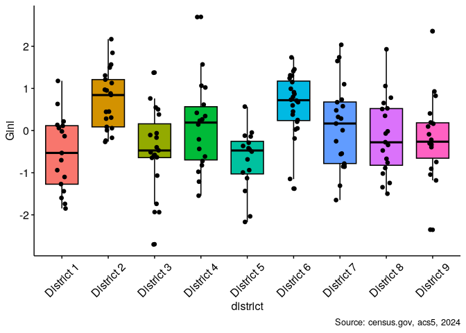


    [[4]]

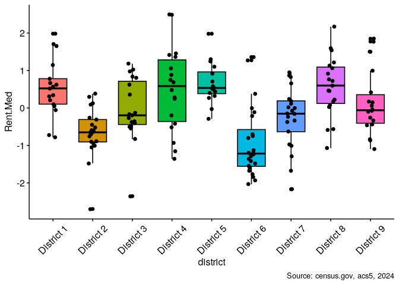


    [[5]]

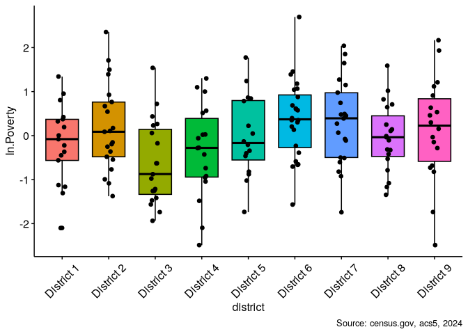


    [[6]]

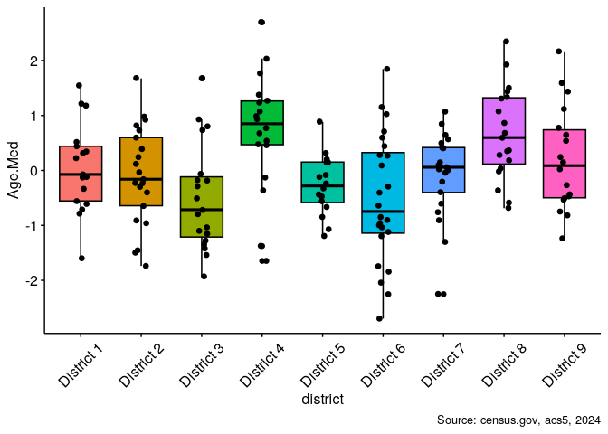


    [[7]]

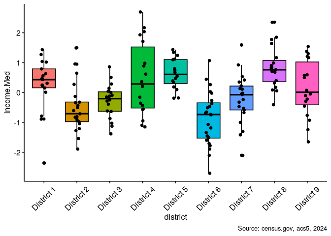


    [[8]]

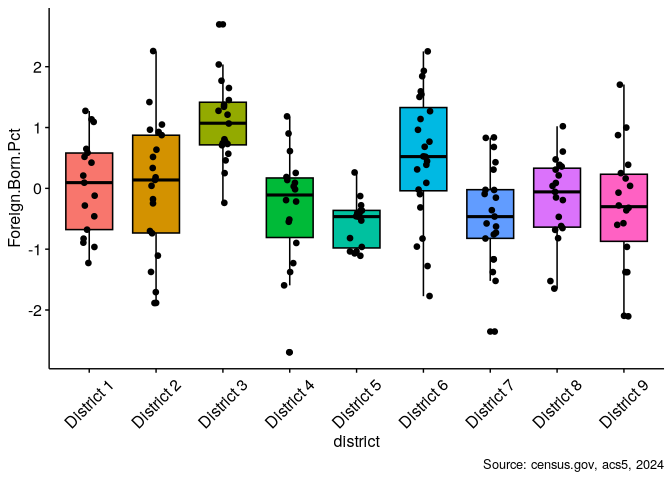


    [[9]]

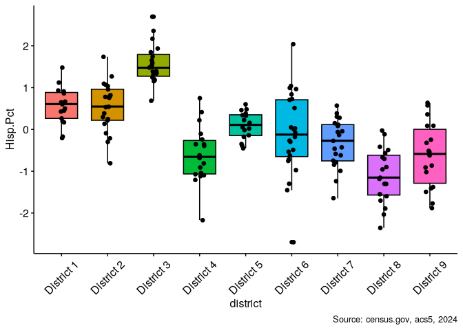


    [[10]]

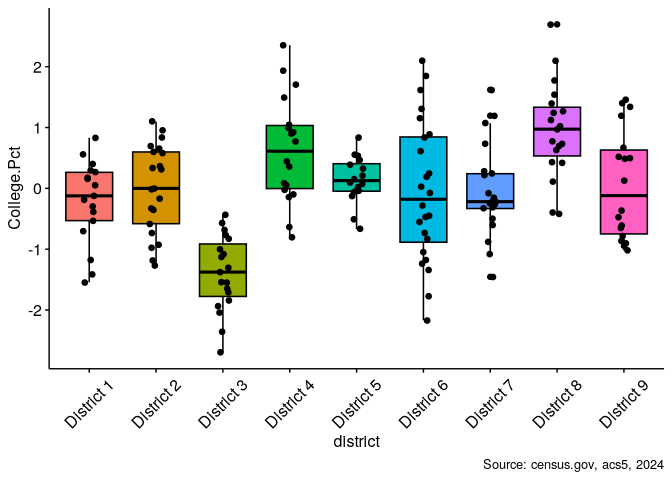

``` r
hists <- map(var_names, \(x) abq_data_elf %>% plot_hist(x))
var_vals <- map(var_names, \(x) pull(abq_data_elf, x))
lines <- map(var_vals, ggqqplot)
map(1:10,
     \(x) hists[[x]] + lines[[x]])
```

    [[1]]


    [[2]]

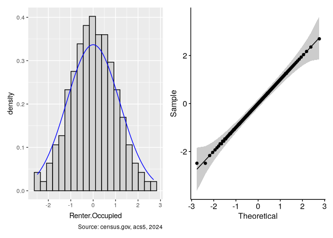


    [[3]]

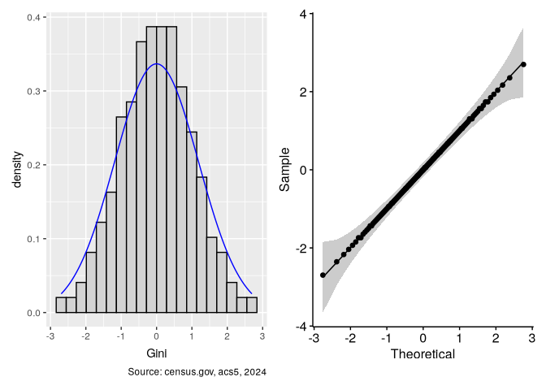


    [[4]]

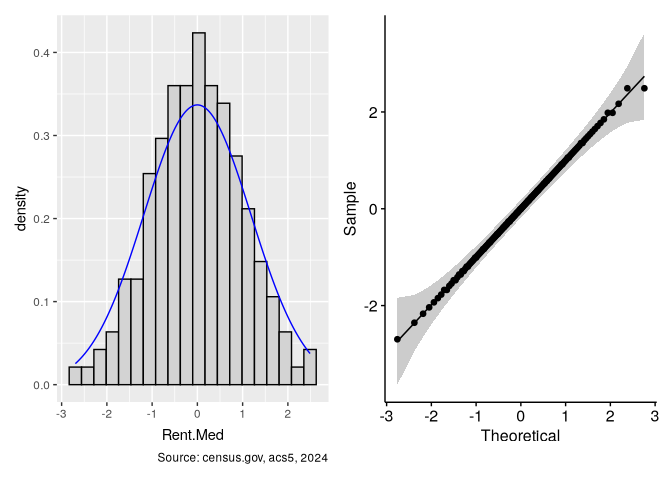


    [[5]]

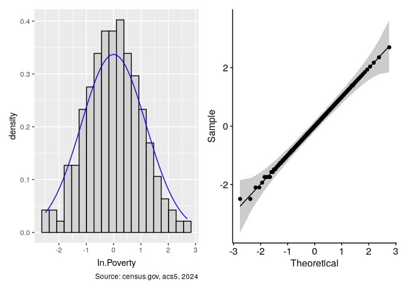


    [[6]]

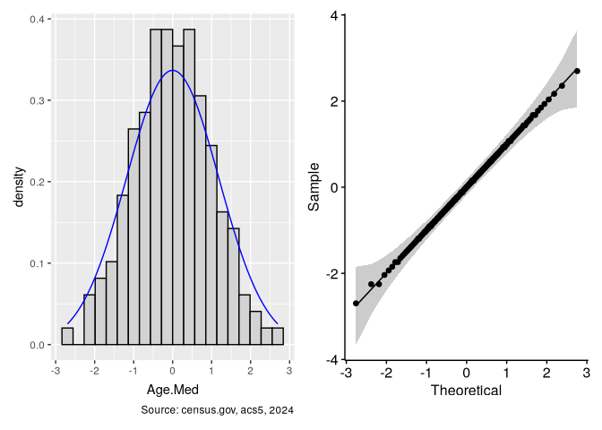


    [[7]]

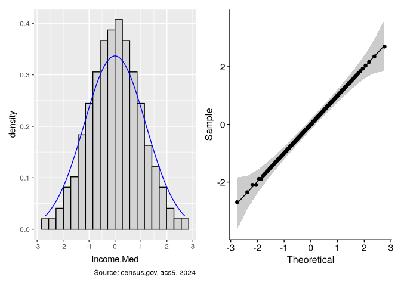


    [[8]]

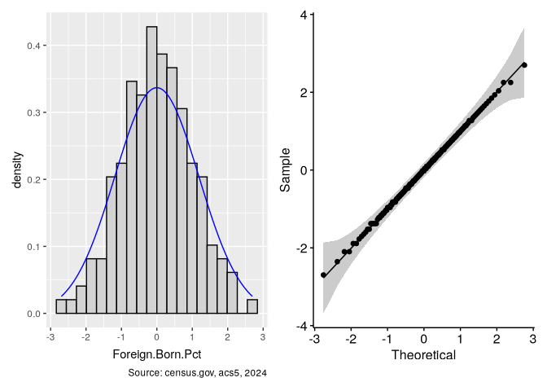


    [[9]]


    [[10]]


``` r
hists <- map(var_names, \(x) abq_data_elf_2 %>% plot_hist(x))
var_vals <- map(var_names, \(x) pull(abq_data_elf_2, x))
lines <- map(var_vals, ggqqplot)
map(1:10,
     \(x) hists[[x]] + lines[[x]])
```

    [[1]]


    [[2]]

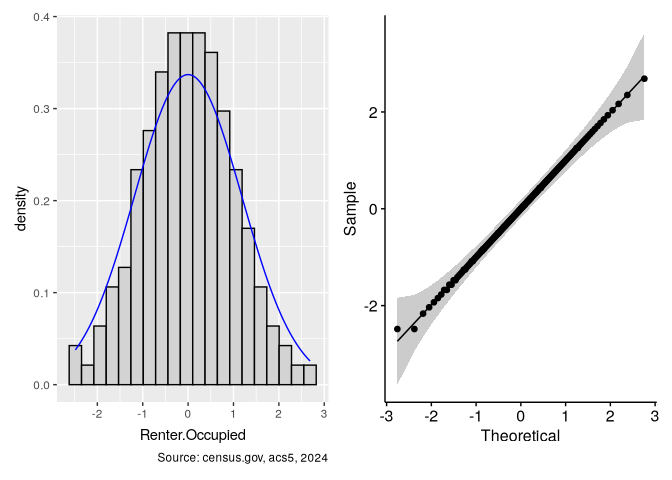


    [[3]]

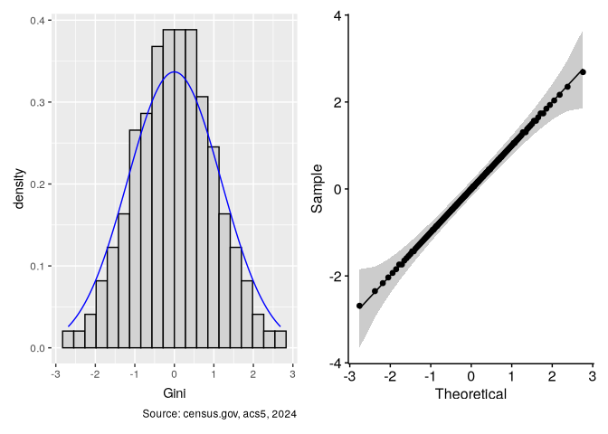


    [[4]]

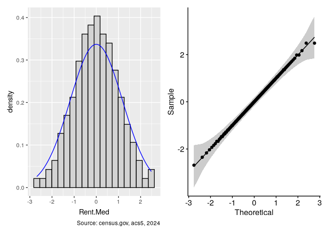


    [[5]]

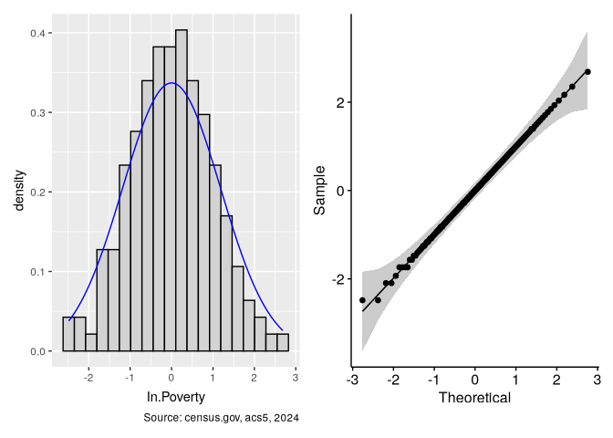


    [[6]]

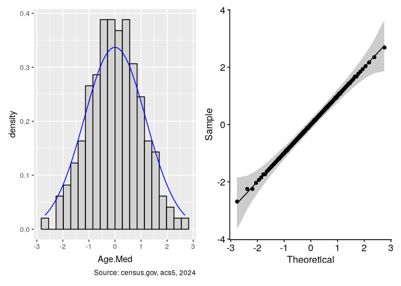


    [[7]]


    [[8]]


    [[9]]


    [[10]]

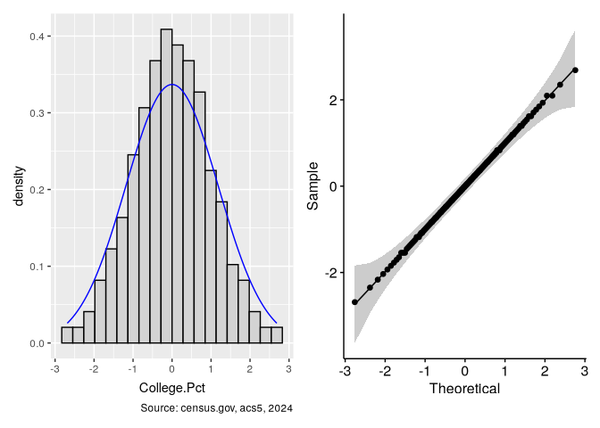

## Equality of variance (Bartlett’s test)

``` r
# var_vals <- map(var_names, \(x) pull(abq_data_elf, x))
btests <- map2(var_names, 
     map(var_names, \(x) pull(abq_data_elf, x)),
    \(x, y) list(x, bartlett.test(y ~ district, abq_data_elf)))
tibble(
  variable = unlist(map(1:length(btests), \(x) btests[[x]][[1]])),
  statistic = unlist(map(1:length(btests), \(x) btests[[x]][[2]]$statistic)),
  p_value = unlist(map(1:length(btests), \(x) btests[[x]][[2]]$p.value %>% round(., 3)))
)
```

    # A tibble: 10 × 3
       variable         statistic p_value
       <chr>                <dbl>   <dbl>
     1 House.Value.Med      42.4    0    
     2 Renter.Occupied      10.0    0.263
     3 Gini                  6.32   0.612
     4 Rent.Med             10.3    0.244
     5 In.Poverty            3.72   0.881
     6 Age.Med              11.8    0.158
     7 Income.Med           17.9    0.022
     8 Foreign.Born.Pct     21.7    0.005
     9 Hisp.Pct             29.0    0    
    10 College.Pct          22.2    0.005

``` r
var_names_aov <- var_names[2:7]
btests <- map2(var_names_aov, 
     map(var_names_aov, \(x) pull(abq_data_elf, x)),
    \(x, y) list(x, bartlett.test(y ~ district, abq_data_elf)))
tibble(
  variable = unlist(map(1:length(btests), \(x) btests[[x]][[1]])),
  statistic = unlist(map(1:length(btests), \(x) btests[[x]][[2]]$statistic)),
  p_value = unlist(map(1:length(btests), \(x) btests[[x]][[2]]$p.value %>% round(., 3)))
)
```

    # A tibble: 6 × 3
      variable        statistic p_value
      <chr>               <dbl>   <dbl>
    1 Renter.Occupied     10.0    0.263
    2 Gini                 6.32   0.612
    3 Rent.Med            10.3    0.244
    4 In.Poverty           3.72   0.881
    5 Age.Med             11.8    0.158
    6 Income.Med          17.9    0.022

# Variance Between Council Districts

## ANOVA

``` r
aov_tests <- map(
  var_names_aov,
  \(x) list(x, aov(as.formula(glue::glue("{x} ~ district")),
    data = abq_data_elf)
  )
)
map2(1:length(aov_tests), var_names_aov, 
     \(x, y) list(y, summary(aov_tests[[x]][[2]])))
```

    [[1]]
    [[1]][[1]]
    [1] "Renter.Occupied"

    [[1]][[2]]
                 Df Sum Sq Mean Sq F value Pr(>F)  
    district      8  18.86  2.3580   2.568 0.0115 *
    Residuals   164 150.60  0.9183                 
    ---
    Signif. codes:  0 '***' 0.001 '**' 0.01 '*' 0.05 '.' 0.1 ' ' 1


    [[2]]
    [[2]][[1]]
    [1] "Gini"

    [[2]][[2]]
                 Df Sum Sq Mean Sq F value  Pr(>F)    
    district      8  37.26   4.658   5.761 1.8e-06 ***
    Residuals   164 132.60   0.809                    
    ---
    Signif. codes:  0 '***' 0.001 '**' 0.01 '*' 0.05 '.' 0.1 ' ' 1


    [[3]]
    [[3]][[1]]
    [1] "Rent.Med"

    [[3]][[2]]
                 Df Sum Sq Mean Sq F value   Pr(>F)    
    district      8  53.63   6.704   9.495 9.47e-11 ***
    Residuals   164 115.80   0.706                     
    ---
    Signif. codes:  0 '***' 0.001 '**' 0.01 '*' 0.05 '.' 0.1 ' ' 1


    [[4]]
    [[4]][[1]]
    [1] "In.Poverty"

    [[4]][[2]]
                 Df Sum Sq Mean Sq F value Pr(>F)  
    district      8   16.8  2.0996   2.257 0.0258 *
    Residuals   164  152.5  0.9301                 
    ---
    Signif. codes:  0 '***' 0.001 '**' 0.01 '*' 0.05 '.' 0.1 ' ' 1


    [[5]]
    [[5]][[1]]
    [1] "Age.Med"

    [[5]][[2]]
                 Df Sum Sq Mean Sq F value   Pr(>F)    
    district      8  31.05   3.882    4.59 4.55e-05 ***
    Residuals   164 138.71   0.846                     
    ---
    Signif. codes:  0 '***' 0.001 '**' 0.01 '*' 0.05 '.' 0.1 ' ' 1


    [[6]]
    [[6]][[1]]
    [1] "Income.Med"

    [[6]][[2]]
                 Df Sum Sq Mean Sq F value   Pr(>F)    
    district      8   51.5   6.438   8.923 4.06e-10 ***
    Residuals   164  118.3   0.722                     
    ---
    Signif. codes:  0 '***' 0.001 '**' 0.01 '*' 0.05 '.' 0.1 ' ' 1

## Welch’s tests

``` r
var_names_welch <- var_names[c(1, 8:10)]
map(
  var_names_welch,
  \(x) list(x, oneway.test(as.formula(glue::glue("{x} ~ district")),
    data = abq_data_elf, var.equal = F)
  )
)
```

    [[1]]
    [[1]][[1]]
    [1] "House.Value.Med"

    [[1]][[2]]

        One-way analysis of means (not assuming equal variances)

    data:  House.Value.Med and district
    F = 16.655, num df = 8.000, denom df = 66.673, p-value = 2.875e-13


    [[2]]
    [[2]][[1]]
    [1] "Foreign.Born.Pct"

    [[2]][[2]]

        One-way analysis of means (not assuming equal variances)

    data:  Foreign.Born.Pct and district
    F = 11.236, num df = 8.000, denom df = 67.516, p-value = 5.897e-10


    [[3]]
    [[3]][[1]]
    [1] "Hisp.Pct"

    [[3]][[2]]

        One-way analysis of means (not assuming equal variances)

    data:  Hisp.Pct and district
    F = 37.544, num df = 8.000, denom df = 67.681, p-value < 2.2e-16


    [[4]]
    [[4]][[1]]
    [1] "College.Pct"

    [[4]][[2]]

        One-way analysis of means (not assuming equal variances)

    data:  College.Pct and district
    F = 16.011, num df = 8.000, denom df = 67.586, p-value = 5.614e-13

``` r
map(
  var_names_welch,
  \(x) list(x, welch_anova_test(as.formula(glue::glue("{x} ~ district")),
    data = abq_data_elf %>% st_drop_geometry)
  )
)
```

    [[1]]
    [[1]][[1]]
    [1] "House.Value.Med"

    [[1]][[2]]
    # A tibble: 1 × 7
      .y.                 n statistic   DFn   DFd        p method     
    * <chr>           <int>     <dbl> <dbl> <dbl>    <dbl> <chr>      
    1 House.Value.Med   173      16.7     8  66.7 2.87e-13 Welch ANOVA


    [[2]]
    [[2]][[1]]
    [1] "Foreign.Born.Pct"

    [[2]][[2]]
    # A tibble: 1 × 7
      .y.                  n statistic   DFn   DFd             p method     
    * <chr>            <int>     <dbl> <dbl> <dbl>         <dbl> <chr>      
    1 Foreign.Born.Pct   173      11.2     8  67.5 0.00000000059 Welch ANOVA


    [[3]]
    [[3]][[1]]
    [1] "Hisp.Pct"

    [[3]][[2]]
    # A tibble: 1 × 7
      .y.          n statistic   DFn   DFd        p method     
    * <chr>    <int>     <dbl> <dbl> <dbl>    <dbl> <chr>      
    1 Hisp.Pct   173      37.5     8  67.7 5.51e-22 Welch ANOVA


    [[4]]
    [[4]][[1]]
    [1] "College.Pct"

    [[4]][[2]]
    # A tibble: 1 × 7
      .y.             n statistic   DFn   DFd        p method     
    * <chr>       <int>     <dbl> <dbl> <dbl>    <dbl> <chr>      
    1 College.Pct   173      16.0     8  67.6 5.61e-13 Welch ANOVA

## Ridge Plots

``` r
library(ggridges)
plot_dist_ridge <- function(df, var) {
  ggplot(df, aes(
    x = .data[[var]], y = district,
    fill = factor(stat(quantile))
  )) +
    stat_density_ridges(
      geom = "density_ridges_gradient", calc_ecdf = TRUE,
      quantiles = 4, quantile_lines = TRUE, alpha = 0.7,
      jittered_points = TRUE, position = "points_sina"
    ) +
    scale_fill_viridis_d(name = "Quartiles") +
    theme(axis.title.x = element_blank())
}
```

``` r
map(var_names, 
    \(x) abq_data_elf %>% 
      plot_dist_ridge(x) +
      labs(title = x))
```

    [[1]]

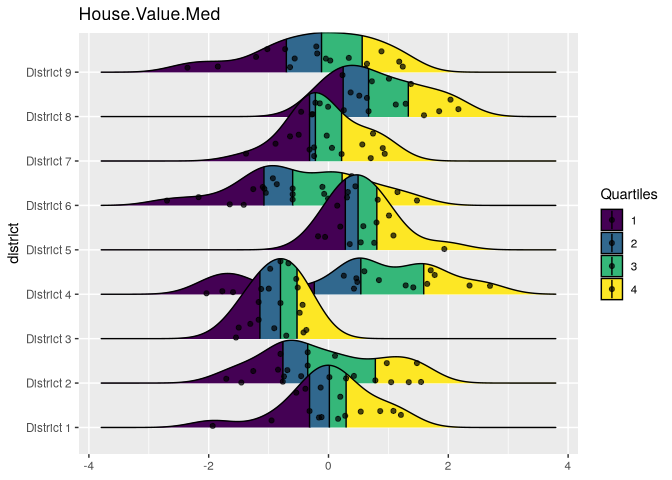


    [[2]]

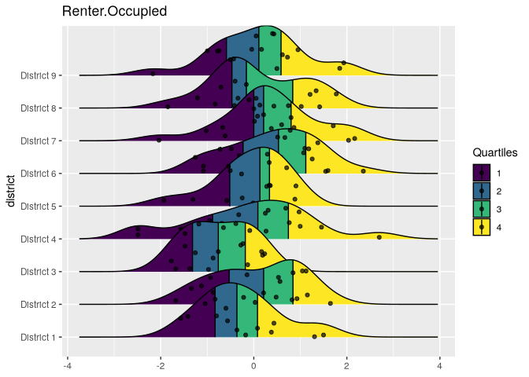


    [[3]]

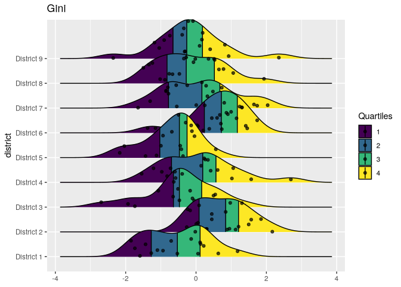


    [[4]]

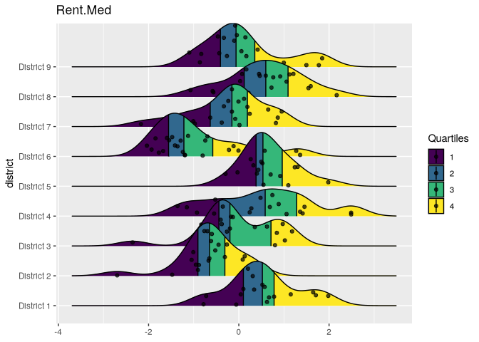


    [[5]]

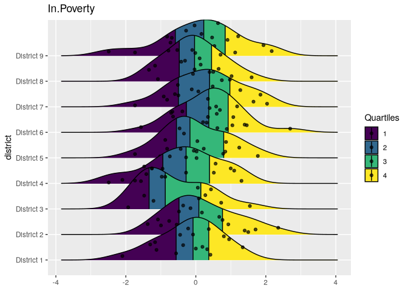


    [[6]]

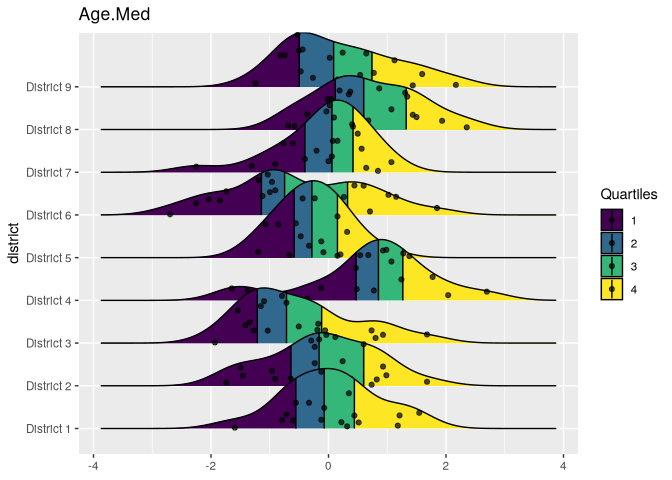


    [[7]]

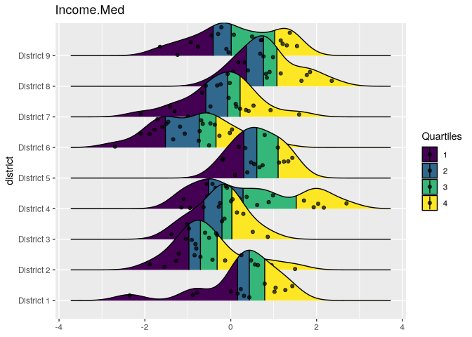


    [[8]]

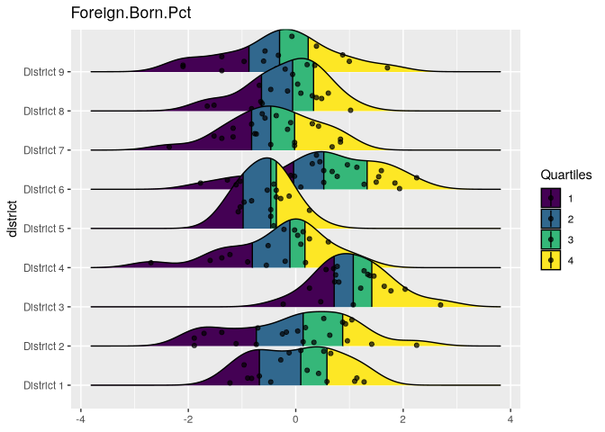


    [[9]]

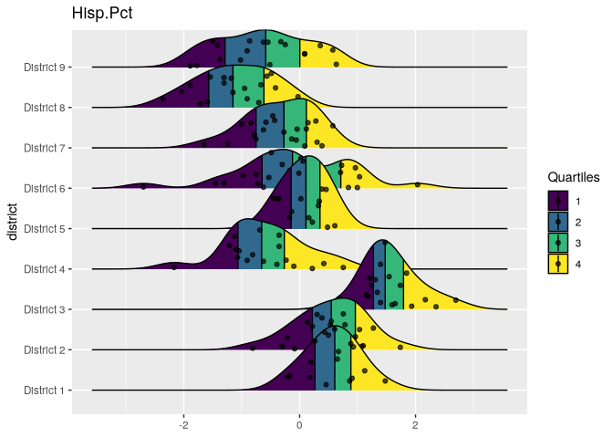


    [[10]]

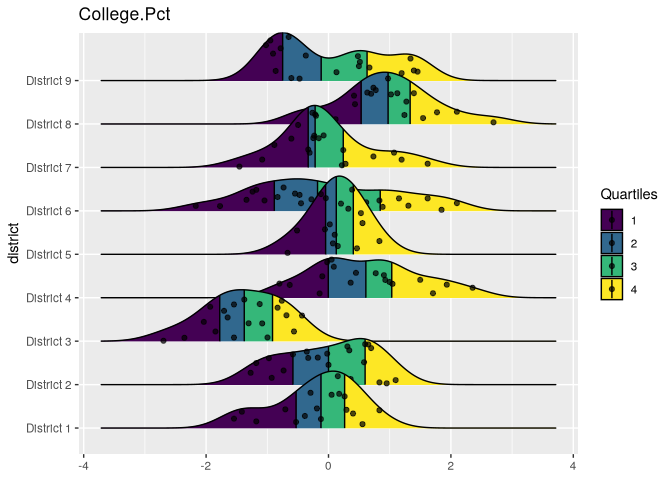

## Tukey’s

``` r
results_tky <- map(
  aov_tests,
  \(x) TukeyHSD(x[[2]])$district %>% 
    as.data.frame %>%
  filter(`p adj` <= .05) %>% 
  mutate(variable = x[[1]], .before = 1) %>% 
    rownames_to_column("districts")) %>% 
  unlist2d(idcols = FALSE) %>% 
  separate(districts, c("District.1", "District.2"), sep = "-")

dist_names <- unique(c(results_tky$District.1, results_tky$District.2)) %>% 
  sort()
var_names_tky <- unique(results_tky$variable)

results_tky_dist <- map(
  dist_names,
  \(x) results_tky %>%
    filter(District.1 == x | District.2 == x) %>%
    mutate(
      district = x,
      compare = if_else(District.1 == x, District.2, District.1),
      .before = variable
    ) %>% 
    select(-(1:2)) %>% 
    arrange(district, compare)
)
```

``` r
map(
  dist_names,
  \(x) results_tky %>%
    filter(District.1 == x | District.2 == x) %>%
    mutate(
      district = x,
      compare = if_else(District.1 == x, District.2, District.1),
      .before = variable
    ) %>% 
    select(-(1:2)) %>% 
    arrange(district, compare) %>% 
    as_tibble()
)
```

    [[1]]
    # A tibble: 5 × 7
      district   compare    variable    diff    lwr    upr    `p adj`
      <chr>      <chr>      <chr>      <dbl>  <dbl>  <dbl>      <dbl>
    1 District 1 District 2 Gini        1.26  0.337  2.18  0.000986  
    2 District 1 District 2 Rent.Med   -1.18 -2.04  -0.321 0.000902  
    3 District 1 District 6 Gini        1.13  0.238  2.03  0.00325   
    4 District 1 District 6 Rent.Med   -1.46 -2.30  -0.625 0.00000526
    5 District 1 District 6 Income.Med -1.14 -1.99  -0.296 0.00120   

    [[2]]
    # A tibble: 10 × 7
       district   compare    variable     diff    lwr    upr   `p adj`
       <chr>      <chr>      <chr>       <dbl>  <dbl>  <dbl>     <dbl>
     1 District 2 District 1 Gini        1.26   0.337  2.18  0.000986 
     2 District 2 District 1 Rent.Med   -1.18  -2.04  -0.321 0.000902 
     3 District 2 District 3 Gini       -1.15  -2.05  -0.260 0.00245  
     4 District 2 District 4 Rent.Med    1.15   0.300  2.00  0.00114  
     5 District 2 District 4 Income.Med  0.986  0.128  1.84  0.0118   
     6 District 2 District 5 Gini       -1.43  -2.37  -0.490 0.000130 
     7 District 2 District 5 Rent.Med    1.30   0.427  2.18  0.000207 
     8 District 2 District 5 Income.Med  1.15   0.268  2.04  0.00213  
     9 District 2 District 8 Rent.Med    1.22   0.385  2.06  0.000296 
    10 District 2 District 8 Income.Med  1.36   0.511  2.20  0.0000415

    [[3]]
    # A tibble: 10 × 7
       district   compare    variable          diff      lwr     upr `p adj`
       <chr>      <chr>      <chr>            <dbl>    <dbl>   <dbl>   <dbl>
     1 District 3 District 2 Gini            -1.15  -2.05    -0.260  0.00245
     2 District 3 District 4 Age.Med          1.20   0.254    2.16   0.00321
     3 District 3 District 5 Income.Med       0.907  0.00132  1.81   0.0494 
     4 District 3 District 6 Renter.Occupied  1.16   0.232    2.08   0.00385
     5 District 3 District 6 Gini             1.03   0.162    1.90   0.00793
     6 District 3 District 6 Rent.Med        -0.885 -1.70    -0.0740 0.0212 
     7 District 3 District 6 In.Poverty       1.01   0.0750   1.94   0.0235 
     8 District 3 District 7 Renter.Occupied  1.07   0.118    2.03   0.0153 
     9 District 3 District 8 Age.Med          1.16   0.222    2.10   0.00453
    10 District 3 District 8 Income.Med       1.11   0.244    1.98   0.00270

    [[4]]
    # A tibble: 6 × 7
      district   compare    variable     diff    lwr    upr    `p adj`
      <chr>      <chr>      <chr>       <dbl>  <dbl>  <dbl>      <dbl>
    1 District 4 District 2 Rent.Med    1.15   0.300  2.00  0.00114   
    2 District 4 District 2 Income.Med  0.986  0.128  1.84  0.0118    
    3 District 4 District 3 Age.Med     1.20   0.254  2.16  0.00321   
    4 District 4 District 6 Rent.Med   -1.43  -2.25  -0.605 0.00000635
    5 District 4 District 6 Age.Med    -1.24  -2.14  -0.334 0.000933  
    6 District 4 District 6 Income.Med -1.34  -2.17  -0.503 0.0000417 

    [[5]]
    # A tibble: 8 × 7
      district   compare    variable     diff      lwr     upr     `p adj`
      <chr>      <chr>      <chr>       <dbl>    <dbl>   <dbl>       <dbl>
    1 District 5 District 2 Gini       -1.43  -2.37    -0.490  0.000130   
    2 District 5 District 2 Rent.Med    1.30   0.427    2.18   0.000207   
    3 District 5 District 2 Income.Med  1.15   0.268    2.04   0.00213    
    4 District 5 District 3 Income.Med  0.907  0.00132  1.81   0.0494     
    5 District 5 District 6 Gini        1.30   0.390    2.22   0.000449   
    6 District 5 District 6 Rent.Med   -1.58  -2.44    -0.731  0.000000978
    7 District 5 District 6 Income.Med -1.50  -2.37    -0.642  0.00000543 
    8 District 5 District 7 Rent.Med   -0.905 -1.78    -0.0281 0.0374     

    [[6]]
    # A tibble: 18 × 7
       district   compare    variable          diff     lwr     upr      `p adj`
       <chr>      <chr>      <chr>            <dbl>   <dbl>   <dbl>        <dbl>
     1 District 6 District 1 Gini             1.13   0.238   2.03   0.00325     
     2 District 6 District 1 Rent.Med        -1.46  -2.30   -0.625  0.00000526  
     3 District 6 District 1 Income.Med      -1.14  -1.99   -0.296  0.00120     
     4 District 6 District 3 Renter.Occupied  1.16   0.232   2.08   0.00385     
     5 District 6 District 3 Gini             1.03   0.162   1.90   0.00793     
     6 District 6 District 3 Rent.Med        -0.885 -1.70   -0.0740 0.0212      
     7 District 6 District 3 In.Poverty       1.01   0.0750  1.94   0.0235      
     8 District 6 District 4 Rent.Med        -1.43  -2.25   -0.605  0.00000635  
     9 District 6 District 4 Age.Med         -1.24  -2.14   -0.334  0.000933    
    10 District 6 District 4 Income.Med      -1.34  -2.17   -0.503  0.0000417   
    11 District 6 District 5 Gini             1.30   0.390   2.22   0.000449    
    12 District 6 District 5 Rent.Med        -1.58  -2.44   -0.731  0.000000978 
    13 District 6 District 5 Income.Med      -1.50  -2.37   -0.642  0.00000543  
    14 District 6 District 8 Rent.Med         1.50   0.690   2.31   0.00000109  
    15 District 6 District 8 Age.Med          1.19   0.303   2.08   0.00134     
    16 District 6 District 8 Income.Med       1.71   0.887   2.53   0.0000000263
    17 District 6 District 9 Rent.Med         1.06   0.237   1.88   0.00251     
    18 District 6 District 9 Income.Med       1.02   0.187   1.85   0.00521     

    [[7]]
    # A tibble: 3 × 7
      district   compare    variable          diff    lwr     upr `p adj`
      <chr>      <chr>      <chr>            <dbl>  <dbl>   <dbl>   <dbl>
    1 District 7 District 3 Renter.Occupied  1.07   0.118  2.03   0.0153 
    2 District 7 District 5 Rent.Med        -0.905 -1.78  -0.0281 0.0374 
    3 District 7 District 8 Income.Med       1.05   0.203  1.89   0.00439

    [[8]]
    # A tibble: 8 × 7
      district   compare    variable    diff   lwr   upr      `p adj`
      <chr>      <chr>      <chr>      <dbl> <dbl> <dbl>        <dbl>
    1 District 8 District 2 Rent.Med    1.22 0.385  2.06 0.000296    
    2 District 8 District 2 Income.Med  1.36 0.511  2.20 0.0000415   
    3 District 8 District 3 Age.Med     1.16 0.222  2.10 0.00453     
    4 District 8 District 3 Income.Med  1.11 0.244  1.98 0.00270     
    5 District 8 District 6 Rent.Med    1.50 0.690  2.31 0.00000109  
    6 District 8 District 6 Age.Med     1.19 0.303  2.08 0.00134     
    7 District 8 District 6 Income.Med  1.71 0.887  2.53 0.0000000263
    8 District 8 District 7 Income.Med  1.05 0.203  1.89 0.00439     

    [[9]]
    # A tibble: 2 × 7
      district   compare    variable    diff   lwr   upr `p adj`
      <chr>      <chr>      <chr>      <dbl> <dbl> <dbl>   <dbl>
    1 District 9 District 6 Rent.Med    1.06 0.237  1.88 0.00251
    2 District 9 District 6 Income.Med  1.02 0.187  1.85 0.00521

``` r
map(unique(results_tky$variable),
    \(x) results_tky %>% 
      filter(variable == x) %>% 
  relocate(variable, .before = 1) %>% 
  as_tibble())
```

    [[1]]
    # A tibble: 2 × 7
      variable        District.1 District.2  diff   lwr   upr `p adj`
      <chr>           <chr>      <chr>      <dbl> <dbl> <dbl>   <dbl>
    1 Renter.Occupied District 6 District 3  1.16 0.232  2.08 0.00385
    2 Renter.Occupied District 7 District 3  1.07 0.118  2.03 0.0153 

    [[2]]
    # A tibble: 6 × 7
      variable District.1 District.2  diff    lwr    upr  `p adj`
      <chr>    <chr>      <chr>      <dbl>  <dbl>  <dbl>    <dbl>
    1 Gini     District 2 District 1  1.26  0.337  2.18  0.000986
    2 Gini     District 6 District 1  1.13  0.238  2.03  0.00325 
    3 Gini     District 3 District 2 -1.15 -2.05  -0.260 0.00245 
    4 Gini     District 5 District 2 -1.43 -2.37  -0.490 0.000130
    5 Gini     District 6 District 3  1.03  0.162  1.90  0.00793 
    6 Gini     District 6 District 5  1.30  0.390  2.22  0.000449

    [[3]]
    # A tibble: 11 × 7
       variable District.1 District.2   diff    lwr     upr     `p adj`
       <chr>    <chr>      <chr>       <dbl>  <dbl>   <dbl>       <dbl>
     1 Rent.Med District 2 District 1 -1.18  -2.04  -0.321  0.000902   
     2 Rent.Med District 6 District 1 -1.46  -2.30  -0.625  0.00000526 
     3 Rent.Med District 4 District 2  1.15   0.300  2.00   0.00114    
     4 Rent.Med District 5 District 2  1.30   0.427  2.18   0.000207   
     5 Rent.Med District 8 District 2  1.22   0.385  2.06   0.000296   
     6 Rent.Med District 6 District 3 -0.885 -1.70  -0.0740 0.0212     
     7 Rent.Med District 6 District 4 -1.43  -2.25  -0.605  0.00000635 
     8 Rent.Med District 6 District 5 -1.58  -2.44  -0.731  0.000000978
     9 Rent.Med District 7 District 5 -0.905 -1.78  -0.0281 0.0374     
    10 Rent.Med District 8 District 6  1.50   0.690  2.31   0.00000109 
    11 Rent.Med District 9 District 6  1.06   0.237  1.88   0.00251    

    [[4]]
    # A tibble: 1 × 7
      variable   District.1 District.2  diff    lwr   upr `p adj`
      <chr>      <chr>      <chr>      <dbl>  <dbl> <dbl>   <dbl>
    1 In.Poverty District 6 District 3  1.01 0.0750  1.94  0.0235

    [[5]]
    # A tibble: 4 × 7
      variable District.1 District.2  diff    lwr    upr  `p adj`
      <chr>    <chr>      <chr>      <dbl>  <dbl>  <dbl>    <dbl>
    1 Age.Med  District 4 District 3  1.20  0.254  2.16  0.00321 
    2 Age.Med  District 8 District 3  1.16  0.222  2.10  0.00453 
    3 Age.Med  District 6 District 4 -1.24 -2.14  -0.334 0.000933
    4 Age.Med  District 8 District 6  1.19  0.303  2.08  0.00134 

    [[6]]
    # A tibble: 11 × 7
       variable   District.1 District.2   diff      lwr    upr      `p adj`
       <chr>      <chr>      <chr>       <dbl>    <dbl>  <dbl>        <dbl>
     1 Income.Med District 6 District 1 -1.14  -1.99    -0.296 0.00120     
     2 Income.Med District 4 District 2  0.986  0.128    1.84  0.0118      
     3 Income.Med District 5 District 2  1.15   0.268    2.04  0.00213     
     4 Income.Med District 8 District 2  1.36   0.511    2.20  0.0000415   
     5 Income.Med District 5 District 3  0.907  0.00132  1.81  0.0494      
     6 Income.Med District 8 District 3  1.11   0.244    1.98  0.00270     
     7 Income.Med District 6 District 4 -1.34  -2.17    -0.503 0.0000417   
     8 Income.Med District 6 District 5 -1.50  -2.37    -0.642 0.00000543  
     9 Income.Med District 8 District 6  1.71   0.887    2.53  0.0000000263
    10 Income.Med District 9 District 6  1.02   0.187    1.85  0.00521     
    11 Income.Med District 8 District 7  1.05   0.203    1.89  0.00439     

## Linear Model

``` r
map(var_names,
    \(x) list(x, lm(as.formula(glue("{x} ~ district")),
      data = abq_data_elf
    ) %>% summary()))
```

    [[1]]
    [[1]][[1]]
    [1] "House.Value.Med"

    [[1]][[2]]

    Call:
    lm(formula = as.formula(glue("{x} ~ district")), data = abq_data_elf)

    Residuals:
         Min       1Q   Median       3Q      Max 
    -2.52608 -0.45042 -0.02866  0.51668  2.20717 

    Coefficients:
                        Estimate Std. Error t value Pr(>|t|)   
    (Intercept)         0.006336   0.214083   0.030  0.97642   
    districtDistrict 2 -0.077409   0.287982  -0.269  0.78842   
    districtDistrict 3 -0.870109   0.294685  -2.953  0.00361 **
    districtDistrict 4  0.482759   0.298525   1.617  0.10777   
    districtDistrict 5  0.561012   0.307454   1.825  0.06987 . 
    districtDistrict 6 -0.454004   0.279814  -1.623  0.10661   
    districtDistrict 7 -0.076004   0.287982  -0.264  0.79217   
    districtDistrict 8  0.814137   0.294685   2.763  0.00639 **
    districtDistrict 9 -0.198955   0.298525  -0.666  0.50605   
    ---
    Signif. codes:  0 '***' 0.001 '**' 0.01 '*' 0.05 '.' 0.1 ' ' 1

    Residual standard error: 0.8827 on 164 degrees of freedom
    Multiple R-squared:  0.2479,    Adjusted R-squared:  0.2112 
    F-statistic: 6.756 on 8 and 164 DF,  p-value: 1.208e-07


    [[2]]
    [[2]][[1]]
    [1] "Renter.Occupied"

    [[2]][[2]]

    Call:
    lm(formula = as.formula(glue("{x} ~ district")), data = abq_data_elf)

    Residuals:
         Min       1Q   Median       3Q      Max 
    -2.39887 -0.57210  0.03489  0.64996  2.78709 

    Coefficients:
                       Estimate Std. Error t value Pr(>|t|)  
    (Intercept)         -0.2783     0.2324  -1.198   0.2328  
    districtDistrict 2   0.3584     0.3126   1.146   0.2533  
    districtDistrict 3  -0.4586     0.3199  -1.433   0.1537  
    districtDistrict 4   0.1875     0.3241   0.579   0.5637  
    districtDistrict 5   0.1963     0.3338   0.588   0.5573  
    districtDistrict 6   0.6989     0.3038   2.301   0.0227 *
    districtDistrict 7   0.6130     0.3126   1.961   0.0516 .
    districtDistrict 8   0.3449     0.3199   1.078   0.2826  
    districtDistrict 9   0.3721     0.3241   1.148   0.2526  
    ---
    Signif. codes:  0 '***' 0.001 '**' 0.01 '*' 0.05 '.' 0.1 ' ' 1

    Residual standard error: 0.9583 on 164 degrees of freedom
    Multiple R-squared:  0.1113,    Adjusted R-squared:  0.06797 
    F-statistic: 2.568 on 8 and 164 DF,  p-value: 0.01152


    [[3]]
    [[3]][[1]]
    [1] "Gini"

    [[3]][[2]]

    Call:
    lm(formula = as.formula(glue("{x} ~ district")), data = abq_data_elf)

    Residuals:
         Min       1Q   Median       3Q      Max 
    -2.27267 -0.64415  0.06353  0.57433  2.59447 

    Coefficients:
                       Estimate Std. Error t value Pr(>|t|)    
    (Intercept)         -0.5284     0.2181  -2.423 0.016494 *  
    districtDistrict 2   1.2594     0.2934   4.293 3.01e-05 ***
    districtDistrict 3   0.1048     0.3002   0.349 0.727556    
    districtDistrict 4   0.6302     0.3041   2.072 0.039817 *  
    districtDistrict 5  -0.1684     0.3132  -0.538 0.591564    
    districtDistrict 6   1.1344     0.2850   3.980 0.000103 ***
    districtDistrict 7   0.6320     0.2934   2.154 0.032669 *  
    districtDistrict 8   0.3818     0.3002   1.272 0.205249    
    districtDistrict 9   0.3648     0.3041   1.199 0.232088    
    ---
    Signif. codes:  0 '***' 0.001 '**' 0.01 '*' 0.05 '.' 0.1 ' ' 1

    Residual standard error: 0.8992 on 164 degrees of freedom
    Multiple R-squared:  0.2194,    Adjusted R-squared:  0.1813 
    F-statistic: 5.761 on 8 and 164 DF,  p-value: 1.802e-06


    [[4]]
    [[4]][[1]]
    [1] "Rent.Med"

    [[4]][[2]]

    Call:
    lm(formula = as.formula(glue("{x} ~ district")), data = abq_data_elf)

    Residuals:
        Min      1Q  Median      3Q     Max 
    -2.3115 -0.4382 -0.0829  0.4854  2.2861 

    Coefficients:
                       Estimate Std. Error t value Pr(>|t|)    
    (Intercept)         0.53479    0.20380   2.624  0.00951 ** 
    districtDistrict 2 -1.18313    0.27415  -4.316 2.74e-05 ***
    districtDistrict 3 -0.57757    0.28054  -2.059  0.04110 *  
    districtDistrict 4 -0.03433    0.28419  -0.121  0.90399    
    districtDistrict 5  0.12058    0.29269   0.412  0.68091    
    districtDistrict 6 -1.46281    0.26638  -5.491 1.49e-07 ***
    districtDistrict 7 -0.78418    0.27415  -2.860  0.00478 ** 
    districtDistrict 8  0.03816    0.28054   0.136  0.89196    
    districtDistrict 9 -0.40186    0.28419  -1.414  0.15925    
    ---
    Signif. codes:  0 '***' 0.001 '**' 0.01 '*' 0.05 '.' 0.1 ' ' 1

    Residual standard error: 0.8403 on 164 degrees of freedom
    Multiple R-squared:  0.3165,    Adjusted R-squared:  0.2832 
    F-statistic: 9.495 on 8 and 164 DF,  p-value: 9.471e-11


    [[5]]
    [[5]][[1]]
    [1] "In.Poverty"

    [[5]][[2]]

    Call:
    lm(formula = as.formula(glue("{x} ~ district")), data = abq_data_elf)

    Residuals:
         Min       1Q   Median       3Q      Max 
    -2.62827 -0.67296 -0.01742  0.68255  2.31486 

    Coefficients:
                       Estimate Std. Error t value Pr(>|t|)  
    (Intercept)         -0.1750     0.2339  -0.748   0.4555  
    districtDistrict 2   0.3669     0.3146   1.166   0.2453  
    districtDistrict 3  -0.4497     0.3220  -1.397   0.1644  
    districtDistrict 4  -0.1722     0.3262  -0.528   0.5983  
    districtDistrict 5   0.1609     0.3359   0.479   0.6326  
    districtDistrict 6   0.5564     0.3057   1.820   0.0706 .
    districtDistrict 7   0.4870     0.3146   1.548   0.1236  
    districtDistrict 8   0.1321     0.3220   0.410   0.6822  
    districtDistrict 9   0.3135     0.3262   0.961   0.3378  
    ---
    Signif. codes:  0 '***' 0.001 '**' 0.01 '*' 0.05 '.' 0.1 ' ' 1

    Residual standard error: 0.9644 on 164 degrees of freedom
    Multiple R-squared:  0.09919,   Adjusted R-squared:  0.05525 
    F-statistic: 2.257 on 8 and 164 DF,  p-value: 0.02583


    [[6]]
    [[6]][[1]]
    [1] "Age.Med"

    [[6]][[2]]

    Call:
    lm(formula = as.formula(glue("{x} ~ district")), data = abq_data_elf)

    Residuals:
         Min       1Q   Median       3Q      Max 
    -2.35918 -0.60591 -0.01213  0.56823  2.37075 

    Coefficients:
                       Estimate Std. Error t value Pr(>|t|)  
    (Intercept)         0.05041    0.22305   0.226   0.8215  
    districtDistrict 2 -0.14919    0.30004  -0.497   0.6197  
    districtDistrict 3 -0.54380    0.30703  -1.771   0.0784 .
    districtDistrict 4  0.66092    0.31103   2.125   0.0351 *
    districtDistrict 5 -0.32057    0.32033  -1.001   0.3184  
    districtDistrict 6 -0.57414    0.29153  -1.969   0.0506 .
    districtDistrict 7 -0.12852    0.30004  -0.428   0.6690  
    districtDistrict 8  0.61630    0.30703   2.007   0.0464 *
    districtDistrict 9  0.15355    0.31103   0.494   0.6222  
    ---
    Signif. codes:  0 '***' 0.001 '**' 0.01 '*' 0.05 '.' 0.1 ' ' 1

    Residual standard error: 0.9197 on 164 degrees of freedom
    Multiple R-squared:  0.1829,    Adjusted R-squared:  0.1431 
    F-statistic:  4.59 on 8 and 164 DF,  p-value: 4.553e-05


    [[7]]
    [[7]][[1]]
    [1] "Income.Med"

    [[7]][[2]]

    Call:
    lm(formula = as.formula(glue("{x} ~ district")), data = abq_data_elf)

    Residuals:
         Min       1Q   Median       3Q      Max 
    -2.62522 -0.52407 -0.00314  0.46513  2.23228 

    Coefficients:
                       Estimate Std. Error t value Pr(>|t|)    
    (Intercept)          0.2709     0.2060   1.315  0.19030    
    districtDistrict 2  -0.7926     0.2771  -2.860  0.00479 ** 
    districtDistrict 3  -0.5463     0.2836  -1.926  0.05577 .  
    districtDistrict 4   0.1931     0.2873   0.672  0.50252    
    districtDistrict 5   0.3611     0.2959   1.220  0.22407    
    districtDistrict 6  -1.1427     0.2693  -4.244 3.67e-05 ***
    districtDistrict 7  -0.4840     0.2771  -1.746  0.08260 .  
    districtDistrict 8   0.5641     0.2836   1.989  0.04833 *  
    districtDistrict 9  -0.1232     0.2873  -0.429  0.66852    
    ---
    Signif. codes:  0 '***' 0.001 '**' 0.01 '*' 0.05 '.' 0.1 ' ' 1

    Residual standard error: 0.8494 on 164 degrees of freedom
    Multiple R-squared:  0.3033,    Adjusted R-squared:  0.2693 
    F-statistic: 8.923 on 8 and 164 DF,  p-value: 4.059e-10


    [[8]]
    [[8]][[1]]
    [1] "Foreign.Born.Pct"

    [[8]][[2]]

    Call:
    lm(formula = as.formula(glue("{x} ~ district")), data = abq_data_elf)

    Residuals:
         Min       1Q   Median       3Q      Max 
    -2.36929 -0.49731  0.07291  0.54615  2.27598 

    Coefficients:
                       Estimate Std. Error t value Pr(>|t|)    
    (Intercept)         0.03194    0.21346   0.150 0.881239    
    districtDistrict 2 -0.05606    0.28714  -0.195 0.845437    
    districtDistrict 3  1.05633    0.29382   3.595 0.000429 ***
    districtDistrict 4 -0.35891    0.29765  -1.206 0.229620    
    districtDistrict 5 -0.60573    0.30655  -1.976 0.049838 *  
    districtDistrict 6  0.48969    0.27899   1.755 0.081089 .  
    districtDistrict 7 -0.46717    0.28714  -1.627 0.105660    
    districtDistrict 8 -0.20649    0.29382  -0.703 0.483194    
    districtDistrict 9 -0.34884    0.29765  -1.172 0.242908    
    ---
    Signif. codes:  0 '***' 0.001 '**' 0.01 '*' 0.05 '.' 0.1 ' ' 1

    Residual standard error: 0.8801 on 164 degrees of freedom
    Multiple R-squared:  0.2512,    Adjusted R-squared:  0.2147 
    F-statistic: 6.878 on 8 and 164 DF,  p-value: 8.699e-08


    [[9]]
    [[9]][[1]]
    [1] "Hisp.Pct"

    [[9]][[2]]

    Call:
    lm(formula = as.formula(glue("{x} ~ district")), data = abq_data_elf)

    Residuals:
         Min       1Q   Median       3Q      Max 
    -2.59251 -0.39824 -0.00699  0.38550  2.14075 

    Coefficients:
                       Estimate Std. Error t value Pr(>|t|)    
    (Intercept)         0.57277    0.16055   3.568 0.000473 ***
    districtDistrict 2 -0.03545    0.21597  -0.164 0.869836    
    districtDistrict 3  1.00126    0.22100   4.531 1.13e-05 ***
    districtDistrict 4 -1.17249    0.22388  -5.237 4.94e-07 ***
    districtDistrict 5 -0.47727    0.23057  -2.070 0.040026 *  
    districtDistrict 6 -0.67653    0.20984  -3.224 0.001526 ** 
    districtDistrict 7 -0.90562    0.21597  -4.193 4.49e-05 ***
    districtDistrict 8 -1.67350    0.22100  -7.573 2.52e-12 ***
    districtDistrict 9 -1.19859    0.22388  -5.354 2.87e-07 ***
    ---
    Signif. codes:  0 '***' 0.001 '**' 0.01 '*' 0.05 '.' 0.1 ' ' 1

    Residual standard error: 0.662 on 164 degrees of freedom
    Multiple R-squared:  0.5769,    Adjusted R-squared:  0.5563 
    F-statistic: 27.95 on 8 and 164 DF,  p-value: < 2.2e-16


    [[10]]
    [[10]][[1]]
    [1] "College.Pct"

    [[10]][[2]]

    Call:
    lm(formula = as.formula(glue("{x} ~ district")), data = abq_data_elf)

    Residuals:
         Min       1Q   Median       3Q      Max 
    -2.11314 -0.53979 -0.02168  0.45521  2.15388 

    Coefficients:
                       Estimate Std. Error t value Pr(>|t|)    
    (Intercept)         -0.2143     0.1960  -1.093  0.27584    
    districtDistrict 2   0.2079     0.2637   0.789  0.43154    
    districtDistrict 3  -1.1792     0.2698  -4.370  2.2e-05 ***
    districtDistrict 4   0.8469     0.2733   3.098  0.00229 ** 
    districtDistrict 5   0.3541     0.2815   1.258  0.21020    
    districtDistrict 6   0.1588     0.2562   0.620  0.53636    
    districtDistrict 7   0.1563     0.2637   0.593  0.55410    
    districtDistrict 8   1.1681     0.2698   4.329  2.6e-05 ***
    districtDistrict 9   0.2729     0.2733   0.998  0.31962    
    ---
    Signif. codes:  0 '***' 0.001 '**' 0.01 '*' 0.05 '.' 0.1 ' ' 1

    Residual standard error: 0.8082 on 164 degrees of freedom
    Multiple R-squared:  0.3691,    Adjusted R-squared:  0.3384 
    F-statistic: 11.99 on 8 and 164 DF,  p-value: 2.082e-13

``` r
abq_data %>% 
  st_drop_geometry() %>% 
  group_by(district) %>% 
  summarise(Hisp.Pct = mean(Hisp.Pct))
```

    # A tibble: 9 × 2
      district   Hisp.Pct
      <chr>         <dbl>
    1 District 1     58.8
    2 District 2     58.5
    3 District 3     82.9
    4 District 4     35.1
    5 District 5     46.7
    6 District 6     45.6
    7 District 7     38.9
    8 District 8     27.1
    9 District 9     34.7

``` r
var_names_str <- glue_collapse(var_names, sep = " + ")
abq_data_elf <- abq_data_elf %>% 
  mutate(
    isDist1 = if_else(district == "District 1", 1, 0),
    isDist2 = if_else(district == "District 2", 1, 0),
    isDist3 = if_else(district == "District 3", 1, 0),
    isDist4 = if_else(district == "District 4", 1, 0),
    isDist5 = if_else(district == "District 5", 1, 0),
    isDist6 = if_else(district == "District 6", 1, 0),
    isDist7 = if_else(district == "District 7", 1, 0),
    isDist8 = if_else(district == "District 8", 1, 0),
    isDist9 = if_else(district == "District 9", 1, 0),
  )
dist_vars <- c("isDist1", "isDist2", "isDist3", 
               "isDist4", "isDist5", "isDist6", 
               "isDist7", "isDist8", "isDist9")
forms <- map(
  dist_vars,
  \(x) as.formula(glue("{x} ~ {var_names_str}"))
)
logit_models <- map(
  forms,
  \(x) list(x,
            glm(x, data = abq_data_elf, family = binomial(link = "logit")))
)
logit_models[[1]]
```

    [[1]]
    isDist1 ~ House.Value.Med + Renter.Occupied + Gini + Rent.Med + 
        In.Poverty + Age.Med + Income.Med + Foreign.Born.Pct + Hisp.Pct + 
        College.Pct
    <environment: 0x639f590f7f00>

    [[2]]

    Call:  glm(formula = x, family = binomial(link = "logit"), data = abq_data_elf)

    Coefficients:
         (Intercept)   House.Value.Med   Renter.Occupied              Gini  
             -3.0384            0.2544            0.3994           -0.4783  
            Rent.Med        In.Poverty           Age.Med        Income.Med  
              1.0832            0.0596            0.5758           -0.2290  
    Foreign.Born.Pct          Hisp.Pct       College.Pct  
             -0.2634            1.8187            0.3599  

    Degrees of Freedom: 172 Total (i.e. Null);  162 Residual
    Null Deviance:      111.2 
    Residual Deviance: 87.37    AIC: 109.4

``` r
map(logit_models, \(x) list(x[[1]], summary(x[[2]])))
```

    [[1]]
    [[1]][[1]]
    isDist1 ~ House.Value.Med + Renter.Occupied + Gini + Rent.Med + 
        In.Poverty + Age.Med + Income.Med + Foreign.Born.Pct + Hisp.Pct + 
        College.Pct
    <environment: 0x639f590f7f00>

    [[1]][[2]]

    Call:
    glm(formula = x, family = binomial(link = "logit"), data = abq_data_elf)

    Coefficients:
                     Estimate Std. Error z value Pr(>|z|)    
    (Intercept)       -3.0383     0.4547  -6.681 2.37e-11 ***
    House.Value.Med    0.2544     0.6409   0.397  0.69147    
    Renter.Occupied    0.3994     0.5769   0.692  0.48879    
    Gini              -0.4783     0.4243  -1.127  0.25958    
    Rent.Med           1.0832     0.5173   2.094  0.03626 *  
    In.Poverty         0.0596     0.4487   0.133  0.89433    
    Age.Med            0.5758     0.4034   1.428  0.15341    
    Income.Med        -0.2290     0.7595  -0.301  0.76306    
    Foreign.Born.Pct  -0.2634     0.3916  -0.673  0.50117    
    Hisp.Pct           1.8187     0.6159   2.953  0.00315 ** 
    College.Pct        0.3599     0.7116   0.506  0.61303    
    ---
    Signif. codes:  0 '***' 0.001 '**' 0.01 '*' 0.05 '.' 0.1 ' ' 1

    (Dispersion parameter for binomial family taken to be 1)

        Null deviance: 111.155  on 172  degrees of freedom
    Residual deviance:  87.367  on 162  degrees of freedom
    AIC: 109.37

    Number of Fisher Scoring iterations: 6


    [[2]]
    [[2]][[1]]
    isDist2 ~ House.Value.Med + Renter.Occupied + Gini + Rent.Med + 
        In.Poverty + Age.Med + Income.Med + Foreign.Born.Pct + Hisp.Pct + 
        College.Pct
    <environment: 0x639f590db450>

    [[2]][[2]]

    Call:
    glm(formula = x, family = binomial(link = "logit"), data = abq_data_elf)

    Coefficients:
                     Estimate Std. Error z value Pr(>|z|)    
    (Intercept)      -3.36727    0.54541  -6.174 6.66e-10 ***
    House.Value.Med  -0.38387    0.55318  -0.694  0.48773    
    Renter.Occupied  -0.76535    0.59836  -1.279  0.20087    
    Gini              0.84277    0.45283   1.861  0.06272 .  
    Rent.Med         -0.77108    0.43809  -1.760  0.07839 .  
    In.Poverty        0.94838    0.54253   1.748  0.08045 .  
    Age.Med          -0.45220    0.38395  -1.178  0.23889    
    Income.Med       -0.05757    0.61116  -0.094  0.92496    
    Foreign.Born.Pct -0.61925    0.38145  -1.623  0.10450    
    Hisp.Pct          2.67037    0.66259   4.030 5.57e-05 ***
    College.Pct       2.33167    0.76991   3.028  0.00246 ** 
    ---
    Signif. codes:  0 '***' 0.001 '**' 0.01 '*' 0.05 '.' 0.1 ' ' 1

    (Dispersion parameter for binomial family taken to be 1)

        Null deviance: 127.909  on 172  degrees of freedom
    Residual deviance:  82.641  on 162  degrees of freedom
    AIC: 104.64

    Number of Fisher Scoring iterations: 7


    [[3]]
    [[3]][[1]]
    isDist3 ~ House.Value.Med + Renter.Occupied + Gini + Rent.Med + 
        In.Poverty + Age.Med + Income.Med + Foreign.Born.Pct + Hisp.Pct + 
        College.Pct
    <environment: 0x639f58f8cd40>

    [[3]][[2]]

    Call:
    glm(formula = x, family = binomial(link = "logit"), data = abq_data_elf)

    Coefficients:
                     Estimate Std. Error z value Pr(>|z|)    
    (Intercept)      -6.83533    1.66290  -4.110 3.95e-05 ***
    House.Value.Med  -0.17948    1.24999  -0.144   0.8858    
    Renter.Occupied   0.06593    1.00633   0.066   0.9478    
    Gini              0.32197    0.89221   0.361   0.7182    
    Rent.Med          0.25774    0.68989   0.374   0.7087    
    In.Poverty       -0.69797    0.89825  -0.777   0.4371    
    Age.Med           0.94866    0.63526   1.493   0.1353    
    Income.Med        1.98283    1.32705   1.494   0.1351    
    Foreign.Born.Pct -0.13986    0.77339  -0.181   0.8565    
    Hisp.Pct          3.38361    1.52511   2.219   0.0265 *  
    College.Pct      -3.22644    1.42133  -2.270   0.0232 *  
    ---
    Signif. codes:  0 '***' 0.001 '**' 0.01 '*' 0.05 '.' 0.1 ' ' 1

    (Dispersion parameter for binomial family taken to be 1)

        Null deviance: 119.769  on 172  degrees of freedom
    Residual deviance:  30.302  on 162  degrees of freedom
    AIC: 52.302

    Number of Fisher Scoring iterations: 9


    [[4]]
    [[4]][[1]]
    isDist4 ~ House.Value.Med + Renter.Occupied + Gini + Rent.Med + 
        In.Poverty + Age.Med + Income.Med + Foreign.Born.Pct + Hisp.Pct + 
        College.Pct
    <environment: 0x639f58f742f0>

    [[4]][[2]]

    Call:
    glm(formula = x, family = binomial(link = "logit"), data = abq_data_elf)

    Coefficients:
                     Estimate Std. Error z value Pr(>|z|)    
    (Intercept)      -2.92411    0.43318  -6.750 1.47e-11 ***
    House.Value.Med  -0.15888    0.52536  -0.302   0.7623    
    Renter.Occupied   1.33007    0.61081   2.178   0.0294 *  
    Gini              0.29689    0.39790   0.746   0.4556    
    Rent.Med          0.64065    0.45118   1.420   0.1556    
    In.Poverty       -1.44258    0.62563  -2.306   0.0211 *  
    Age.Med           0.98792    0.38904   2.539   0.0111 *  
    Income.Med       -0.21282    0.74801  -0.285   0.7760    
    Foreign.Born.Pct -0.23389    0.32879  -0.711   0.4769    
    Hisp.Pct         -0.09173    0.49466  -0.185   0.8529    
    College.Pct       0.24543    0.66302   0.370   0.7113    
    ---
    Signif. codes:  0 '***' 0.001 '**' 0.01 '*' 0.05 '.' 0.1 ' ' 1

    (Dispersion parameter for binomial family taken to be 1)

        Null deviance: 115.524  on 172  degrees of freedom
    Residual deviance:  91.916  on 162  degrees of freedom
    AIC: 113.92

    Number of Fisher Scoring iterations: 6


    [[5]]
    [[5]][[1]]
    isDist5 ~ House.Value.Med + Renter.Occupied + Gini + Rent.Med + 
        In.Poverty + Age.Med + Income.Med + Foreign.Born.Pct + Hisp.Pct + 
        College.Pct
    <environment: 0x639f58f5b608>

    [[5]][[2]]

    Call:
    glm(formula = x, family = binomial(link = "logit"), data = abq_data_elf)

    Coefficients:
                     Estimate Std. Error z value Pr(>|z|)    
    (Intercept)      -4.84367    0.97846  -4.950 7.41e-07 ***
    House.Value.Med   3.34724    1.19499   2.801  0.00509 ** 
    Renter.Occupied   0.06465    0.64703   0.100  0.92041    
    Gini             -0.70124    0.60117  -1.166  0.24343    
    Rent.Med          0.37328    0.57265   0.652  0.51450    
    In.Poverty        1.02564    0.60905   1.684  0.09218 .  
    Age.Med          -1.33617    0.66019  -2.024  0.04298 *  
    Income.Med        1.11438    0.97118   1.147  0.25119    
    Foreign.Born.Pct -1.53880    0.49839  -3.088  0.00202 ** 
    Hisp.Pct          0.76448    0.71216   1.073  0.28306    
    College.Pct      -2.11408    1.21417  -1.741  0.08165 .  
    ---
    Signif. codes:  0 '***' 0.001 '**' 0.01 '*' 0.05 '.' 0.1 ' ' 1

    (Dispersion parameter for binomial family taken to be 1)

        Null deviance: 106.655  on 172  degrees of freedom
    Residual deviance:  61.301  on 162  degrees of freedom
    AIC: 83.301

    Number of Fisher Scoring iterations: 8


    [[6]]
    [[6]][[1]]
    isDist6 ~ House.Value.Med + Renter.Occupied + Gini + Rent.Med + 
        In.Poverty + Age.Med + Income.Med + Foreign.Born.Pct + Hisp.Pct + 
        College.Pct
    <environment: 0x639f58f3d368>

    [[6]][[2]]

    Call:
    glm(formula = x, family = binomial(link = "logit"), data = abq_data_elf)

    Coefficients:
                     Estimate Std. Error z value Pr(>|z|)    
    (Intercept)       -3.2094     0.5234  -6.132  8.7e-10 ***
    House.Value.Med   -1.1480     0.5296  -2.168  0.03018 *  
    Renter.Occupied   -0.7370     0.5102  -1.444  0.14860    
    Gini               0.2843     0.4294   0.662  0.50797    
    Rent.Med          -1.3387     0.4602  -2.909  0.00363 ** 
    In.Poverty         0.5919     0.4821   1.228  0.21954    
    Age.Med           -0.7885     0.3796  -2.078  0.03775 *  
    Income.Med        -0.3055     0.6341  -0.482  0.62994    
    Foreign.Born.Pct   0.7503     0.3795   1.977  0.04805 *  
    Hisp.Pct          -1.2372     0.5559  -2.225  0.02605 *  
    College.Pct        1.1473     0.6506   1.764  0.07781 .  
    ---
    Signif. codes:  0 '***' 0.001 '**' 0.01 '*' 0.05 '.' 0.1 ' ' 1

    (Dispersion parameter for binomial family taken to be 1)

        Null deviance: 139.316  on 172  degrees of freedom
    Residual deviance:  83.444  on 162  degrees of freedom
    AIC: 105.44

    Number of Fisher Scoring iterations: 7


    [[7]]
    [[7]][[1]]
    isDist7 ~ House.Value.Med + Renter.Occupied + Gini + Rent.Med + 
        In.Poverty + Age.Med + Income.Med + Foreign.Born.Pct + Hisp.Pct + 
        College.Pct
    <environment: 0x639f58f24830>

    [[7]][[2]]

    Call:
    glm(formula = x, family = binomial(link = "logit"), data = abq_data_elf)

    Coefficients:
                     Estimate Std. Error z value Pr(>|z|)    
    (Intercept)      -2.35791    0.31104  -7.581 3.44e-14 ***
    House.Value.Med   0.14993    0.49793   0.301   0.7633    
    Renter.Occupied   0.16379    0.42405   0.386   0.6993    
    Gini              0.09812    0.37397   0.262   0.7930    
    Rent.Med         -0.33958    0.41046  -0.827   0.4081    
    In.Poverty        0.13201    0.40721   0.324   0.7458    
    Age.Med          -0.41862    0.33701  -1.242   0.2142    
    Income.Med        0.14685    0.58958   0.249   0.8033    
    Foreign.Born.Pct -0.65570    0.29857  -2.196   0.0281 *  
    Hisp.Pct         -1.00972    0.43966  -2.297   0.0216 *  
    College.Pct      -0.93274    0.59171  -1.576   0.1149    
    ---
    Signif. codes:  0 '***' 0.001 '**' 0.01 '*' 0.05 '.' 0.1 ' ' 1

    (Dispersion parameter for binomial family taken to be 1)

        Null deviance: 127.91  on 172  degrees of freedom
    Residual deviance: 111.02  on 162  degrees of freedom
    AIC: 133.02

    Number of Fisher Scoring iterations: 6


    [[8]]
    [[8]][[1]]
    isDist8 ~ House.Value.Med + Renter.Occupied + Gini + Rent.Med + 
        In.Poverty + Age.Med + Income.Med + Foreign.Born.Pct + Hisp.Pct + 
        College.Pct
    <environment: 0x639f58f08e88>

    [[8]][[2]]

    Call:
    glm(formula = x, family = binomial(link = "logit"), data = abq_data_elf)

    Coefficients:
                     Estimate Std. Error z value Pr(>|z|)    
    (Intercept)      -3.51259    0.60236  -5.831  5.5e-09 ***
    House.Value.Med  -0.20766    0.69288  -0.300   0.7644    
    Renter.Occupied   0.93118    0.58020   1.605   0.1085    
    Gini              0.19481    0.46007   0.423   0.6720    
    Rent.Med          0.01548    0.45590   0.034   0.9729    
    In.Poverty        0.38273    0.53657   0.713   0.4757    
    Age.Med           0.33854    0.41974   0.807   0.4199    
    Income.Med        1.66793    1.02098   1.634   0.1023    
    Foreign.Born.Pct  0.04019    0.40798   0.099   0.9215    
    Hisp.Pct         -1.31947    0.58577  -2.253   0.0243 *  
    College.Pct      -0.16965    0.72792  -0.233   0.8157    
    ---
    Signif. codes:  0 '***' 0.001 '**' 0.01 '*' 0.05 '.' 0.1 ' ' 1

    (Dispersion parameter for binomial family taken to be 1)

        Null deviance: 119.769  on 172  degrees of freedom
    Residual deviance:  80.134  on 162  degrees of freedom
    AIC: 102.13

    Number of Fisher Scoring iterations: 7


    [[9]]
    [[9]][[1]]
    isDist9 ~ House.Value.Med + Renter.Occupied + Gini + Rent.Med + 
        In.Poverty + Age.Med + Income.Med + Foreign.Born.Pct + Hisp.Pct + 
        College.Pct
    <environment: 0x639f58eedc50>

    [[9]][[2]]

    Call:
    glm(formula = x, family = binomial(link = "logit"), data = abq_data_elf)

    Coefficients:
                     Estimate Std. Error z value Pr(>|z|)    
    (Intercept)      -2.91883    0.42262  -6.906 4.97e-12 ***
    House.Value.Med  -1.34383    0.62019  -2.167 0.030250 *  
    Renter.Occupied   0.04881    0.51331   0.095 0.924250    
    Gini              0.25643    0.41234   0.622 0.534017    
    Rent.Med          0.04152    0.47187   0.088 0.929892    
    In.Poverty        0.15879    0.45786   0.347 0.728733    
    Age.Med          -0.16124    0.35226  -0.458 0.647143    
    Income.Med        1.34505    0.88594   1.518 0.128959    
    Foreign.Born.Pct -0.09632    0.30411  -0.317 0.751451    
    Hisp.Pct         -1.96493    0.56172  -3.498 0.000469 ***
    College.Pct      -1.14912    0.71274  -1.612 0.106908    
    ---
    Signif. codes:  0 '***' 0.001 '**' 0.01 '*' 0.05 '.' 0.1 ' ' 1

    (Dispersion parameter for binomial family taken to be 1)

        Null deviance: 115.524  on 172  degrees of freedom
    Residual deviance:  90.191  on 162  degrees of freedom
    AIC: 112.19

    Number of Fisher Scoring iterations: 6

``` r
form = as.formula(glue("isDist1 ~ {var_names_str}"))
logit_model <- glm(form,
                   data = abq_data_elf, family = binomial(link = "logit"))
summary(logit_model)
```


    Call:
    glm(formula = form, family = binomial(link = "logit"), data = abq_data_elf)

    Coefficients:
                     Estimate Std. Error z value Pr(>|z|)    
    (Intercept)       -3.0383     0.4547  -6.681 2.37e-11 ***
    House.Value.Med    0.2544     0.6409   0.397  0.69147    
    Renter.Occupied    0.3994     0.5769   0.692  0.48879    
    Gini              -0.4783     0.4243  -1.127  0.25958    
    Rent.Med           1.0832     0.5173   2.094  0.03626 *  
    In.Poverty         0.0596     0.4487   0.133  0.89433    
    Age.Med            0.5758     0.4034   1.428  0.15341    
    Income.Med        -0.2290     0.7595  -0.301  0.76306    
    Foreign.Born.Pct  -0.2634     0.3916  -0.673  0.50117    
    Hisp.Pct           1.8187     0.6159   2.953  0.00315 ** 
    College.Pct        0.3599     0.7116   0.506  0.61303    
    ---
    Signif. codes:  0 '***' 0.001 '**' 0.01 '*' 0.05 '.' 0.1 ' ' 1

    (Dispersion parameter for binomial family taken to be 1)

        Null deviance: 111.155  on 172  degrees of freedom
    Residual deviance:  87.367  on 162  degrees of freedom
    AIC: 109.37

    Number of Fisher Scoring iterations: 6

``` r
abq_data_elf <- abq_data_elf %>% 
  mutate(dist_num = parse_number(district))
abq_data <- abq_data %>% 
  mutate(dist_num = parse_number(district))
form <- as.formula(glue("dist_num ~ {var_names_str}"))
lm(form,
   data = abq_data %>% st_drop_geometry()) %>% 
  summary()
```


    Call:
    lm(formula = form, data = abq_data %>% st_drop_geometry())

    Residuals:
        Min      1Q  Median      3Q     Max 
    -4.5952 -1.3793  0.1389  1.3368  4.5354 

    Coefficients:
                       Estimate Std. Error t value Pr(>|t|)    
    (Intercept)       1.510e+01  1.861e+00   8.118 1.13e-13 ***
    House.Value.Med  -3.512e-06  2.654e-06  -1.323   0.1876    
    Renter.Occupied  -4.263e-04  4.596e-04  -0.928   0.3550    
    Gini             -1.212e+00  3.127e+00  -0.387   0.6989    
    Rent.Med         -5.012e-04  4.796e-04  -1.045   0.2976    
    In.Poverty        8.214e-04  9.375e-04   0.876   0.3822    
    Age.Med          -2.634e-02  2.271e-02  -1.160   0.2478    
    Income.Med        7.514e-06  1.074e-05   0.699   0.4853    
    Foreign.Born.Pct  5.949e-02  2.522e-02   2.359   0.0195 *  
    Hisp.Pct         -1.301e-01  1.330e-02  -9.787  < 2e-16 ***
    College.Pct      -4.360e-02  1.881e-02  -2.318   0.0217 *  
    ---
    Signif. codes:  0 '***' 0.001 '**' 0.01 '*' 0.05 '.' 0.1 ' ' 1

    Residual standard error: 1.934 on 162 degrees of freedom
    Multiple R-squared:  0.4597,    Adjusted R-squared:  0.4264 
    F-statistic: 13.78 on 10 and 162 DF,  p-value: < 2.2e-16

## Spatial autocorrelation

``` r
abq_data_nona <- abq_data %>% 
  mutate(vbl = Income.Med) %>% 
  filter(!is.na(vbl))
nb <- poly2nb(abq_data_nona, queen = F, snap = 25)
nbw <- nb2listw(nb, style = "W", zero.policy = T)

gmoran <- moran.test(abq_data_nona$vbl, nbw, alternative = "two.sided")
gmoran
```


        Moran I test under randomisation

    data:  abq_data_nona$vbl  
    weights: nbw    

    Moran I statistic standard deviate = 11.506, p-value < 2.2e-16
    alternative hypothesis: two.sided
    sample estimates:
    Moran I statistic       Expectation          Variance 
          0.544084237      -0.005813953       0.002284180 

``` r
moran.plot(abq_data_nona$vbl, nbw)
```

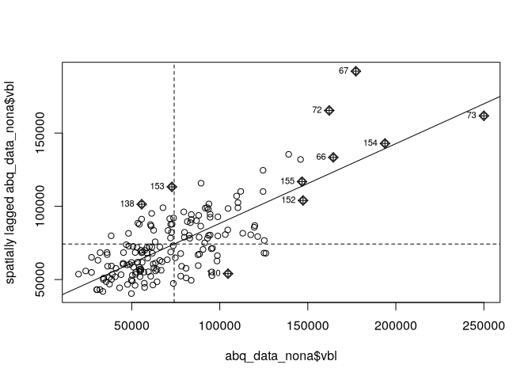

``` r
lmoran <- localmoran(abq_data_nona$vbl, nbw, alternative = "greater")
head(lmoran)
```

                Ii          E.Ii       Var.Ii       Z.Ii Pr(z > E(Ii))
    1  0.012554818 -3.353600e-04 1.424508e-02  0.1080007    0.45699758
    2  0.105027109 -1.511568e-04 3.604109e-03  1.7519716    0.03988935
    3  0.326209527 -2.106733e-03 5.013367e-02  1.4663162    0.07128109
    4  0.171580678 -4.801753e-04 2.039344e-02  1.2048606    0.11412856
    5  0.258447585 -4.676453e-03 1.302830e-01  0.7289818    0.23300640
    6 -0.005401055 -6.072014e-07 3.460572e-05 -0.9180277    0.82069783

``` r
abq_data_nona$lmI <- lmoran[, "Ii"] # local Moran's I
abq_data_nona$lmZ <- lmoran[, "Z.Ii"] # z-scores
abq_data_nona$lmp <- lmoran[, "Pr(z > E(Ii))"]
```

``` r
make_quantiles <- function(var) {
  classIntervals(var, 5, style = "quantile")
}

quantile_breaks <- make_quantiles(abq_data_nona$Income.Med)
br_quantile <- classIntervals(
  abq_data_nona$Income.Med, 5,
  style = "quantile"
)
abq_data_nona$Income.Med_q <- cut(
  abq_data_nona$Income.Med, br_quantile$brks,
  include.lowest = TRUE, dig.lab = 10
)
pal <- colorRampPalette(c("darkred", "darkgreen", "navy"))(length(br_quantile$brks))
ggplot(abq_data_nona) +
  geom_sf(aes(fill = Income.Med_q)) +
  scale_fill_viridis_d() +
  labs(fill = "Median Income") +
  theme_void()
```

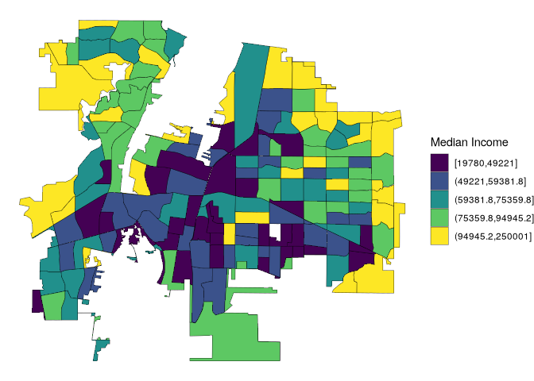

``` r
library(tmap)

p1 <- tm_shape(abq_data_nona) +
  tm_polygons(col = "vbl", title = "vbl", style = "quantile") +
  tm_layout(legend.outside = TRUE)
```

    ── tmap v3 code detected ───────────────────────────────────────────────────────

    [v3->v4] `tm_polygons()`: instead of `style = "quantile"`, use fill.scale =
    `tm_scale_intervals()`.
    ℹ Migrate the argument(s) 'style' to 'tm_scale_intervals(<HERE>)'
    [v3->v4] `tm_polygons()`: use 'fill' for the fill color of polygons/symbols
    (instead of 'col'), and 'col' for the outlines (instead of 'border.col').
    [v3->v4] `tm_polygons()`: migrate the argument(s) related to the legend of the
    map variable `fill` namely 'title' to 'fill.legend = tm_legend(<HERE>)'

``` r
p2 <- tm_shape(abq_data_nona) +
  tm_polygons(col = "lmI", title = "Local Moran's I",
              style = "quantile") +
  tm_layout(legend.outside = TRUE)
```

    [v3->v4] `tm_polygons()`: migrate the argument(s) related to the legend of the
    map variable `fill` namely 'title' to 'fill.legend = tm_legend(<HERE>)'

``` r
p3 <- tm_shape(abq_data_nona) +
  tm_polygons(col = "lmZ", title = "Z-score",
              breaks = c(-Inf, 1.65, Inf)) +
  tm_layout(legend.outside = TRUE)
```

    [v3->v4] `tm_tm_polygons()`: migrate the argument(s) related to the scale of
    the map variable `fill` namely 'breaks' to fill.scale = tm_scale(<HERE>).
    [v3->v4] `tm_polygons()`: migrate the argument(s) related to the legend of the
    map variable `fill` namely 'title' to 'fill.legend = tm_legend(<HERE>)'

``` r
p4 <- tm_shape(abq_data_nona) +
  tm_polygons(col = "lmp", title = "p-value",
              breaks = c(-Inf, 0.05, Inf)) +
  tm_layout(legend.outside = TRUE)
```

    [v3->v4] `tm_polygons()`: migrate the argument(s) related to the legend of the
    map variable `fill` namely 'title' to 'fill.legend = tm_legend(<HERE>)'

``` r
tmap_arrange(p1, p2, p3, p4)
```

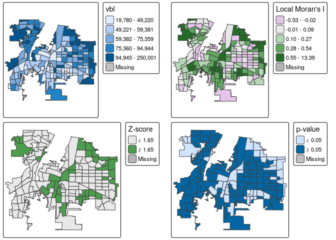

``` r
tmap5 <- tm_shape(abq_data_nona) + 
  tm_polygons(col = "lmZ",
              title = "Local Moran's I", 
              style = "fixed",
              breaks = c(-Inf, -1.96, 1.96, Inf),
              labels = c("Negative SAC", "No SAC", "Positive SAC"),
              palette =  c("blue", "white", "red")) +
  tm_layout(legend.outside = TRUE)
```

    ── tmap v3 code detected ───────────────────────────────────────────────────────

    [v3->v4] `tm_polygons()`: instead of `style = "fixed"`, use fill.scale =
    `tm_scale_intervals()`.
    ℹ Migrate the argument(s) 'style', 'breaks', 'palette' (rename to 'values'),
      'labels' to 'tm_scale_intervals(<HERE>)'
    [v3->v4] `tm_polygons()`: migrate the argument(s) related to the legend of the
    map variable `fill` namely 'title' to 'fill.legend = tm_legend(<HERE>)'

``` r
tmap5
```

    Multiple palettes called "blue" found: "kovesi.blue", "tableau.blue". The first one, "kovesi.blue", is returned.

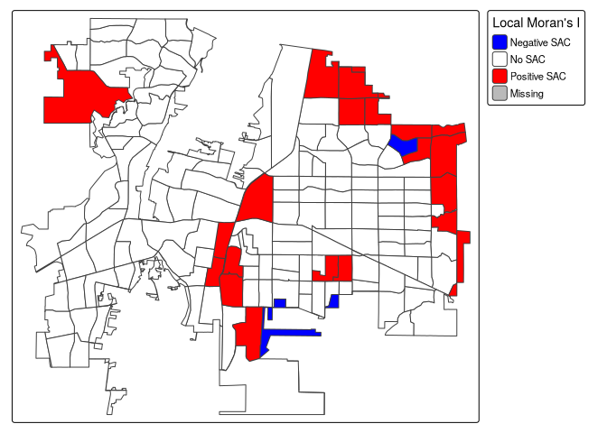

## Clusters

``` r
lmoran <- localmoran(abq_data_nona$vbl, nbw, alternative = "two.sided")
head(lmoran)
```

                Ii          E.Ii       Var.Ii       Z.Ii Pr(z != E(Ii))
    1  0.012554818 -3.353600e-04 1.424508e-02  0.1080007      0.9139952
    2  0.105027109 -1.511568e-04 3.604109e-03  1.7519716      0.0797787
    3  0.326209527 -2.106733e-03 5.013367e-02  1.4663162      0.1425622
    4  0.171580678 -4.801753e-04 2.039344e-02  1.2048606      0.2282571
    5  0.258447585 -4.676453e-03 1.302830e-01  0.7289818      0.4660128
    6 -0.005401055 -6.072014e-07 3.460572e-05 -0.9180277      0.3586043

``` r
abq_data_nona$lmp <- lmoran[, 5]
mp <- moran.plot(as.vector(scale(abq_data_nona$vbl)), nbw)
```

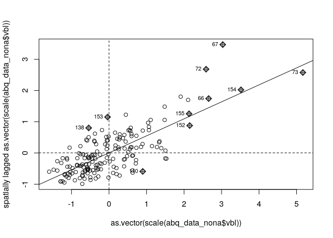

``` r
abq_data_nona$quadrant <- NA
abq_data_nona[(mp$x >= 0 & mp$wx >= 0) & (abq_data_nona$lmp <= 0.05), "quadrant"] <- 1
abq_data_nona[(mp$x <= 0 & mp$wx <= 0) & (abq_data_nona$lmp <= 0.05), "quadrant"] <- 2
abq_data_nona[(mp$x >= 0 & mp$wx <= 0) & (abq_data_nona$lmp <= 0.05), "quadrant"] <- 3
abq_data_nona[(mp$x <= 0 & mp$wx >= 0) & (abq_data_nona$lmp <= 0.05), "quadrant"] <- 4
abq_data_nona[(abq_data_nona$lmp > 0.05), "quadrant"] <- 5
```

``` r
tm_shape(abq_data_nona) +
  tm_fill(
    col = "quadrant", title = "",
    breaks = c(1, 2, 3, 4, 5, 6),
    palette = c("red", "blue", "lightpink", "skyblue2", "white"),
    labels = c(
      "High-High", "Low-Low", "High-Low",
      "Low-High", "Non-significant"
    )
  ) +
  tm_legend(text.size = 1) + tm_borders(alpha = 0.5) +
  tm_layout(frame = FALSE, title = "Clusters") +
  tm_layout(legend.outside = TRUE)
```

    ── tmap v3 code detected ───────────────────────────────────────────────────────

    [v3->v4] `tm_tm_polygons()`: migrate the argument(s) related to the scale of
    the map variable `fill` namely 'breaks', 'palette' (rename to 'values'),
    'labels' to fill.scale = tm_scale(<HERE>).
    [v3->v4] `tm_polygons()`: migrate the argument(s) related to the legend of the
    map variable `fill` namely 'title' to 'fill.legend = tm_legend(<HERE>)'
    [v3->v4] `tm_borders()`: use `fill_alpha` instead of `alpha`.
    [v3->v4] `tm_layout()`: use `tm_title()` instead of `tm_layout(title = )`
    [v3->v4] `tm_legend()`: use 'tm_legend()' inside a layer function, e.g.
    'tm_polygons(..., fill.legend = tm_legend())'

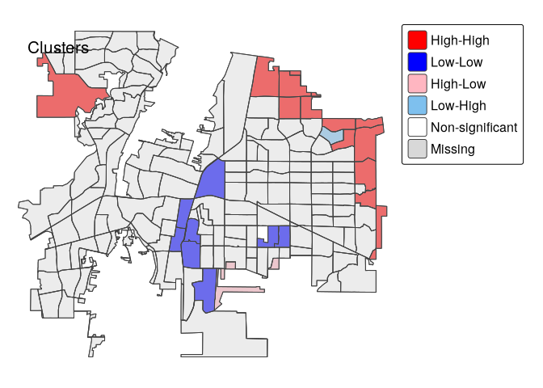

# Save data

``` r
data_sets <- c(
  "dist_data", "bern_data", "abq_data", "abq_data_elf"
)

walk2(
  map(data_sets, \(x) get(x)),
  data_sets,
  \(df, level) st_write(df, "data/district_variance.gpkg",
    layer = level, append = F
  )
)
```

    Deleting layer `dist_data' using driver `GPKG'
    Writing layer `dist_data' to data source 
      `data/district_variance.gpkg' using driver `GPKG'
    Writing 228 features with 16 fields and geometry type Unknown (any).
    Deleting layer `bern_data' using driver `GPKG'
    Writing layer `bern_data' to data source 
      `data/district_variance.gpkg' using driver `GPKG'
    Writing 173 features with 13 fields and geometry type Multi Polygon.
    Deleting layer `abq_data' using driver `GPKG'
    Writing layer `abq_data' to data source 
      `data/district_variance.gpkg' using driver `GPKG'
    Writing 173 features with 12 fields and geometry type Unknown (any).
    Deleting layer `abq_data_elf' using driver `GPKG'
    Writing layer `abq_data_elf' to data source 
      `data/district_variance.gpkg' using driver `GPKG'
    Writing 173 features with 21 fields and geometry type Unknown (any).
