# Demographic and Economic Variance in Albuquerque Pt 2


# Introduction

This is the second part of a short series began
[here](https://biscotty.net/posts/data-science/r-census/abq-demographics-wrangling-collapse/),
which looks at demographic and economic variances between city council
districts in Albuquerque, New Mexico.[^1] In the first part, I created a
data set of demographic and economic information obtained from the [US
Census Bureau](http://census.gov), and, after cleaning, split the data
between Albuquerque’s city council districts and engineered variables
appropriate for the analysis. In this part, I would like to explore
these variables before doing the actual analysis of variance testing
between the districts, which will be the subject of the next article.

This exploration will involve mapping the variables, to see how they are
distributed geographically. By overlaying the council districts on the
map, one can already get a good sense of the variance between districts.
I will also visualize variable distribution and correlation with
standard plots.

The larger part of the article will deal with *spatial autocorrelation*
[(SA)](https://en.wikipedia.org/wiki/Spatial_analysis#Spatial_auto-correlation).
I will compare three common measures of SA, as well as various ways to
define neighborhoods. Again, by overlaying the results with the
districts, insights can be gained into the peculiarities of the
different districts.

To begin, I’ll load libraries, constants and functions, as well as the
data from last time.

``` r
options(paged.print = FALSE,
        tigris_use_cache = TRUE)
libraries <- list(
  "sf", "collapse", "ggplot2", "magrittr", "dplyr",
  "zeallot", "patchwork", "spdep", "sfdep"
)
invisible(lapply(libraries, library, character.only = TRUE))

glue <- glue::glue
map <- purrr::map
map2 <- purrr::map2
ggqqplot <- ggpubr::ggqqplot
classIntervals <- classInt::classIntervals
str_replace_all <- stringr::str_replace_all
annotation_map_tile <- ggspatial::annotation_map_tile
ggpairs <- GGally::ggpairs
melt <- reshape2::melt
tidy <- broom::tidy
unnest <- tidyr::unnest
rownames_to_column <- tibble::rowid_to_column
gt <- gt::gt

year <- 2024
crs <- 6528
caption <- glue("Source: census.gov, acs5, {year}")

abq_data <- st_read("data/district_variance.gpkg", layer = "abq_data")
council_dists <- st_read("data/district_variance.gpkg", 
                         layer = "council_dists")
```

Before going further, I want to split the data from the geometries, so I
can work with a simpler object for data processing. I’ll preserve the
geometries so I can recreate the `sf` object when I want to do mapping
or spatial autocorrelation. Additionally, the geometries are all that is
needed for many spatial functions. `st_drop_geometry` returns a `tibble`
which, while convenient for many things, carries unneeded extra
overhead, so I will use the fast `qDF` to convert to a simple data
frame. As you may recall, `gv` is short for `get_vars`, a fast function
from `collapse`.

``` r
abq_data_geom <- st_geometry(abq_data)
districts <- abq_data %>% st_drop_geometry %>% gv(1)
abq_data %<>% gv(-1) %>% st_drop_geometry %>% qDF
to_sf <- function(df, geometry = abq_data_geom) {
  st_sf(df, geometry = geometry)}
```

# Visualization

## Maps

I will begin by simply mapping the variables. They are all continuous,
but I would like to map the data in quantiles. This is convenient with
`tmap`, and one of the few areas where `ggplot` makes life a bit
difficult, since the cuts must be manually generated prior to plotting.
Never-the-less, I will use `ggplot`. First, I’ll create a base plot.

``` r
base_plot <- ggplot(council_dists) +
  annotation_map_tile(type = "osm", zoomin = -1, 
                      cachedir = "~/.cache/maps/") +
  geom_sf(color = "black", linewidth = 0.8) +
  geom_sf_label(aes(label = district), 
                fill = "#A0A050", fontface = "bold") +
  labs(caption = caption) + theme_void()
```

The `classInt` package can identify the break points, which I will use
to `cut` the data. `num_vars` is a useful function from `collapse` that
efficiently selects the numeric variables from a data frame, or any
similar object. The `return` argument makes it flexible. In this case,
rather than grabbing the actual data, I’m just grabbing the variable
names.

``` r
var_names <- num_vars(abq_data, return = "names")

make_cuts <- function(var) {
  quantiles <- classIntervals(var, 5, style = "quantile")
  cut(var, quantiles$brks, 
      ordered_result = T, include.lowest = TRUE, dig.lab = 6)}

cuts <- map(var_names, \(x) make_cuts(abq_data[[x]]))
```

Now I will make the function to build the maps.

``` r
quantile_map <- function(cut, lab) {
  base_plot +
    geom_sf(data = to_sf(abq_data), aes(fill = cut), alpha = 0.5) +
    scale_fill_viridis_d() + labs(fill = lab) + theme_void()}
```

And, finally, I will generate the maps with `map2()`, saving each plot
with `zeallot`’s assignment operator `%<-%`, after which I can review
all or select plots.

``` r
c(
  pHouse.Value.Med, pGini, pRent.Med, pAge.Med, pIncome.Med, 
  pForeign.Born.Pct, pHisp.Pct, pCollege.Pct, pPopulation.Density, 
  pVacant.Pct, pRenter.Occupied.Pct, pHousing.Density
) %<-% 
  map2(cuts, var_names, \(cut, lab) quantile_map(cut, lab))
```

``` r
pHouse.Value.Med + pIncome.Med + plot_annotation(title = "Albuquerque, NM")
```

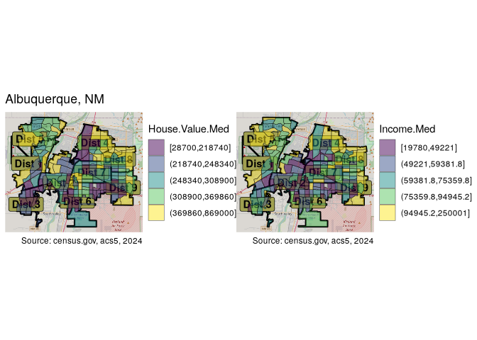

Housing values seem to be highest in the east, northeast and west, as
well as in the North Valley near the Rio Grande. District 8 in
particular seems to have the most high value tracts. District 4 and
District 9, while having some of the highest income tracts, also contain
some of the lowest, in many cases adjacent to each other. Income levels
follow a similar pattern, although seemingly less extreme in many areas.
Some of the highest housing prices in District 8 are not associated with
the highest income, while the fourth district has somewhat lower housing
prices but higher income levels. The patches of high income in the
central areas are those around the University of New Mexico. This
“aberration” will be evident when looking at education levels as well.

``` r
pHisp.Pct + pCollege.Pct + plot_annotation(title = "Albuquerque, NM")
```

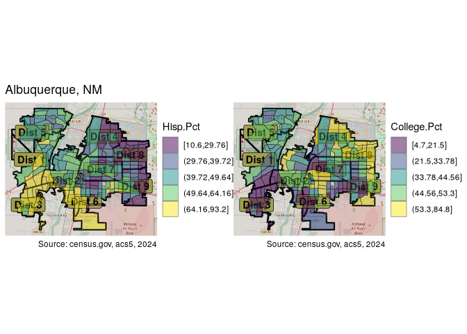

The percentage of Hispanics is highest in the southwest of the city,
especially in the third district, and decreasing northward and, much
more significantly, eastward. It is in many cases the mirror image of
the percentage of college graduates who are most represented in the
north-east (eigth district in particular), as well as in the areas
around the university. District 3 has the lowest concentration of
college graduates.

## Plots

For visualizing variable distribution, I will construct a series of
histograms and quantile-quantile plots. Note the `.data[[var]]` syntax
in the plotting function, which is necessary to pass variables to
`aes()` when using `ggplot` *within* a function.

``` r
plot_hist <- function(df, var) {
  df %>%
    ggplot(aes(.data[[var]])) +
    geom_histogram(aes(y = after_stat(density)),
                   fill = "lightgray", col = "black", bins = 20) +
    geom_line(stat = "density", adjust = 2, color = "blue") +
    labs(caption = "")}
hists <- map(var_names, \(x) abq_data %>% plot_hist(x))
qqs <- map(var_names, \(x) ggqqplot(abq_data[[x]]))
c(
  pHouse.Value.Med, pGini, pRent.Med, pAge.Med, pIncome.Med, 
  pForeign.Born.Pct, pHisp.Pct, pCollege.Pct, pPopulation.Density,
  pVacant.Pct, pRenter.Occupied.Pct, pHousing.Density
) %<-% map(seq_len(length(hists)), 
           \(x) hists[[x]] + qqs[[x]])
```

Here I will display just a few of the variables.

``` r
annotate <- plot_annotation(title = "Variable Distribution", 
                             caption = caption)
pHouse.Value.Med - pIncome.Med + annotate
```

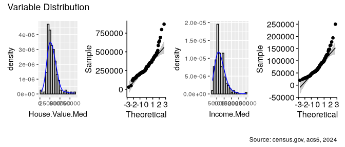

``` r
pHisp.Pct - pGini + annotate
```

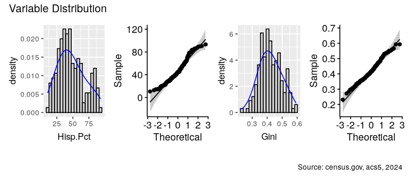

The data is clearly not, for the most part, normally distributed. This
will pose challenges to analysis of variance testing later on, and will
certainly require appropriate transformations.

# Correlation

Next, let’s look at the correlation between variables.

``` r
ggpairs(num_vars(abq_data)) + theme_gray(base_size = 8)
```

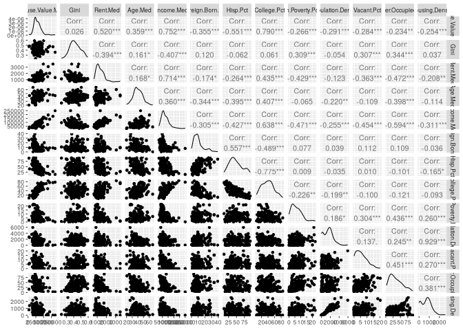

``` r
cor(num_vars(abq_data)) %>% melt %>% ggplot() +
  geom_tile(aes(x = Var1, y = Var2, fill = value)) +
  labs(title = "Correlation Heatmap", x = "Variable 1", y = "Variable 2") +
  scale_fill_distiller(palette = "RdBu", direction = 1) +
  theme(axis.text.x = element_text(angle = 45, hjust = 1)) +
  labs(x = NULL, y = NULL, fill = "Corr", caption = caption)
```

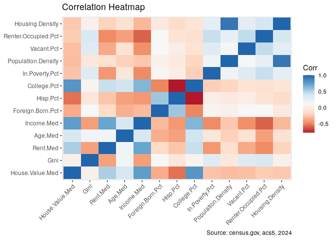

It is not surprising that many variables are correlated, some quite
highly. For example housing density and population density. These are so
strongly and logically correlated, that I will go ahead and drop one.

``` r
settransform(abq_data, Housing.Density = NULL)
```

`settransform` modifies the dataset by refererence, and is the
equivalent of `data <- data %>% transform`.

Housing values are correlated with income levels, and even more strongly
with percentage of college graduates. On the other hand, they show a
pretty strong negative correlation with the percentage of Hispanics.

As anticipated, a strong negative correlation between areas with high
percentage of Hispanics and those with high percentage of college grads
jumps out in the heatmap.

Economic inequality is most evident in areas with a high percentage of
rentals, vacancies and lower rent prices. Areas with higher incomes and
lower poverty levels have less economic inequality. Neighborhoods with
higher incomes have less rental properties.

In data in which so many variables appear correlated, it is interesting
to note those which are not. For example, inequality does not seem to be
related to any of the demographic variables, only the economic
indicators. Inequality seems not to care about age, race, or where one
is from.

# Spatial autocorrelation

We are influenced by our neighbors, and birds of a feather flock
together, as they say. Or, more canonically, “everything is related to
everything else, but near things are more related than distant
things.”[^2] As a result, geographically-related variables lose a degree
of independence, something typically assumed in regression modeling.
Spatial autocorrelation (SA) is based on this idea, and allows us to
recognize to what degree variables exhibit spatial dependence.

Three commonly used methods to analyze SA are [Moran’s
$I$](https://en.wikipedia.org/wiki/Moran's_I) , the [Getis-Ord Statistic
$G^*_i$](https://en.wikipedia.org/wiki/Getis%E2%80%93Ord_statistics),
and [Geary’s $C$](https://en.wikipedia.org/wiki/Geary's_C). Each has
both a global and local version, and take somewhat different approaches.
The global version asserts the existence or not of SA, while the local
version allows for drilling down geographically and mapping areas of
particular interest.

Getis-Ord [^3] is the simplest. It compares weighted values of
neighboring tracts to a target tract, identifying where high values (hot
spots) or low values (cold spots), are clustered together. Moran’s $I$
[^4] is the more commonly used test. It compares a tract’s value to the
overall mean, and the neighbors’ values to the overall mean, which may
by negative or positive in either instance. Tracts with large
differences from the mean surrounded by neighbors with large differences
from the mean, are identified. With Moran’s, not only are hot spots and
cold spots identified, but also areas where particularly low values are
surrounded by high values, and vice versa (Low-High and High-Low).
Geary’s $C$[^5] is similar, but compares neighboring weighted values
directly to each other, rather than in reference to global means, and is
considered more sensitive to local SA.

## Neighbors and weights

The first step in SA is to define the neighbors. These can be chosen in
a number of ways, such as a specified maximum distance between regions,
or some arbitrary number of “closest” areas. One common way to define
neighbors is based on contiguity. Contiguous regions can be regions
which share just a single boundary point, or can require multiple shared
points and/or a shared border. The former is described as a “queen”
relationship, the latter as a “rook” relationship. (In chess, the rook
can only move vertically or horizontally, while the queen can also move
diagonally.)

Here I’ll define the neighbors as queen-contiguous. I will first use
functions from the `spdep` package, which is the most commonly used.
Later I will use the `sfdep` package, which provides wrappers to many
`spdep` functions as well as new functions for spatial analysis, and is
somewhat easier to work with and integrate into a workflow.

``` r
(nb <- poly2nb(abq_data_geom, queen = T, snap = 20))
```

    Neighbour list object:
    Number of regions: 173 
    Number of nonzero links: 1060 
    Percentage nonzero weights: 3.541715 
    Average number of links: 6.127168 

The `ploy2nb` function defaults to queen, so adding it here is
redundant. The `snap` argument allows for some flexibility in distance
in specifying contiguous regions.

Once the neighbors are defined, a weights list must by generated. There
are a number of options here. A binary list simply contains ones and
zeros, depending on whether and area is contiguous or not. The binary
style is preferred with $G^*$. On the other hand, a weighted list uses
an average of neighborhood values. The `style` argument is used to
specify the type of list desired.

``` r
nbw <- nb2listw(nb, style = "W")
summary(nbw)
```

    Characteristics of weights list object:
    Neighbour list object:
    Number of regions: 173 
    Number of nonzero links: 1060 
    Percentage nonzero weights: 3.541715 
    Average number of links: 6.127168 
    Link number distribution:

     1  2  3  4  5  6  7  8  9 10 11 12 
     2  4 13 14 30 38 33 21  9  3  5  1 
    2 least connected regions:
    17 46 with 1 link
    1 most connected region:
    59 with 12 links

    Weights style: W 
    Weights constants summary:
        n    nn  S0       S1       S2
    W 173 29929 173 62.94904 709.7061

## Global Spatial Autocorrelation

The various tests are easily performed. I’ll start with Moran’s.

``` r
map(num_vars(abq_data), 
    \(x) moran.test(x, nbw, alternative = "two.sided") %>% tidy) %>% 
    unlist2d %>% gv(c(".id", "statistic", "p.value")) %>% roworder(-statistic)
```

                       .id statistic      p.value
    1             Hisp.Pct 16.739880 6.712362e-63
    2          College.Pct 13.812201 2.151555e-43
    3           Income.Med 12.047456 2.000280e-33
    4      House.Value.Med 11.855612 2.012492e-32
    5           Vacant.Pct  9.817289 9.486009e-23
    6     Foreign.Born.Pct  9.546429 1.342433e-21
    7             Rent.Med  9.510854 1.891029e-21
    8  Renter.Occupied.Pct  7.934497 2.113500e-15
    9              Age.Med  7.235345 4.643485e-13
    10                Gini  5.687051 1.292518e-08
    11  Population.Density  5.513270 3.522264e-08
    12      In.Poverty.Pct  4.543862 5.523270e-06

The p-values suggest SA present in all variables. The statistic suggests
that SA is most strongly exhibited in the demographic variables. Housing
values and income levels also show SA. Interestingly the lowest levels
of SA are found in the Gini and poverty variables, suggesting that these
phenomena are more evenly (randomly) spread throughout all areas.

For the sake of brevity, I’m going to restrict the rest of these
analyses to housing and income, race and education, and Gini values. I
will also use the `sfdep` package for the rest of the testing.

``` r
abq_data %<>% 
  gv(c("House.Value.Med", "Income.Med", "Gini", "Hisp.Pct", "College.Pct"))
var_names <- num_vars(abq_data, return = "names")
var_vals <- num_vars(abq_data)

nb <- st_contiguity(abq_data_geom, snap = 20)
wt <- st_weights(nb)
map(var_vals, \(x) global_c_test(x, nb, wt) %>% tidy) %>%
  unlist2d %>% gv(c(".id", "statistic", "p.value")) %>% 
  fmutate(.id = var_names) %>% roworder(-statistic)
```

                  .id statistic      p.value
    1        Hisp.Pct 15.864025 5.622551e-57
    2     College.Pct 13.288318 1.352956e-40
    3      Income.Med 10.738567 3.353883e-27
    4 House.Value.Med 10.275378 4.549348e-25
    5            Gini  5.067448 2.015922e-07

While the actual values differ, the relative similarity is evident. For
completeness, I’ll also run the Getis-Ord test. This takes two forms
$G_i$ and $G^*_i$. The second, more commonly used, requires that each
tract be considered a neighbor of itself. Fortunately, `sfdep` makes
this type of inclusion easy. Getis-Ord also prefers binary weights.

``` r
nb_gi <- include_self(st_contiguity(abq_data_geom, snap = 25))
wt_gi = st_weights(nb_gi, style = "B")
map(var_vals, \(x) global_g_test(x, nb_gi, wt_gi) %>% tidy) %>%
  unlist2d %>% gv(c(".id", "statistic", "p.value")) %>% 
  fmutate(.id = var_names) %>% roworder(-statistic)
```

                  .id statistic      p.value
    1     College.Pct  6.139547 4.137845e-10
    2        Hisp.Pct  4.912567 4.494581e-07
    3            Gini  3.014546 1.286823e-03
    4      Income.Med  2.794840 2.596269e-03
    5 House.Value.Med  2.635447 4.201324e-03

While $G^*_i$ shows SA for all four variables, the relative values of
the statistic vary considerably from the other tests.

As mentioned, there are other ways to define neighbors, aside from
contiguity. Another common one is $k$-nearest neighbors, which identify
an arbitrary number of closest areas. I will run Geary’s test using 5
nearest neighbors. To determine distances, the POLYGON geometries need
to be changed to POINTs, using `st_centroid`.

``` r
nb_k5 <- st_knn(st_centroid(abq_data_geom), k = 5)
wt_k5 <- st_weights(nb_k5)
map(var_vals, \(x) global_c_test(x, nb_k5, wt_k5) %>% tidy) %>%
  unlist2d %>% gv(c(".id", "statistic", "p.value")) %>% 
  fmutate(.id = var_names) %>% roworder(-statistic)
```

                  .id statistic      p.value
    1        Hisp.Pct 16.204634 2.338313e-59
    2     College.Pct 13.919806 2.401025e-44
    3      Income.Med 10.382504 1.489298e-25
    4 House.Value.Med 10.154466 1.582688e-24
    5            Gini  6.066581 6.533091e-10

For all intents and purposes, the results are the same as with
contiguity.

One way to visualize the degree of spatial autocorrelation is with
`moran.plot`, which produces spatially lagged plots of a variable.

``` r
par(mfrow = c(2, 2))
mplots <- map2(var_vals[-5], var_names[-5], 
               \(x, y) moran.plot(x, nbw, xlab = y))
```

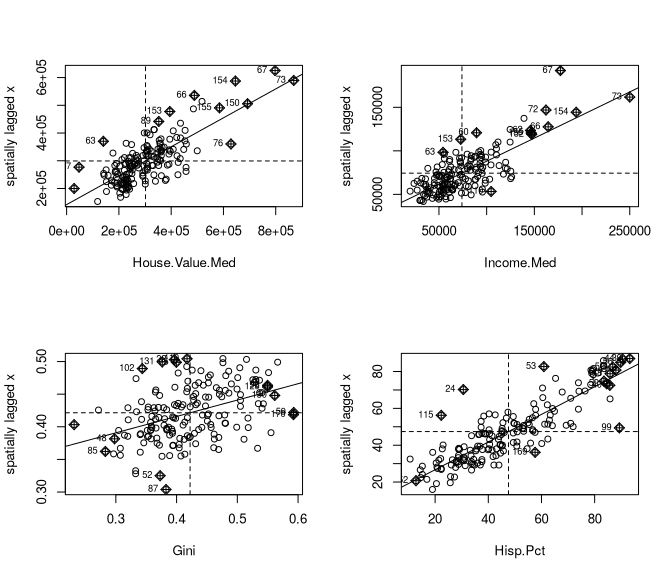

The spatial lag plots show spatial autocorrelation of the variables, as
they are generally gathered near the mean line. The lower left quadrant
contains tracts with low values clustered with other low values
(low-low), while the upper right quadrant contains observations with
spatially autocorrelated high values (high-high). Later we will
visualize these areas on a map. The Hispanic percentage variable has a
high statistic value, and the plot shows most observations tightly
grouped along the diagonal. Gini, on the other hand, has a relatively
low value, and the graph displays how much wider spread the lagged
observations are.

## Local Indicators of Spatial Autocorrelation (LISA)

While useful, these global tests are somewhat unsatisfying. Just like
the post-hoc tests are more interesting than the ANOVA results
themselves, the local versions of these tests are more informative and
revealing of the underlying structure. Local tests allow us to identify
*where* the most significant correlations are, where similar values are
clustered. These can be mapped. As we will see, the three different
tests will produce somewhat different results, some identifying
significant regions which the others do not. It is important to remember
that these tests constitute exploratory data analysis, discovering areas
of interest, which should be further explored.

I’ll begin by using the `local_moran` function from `sfdep`, converting
the results to a matrix for faster processing. I’ll also write a
function to draw the maps.

``` r
lmorans <- map(var_vals, \(x) local_moran(x, nb, wt) %>% qM)

moran_map <- function(cut) {
  base_plot +
    geom_sf(data = to_sf(abq_data), aes(fill = cut), 
            alpha = 0.5, show.legend = T) +
    geom_sf_text(data = council_dists, aes(label = district)) +
    theme_void()
}
```

I will create one map which shows which areas show positive, negative,
or lack of SA. A second map will show in which regions the correlation
values are statistically significant. Because the data is in matrix
form, I can use the `ss` function, which is even faster than the already
fast `fselect` used on data frames.

``` r
mmaps <- map(seq_len(length(var_names)), \(x) {
    p1 <- moran_map(
      cut(ss(lmorans[[x]], ,"z_ii"), c(-Inf, -1.96, 1.96, Inf))) +
      scale_fill_discrete(
        "Local Moran's I",
        palette = c("red", "white", "blue"),
        labels = c("Negative SA", "No SA", "Positive SA"), drop = FALSE) +
      labs(title = "", caption = "")
    p2 <- moran_map(
      cut(ss(lmorans[[x]], ,"p_folded_sim"), c(-Inf, 0.05, Inf))) +
      scale_fill_discrete(
        "p-value", palette = c("orange", "white"), 
        labels = c("< 0.05", ">= 0.05"))
    list(p1, p2)
  })

map2(mmaps[c(1,4)], var_names[c(1,4)], \(x, y) {
  c(p1, p2) %<-% x
  wrap_plots(p1, p2) + plot_annotation(
    title = glue("Spatial Autocorrelation - {y}"))})
```

    [[1]]

    Zoom: 11
    Zoom: 11

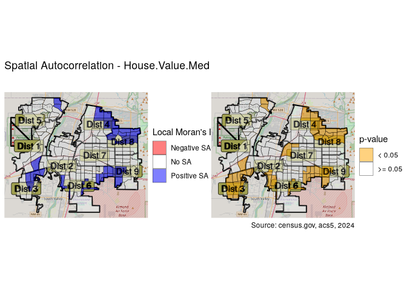


    [[2]]

    Zoom: 11
    Zoom: 11

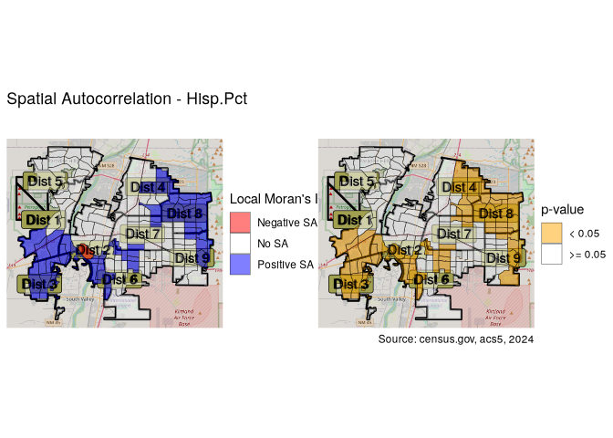

Most of the areas showing positive (or negative) SA also have p-values
showing statistical significance. On the other hand, the statistical
significance of the “No SA” designation only holds for a minority of
these tracts.

Going down one further level, we can map the nature of the SA,
identifying whether they represent clusters of high values or low
values. We can also map the “high-high” and “low-low” observations we
saw earlier in the upper right and lower left of the Moran plots we made
earlier.

Now I’ll create the mapping function. Note that I’m using
`scale_fill_discrete`, which will misbehave in the case that some of the
factor levels have no data. For it to work, it is not enough to add
`drop=FALSE` as an argument to the scale function, but the associated
`geom_sf` function must specify `show.legend=TRUE`.

First I will run local moran tests for each variable. The `sfdep`
version of the test returns a p-value as well as the quadrant
description in the `pysal` variable.

``` r
lm_lisas <- map(var_names, \(x) {
    abq_data %>% to_sf %>% 
      mutate(
        moran = local_moran(abq_data[[x]], nb, wt),
      ) %>% unnest(moran) %>%
      fmutate(quadrant = factor(
        ifelse(p_folded_sim <= 0.05, as.character(pysal), "Not Significant"),
        levels = c("High-High", "High-Low", "Low-High",
                   "Low-Low", "Not Significant")))})
```

Now I’ll create the mapping function. Note that I’m using
`scale_fill_discrete`, which will misbehave in the case that some of the
factor levels have no data. For it to work, it is not enough to add
`drop=FALSE` as an argument to the scale function, but the associated
`geom_sf` function must specify `show.legend=TRUE`.

``` r
lm_plots <- map(
  lm_lisas, \(x) base_plot +
    geom_sf(data = x, aes(fill = quadrant), alpha = 0.4, show.legend = T) +
    scale_fill_manual("Local Moran",
      values = c("blue", "skyblue", "salmon", "#BB112A", "#FFF"),
      drop = F
    ) +
    labs(caption = ""))
```

While the `local_moran` function returns p-values, for Getis-Ord and
Geary’s C, I need to use the `_perm` version of the relevant function.
This version runs a Monte Carlo simulation, which is necessary to
generate p-values, and requires a number of simulations argument.

``` r
gi_plots <- map(var_names, \(x) {
    lisa <- abq_data %>% to_sf %>% 
      transmute(
        gs = local_gstar_perm(abq_data[[x]], nb_gi, wt_gi, nsim = 199)) %>%
      unnest(gs) %>%
      fcompute(cluster = case_when(
        p_folded_sim > 0.05 ~ "Not Significant",
        gi_star < 0 ~ "Low",
        gi_star > 0 ~ "High"
      ))
    base_plot +
      geom_sf(data = lisa, aes(fill = cluster), 
              alpha = 0.4, show.legend = T) +
      scale_fill_manual("GI*", values = c(
        "High" = "blue", "Low" = "red", "Not Significant" = "white"
      )) + labs(title = "", caption = "")})
```

``` r
lg_lisas <- map(var_names, \(x) abq_data %>% to_sf %>%
     transmute(local_c = local_c_perm(abq_data[[x]], nb, wt, nsim = 199)) %>%
      unnest(local_c) %>%
      mutate(cluster = factor(
        ifelse(p_folded_sim <= 0.05, as.character(cluster), "Not Significant"),
        levels = c("High-High", "Low-Low", "Negative",
                   "Other Positive", "Not Significant"))))

lg_plots <- map(lg_lisas, \(x) 
                  base_plot +
      geom_sf(data = x, aes(fill = cluster),
              alpha = 0.4, show.legend = T) +
      scale_fill_discrete("Local Geary's C", 
        palette = c("blue", "red", "green", "orange", "#FFF"), 
        drop = F) + labs(title = ""))
     
lg_plots <- map(var_names, \(x) {
  lisa <- abq_data %>% to_sf %>% 
     transmute(local_c = local_c_perm(abq_data[[x]], nb, wt, nsim = 199)) %>%
      unnest(local_c) %>%
      mutate(cluster = factor(
        ifelse(p_folded_sim <= 0.05, as.character(cluster), "Not Significant"),
        levels = c("High-High", "Low-Low", "Negative",
                   "Other Positive", "Not Significant")))
  base_plot +
      geom_sf(data = lisa, aes(fill = cluster),
              alpha = 0.4, show.legend = T) +
      scale_fill_discrete("Local Geary's C", 
        palette = c("blue", "red", "green", "orange", "#FFF"), 
        drop = F) + labs(title = "")})
```

``` r
cuts <- map(var_names, \(x) make_cuts(abq_data[[x]]))
vmaps <- map2(cuts, var_names, \(cut, lab) quantile_map(cut, lab))
```

``` r
compare_lisa <- map2(seq_len(length(lm_plots)), var_names,
    \(x, y) vmaps[[x]] + lm_plots[[x]] + gi_plots[[x]] + lg_plots[[x]] +
      plot_layout(nrow = 2) + 
      plot_annotation(title = glue("Albuquerque, NM - {y} - SA")))
```

``` r
compare_lisa[[1]]
```

    Zoom: 11
    Zoom: 11
    Zoom: 11
    Zoom: 11

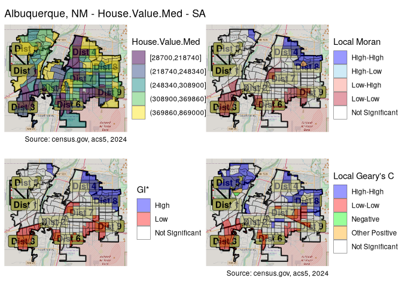

All three have the same basic outlines, with high values clustered in
the northeast and low values clustered in the south and southwest. Moran
and GI are very similar, while Geary’s identifies quite a few more
areas.

``` r
compare_lisa[[4]]
```

    Zoom: 11
    Zoom: 11
    Zoom: 11
    Zoom: 11

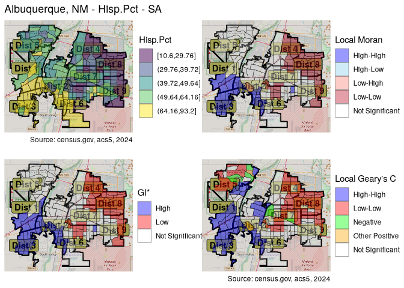

All three methods expose a high degree of local clustering along racial
lines. In fact, Geary’s C shows that such clustering is prominent
throughout the city, not only the NE-SW divide identified by the others.

``` r
lg_tables <- 
  map(lg_lisas, \(x) st_drop_geometry(x) %>% gv("cluster") %>% 
        add_vars(districts) %>% table %>% t)
names(lg_tables) <- var_names
table_gt <- function(table) table %>% qDF %>% rownames_to_column("district") %>% gt
table_gt(lg_tables$Hisp.Pct)
```

<div id="fsiczyycdc" style="padding-left:0px;padding-right:0px;padding-top:10px;padding-bottom:10px;overflow-x:auto;overflow-y:auto;width:auto;height:auto;">
<style>#fsiczyycdc table {
  font-family: system-ui, 'Segoe UI', Roboto, Helvetica, Arial, sans-serif, 'Apple Color Emoji', 'Segoe UI Emoji', 'Segoe UI Symbol', 'Noto Color Emoji';
  -webkit-font-smoothing: antialiased;
  -moz-osx-font-smoothing: grayscale;
}
&#10;#fsiczyycdc thead, #fsiczyycdc tbody, #fsiczyycdc tfoot, #fsiczyycdc tr, #fsiczyycdc td, #fsiczyycdc th {
  border-style: none;
}
&#10;#fsiczyycdc p {
  margin: 0;
  padding: 0;
}
&#10;#fsiczyycdc .gt_table {
  display: table;
  border-collapse: collapse;
  line-height: normal;
  margin-left: auto;
  margin-right: auto;
  color: #333333;
  font-size: 16px;
  font-weight: normal;
  font-style: normal;
  background-color: #FFFFFF;
  width: auto;
  border-top-style: solid;
  border-top-width: 2px;
  border-top-color: #A8A8A8;
  border-right-style: none;
  border-right-width: 2px;
  border-right-color: #D3D3D3;
  border-bottom-style: solid;
  border-bottom-width: 2px;
  border-bottom-color: #A8A8A8;
  border-left-style: none;
  border-left-width: 2px;
  border-left-color: #D3D3D3;
}
&#10;#fsiczyycdc .gt_caption {
  padding-top: 4px;
  padding-bottom: 4px;
}
&#10;#fsiczyycdc .gt_title {
  color: #333333;
  font-size: 125%;
  font-weight: initial;
  padding-top: 4px;
  padding-bottom: 4px;
  padding-left: 5px;
  padding-right: 5px;
  border-bottom-color: #FFFFFF;
  border-bottom-width: 0;
}
&#10;#fsiczyycdc .gt_subtitle {
  color: #333333;
  font-size: 85%;
  font-weight: initial;
  padding-top: 3px;
  padding-bottom: 5px;
  padding-left: 5px;
  padding-right: 5px;
  border-top-color: #FFFFFF;
  border-top-width: 0;
}
&#10;#fsiczyycdc .gt_heading {
  background-color: #FFFFFF;
  text-align: center;
  border-bottom-color: #FFFFFF;
  border-left-style: none;
  border-left-width: 1px;
  border-left-color: #D3D3D3;
  border-right-style: none;
  border-right-width: 1px;
  border-right-color: #D3D3D3;
}
&#10;#fsiczyycdc .gt_bottom_border {
  border-bottom-style: solid;
  border-bottom-width: 2px;
  border-bottom-color: #D3D3D3;
}
&#10;#fsiczyycdc .gt_col_headings {
  border-top-style: solid;
  border-top-width: 2px;
  border-top-color: #D3D3D3;
  border-bottom-style: solid;
  border-bottom-width: 2px;
  border-bottom-color: #D3D3D3;
  border-left-style: none;
  border-left-width: 1px;
  border-left-color: #D3D3D3;
  border-right-style: none;
  border-right-width: 1px;
  border-right-color: #D3D3D3;
}
&#10;#fsiczyycdc .gt_col_heading {
  color: #333333;
  background-color: #FFFFFF;
  font-size: 100%;
  font-weight: normal;
  text-transform: inherit;
  border-left-style: none;
  border-left-width: 1px;
  border-left-color: #D3D3D3;
  border-right-style: none;
  border-right-width: 1px;
  border-right-color: #D3D3D3;
  vertical-align: bottom;
  padding-top: 5px;
  padding-bottom: 6px;
  padding-left: 5px;
  padding-right: 5px;
  overflow-x: hidden;
}
&#10;#fsiczyycdc .gt_column_spanner_outer {
  color: #333333;
  background-color: #FFFFFF;
  font-size: 100%;
  font-weight: normal;
  text-transform: inherit;
  padding-top: 0;
  padding-bottom: 0;
  padding-left: 4px;
  padding-right: 4px;
}
&#10;#fsiczyycdc .gt_column_spanner_outer:first-child {
  padding-left: 0;
}
&#10;#fsiczyycdc .gt_column_spanner_outer:last-child {
  padding-right: 0;
}
&#10;#fsiczyycdc .gt_column_spanner {
  border-bottom-style: solid;
  border-bottom-width: 2px;
  border-bottom-color: #D3D3D3;
  vertical-align: bottom;
  padding-top: 5px;
  padding-bottom: 5px;
  overflow-x: hidden;
  display: inline-block;
  width: 100%;
}
&#10;#fsiczyycdc .gt_spanner_row {
  border-bottom-style: hidden;
}
&#10;#fsiczyycdc .gt_group_heading {
  padding-top: 8px;
  padding-bottom: 8px;
  padding-left: 5px;
  padding-right: 5px;
  color: #333333;
  background-color: #FFFFFF;
  font-size: 100%;
  font-weight: initial;
  text-transform: inherit;
  border-top-style: solid;
  border-top-width: 2px;
  border-top-color: #D3D3D3;
  border-bottom-style: solid;
  border-bottom-width: 2px;
  border-bottom-color: #D3D3D3;
  border-left-style: none;
  border-left-width: 1px;
  border-left-color: #D3D3D3;
  border-right-style: none;
  border-right-width: 1px;
  border-right-color: #D3D3D3;
  vertical-align: middle;
  text-align: left;
}
&#10;#fsiczyycdc .gt_empty_group_heading {
  padding: 0.5px;
  color: #333333;
  background-color: #FFFFFF;
  font-size: 100%;
  font-weight: initial;
  border-top-style: solid;
  border-top-width: 2px;
  border-top-color: #D3D3D3;
  border-bottom-style: solid;
  border-bottom-width: 2px;
  border-bottom-color: #D3D3D3;
  vertical-align: middle;
}
&#10;#fsiczyycdc .gt_from_md > :first-child {
  margin-top: 0;
}
&#10;#fsiczyycdc .gt_from_md > :last-child {
  margin-bottom: 0;
}
&#10;#fsiczyycdc .gt_row {
  padding-top: 8px;
  padding-bottom: 8px;
  padding-left: 5px;
  padding-right: 5px;
  margin: 10px;
  border-top-style: solid;
  border-top-width: 1px;
  border-top-color: #D3D3D3;
  border-left-style: none;
  border-left-width: 1px;
  border-left-color: #D3D3D3;
  border-right-style: none;
  border-right-width: 1px;
  border-right-color: #D3D3D3;
  vertical-align: middle;
  overflow-x: hidden;
}
&#10;#fsiczyycdc .gt_stub {
  color: #333333;
  background-color: #FFFFFF;
  font-size: 100%;
  font-weight: initial;
  text-transform: inherit;
  border-right-style: solid;
  border-right-width: 2px;
  border-right-color: #D3D3D3;
  padding-left: 5px;
  padding-right: 5px;
}
&#10;#fsiczyycdc .gt_stub_row_group {
  color: #333333;
  background-color: #FFFFFF;
  font-size: 100%;
  font-weight: initial;
  text-transform: inherit;
  border-right-style: solid;
  border-right-width: 2px;
  border-right-color: #D3D3D3;
  padding-left: 5px;
  padding-right: 5px;
  vertical-align: top;
}
&#10;#fsiczyycdc .gt_row_group_first td {
  border-top-width: 2px;
}
&#10;#fsiczyycdc .gt_row_group_first th {
  border-top-width: 2px;
}
&#10;#fsiczyycdc .gt_summary_row {
  color: #333333;
  background-color: #FFFFFF;
  text-transform: inherit;
  padding-top: 8px;
  padding-bottom: 8px;
  padding-left: 5px;
  padding-right: 5px;
}
&#10;#fsiczyycdc .gt_first_summary_row {
  border-top-style: solid;
  border-top-color: #D3D3D3;
}
&#10;#fsiczyycdc .gt_first_summary_row.thick {
  border-top-width: 2px;
}
&#10;#fsiczyycdc .gt_last_summary_row {
  padding-top: 8px;
  padding-bottom: 8px;
  padding-left: 5px;
  padding-right: 5px;
  border-bottom-style: solid;
  border-bottom-width: 2px;
  border-bottom-color: #D3D3D3;
}
&#10;#fsiczyycdc .gt_grand_summary_row {
  color: #333333;
  background-color: #FFFFFF;
  text-transform: inherit;
  padding-top: 8px;
  padding-bottom: 8px;
  padding-left: 5px;
  padding-right: 5px;
}
&#10;#fsiczyycdc .gt_first_grand_summary_row {
  padding-top: 8px;
  padding-bottom: 8px;
  padding-left: 5px;
  padding-right: 5px;
  border-top-style: double;
  border-top-width: 6px;
  border-top-color: #D3D3D3;
}
&#10;#fsiczyycdc .gt_last_grand_summary_row_top {
  padding-top: 8px;
  padding-bottom: 8px;
  padding-left: 5px;
  padding-right: 5px;
  border-bottom-style: double;
  border-bottom-width: 6px;
  border-bottom-color: #D3D3D3;
}
&#10;#fsiczyycdc .gt_striped {
  background-color: rgba(128, 128, 128, 0.05);
}
&#10;#fsiczyycdc .gt_table_body {
  border-top-style: solid;
  border-top-width: 2px;
  border-top-color: #D3D3D3;
  border-bottom-style: solid;
  border-bottom-width: 2px;
  border-bottom-color: #D3D3D3;
}
&#10;#fsiczyycdc .gt_footnotes {
  color: #333333;
  background-color: #FFFFFF;
  border-bottom-style: none;
  border-bottom-width: 2px;
  border-bottom-color: #D3D3D3;
  border-left-style: none;
  border-left-width: 2px;
  border-left-color: #D3D3D3;
  border-right-style: none;
  border-right-width: 2px;
  border-right-color: #D3D3D3;
}
&#10;#fsiczyycdc .gt_footnote {
  margin: 0px;
  font-size: 90%;
  padding-top: 4px;
  padding-bottom: 4px;
  padding-left: 5px;
  padding-right: 5px;
}
&#10;#fsiczyycdc .gt_sourcenotes {
  color: #333333;
  background-color: #FFFFFF;
  border-bottom-style: none;
  border-bottom-width: 2px;
  border-bottom-color: #D3D3D3;
  border-left-style: none;
  border-left-width: 2px;
  border-left-color: #D3D3D3;
  border-right-style: none;
  border-right-width: 2px;
  border-right-color: #D3D3D3;
}
&#10;#fsiczyycdc .gt_sourcenote {
  font-size: 90%;
  padding-top: 4px;
  padding-bottom: 4px;
  padding-left: 5px;
  padding-right: 5px;
}
&#10;#fsiczyycdc .gt_left {
  text-align: left;
}
&#10;#fsiczyycdc .gt_center {
  text-align: center;
}
&#10;#fsiczyycdc .gt_right {
  text-align: right;
  font-variant-numeric: tabular-nums;
}
&#10;#fsiczyycdc .gt_font_normal {
  font-weight: normal;
}
&#10;#fsiczyycdc .gt_font_bold {
  font-weight: bold;
}
&#10;#fsiczyycdc .gt_font_italic {
  font-style: italic;
}
&#10;#fsiczyycdc .gt_super {
  font-size: 65%;
}
&#10;#fsiczyycdc .gt_footnote_marks {
  font-size: 75%;
  vertical-align: 0.4em;
  position: initial;
}
&#10;#fsiczyycdc .gt_asterisk {
  font-size: 100%;
  vertical-align: 0;
}
&#10;#fsiczyycdc .gt_indent_1 {
  text-indent: 5px;
}
&#10;#fsiczyycdc .gt_indent_2 {
  text-indent: 10px;
}
&#10;#fsiczyycdc .gt_indent_3 {
  text-indent: 15px;
}
&#10;#fsiczyycdc .gt_indent_4 {
  text-indent: 20px;
}
&#10;#fsiczyycdc .gt_indent_5 {
  text-indent: 25px;
}
&#10;#fsiczyycdc .katex-display {
  display: inline-flex !important;
  margin-bottom: 0.75em !important;
}
&#10;#fsiczyycdc div.Reactable > div.rt-table > div.rt-thead > div.rt-tr.rt-tr-group-header > div.rt-th-group:after {
  height: 0px !important;
}
</style>

| district | High-High | Low-Low | Negative | Other Positive | Not Significant |
|----------|-----------|---------|----------|----------------|-----------------|
| 1        | 12        | 1       | 0        | 1              | 3               |
| 2        | 11        | 0       | 0        | 1              | 9               |
| 3        | 17        | 0       | 0        | 0              | 2               |
| 4        | 0         | 10      | 0        | 0              | 8               |
| 5        | 3         | 5       | 3        | 1              | 4               |
| 6        | 1         | 5       | 0        | 0              | 18              |
| 7        | 1         | 8       | 2        | 0              | 10              |
| 8        | 0         | 17      | 0        | 0              | 2               |
| 9        | 0         | 7       | 0        | 0              | 11              |

</div>

``` r
gt::gtsave(table_gt(lg_tables$Hisp.Pct), "data/Hisp_tbl.png")
```

    file:////tmp/Rtmpg0RTpb/file172feb8de41c.html screenshot completed

With the exceptions of district 6, and to a lesser extent district 9,
most Albuquerque districts show significant racial clustering. We can
compare this to the local Moran results.

``` r
lm_tables <- 
  map(lm_lisas, \(x) st_drop_geometry(x) %>% gv("quadrant") %>% 
        add_vars(districts) %>% table %>% t)
names(lm_tables) <- var_names
table_gt(lm_tables$Hisp.Pct)
```

<div id="enqxyroupz" style="padding-left:0px;padding-right:0px;padding-top:10px;padding-bottom:10px;overflow-x:auto;overflow-y:auto;width:auto;height:auto;">
<style>#enqxyroupz table {
  font-family: system-ui, 'Segoe UI', Roboto, Helvetica, Arial, sans-serif, 'Apple Color Emoji', 'Segoe UI Emoji', 'Segoe UI Symbol', 'Noto Color Emoji';
  -webkit-font-smoothing: antialiased;
  -moz-osx-font-smoothing: grayscale;
}
&#10;#enqxyroupz thead, #enqxyroupz tbody, #enqxyroupz tfoot, #enqxyroupz tr, #enqxyroupz td, #enqxyroupz th {
  border-style: none;
}
&#10;#enqxyroupz p {
  margin: 0;
  padding: 0;
}
&#10;#enqxyroupz .gt_table {
  display: table;
  border-collapse: collapse;
  line-height: normal;
  margin-left: auto;
  margin-right: auto;
  color: #333333;
  font-size: 16px;
  font-weight: normal;
  font-style: normal;
  background-color: #FFFFFF;
  width: auto;
  border-top-style: solid;
  border-top-width: 2px;
  border-top-color: #A8A8A8;
  border-right-style: none;
  border-right-width: 2px;
  border-right-color: #D3D3D3;
  border-bottom-style: solid;
  border-bottom-width: 2px;
  border-bottom-color: #A8A8A8;
  border-left-style: none;
  border-left-width: 2px;
  border-left-color: #D3D3D3;
}
&#10;#enqxyroupz .gt_caption {
  padding-top: 4px;
  padding-bottom: 4px;
}
&#10;#enqxyroupz .gt_title {
  color: #333333;
  font-size: 125%;
  font-weight: initial;
  padding-top: 4px;
  padding-bottom: 4px;
  padding-left: 5px;
  padding-right: 5px;
  border-bottom-color: #FFFFFF;
  border-bottom-width: 0;
}
&#10;#enqxyroupz .gt_subtitle {
  color: #333333;
  font-size: 85%;
  font-weight: initial;
  padding-top: 3px;
  padding-bottom: 5px;
  padding-left: 5px;
  padding-right: 5px;
  border-top-color: #FFFFFF;
  border-top-width: 0;
}
&#10;#enqxyroupz .gt_heading {
  background-color: #FFFFFF;
  text-align: center;
  border-bottom-color: #FFFFFF;
  border-left-style: none;
  border-left-width: 1px;
  border-left-color: #D3D3D3;
  border-right-style: none;
  border-right-width: 1px;
  border-right-color: #D3D3D3;
}
&#10;#enqxyroupz .gt_bottom_border {
  border-bottom-style: solid;
  border-bottom-width: 2px;
  border-bottom-color: #D3D3D3;
}
&#10;#enqxyroupz .gt_col_headings {
  border-top-style: solid;
  border-top-width: 2px;
  border-top-color: #D3D3D3;
  border-bottom-style: solid;
  border-bottom-width: 2px;
  border-bottom-color: #D3D3D3;
  border-left-style: none;
  border-left-width: 1px;
  border-left-color: #D3D3D3;
  border-right-style: none;
  border-right-width: 1px;
  border-right-color: #D3D3D3;
}
&#10;#enqxyroupz .gt_col_heading {
  color: #333333;
  background-color: #FFFFFF;
  font-size: 100%;
  font-weight: normal;
  text-transform: inherit;
  border-left-style: none;
  border-left-width: 1px;
  border-left-color: #D3D3D3;
  border-right-style: none;
  border-right-width: 1px;
  border-right-color: #D3D3D3;
  vertical-align: bottom;
  padding-top: 5px;
  padding-bottom: 6px;
  padding-left: 5px;
  padding-right: 5px;
  overflow-x: hidden;
}
&#10;#enqxyroupz .gt_column_spanner_outer {
  color: #333333;
  background-color: #FFFFFF;
  font-size: 100%;
  font-weight: normal;
  text-transform: inherit;
  padding-top: 0;
  padding-bottom: 0;
  padding-left: 4px;
  padding-right: 4px;
}
&#10;#enqxyroupz .gt_column_spanner_outer:first-child {
  padding-left: 0;
}
&#10;#enqxyroupz .gt_column_spanner_outer:last-child {
  padding-right: 0;
}
&#10;#enqxyroupz .gt_column_spanner {
  border-bottom-style: solid;
  border-bottom-width: 2px;
  border-bottom-color: #D3D3D3;
  vertical-align: bottom;
  padding-top: 5px;
  padding-bottom: 5px;
  overflow-x: hidden;
  display: inline-block;
  width: 100%;
}
&#10;#enqxyroupz .gt_spanner_row {
  border-bottom-style: hidden;
}
&#10;#enqxyroupz .gt_group_heading {
  padding-top: 8px;
  padding-bottom: 8px;
  padding-left: 5px;
  padding-right: 5px;
  color: #333333;
  background-color: #FFFFFF;
  font-size: 100%;
  font-weight: initial;
  text-transform: inherit;
  border-top-style: solid;
  border-top-width: 2px;
  border-top-color: #D3D3D3;
  border-bottom-style: solid;
  border-bottom-width: 2px;
  border-bottom-color: #D3D3D3;
  border-left-style: none;
  border-left-width: 1px;
  border-left-color: #D3D3D3;
  border-right-style: none;
  border-right-width: 1px;
  border-right-color: #D3D3D3;
  vertical-align: middle;
  text-align: left;
}
&#10;#enqxyroupz .gt_empty_group_heading {
  padding: 0.5px;
  color: #333333;
  background-color: #FFFFFF;
  font-size: 100%;
  font-weight: initial;
  border-top-style: solid;
  border-top-width: 2px;
  border-top-color: #D3D3D3;
  border-bottom-style: solid;
  border-bottom-width: 2px;
  border-bottom-color: #D3D3D3;
  vertical-align: middle;
}
&#10;#enqxyroupz .gt_from_md > :first-child {
  margin-top: 0;
}
&#10;#enqxyroupz .gt_from_md > :last-child {
  margin-bottom: 0;
}
&#10;#enqxyroupz .gt_row {
  padding-top: 8px;
  padding-bottom: 8px;
  padding-left: 5px;
  padding-right: 5px;
  margin: 10px;
  border-top-style: solid;
  border-top-width: 1px;
  border-top-color: #D3D3D3;
  border-left-style: none;
  border-left-width: 1px;
  border-left-color: #D3D3D3;
  border-right-style: none;
  border-right-width: 1px;
  border-right-color: #D3D3D3;
  vertical-align: middle;
  overflow-x: hidden;
}
&#10;#enqxyroupz .gt_stub {
  color: #333333;
  background-color: #FFFFFF;
  font-size: 100%;
  font-weight: initial;
  text-transform: inherit;
  border-right-style: solid;
  border-right-width: 2px;
  border-right-color: #D3D3D3;
  padding-left: 5px;
  padding-right: 5px;
}
&#10;#enqxyroupz .gt_stub_row_group {
  color: #333333;
  background-color: #FFFFFF;
  font-size: 100%;
  font-weight: initial;
  text-transform: inherit;
  border-right-style: solid;
  border-right-width: 2px;
  border-right-color: #D3D3D3;
  padding-left: 5px;
  padding-right: 5px;
  vertical-align: top;
}
&#10;#enqxyroupz .gt_row_group_first td {
  border-top-width: 2px;
}
&#10;#enqxyroupz .gt_row_group_first th {
  border-top-width: 2px;
}
&#10;#enqxyroupz .gt_summary_row {
  color: #333333;
  background-color: #FFFFFF;
  text-transform: inherit;
  padding-top: 8px;
  padding-bottom: 8px;
  padding-left: 5px;
  padding-right: 5px;
}
&#10;#enqxyroupz .gt_first_summary_row {
  border-top-style: solid;
  border-top-color: #D3D3D3;
}
&#10;#enqxyroupz .gt_first_summary_row.thick {
  border-top-width: 2px;
}
&#10;#enqxyroupz .gt_last_summary_row {
  padding-top: 8px;
  padding-bottom: 8px;
  padding-left: 5px;
  padding-right: 5px;
  border-bottom-style: solid;
  border-bottom-width: 2px;
  border-bottom-color: #D3D3D3;
}
&#10;#enqxyroupz .gt_grand_summary_row {
  color: #333333;
  background-color: #FFFFFF;
  text-transform: inherit;
  padding-top: 8px;
  padding-bottom: 8px;
  padding-left: 5px;
  padding-right: 5px;
}
&#10;#enqxyroupz .gt_first_grand_summary_row {
  padding-top: 8px;
  padding-bottom: 8px;
  padding-left: 5px;
  padding-right: 5px;
  border-top-style: double;
  border-top-width: 6px;
  border-top-color: #D3D3D3;
}
&#10;#enqxyroupz .gt_last_grand_summary_row_top {
  padding-top: 8px;
  padding-bottom: 8px;
  padding-left: 5px;
  padding-right: 5px;
  border-bottom-style: double;
  border-bottom-width: 6px;
  border-bottom-color: #D3D3D3;
}
&#10;#enqxyroupz .gt_striped {
  background-color: rgba(128, 128, 128, 0.05);
}
&#10;#enqxyroupz .gt_table_body {
  border-top-style: solid;
  border-top-width: 2px;
  border-top-color: #D3D3D3;
  border-bottom-style: solid;
  border-bottom-width: 2px;
  border-bottom-color: #D3D3D3;
}
&#10;#enqxyroupz .gt_footnotes {
  color: #333333;
  background-color: #FFFFFF;
  border-bottom-style: none;
  border-bottom-width: 2px;
  border-bottom-color: #D3D3D3;
  border-left-style: none;
  border-left-width: 2px;
  border-left-color: #D3D3D3;
  border-right-style: none;
  border-right-width: 2px;
  border-right-color: #D3D3D3;
}
&#10;#enqxyroupz .gt_footnote {
  margin: 0px;
  font-size: 90%;
  padding-top: 4px;
  padding-bottom: 4px;
  padding-left: 5px;
  padding-right: 5px;
}
&#10;#enqxyroupz .gt_sourcenotes {
  color: #333333;
  background-color: #FFFFFF;
  border-bottom-style: none;
  border-bottom-width: 2px;
  border-bottom-color: #D3D3D3;
  border-left-style: none;
  border-left-width: 2px;
  border-left-color: #D3D3D3;
  border-right-style: none;
  border-right-width: 2px;
  border-right-color: #D3D3D3;
}
&#10;#enqxyroupz .gt_sourcenote {
  font-size: 90%;
  padding-top: 4px;
  padding-bottom: 4px;
  padding-left: 5px;
  padding-right: 5px;
}
&#10;#enqxyroupz .gt_left {
  text-align: left;
}
&#10;#enqxyroupz .gt_center {
  text-align: center;
}
&#10;#enqxyroupz .gt_right {
  text-align: right;
  font-variant-numeric: tabular-nums;
}
&#10;#enqxyroupz .gt_font_normal {
  font-weight: normal;
}
&#10;#enqxyroupz .gt_font_bold {
  font-weight: bold;
}
&#10;#enqxyroupz .gt_font_italic {
  font-style: italic;
}
&#10;#enqxyroupz .gt_super {
  font-size: 65%;
}
&#10;#enqxyroupz .gt_footnote_marks {
  font-size: 75%;
  vertical-align: 0.4em;
  position: initial;
}
&#10;#enqxyroupz .gt_asterisk {
  font-size: 100%;
  vertical-align: 0;
}
&#10;#enqxyroupz .gt_indent_1 {
  text-indent: 5px;
}
&#10;#enqxyroupz .gt_indent_2 {
  text-indent: 10px;
}
&#10;#enqxyroupz .gt_indent_3 {
  text-indent: 15px;
}
&#10;#enqxyroupz .gt_indent_4 {
  text-indent: 20px;
}
&#10;#enqxyroupz .gt_indent_5 {
  text-indent: 25px;
}
&#10;#enqxyroupz .katex-display {
  display: inline-flex !important;
  margin-bottom: 0.75em !important;
}
&#10;#enqxyroupz div.Reactable > div.rt-table > div.rt-thead > div.rt-tr.rt-tr-group-header > div.rt-th-group:after {
  height: 0px !important;
}
</style>

| district | High-High | High-Low | Low-High | Low-Low | Not Significant |
|----------|-----------|----------|----------|---------|-----------------|
| 1        | 6         | 0        | 0        | 0       | 11              |
| 2        | 7         | 0        | 1        | 0       | 13              |
| 3        | 17        | 0        | 0        | 0       | 2               |
| 4        | 0         | 0        | 0        | 11      | 7               |
| 5        | 0         | 0        | 0        | 0       | 16              |
| 6        | 1         | 0        | 0        | 7       | 16              |
| 7        | 0         | 0        | 0        | 5       | 16              |
| 8        | 0         | 0        | 0        | 19      | 0               |
| 9        | 0         | 0        | 0        | 6       | 12              |

</div>

``` r
gt::gtsave(table_gt(lm_tables$Hisp.Pct), "data/Hisp_tbl_2.png")
```

    file:////tmp/Rtmpg0RTpb/file172fe28716258.html screenshot completed

Moran’s test does not identify as many significant areas, but still all
areas of District 8, and all but one of District 3 show significant
racial clustering. In any case, this is a picture of a highly segregated
city.

As a final exercise, I will compare selecting neighbors based on
contiguity or 5 nearest neighbors.

``` r
lg_k5_plots <- map(var_names, \(x) {
    lisa <- abq_data %>% to_sf %>% 
     transmute(
      local_c = local_c_perm(abq_data[[x]], nb_k5, wt_k5, nsim = 199)) %>%
      unnest(local_c) %>%
      mutate(cluster = factor(
        ifelse(p_folded_sim <= 0.05, as.character(cluster), "Not Significant"),
        levels = c("High-High", "Low-Low", "Negative",
                   "Other Positive", "Not Significant")))

    base_plot +
      geom_sf(data = lisa, aes(fill = cluster), alpha = 0.4, show.legend = T) +
      scale_fill_discrete(
        "Local Geary's C\n5-Nearest-Neighbors", 
        palette = c("blue", "red", "green", "orange", "#FFF"), 
        drop = F) +
      labs(title = "")
  }
)

k5_compare <- map2(seq_len(length(lg_plots)), var_names, \(x, y) 
     lg_plots[[x]] + lg_k5_plots[[x]] + plot_annotation(
       title = glue("Queen contiguity vs. 5-nearest neighbors\n{y}")))
k5_compare[[1]]; k5_compare[[4]]
```

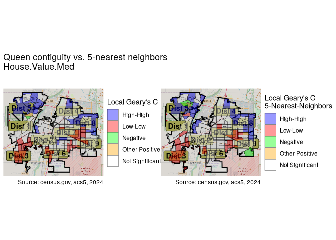

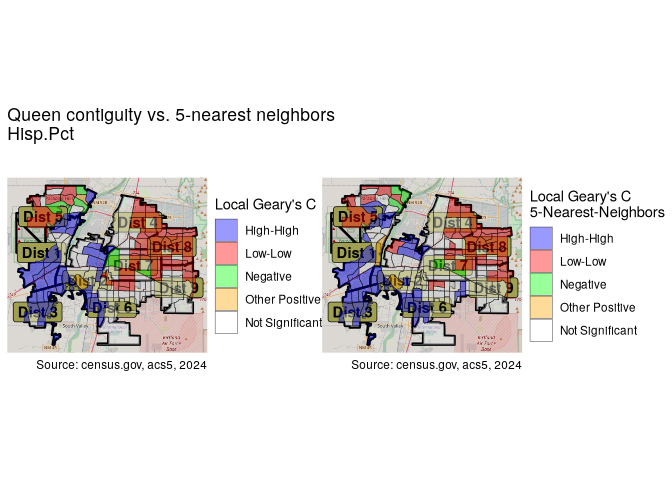

The results are similar. In this case, contiguity reveals more areas of
interest than the k-nearest neighbor approach.

# Conclusion

Visualizing the distribution and correlation of the chosen variables
allowed us to see how they are spread geographically, and identified
many relationships, some expected, some not. Through spatial
autocorrelation we were able to identify the areas of the city where
particularly high or low values of the variables are situated. Both
through visual mapping and tables, we were able to see the differences
across districts, and have gained a number of insights regarding the
variance between districts even before doing formal ANOVA tests. This
will be the subject of the next article. As seen at the beginning, few
if any of the variables are normally distributed, so the testing will
not be straight-forward.

[^1]: The data sets are obtainable on
    [GitHub](https://github.com/biscotty666/biscottys-workshop/tree/main/posts/data-science/r-census/data).

[^2]: https://en.wikipedia.org/wiki/Tobler’s_first_law_of_geography

[^3]: The statistic is defined as
    ${\displaystyle G_{i}^{*}={\frac {\sum _{j}w_{ij}x_{j}}{\sum _{j}x_{j}}}}$

[^4]: The statistic is defined as
    ${\displaystyle I={\frac {N}{W}}{\frac {\sum _{ij}w_{ij}(x_{i}-{\bar {x}})(x_{j}-{\bar {x}})}{\sum _{i}(x_{i}-{\bar {x}})^{2}}}}$

[^5]: The statistic is defined as
    ${\displaystyle C={\frac {(N-1)\sum _{i}\sum _{j}w_{ij}(x_{i}-x_{j})^{2}}{2S_{0}\sum _{i}(x_{i}-{\bar {x}})^{2}}}}$
