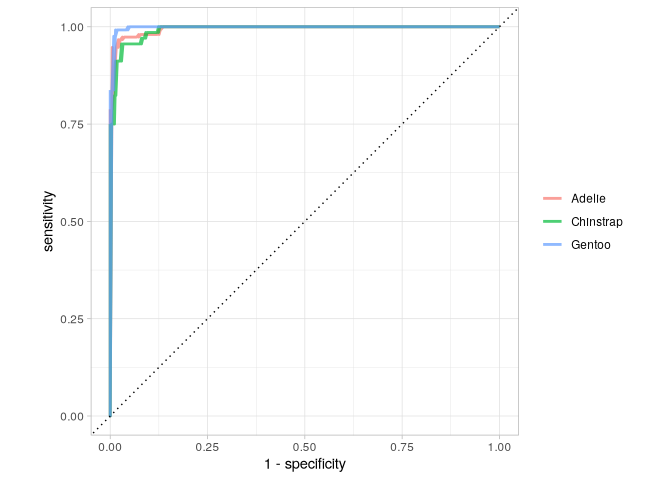
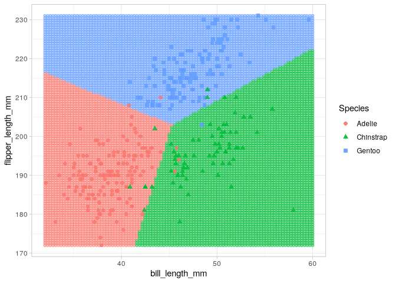

# Multinomial Logistic Regression Tidymodels


``` r
library(tidyverse)
library(tidymodels)
library(palmerpenguins)
```

``` r
penguins <- penguins %>% 
  select(bill_length_mm, flipper_length_mm, species)
```

# Fitting a multinomial logistic regression

``` r
model_fit <- multinom_reg() %>% 
  fit(species ~ bill_length_mm + flipper_length_mm,
      data = penguins)
model_fit
```

    parsnip model object

    Call:
    nnet::multinom(formula = species ~ bill_length_mm + flipper_length_mm, 
        data = data, trace = FALSE)

    Coefficients:
              (Intercept) bill_length_mm flipper_length_mm
    Chinstrap   -26.53864      1.3472574        -0.1699613
    Gentoo     -119.39842      0.4815335         0.4805051

    Residual Deviance: 78.12858 
    AIC: 90.12858 

# Explain th relationship between predictors and outcome

1.  First, call the function tidy() on the model fit to extract the
    coefficients and p-values.
2.  Add the argument exponentiate = TRUE inside the function tidy() to
    exponentiate the coefficients (to get odds instead of log odds).
3.  Specify conf.int = TRUE to print the 95% confidence intervals.
4.  Round the output values to 4 decimal places for all numeric outputs
    to make them more readable.
5.  Finally, remove the standard errors and z-scores from the output to
    make the table smaller.

``` r
model_fit %>% 
  tidy(exponentiate = T, conf.int = T) %>% 
  mutate(across(where(is.numeric), round, 4)) %>% 
  select(-std.error, -statistic)
```

    Warning: There was 1 warning in `mutate()`.
    ℹ In argument: `across(where(is.numeric), round, 4)`.
    Caused by warning:
    ! The `...` argument of `across()` is deprecated as of dplyr 1.1.0.
    Supply arguments directly to `.fns` through an anonymous function instead.

      # Previously
      across(a:b, mean, na.rm = TRUE)

      # Now
      across(a:b, \(x) mean(x, na.rm = TRUE))

    # A tibble: 6 × 6
      y.level   term              estimate p.value conf.low conf.high
      <chr>     <chr>                <dbl>   <dbl>    <dbl>     <dbl>
    1 Chinstrap (Intercept)          0      0.0074    0        0.0008
    2 Chinstrap bill_length_mm       3.85   0         2.45     6.04  
    3 Chinstrap flipper_length_mm    0.844  0.0087    0.743    0.958 
    4 Gentoo    (Intercept)          0      0         0        0     
    5 Gentoo    bill_length_mm       1.62   0.0228    1.07     2.45  
    6 Gentoo    flipper_length_mm    1.62   0         1.47     1.78  

A penguin’s bill length significantly differentiates (p \< 0.05) a
Chinstrap from an Adelie (the reference category), and also a Gentoo
from an Adelie. Specifically, a 1mm longer bill multiplies the odds of
being Chinstrap versus Adelie by 3.85, and the odds of being Gentoo
versus Adelie by 1.62.

A penguin with a 1mm longer bill has 285% (3.85 – 1 = 2.85) more odds of
being Chinstrap versus Adelie, and 62% (1.62 – 1 = 0.62) more odds of
being Gentoo versus Adelie.

Set the reference level

``` r
penguins$species <- relevel(penguins$species, ref = "Gentoo")
```

# Evaluate model performance

``` r
glance(model_fit)
```

    # A tibble: 1 × 4
        edf deviance   AIC  nobs
      <dbl>    <dbl> <dbl> <int>
    1     6     78.1  90.1   342

Deviance measures goodness of fit, 0 being perfect fit.

Akaike Information Criterion estimates prediction error, lower being
more accurate. Useful to evaluate the effect of adding new predictors.

``` r
penguins_preds <- model_fit %>% 
  augment(new_data = penguins)
```

``` r
penguins_preds
```

    # A tibble: 344 × 7
       .pred_class .pred_Adelie .pred_Chinstrap .pred_Gentoo bill_length_mm
       <fct>              <dbl>           <dbl>        <dbl>          <dbl>
     1 Adelie             0.990      0.00972      0.00000123           39.1
     2 Adelie             0.993      0.00714      0.0000165            39.5
     3 Adelie             0.994      0.00455      0.00184              40.3
     4 <NA>              NA         NA           NA                    NA  
     5 Adelie             1.000      0.0000503    0.000125             36.7
     6 Adelie             0.997      0.00278      0.000103             39.3
     7 Adelie             0.993      0.00744      0.00000112           38.9
     8 Adelie             0.998      0.00104      0.00109              39.2
     9 Adelie             1.000      0.00000152   0.0000357            34.1
    10 Adelie             0.904      0.0956       0.000343             42  
    # ℹ 334 more rows
    # ℹ 2 more variables: flipper_length_mm <int>, species <fct>

## Confusion Matrix

``` r
conf_mat(penguins_preds,
         truth = species,
         estimate = .pred_class)
```

               Truth
    Prediction  Adelie Chinstrap Gentoo
      Adelie       146         6      0
      Chinstrap      3        60      1
      Gentoo         2         2    122

## Model accuracy

``` r
accuracy(penguins_preds,
         truth = species,
         estimate = .pred_class)
```

    # A tibble: 1 × 3
      .metric  .estimator .estimate
      <chr>    <chr>          <dbl>
    1 accuracy multiclass     0.959

The accuracy of the multinomial logistic model is 95.9%. This means that
95.9% of penguins were correctly classified.

Using accuracy alone, we cannot know the proportion of misclassified
penguins in each category. So we need other metrics such as ROC AUC.

## Area under the ROC

``` r
roc_auc(
  penguins_preds,
  truth = species,
  .pred_Adelie, .pred_Chinstrap, .pred_Gentoo
)
```

    # A tibble: 1 × 3
      .metric .estimator .estimate
      <chr>   <chr>          <dbl>
    1 roc_auc hand_till      0.995

The ROC AUC, which in this case is 99.5%, tells us how good the model is
at separating the different categories of the outcome variable.

``` r
roc_curve(penguins_preds, truth = species,
          .pred_Adelie, .pred_Chinstrap, .pred_Gentoo) %>% 
  ggplot(aes(x = 1 - specificity,
             y = sensitivity,
             color = .level)) +
  geom_line(size = 1, alpha = 0.7) +
  geom_abline(slope = 1, linetype = "dotted") +
  coord_fixed() +
  labs(color = NULL) +
  theme_light()
```

    Warning: Using `size` aesthetic for lines was deprecated in ggplot2 3.4.0.
    ℹ Please use `linewidth` instead.



Chinstrap was hardest to classify.

## Plot decision boundary

1.  Get range of predictor variables

``` r
summary(penguins)
```

     bill_length_mm  flipper_length_mm      species   
     Min.   :32.10   Min.   :172.0     Adelie   :152  
     1st Qu.:39.23   1st Qu.:190.0     Chinstrap: 68  
     Median :44.45   Median :197.0     Gentoo   :124  
     Mean   :43.92   Mean   :200.9                    
     3rd Qu.:48.50   3rd Qu.:213.0                    
     Max.   :59.60   Max.   :231.0                    
     NA's   :2       NA's   :2                        

2.  Create dataframe of 10,000 combinations of predictor values

``` r
(possibilities <- expand_grid(
  bill_length_mm = seq(32, 60, length.out = 100),
  flipper_length_mm = seq(172, 231, length.out = 100)
))
```

    # A tibble: 10,000 × 2
       bill_length_mm flipper_length_mm
                <dbl>             <dbl>
     1             32              172 
     2             32              173.
     3             32              173.
     4             32              174.
     5             32              174.
     6             32              175.
     7             32              176.
     8             32              176.
     9             32              177.
    10             32              177.
    # ℹ 9,990 more rows

3.  Predict the outcome for the 10,000 data points

``` r
(possibilities <- 
  bind_cols(
    possibilities,
    predict(model_fit, new_data = possibilities)
  ))
```

    # A tibble: 10,000 × 3
       bill_length_mm flipper_length_mm .pred_class
                <dbl>             <dbl> <fct>      
     1             32              172  Adelie     
     2             32              173. Adelie     
     3             32              173. Adelie     
     4             32              174. Adelie     
     5             32              174. Adelie     
     6             32              175. Adelie     
     7             32              176. Adelie     
     8             32              176. Adelie     
     9             32              177. Adelie     
    10             32              177. Adelie     
    # ℹ 9,990 more rows

4.  Plot the predictions and true values

``` r
possibilities %>% 
  ggplot(aes(x = bill_length_mm,
             y = flipper_length_mm)) +
  geom_point(aes(color = .pred_class), alpha = 0.5) +
  geom_point(data = penguins,
             aes(color = species, shape = species),
             size = 2, alpha = 0.8) +
  labs(color = "Species", shape = "Species") +
  theme_light()
```

    Warning: Removed 2 rows containing missing values or values outside the scale range
    (`geom_point()`).


